# 0.概述
Android系统采用一种称为Surface的UI架构为应用程序提供用户界面。在Android应用程序中，每一个Activity组件都关联有一个或者若干个窗口，**每一个窗口都对应有一个Surface**。有了这个Surface之后，应用程序就可以在上面渲染窗口的UI。最终这些已经绘制好了的Surface都会被统一提交给Surface管理服务SurfaceFlinger进行合成，最后显示在屏幕上面。无论是应用程序，还是SurfaceFlinger，都可以利用GPU等硬件来进行UI渲染，以便获得更流畅的UI。

在Android应用程序UI架构中，还有一个重要的服务WindowManagerService，它负责**统一管理协调系统中的所有窗口**，例如管理窗口的`大小`、`位置`、`打开`和`关闭`等。

这系列讲Android应用程序的Surface机制，阐述Activity、Window和View的关系，以及应用程序、WindowManagerService和SurfaceFlinger协作完成UI渲染的过程。

* Android UI 框架概述
* Android 应用程序UI框架
* WindowManagerService
* SurfaceFlinger
* Android多屏支持
# 1.总体框架

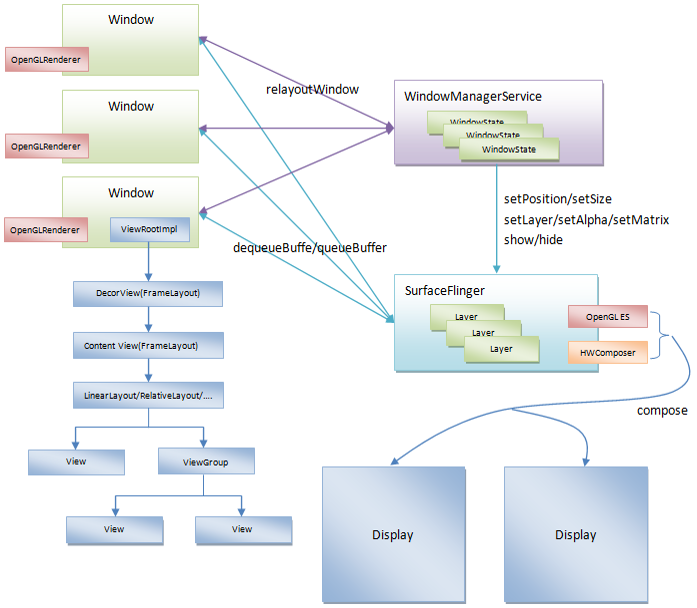

## 1.1 窗口(Window)的结构

* ViewRootImpl是一个**虚拟根View**，用来控制窗口的渲染，以及用来与WindowManagerService 、 SurfaceFlinger通信
* DecorView是窗口的**真正根View**
* ContentView描述窗口的主题风格

## 1.2 Window与Activity的关系

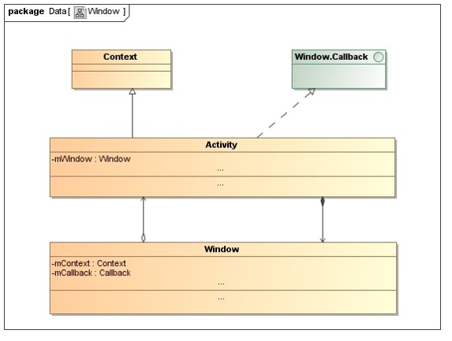

### Activity所对应的Window实际上是一个PhoneWindow

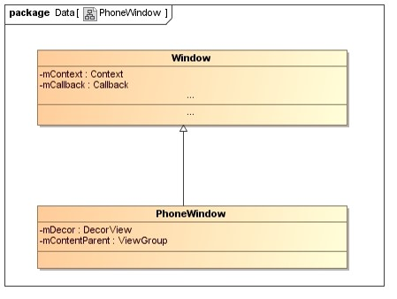

### `Activity/Window`的上下文

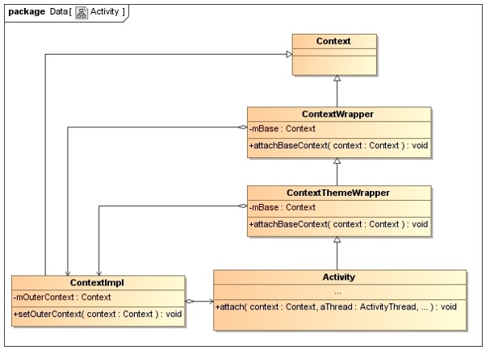

### Window的虚拟根View -- ViewRootImpl

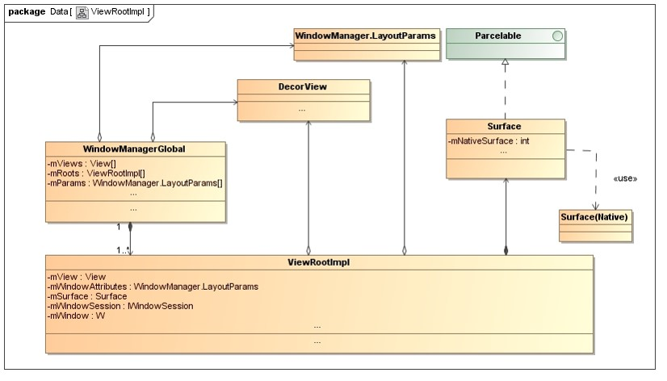

### 窗口绘图表面 -- Surface

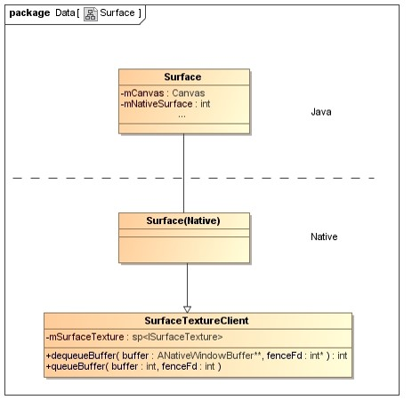

### 窗口标志 -- W

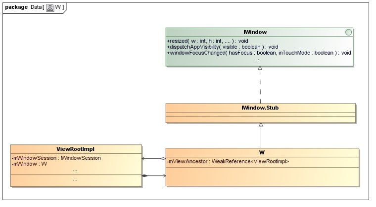

### 窗口会话 -- Session

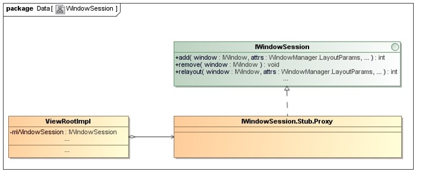

### 窗口视图 -- View

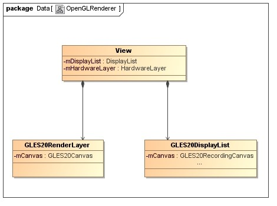

# 2.Android应用程序UI的绘制过程

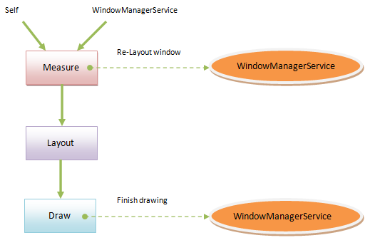

## 2.1 软件渲染过程

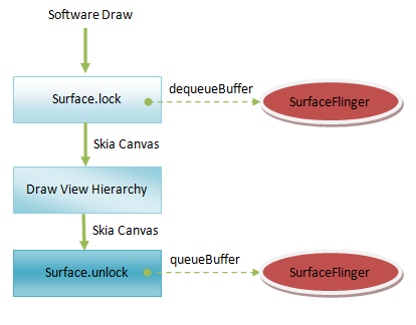

## 2.2 硬件渲染过程

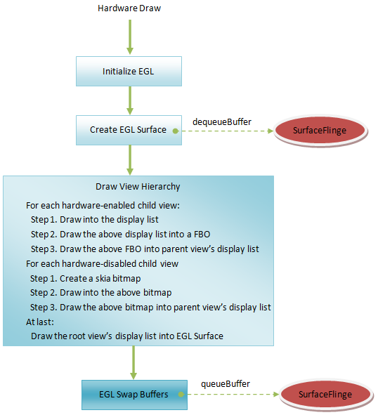

* Display List是什么？
`Display List`是一个缓存绘制命令的Buffer.

* Display List的好处？
当View的某些属性发生改变时，只需要修改相应的Buffer中对应的属即可，例如Alpha属性，而无需对整个View进行重绘

## 2.3 Android应用程序UI的绘制时机 – Without Vsync -- Jank

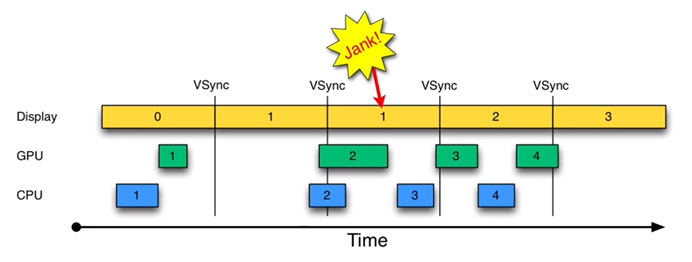

## 2.4 Android应用程序UI的绘制时机 – With VSync

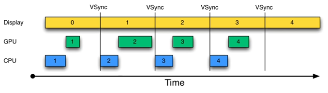

## 2.5 Android应用程序UI的绘制时机 – With Vsync and Double Buffering

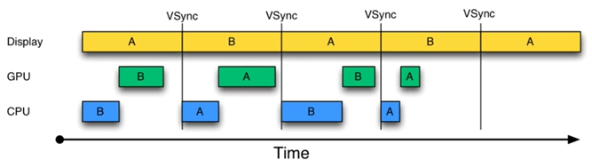

## 2.6 Android应用程序UI的绘制时机 – With Vsync and Triple Buffering

## 2.7 Android系统的VSync实现

* SurfaceFlinger内部维护有一个EventThread，用来监控显卡的VSync事件
* Android应用程序通过注册一个DisplayEventReceiver来接收SurfaceFlinger的VSync事件
* Android应用程序接收到重绘UI请求，通过前面注册的DisplayEventReceiver向SurfaceFlinger请求在下一个VSync事件到来时产生一个VSync通知
* Android应用程序获得VSync通知的时候，才会真正执行重绘UI的请求