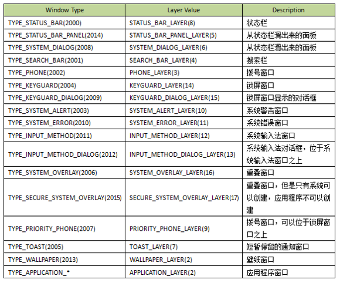
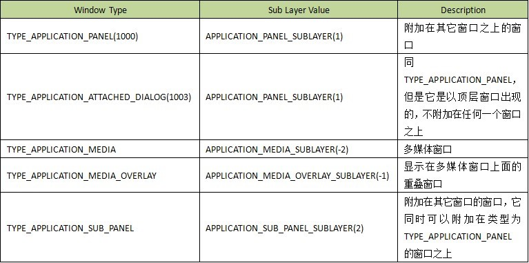

接上完成

* windowManagerService
* SurfaceFlinger
* 多屏

# 3.WindowManagerService
## 3.1职责

*  计算窗口大小
*  计算窗口Z轴位置
*  管理输入法窗口
*  管理壁纸窗口
*  执行窗口切换

### 屏幕的基本结构


## 3.2 计算窗口大小 – Content Region


### 计算窗口大小 – Visible Region


## 3.3 计算窗口Z轴位置 – Window Stack


### 计算窗口Z轴位置 – 计算时机  


### 计算窗口Z轴位置 – 计算公式

```
Z = Base Layer + WINDOW_LAYER_MULTIPLIER(5)
Base Layer = T * TYPE_LAYER_MULTIPLIER(10000) + TYPE_LAYER_OFFSET(1000)
```


### 计算窗口Z轴位置 – 窗口主类型



### 计算窗口Z轴位置 – 窗口子类型



## 3.4 管理输入法窗口


###　输入法窗口在Window Stack的位置


## 3.5 管理壁纸窗口


### 壁纸窗口在Window Stack的位置


## 3.6 执行窗口切换


### 执行窗口切换 – Starting Window


### 执行窗口切换 – 动画


# 4.SurfaceFlinger

## 职责 

* 分配图形缓冲区
* 合成图形缓冲区
* 管理VSync事件

## 渲染过程


## 4.1 分配图形缓冲区


## 4.2 合成图形缓冲区


### HWComposer实例：高通MDP4.0


### 合成图形缓冲区 – 可见性计算


## 4.3 管理VSync事件


# 5.Android多屏支持
从4.2开始支持多屏幕


## 5.1 屏幕类型

* Primary Display
	* 设备自带的屏幕,由SurfaceFlinger管理

* External Display
	* 通过HDMI连接,由SurfaceFlinger监控和管理

* Virtual Display
	* 通过`Miracast连接`(基于Wifi Direct技术),由DisplayManagerService监控和管理

App通过`android.app.Presentation`接口在指定的屏幕上创建窗口.[Presentation](https://developer.android.com/reference/android/app/Presentation)

```java
DisplayManager displayManager=(DisplayManager)context.getSystemService(Context.DISPLAY_SERVICE);
Display[] presentationDisplay=displayManager.getDisplays(DisplayManager.DISPLAY_CATEGORY_PRESENTATION);
if(presentationDisplay.length>0){
	//如果有多个可选显示，弹框由用户选择。这里默认第一个，系统推荐的
	Display display=presentationDisplay[0];
	Presentation presentation=new MyPresentation(context,presentationDisplay);
	presentation.show();
}
```


