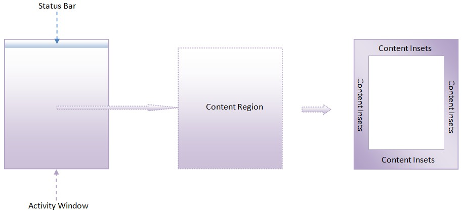
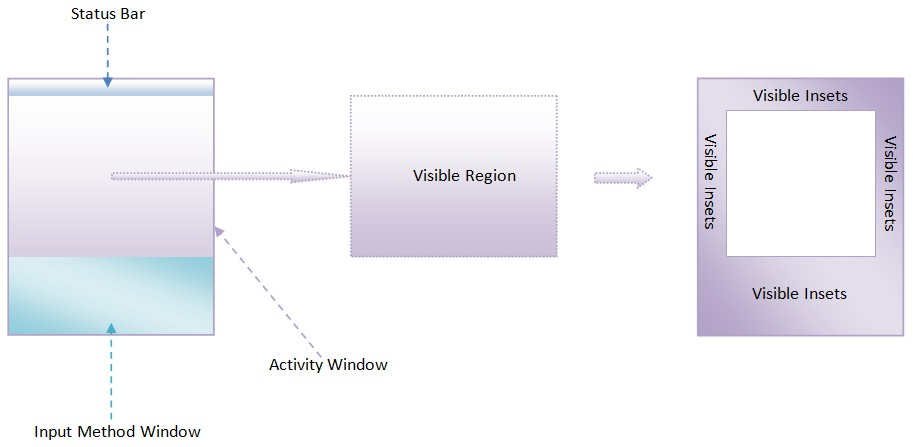
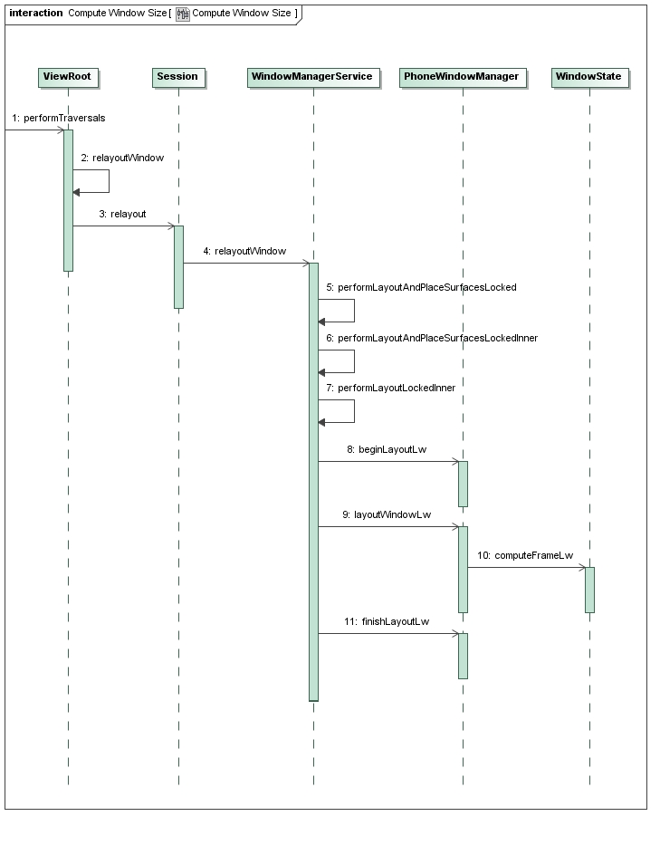

在Android系统中，**Activity窗口的大小**是由WindowManagerService服务来计算的。WindowManagerService服务会根据屏幕及其装饰区的大小来决定Activity窗口的大小。一个Activity窗口只有知道自己的大小之后，才能对它里面的UI元素进行测量、布局以及绘制。

一般来说，Activity窗口的大小等于整个屏幕的大小，但是它并不占据着整块屏幕。

为了理解这一点，我们首先分析一下Activity窗口的区域是如何划分的。

我们知道，Activity窗口的上方一般会有一个状态栏，用来显示3G信号、电量使用等图标，如图1所示。


从Activity窗口剔除掉状态栏所占用的区域之后，所得到的区域就称为**内容区域**（Content Region）。顾名思义，内容区域就是用来显示Activity窗口的内容的。

我们再抽象一下，假设Activity窗口的四周都有一块类似状态栏的区域，那么将这些区域剔除之后，得到中间的那一块区域就称为内容区域，而被剔除出来的区域所组成的区域就称为**内容边衬区域**（Content Insets）。Activity窗口的内容边衬区域可以用一个四元组（content-left, content-top, content-right, content-bottom）来描述，其中，content-left、content-right、content-top、content-bottom分别用来描述内容区域与窗口区域的左右上下边界距离。

我们还知道，Activity窗口有时候需要显示输入法窗口，如图2所示。


这时候Activity窗口的内容区域的大小有可能没有发生变化，这取决于它的**Soft Input Mode**。

我们假设Activity窗口的内容区域没有发生变化，但是它在底部的一些区域被输入法窗口遮挡了，即它在底部的一些内容是不可见的。从Activity窗口剔除掉状态栏和输入法窗口所占用的区域之后，所得到的区域就称为可见区域（Visible Region）。同样，我们再抽象一下，假设Activity窗口的四周都有一块类似状态栏和输入法窗口的区域，那么将这些区域剔除之后，得到中间的那一块区域就称为可见区域，而被剔除出来的区域所组成的区域就称为可见边衬区域（Visible Insets）。Activity窗口的可见边衬区域可以用一个四元组（visible-left, visible-top, visible-right, visible-bottom）来描述，其中，visible-left、visible-right、visible-top、visible-bottom分别用来描述可见区域与窗口区域的左右上下边界距离。

在大多数情况下，Activity窗口的内容区域和可见区域的大小是一致的，而状态栏和输入法窗口所占用的区域又称为屏幕装饰区。

WindowManagerService服务实际上就是需要根据屏幕以及可能出现的`状态栏`和`输入法窗口的大小`来计算出`Activity窗口`的整体大小及其内容区域**边衬和可见区域边衬**的大小。有了这三个数据之后，Activity窗口就可以对它里面的UI元素进行测量、布局以及绘制等操作了。

Android应用程序窗口（Activity）的绘图表面（Surface）的创建过程分析一文可以知道，应用程序进程是从ViewRoot类的成员函数performTraversals开始，向WindowManagerService服务请求计算一个Activity窗口的大小的，因此，接下来我们就从ViewRoot类的成员函数performTraversals开始分析一个Activity窗口大小的计算过程，如图3所示。


这个过程可以分为11个步骤，接下来我们就详细分析每一个步骤。

## step 1 ViewRoot.performTraversals

这个函数定义在文件`frameworks/base/core/java/android/view/ViewRoot.java`中.

```java
public final class ViewRoot extends Handler implements ViewParent,  
        View.AttachInfo.Callbacks {  
    ......  
       
    private void performTraversals() {  
        ......  
  
        final View host = mView;  
        ......  
   
        int desiredWindowWidth;  
        int desiredWindowHeight;  
        int childWidthMeasureSpec;  
        int childHeightMeasureSpec;  
        ......  
  
        Rect frame = mWinFrame;  
        if (mFirst) {  
            ......  
   
            DisplayMetrics packageMetrics =  
                 mView.getContext().getResources().getDisplayMetrics();  
            desiredWindowWidth = packageMetrics.widthPixels;  
            desiredWindowHeight = packageMetrics.heightPixels;  
        } else {  
            desiredWindowWidth = frame.width();  
            desiredWindowHeight = frame.height();  
            if (desiredWindowWidth != mWidth || desiredWindowHeight != mHeight) {  
                ......  
                windowResizesToFitContent = true;  
            }  
        }  
```
这段代码用来获得Activity窗口的当前宽度desiredWindowWidth和当前高度desiredWindowHeight.

**注意**，Activity窗口当前的宽度和高度是保存ViewRoot类的成员变量mWinFrame中的。

ViewRoot类的另外两个成员变量mWidth和mHeight也是用来描述Activity窗口当前的宽度和高度的，但是它们的值是由应用程序进程上一次主动请求WindowManagerService服务计算得到的，并且会一直保持不变到应用程序进程下一次再请求WindowManagerService服务来重新计算为止。Activity窗口的当前宽度和高度有时候是被WindowManagerService服务主动请求应用程序进程修改的，修改后的值就会保存在ViewRoot类的成员变量mWinFrame中，它们可能会与ViewRoot类的成员变量mWidth和mHeight的值不同。

如果Activity窗口是第一次被请求执行测量、布局和绘制操作，即ViewRoot类的成员变量mFirst的值等于true，那么它的当前宽度desiredWindowWidth和当前高度desiredWindowHeight就等于屏幕的宽度和高度，否则的话，它的当前宽度desiredWindowWidth和当前高度desiredWindowHeight就等于保存在ViewRoot类的成员变量mWinFrame中的宽度和高度值。

如果Activity窗口不是第一次被请求执行测量、布局和绘制操作，并且Activity窗口主动上一次请求WindowManagerService服务计算得到的宽度mWidth和高度mHeight不等于Activity窗口的当前宽度desiredWindowWidth和当前高度desiredWindowHeight，那么就说明Activity窗口的大小发生了变化，这时候变量windowResizesToFitContent的值就会被标记为true，以便接下来可以对Activity窗口的大小变化进行处理。