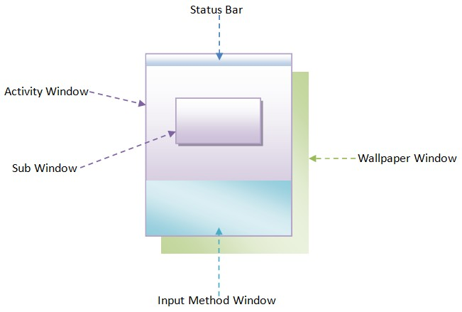
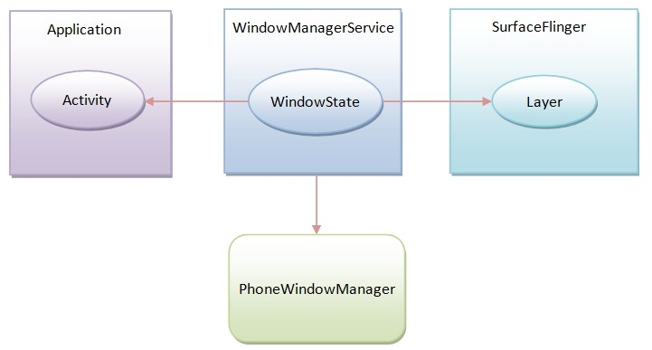

从整体的角度来看，Android应用程序窗口的实现要更复杂，因为它们的类型和作用不同，且会相互影响。在Android系统中，对系统中的所有窗口进行管理是窗口管理服务WindowManagerService的职责。

在Android系统中，同一时刻，只有一个Activity窗口是激活的，但是，对于WindowManagerService服务来说，这并不意味着它每次只需要管理一个Activity窗口，例如，在两个Activity窗口的切换过程中，前后两个Activity窗口实际上都是可见的。即使在只有一个Activity窗口是可见的时候，WindowManagerService服务仍然需要同时管理着多个窗口，这是因为可见的Activity窗口可能还会被设置了壁纸窗口（Wallpaper Winodw）或者弹出了子窗口（Sub Window），以及可能会出现状态栏（Status Bar）以及输入法窗口（Input Method Window），如图1所示。

因此，WindowManagerService服务是不可以假设同一时刻它只需要管理一个窗口的，它需要通过各个窗口在屏幕上的位置以及大小来决定哪些窗口需要显示的以及要显在哪里，这实际上就是要计算出各个窗口的可见区域。

SurfaceFlinger服务在渲染整个屏幕的UI的时候，**会对各个窗品的可见性进行计算**，因此，WindowManagerService服务只要将它所管理的各个窗品的位置以及大小告诉SurfaceFlinger服务，后者可以帮帮它计算出各个窗口的可见区域了。注意，这里，这里所说的窗口位置包括窗口在X、Y和Z轴的位置。

WindowManagerService服务大致按照以下方式来控制哪些窗口需要显示的以及要显在哪里：

* 1.每一个Activity窗口的大小都等于屏幕的大小，因此，只要对每一个Activity窗口设置一个不同的Z轴位置，然后就可以使得位于最上面的，即当前被激活的Activity窗口，才是可见的。
* 2.每一个子窗口的Z轴位置都比它的父窗口大，但是大小要比父窗口小，这时候Activity窗口及其所弹出的子窗口都可以同时显示出来。
* 3.对于非全屏Activity窗口来说，它会在屏幕的上方留出一块区域，用来显示状态栏。这块留出来的区域称对于屏幕来说，称为装饰区（decoration），而对于Activity窗口来说，称为内容边衬区（Content Inset）。
* 4.输入法窗口只有在需要的时候才会出现，它同样是出现在屏幕的装饰区或者说Activity窗口的内容边衬区的。
* 5.对于壁纸窗口，它出现需要壁纸的Activity窗口的下方，这时候要求Activity窗口是半透明的，这样就可以将它后面的壁纸窗口一同显示出来。
* 6.两个Activity窗口在切换过程，实际上就是前一个窗口显示退出动画而后一个窗口显示开始动画的过程，而在动画的显示过程，窗口的大小会有一个变化的过程，这样就导致前后两个Activity窗口的大小不再都等于屏幕的大小，因而它们就有可能同时都处于可见的状态。事实上，Activity窗口的切换过程是相当复杂的，因为即将要显示的Activity窗口可能还会被设置一个启动窗口（Starting Window）。一个被设置了启动窗口的Activity窗口要等到它的启动窗口显示了之后才可以显示出来。

从以上六点就可以看出，窗口在X、Y和Z轴的位置及其大小的计算非常重要，它们共同决定了一个窗口是否是整体可见的，还是部分可见的，或者整体不可见的。

在Android系统中，WindowManagerService服务是通过一个实现了WindowManagerPolicy接口的策略类来计算一个窗口的位置和大小的。例如，在`Phone`平台上，这个策略类就是PhoneWindowManager。这样做的好处就是**对于不同的平台实现不同的策略类来达到不同的窗口控制模式**。

从上面的描述就可以看出，WindowManagerService服务除了要与Activity窗口所运行在的应用程序进程打交道之外，还需要与SurfaceFlinger服务以及窗口管理策略类PhoneWindowManager交互，如图2所示。

将主要分析WindowManagerService服务的实现，以及它与SurfaceFlinger服务、PhoneWindowManager策略类的交互过程。

从总体上来看，WindowManagerService服务的实现是相当复杂的，例如，WindowManagerService类的核心成员函数performLayoutAndPlaceSurfacesLockedInner的代码有1200+行，比600-行代码的ViewRoot类的核心成员函数performTraversals还要恐怖。不过，WindowManagerService服务实现的复杂性是在预料之中的，毕竟它要管理的整个系统所有窗口的UI，而在任何一个系统中，窗口管理子系统都是极其复杂的。基于上述理由，采用硬碰硬的方式来分析WindowManagerService服务的实现是以卵击石，因此，这个系列的文章将对WindowManagerService服务进行分拆，然后再逐个击破，这是算法中的分而治之思想是一致的。

具体来说，我们将按照以下几个情景来分析WindowManagerService服务的实现：

1. 窗口大小和位置（X轴和Y轴）的计算过程。
2. 窗口的组织方式。
3. 输入法窗口的调整过程。
4. 壁纸窗口的调整过程。
5. 窗口Z轴位置的计算和调整过程。
6. Activity窗口的启动窗口的显示过程。
7. Activity窗口的切换过程。
8. Activity窗口的动画显示过程。

再次地，由于WindowManagerService服务的实现实在是太复杂，因此上述八个情景可能还不足于说明WindowManagerService服务的实现。如果出现这种情况，我们在分析的过程中会进行相应的调整。