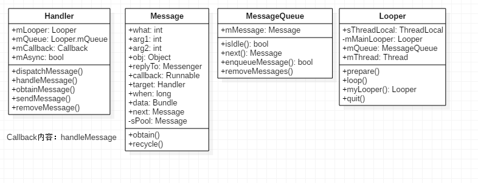

# Looper，Message和Handler

Java应用依靠消息驱动，大致工作原理：两大剑客，一个Binder

* 一个消息队列，可以往消息队列中投递消息。
* 一个消息循环，不断从队列中取出消息然后处理。
主要由Looper和Handler来实现：

* Looper:不断循环执行(`Looper.loop`),按分发机制将消息分发给目标处理者。（**与线程挂钩**）
* Message类:分为硬件产生和软件产生的消息。
* MessageQueue：消息队列的主要功能向消息池投递消息`MessageQueue.enqueueMessage`和取走消息池消息`MessageQueue.next`
* Handler类：辅助类，向消息池发送各种消息事件(`Handler.sendMessage`)和处理相应消息(`Handler.handleMessage`)。


几个类图

* Looper:有一个MessageQueue消息队列
* MessageQueue有一组待处理的Message
* Message中有一个用于处理消息的handler
* Handler中有一个Looper和MessageQueue

## 1.Looper类
分析Looper的例子：

```java
class LooperThread extends Thread{
	public Handler mHandler;
	public void run(){
		//1.调用prepare
		Looper.prepare();
		mHandler=new Handler(){
			public void handleMessage(Message msg){
				//process incoming messages here
			}
		}
		//2.进入消息循环
		Looper.loop();
	}
}
//应用启动使用LooperThread,运行run函数
new LooperThread().start();
```

### 1.1 其中`prepare()`函数保证：

```java
public static final void prepare(){
	//一个线程只能一个Looper
	if(sThreadLocal.get()!=null){
		throw new RuntimeException("only one Looper may be create per thread");
	}
	//构建一个Looper对象，设置调用线程局部变量
	sThreadLocal.set(new Looper());
}
//sThread定义
private static final ThreadLocal sThreadLocal=new ThreadLocal();
```
实现一个线程本地存储，也就是一个变量对每个线程都有自己的值。所有线程共享相同`ThreadLocal<T>`对象，但是每个线程访问它将得到不同的值，并且线程之间修改，相互不影响，并且支持`null`值。
一个线程只能有一个Looper.通过`ThreadLocal<T>`进行保证。Looper构造函数

```java
private Looper(boolean quitAllowed){
	//构造一个消息队列
	mQueue=new MessageQueue(quitAllowed);
	mRun=true();
	//得到当前线程的Thread对象	
	mThread=Thread.currentThread();
}
```

与prepare()相近功能的，还有一个`prepareMainLooper()`方法，该方法主要在ActivityThread类中使用。

```java
public static void prepareMainLooper(){
	//设置不允许退出looper
	prepare(false);
	synchronized(Looper.class){
		//将当前的Looper保存在looper，每个线程只允许执行一次
		if(sMainLooper!=null){
			throw new IllegalStateException("The main Looper has already been prepared");
		}
		mMainLooper=myLooper();
	}
}
```
### 1.2looper循环

```java
public static final void loop(){	
	// return (Looper)sThreadLocal.get()
	Looper me=myLooper();//返回TLV中保存Looper对象
	//取出这个Looper消息队列
	MessageQueue queue=me.mQueue;
	while(true){
		Message msg=queue.next();
		//处理消息，Message对象中有一个target，它是Handler类型
		//Handler为空，退出循环
		if(msg!=null){
			if(msg.target==null){
				return;
			}
			//调用消息的Hanlder，交给它dispatchMessage函数处理
			msg.target.dispatchMessage(msg);
			msg.recycle();
		}
	}
}
```
looper进入循环，不断重复下面操作，直到没有消息时推出循环：

* 读取MessageQueue的下一条Message(可能阻塞)
* 把Message分发给相应的target；
* 再把分发后的Message回收到消息池，以便重复利用。

### 1.3 quit()

```java
public void quit(){
	//消息移除,可能有消息还未发送完成，不安全
	mQueue.quit(false);
}
public void quitSafely(){
	//安全的移除消息
	mQueue.quit(true);
}
```
`Looper.quit()`方法的实现最终调用的是`MessageQueue.quit()`方法

```java
void quit(boolean safe){
	if(!mQuitAllowed){
		throw new RuntimeException("Main thread not allowed to quit.");
	}
	sychronized(this)}
		if(mQutting) return;
		mQuitting = true;
		if(safe){
			removeAllFutrueMessageLocked();
		}else{
			removeAllMessageLocked();
		}
		//we can assume mPtr!=0
		//because mQuitting was previously false
		nativeWake(mPtr);
	}
}
```

消息退出方式：

* 当safe = true时，只移除尚未出发所有消息，对于正在出发的消息并不移除
* 当safe = false时，移除所有消息。

### 1.4常用方法

### myLooper
获取用于TLS存储的Looper对象

```java
public static @Nullable Looper myLooper(){
	return sThreadLocal.get();
}
```
## 2.Handler分析

### 2.1 创建Handler

```java
//成员变量
final MessageQueue mQueue;//handler中也有一个消息队列
final Looper mLooper；//也有一个Looper
final Callback mCallback;//也有一个回调函数
public Handler(){
	//获取当前线程Handler
	mLooper=Looper.myLooper();
	if(mLooper==null){
		throw new RuntimeException();
	}
	//得到Looper的消息队列
	mQueue=mLooper.mQueue;
	//无callback设置
	mCallback=null;
}

public Handler(Callback callback){
	mLooper =Looper.myLooper();
	if(mLooper==null){
		throw new RuntimeException();
	}
	mQueue=mLooper.mQueue;
	mCallback=callback;
}
public Handler(Looper loope){
	mLooper=looper;
	mQueue=looper.mQueue;
	mCallback=null;
}
public Handler(Looper looper,Callback callback){
	mLooper=looper;
	mQueue=looper.mQueue;
	mCallback=callback;
}
```

### 2.1 Handler和Message
Handler提供一些列完成创建和插入消息队列工作：

* 是否有what的消息：`final boolean hasMessage(int what)`
* 创建一个消息码是what消息：`final Message obtainMessage(int what)`
* 移除what消息:`final void removeMessage(int what)`
* 发送一个只填充消息码消息：`final boolean sendEmptyMessage(int what)`
* 发送一个消息到队列头，优先级很高`final boolean sendMessageFrontOfQueue(Message msg)`
* `public final boolean sendMessageDelayed(Message msg,long delayMillis)`

```java
public final boolean sendMessage(Message msg){
	return sendMessageDelayed(msg,0);
}
public boolean sendMessageDelayed(Message msg,long uptineMills){
	if(delayMills<0) delayMills=0;
	return sendMessageAtTime(msg,SystemClock.uptimeMills()+delayMillis);
}
public boolean sendMessageAtTime(Message msg,long uptimeMills){
	boolean send =false;
	MessageQueue queue=mQueue;
	if(queue!=null){
		//把Message target设置为自己，然后加入到队列消息中
		msg.target=this;
		sent=queue.enqueueMessage(msg,uptimeMills);
	}
}
```
Handler把Message设置为自己，因为Handler除了封装消息添加功能还封装小消息处理接口

### 2.2 Handler消息处理
Looper消息队列中加入一个消息，Looper消息处理规则获取消息还会调用target的dispatchMessage函数。

```java
public void dispatchMessage(Message msg){
	//如果Message本身有callback,则直接交给Messge的callback处理
	if(msg.callback!=null){
		//优先级：1
		handleCallback(msg);
	}else{
		//如果Handler设置mCallback，则交给mCallback处理
		if(mCallback!=null){
			//优先级：2
			if(mCallback.handleMessage(msg){
				return ;
			}
		}
		//优先级：3
		//最后交给子类处理
		handleMessage(msg);
	}
}
```

## Looper和Handler同步关系

```java
//线程1
class LooperThread extends Thread{
	public Looper myLooper=null;//定义一个public
	public void run(){
		Looper.prepare();
		//myLooper必须这个线程中赋值
		myLooper=Looper.myLooper();
		Looper.loop();
	}
}
//下面在线程1中执行，并且创建线程2
{
	LooperThread lpThread=new LooperThread;
	lpThread.start();//start后会创建线程2
	Looper looper=lpThread.myLooper;
	//线程1和2挂钩
	Handler thread2Handler=new Handler(looper);
	//sendMessage发送消息
	threadHandler.sendMessage()...;
}
```
想要进行线程1和线程2进行交互。但是存在问题可能在`lpThread.myLooper`时候myLooper还未成功创建。

### 解决方案

```java
public class HandlerThread extends Thread{
    //线程1 调用getLooper来获得线程的Looper
    public Looper getLooper(){
        synchronized(this){
            while(isAlive() && mLooper==null){
                try{
                    //如果新线程还未创建Looper，则等待
                    wait();
                }catch (InterruptException e){
                }
            }
        }
        return mLooper;
    }
}
//线程2运行它的run 函数，looper就是run线程创建的
public void run(){
    mTid=Process.myTid();
    Looper.prepare();//创建这个线程上Looper
    synchronized (this){
        mLooper=Looper.myLooper();
        notifyAll();//通知Looper的线程1,此时Looper已经创建好了
    }
    Process.setThreadPriority(mPriority);
    onLoooper.loop();
    mTid=-1;
}
```

多多使用HandlerThread线程。

## 3.消息机制

### 3.1 分发机制
在`Looper.loop()`中，当发现有消息时，调用消息的目标handler，执行`dispatchMessage()`方法来分发消息。

```java
public void dispatchMessage(Message msg){
		if(msg.callback != null){
		//当message存在回调方法，回调msg.callback.run()方法
		handleCallback(msg);
	}else{
		if(mCallback!=null){
			//当handler存在Callback成员变量时，回调方法handleMessage()
			if(mCallback.handleMessage(msg){
				return;
			}
		}
		//Handler自身的回调方法handleMessage()
	}
}
```

分发消息流程：

* 1.当`Message`的回调不为空，则回调`msg.callback.run();`，其中callBack数据类型为Runnable；否则进入步骤2
* 2.当Handler的mCallback成员变量不为空时，则回调`mCallback.handleMessage(msg);`，否则进入步骤3
* 3.调用Handler自身回调方法`handleMessage()`,该方法默认为空，Handler子类通过复写该方法实现逻辑。

对于很多情况下，消息分发后的处理方法是第3种情况，即Handler.handleMessage()，一般地往往通过覆写该方法从而实现自己的业务逻辑。

### 3.1 消息发送机制

发送消息调用链：


从上图，可以发现所有的发消息方式，最终都是调用`MessageQueue.enqueueMessage();`

其他方法：

* `obtainMessage()`获取消息调用`Message.obtain(this);`
`Handler.obtainMessage()`方法，最终调用`Message.obtainMessage(this)`，其中this为当前的Handler对象。
* `removeMessages`调用`mQueue.removeMessages(this,what,null);`

Handler是消息机制中非常重要的辅助类，更多的实现都是MessageQueue, Message中的方法，Handler的目的是为了更加方便的使用消息机制。

## 4. MessageQueue
`MessageQueue`是消息机制的**Java层和C++层的连接纽带**，大部分核心方法都交给native层来处理，其中MessageQueue类中涉及的native方法如下：

```java
private native static long nativeInit();
private native static void nativeDestroy(long ptr);
private native void nativePollOnce(long ptr,int timeoutMillis);
private native static void nativeWake(long ptr);
private native static boolean nativeIsPolling(long ptr);
private native static void nativeSetFileDescriptorEvents(long ptr,int fd,int events);
```

### 4.1创建MessageQueue

```java
MessageQueue(quitAllowed){
	mQuitAllowed=quitAllowed;
	mPtr=nativeInit();
}
```

### 4.2 enqueueMessage
添加一条消息到消息队列

```java
boolean enqueueMessage(Message msg,long when){
	//每一个普通大的Message必须有一个target
	if(msg.target == null){
		throw new IllegalArgumentException("Message must have a target.");
	}
	if(msg.isInUse()){
		throw new IllegalStateException(msg+"This message is already in use.");
	}
	sychronize(this){
		if(mQuitting){
		//正在退出时，回收msg,计入消息池
			msg.recycle()
			return false;
		}
		msg.makeInUse();
		msg.when=when;
		Message p = mMessage;
		boolean needWake;
		if(p ==null || when ==0 ||when<p.when){
			//p 为null(代表MessageQueue没有消息)或者msg的触发时间是队列最早的，则进入该分支
			msg.next=p;
			mMessage=msg;
	
			//当阻塞时需要唤醒
			needWake=mBlocked;
		}else{
			//将消息按时间顺序插入到MessageQueue，一般地，不需要唤醒事件队列，除非
			//消息队列开头在barrier,并且同时Message是队列中最早的异步消息
			needWake=mBlocked && p.target==null && msg.isAsynchronous();
			Message prev;
			for(;;){
				prev = p;
				p = p.next;
				if(p == null || when <p.when){
					break;
				}
				if(needWake && p.isAsynchronous){	
					needWake = false;
				}
			}
			msg.next = p;
			pre.next = msg;
		}
		//消息没有退出，我们认为此时mPtr != 0
		if(needWake){
			nativeWake(mPtr);
		}
	}
	return true;
}
```
`MessageQueue`是按照Message触发时间的先后顺序排列的，队头的消息是将要最早触发的消息。当有消息需要加入消息队列时，会从队列头开始遍历，直到找到消息应该插入的合适位置，以保证所有消息的时间顺序。

## 4.3 next()
提取下一条 message

```java
Message next(){
	final long ptr=mPtr;
	//当消息循环已经退出，则直接返回
	if(ptr == 0){
		return null;
	}
	//循环迭代的首次为-1
	int pendingIdleHandlerCount=-1;
	int nextPollTimeoutMillis =0;
	for(;;){
		if(nextPollTimeoutMillis !=0){
			Binder.flushPendingCommands();
		}
		//阻塞操作，当等待nexPollTimeoutMillis时长，或者消息队列被唤醒，都会返回
		nativePollOnce(ptr,nextPollTimeoutMillis);
		sychronized(this){
			final long now=SystemClock.uptimeMillis();
			Message prevMsg=null;
			Message msg=mMessages;
			if(msg!=null&&msg.targe==null){
				//当消息Handler为空时，查询MessageQueue中的下一条异步消息msg，则退出循环
				do{
					preMsg=msg;
					msg=msg.next;
				}while(msg!=null && !msg.isAsynchronous());			
				if(msg != null){
					if(now <msg.when){
						//当异步消息触发时间大于当前时间，则设置下次一个轮询超时时长
						nextPollTimeoutMillis=(int)Math.min(msg.when - now,Integer.MAX_VALUE);
					}else{
						//获取一条消息，并返回
						mBlocked=false;
						if(prevMsg!=null){
							prevMsg.next=msg.next;
						}else{
							mMessage=msg.next;
						}
						msg.next=null;
						//设置消息的使用状态，即flags |=FLAG_IN_USE
						msg.makeInUse();
						//成功获取下一条即将执行的消息
				
						return msg;
					}else{
						//没有消息
						nextPollTimeoutMillis=-1;
					}
					//消息正在退出，返回null
					if(mQuitting){
						dispose();
						return null;
					}
					//当消息队列为空，或者是消息队列的第一个消息时
					if(pendingIdleHandlerCount<0 && (mMessages==null || now <mMessages.when)){
						pendingIdleHandlerCount = mIdleHandlers.size();
					}
					if(pendingIdleHandlerCount<=0){
						//没有idle handlers 需要运行，则循环并等待
						mBlock=true;
						continue;
					}
					if(pendingIdleHandler==null){
						mPendingIdleHandlers=new IdleHandler[Math.max(pendingIdleHandlerCount,4)];	
					}
					mPendingIdleHandlers=mIdleHandlers.toArray(mPendingIdleHandlers);
				}
				//只有一次循环时，会运行idle handlers，执行完成后，重置pendingIdleHandlerCount为0
				for(int i=0;i<pendingIdleHandlerCount;i++){
					final IdleHandler idler=mPendingIdleHandlers[i];
					mPendingIdleHandlers[i]=null;
					boolean keep=false;
					try{
				
						//idle时执行的方法		keep=idler.queueIdle();
					}catch(Throwable t){
					}
					if(!keep){
						synchronize(this){
						mIdleHandlers.remove(idler);
						}
					}
				}
				//重置idle handler 个数为0,以保证不会再次重置运行
				pendingIdleHandlerCount=0;
				//当调用一个空闲handler时，一个新message能够被分发，因此无需等待可以直接查询pending message
				nextPollTimeoutMillis=0;
			}
		}
	}
}
```

`nativePollOnce`是阻塞操作，其中`nextPollTimeoutMillis`代表下一个消息到来前，还需要等待的时长；当`nextPollTimeoutMillis=-1`时，表示消息队列中无消息，会一直等待下去.

当处于空闲时，往往会执行`IdleHandler`中的方法。当nativePollOnce()返回后，`next()`从mMessages中提取一个消息。

`nativePollOnce()`在native做了大量的工作。

## 4.4removeMessages

```java
void removeMessages(Handler h,int what,Object object){
	if(h==null) return;
	synchronized(this){
		//Messasge p=mMessages;
		//从消息队列的头部开始，移除所有符合条件的消息
		while(p！=null && p.target ==h && p.what ==what && (object ==null ||p.object ==object)){
			Message n=p.next;
			mMessages =n;
			p.recycleUnchecked();
			p=n;
		}
		//移除剩余的符合要求的消息
		while(p !=null){
			Message n =p.next;
			if(n!=null){
				if(n.target ==h && n.what ==what && (object ==null ||n.obj ==object)){
					Message nn=n.next;
					n.recycleUnchecked();
					p.next =nn;	
					continue;
				}
			}
			p=n;
		}
	}
}
```
这个移除消息的方法，采用了两个while循环，第一个循环是从队头开始，移除符合条件的消息，第二个循环是从头部移除完连续的满足条件的消息之后，再从队列后面继续查询是否有满足条件的消息需要被移除。
