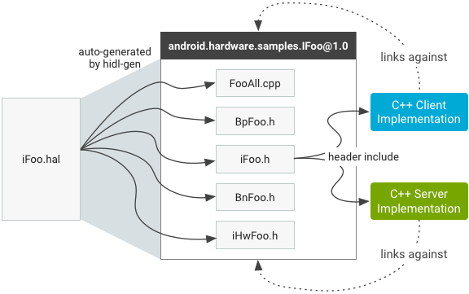

# 1. HIDL 概述

在 Andoird 8.0 版本框架代码中，加入了 HIDL（HAL 接口定义语言），HIDL 的出现是为了将用户层和 HAL 层分割开，它指定了 HAL 和用户之间的接口，让用户能够替换 Android 框架，而无需重新编译 HAL，以便让厂商能够以更低的成本、更快速地将设备更新到新版 Android 版本中。

通俗的来说，HIDL 设计了一套通过的框架接口，将 HAL 层实现与 Android 操作系统框架分离开来，设备厂商只需要构建一次 HAL，并将其放置在`/vendor`分区中，便能适应大部分 Android 操作系统框架版本的升级。

HIDL相当于原来fingerpintd功能，提供打开so接口的功能

在 HIDL 设计理念中，HAL 模块以一个独立的 Service 运行，用户通过 Binder IPC 与 HAL 模块进行通信。这些 Service 提供了设备 HAL 模块具体接口实现（由 HIDL 主导设计），这些接口独立于 Android 平台与设备厂商 HAL 实现。


# 2. HIDL 设计分析
HIDL 是一种接口定义语言，描述了 HAL 和它的用户之间的接口，因此首先需要设计一套通用接口实现。HIDL 为每个 HAL 模块设计了不同接口定义 hal 文件，以 .hal 结尾，在 hidl-gen 工具的帮助下即可自动编译生成对应接口 C++ 实现或者 Java 实现。

下面先来理清几个概念。
# 2.1 软件包

Google 为每个 HAL 模块设计一个接口软件包，大部分 HIDL 接口软件包位于`hardware/interfaces`下

`hardware/interfaces`顶层会直接映射到`android.hardware `软件包命名空间,软件包名称可以具有子级，表示接口软件包的版本，如 HAL Service：

`android.hardware.graphics.composer@2.1-service`的接口软件包可以在`hardware/interfaces/graphics/composer/2.1` 目录下找到。

下表列出了 Android 所有软件包前缀和位置：

```
android.hardware.*	    hardware/interfaces/*
android.frameworks.*	frameworks/hardware/interfaces/*
android.system.*	    system/hardware/interfaces/*
android.hidl.*	        system/libhidl/transport/*
```

### 2.1.1 软件包结构

> .hal 文件

软件包是 HIDL 设计的关键所在，每个接口软件包都包含一个 .hal 文件，.hal 文件包含一个指定文件所属的软件包和版本的package 语句。如路径 `hardware/interfaces/graphics/composer/2.1/IComposer.hal`声明。

```hal
package android.hardware.graphics.composer@2.1;

interface IComposer {
...
}
```

`.hal`文件中定义了HAL模块向用户提供的访问接口及数据类型

```hal
interface IComposer {
    struct MyStruct {/*...*/};
    ...
    getCapabilities() generates (vec<Capability> capabilities);
    dumpDebugInfo() generates (string debugInfo);
    ....
}
```

> 不含显式 extends 声明的接口会从 android.hidl.base@1.0::IBase 隐式扩展，其他语法不做分析，可以访问 Google 官网 做深入了解。

### 2.1.2 hidl-gen 工具

hidl-gen 编译器会将 `.hal` 文件编译成一组 `.h` 和 `.cpp` 文件，这些自动生成的文件用于`编译客户端/服务端`实现链接到的**共享库**,用于编译此共享库的 **Android.bp** 文件由`hardware/interfaces/update-makefiles.sh`脚本自动**生成**。每次将新软件包添加到 hardware/interfaces 或在现有软件包中添加/移除`.hal`文件时，都必须重新运行该脚本，以确保生成的共享库是最新的。

在 HIDL 架构中，系统定义的所有的 .hal 接口，都是通过 hidl-gen 工具在编译时转换成对应的代码。比如:

```
hal 文件：hardware/interfaces/graphics/composer/2.1/IComposer.hal

1.生成文件路径:
out/soong/.intermediates/hardware/interfaces/graphics/composer/2.1

2. 头文件自动生成在：
android.hardware.graphics.composer@2.1_genc++_headers

3.C++文件自动生成在：
android.hardware.graphics.composer@2.1_genc++
```

hidl-gen 源码路径：system/tools/hidl，是在 ubuntu 上可执行的二进制文件，这里不对工具源码做分析。

hidl-gen 工具以`.hal`文件为输入，自动生成的文件主要以下几个，这些文件会链接到与软件包同名的单个共享库（例如 android.hardware.samples@1.0）。



由编译器生成的文件

* IFoo.h - 描述 C++ 类中的纯 IFoo 接口；它包含 IFoo.hal 文件中的 IFoo 接口中所定义的方法和类型，类的命名空间包含软件包名称和版本号，例如 ::android::hardware::samples::IFoo::V1_0。客户端和服务器都包含此标头：客户端用它来调用方法，服务器用它来实现这些方法。
* IHwFoo.h - 头文件，其中包含用于对接口中使用的数据类型进行序列化的函数的声明。开发者不得直接包含其标头（它不包含任何类）。
* BpFoo.h - 从 IFoo 继承的类，可描述接口的 HwBinder 代理（客户端）实现。开发者不得直接引用此类。
* BnFoo.h - 保存对 IFoo 实现的引用的类，可描述接口的 HwBinder 服务器端实现。开发者不得直接引用此类。
* FooAll.cpp - 包含 HwBinder 客户端和 HwBinder 服务器端的实现的类。当客户端调用接口方法时，代理会自动从客户端封送参数，并将事务发送到绑定内核驱动程序，该内核驱动程序会将事务传送到另一端的服务器端实现。

## 2.2 共享库与 Service
软件包中编译，如 在`hardware/interfaces/graphics/composer`目录下 mm 编译将生成:

* android.hardware.graphics.composer@2.1 .so
* android.hardware.graphics.composer@2.1-impl.so
* android.hardware.graphics.composer@2.1-service.rc
* android.hardware.graphics.composer@2.1-service

下面会简单介绍一下这些库及文件的用途，以及一个 HIDL 架构下的 HAL 模块是怎么运转起来的，在下一章的实例分析中会具体分析它的代码实现。

首先，android.hardware.graphics.composer@2.1-service 是一个服务，是一个 Hal 模块可执行程序，而 android.hardware.graphics.composer@2.1-service.rc 正是它的启动配置脚本：

```
service vendor.hwcomposer-2-1 /vendor/bin/hw/android.hardware.graphics.composer@2.1-service                                     
    class hal animation
    user system
    group graphics drmrpc
    capabilities SYS_NICE
    writepid /dev/cpuset/system-background/tasks
```
也就是说，Android HIDL 架构下，所有 HAL 模块实现都以服务的形式运行在独立的进程空间

而 HAL 服务进程会链接 `android.hardware.graphics.composer@2.1.so`

```
cc_binary {
    name: "android.hardware.graphics.composer@2.1-service",
    defaults: ["hidl_defaults"],
    vendor: true,
    relative_install_path: "hw",
    srcs: ["service.cpp"],
    init_rc: ["android.hardware.graphics.composer@2.1-service.rc"],
    shared_libs: [
        "android.hardware.graphics.composer@2.1", // 链接 HIDL 生成主要库
        "libbinder",
        "libhidlbase",
        "libhidltransport",
        "liblog",
        "libsync",
        "libutils",
    ],
} 
```

首先，android.hardware.graphics.composer@2.1-service 服务的作用就是向 hwservicemanager 注册 HAL，以便客户端调用，因此需要开机启动。


android.hardware.graphics.composer@2.1.so 中包含必要的 binder IPC 通信机制，包含 HAL 对象如 IComposer 对象的客户端和服务器端通信实现及接口调用。而 android.hardware.graphics.composer@2.1.so 又会链接 android.hardware.graphics.composer@2.1-impl.so，这个动态库具体实现了接口逻辑，如在 passthrought 模式下，链接旧版 HAL（hw_moudle_get）实现逻辑。

在最后一节会通过 composer HAL 来具体分析。

## 2.3 HAL 兼容类型

Google 的 HIDL 设计目的是让 HAL 与 用户调用在不同的进程中，HAL 被写成 binder service，而用户接口如 frameworks 作为 binder client 通过 IPC 机制实现跨进程接口调用。

但是理想很丰满，现实却很残酷，很多厂商还停留在 Android 老版本，为了给厂商改变时间，同时保持 Android 向前兼容性，Google 另外设计了 Passthrough 类型的 HAL 框架。请看，


图：HAL 的发展历程

* Legacy Hal：Android 8.0 之前版本的 HAL 都是编译成 so，然后动态链接到各个 frameworks service 中去。
* Passthrough Hal：该模式是为了兼容旧版的 HAL，旧版 HAL 实现仍以动态库的方式提供，只是 binder service 链接了动态库 HAL 实现，即 binder service 通过 hw_get_module 链接了旧版的 hal 实现，而用户端通过与 binder service IPC 通信，间接实现了与旧版 HAL 的交互。
* Binderized HAL：HAL 与 用户调用在不同的进程中，HAL 被写成 binder service，而用户接口如 frameworks 作为 binder client 通过 IPC 机制实现跨进程接口调用。这个是 Google 的最终设计目标。

## 2.4 通用客户端与服务端实现
HIDL 接口具有客户端和服务器实现：

* HIDL 接口的客户端实现是指通过在该接口上调用方法来使用该接口的代码。
* 服务器实现是指 HIDL 接口的实现，它可接收来自客户端的调用并返回结果（如有必要）。

在从 libhardware HAL 转换为 HIDL HAL 的过程中，HAL 实现成为服务器，而调用 HAL 的进程则成为客户端。

### 创建 HAL 客户端
通过 HAL Service 的注册，hwservicemanager 中已经保存了 HAL 模块对象（如 IComposer），因此我们只需如下操作客户端。

首先将 HAL 库添加到 makefile 中：

```
Make：LOCAL_SHARED_LIBRARIES += android.hardware.graphics.composer@2.1
Soong：shared_libs: [ …, android.hardware.graphics.composer@2.1 ]
```
接下来，添加 HAL 头文件：

```
#include <android/hardware/graphics/composer/2.1/IComposer.h>
…
// in code:
sp<IFoo> client = IComposer::getService();
client->doThing();
```

### 创建 HAL 服务器

要创建 HAL 实现，必须具有表示 HAL 的 .hal 文件并已在 hidl-gen 上使用 `-Lmakefile` 或 `-Landroidbp` 为 HAL 生成 makefile（`./hardware/interfaces/update-makefiles.sh`完成）。

为了让 HAL 在 Passthrough 模式下工作（兼容旧版 HAL），必须具备 HIDL_FETCH_IModuleName 函数（位于 `/(system|vendor|…)/lib(64)?/hw/android.hardware.graphics/composer@2.1-impl.so` 下）。

接下来，完成服务器端代码并设置守护进程。守护进程代码（支持 Passthrough 模式）示例：

```
#include <hidl/LegacySupport.h>

int main(int /* argc */, char* /* argv */ []) {
    return defaultPassthroughServiceImplementation<INfc>("nfc");
}
```

defaultPassthroughServiceImplementation 将对提供的 `-impl` 库执行 dlopen() 操作，并将其作为绑定式服务提供。守护进程代码（对于纯绑定式服务）示例：

```
int main(int /* argc */, char* /* argv */ []) {
    // This function must be called before you join to ensure the proper
    // number of threads are created. The threadpool will never exceed
    // size one because of this call.
    ::android::hardware::configureRpcThreadpool(1 /*threads*/, true /*willJoin*/);

    sp nfc = new Nfc();
    const status_t status = nfc->registerAsService();
    if (status != ::android::OK) {
        return 1; // or handle error
    }

    // Adds this thread to the threadpool, resulting in one total
    // thread in the threadpool. We could also do other things, but
    // would have to specify 'false' to willJoin in configureRpcThreadpool.
    ::android::hardware::joinRpcThreadpool();
    return 1; // joinRpcThreadpool should never return
}
```
此守护进程通常存在于 $PACKAGE + “-service-suffix”（例如 android.hardware.graphics.composer@1.0-service）中，但也可以位于任何位置。HAL 的特定类的 sepolicy 是属性 hal_（例如 hal_composer)）。您必须将此属性应用到运行特定 HAL 的守护进程（如果同一进程提供多个 HAL，则可以将多个属性应用到该进程）。