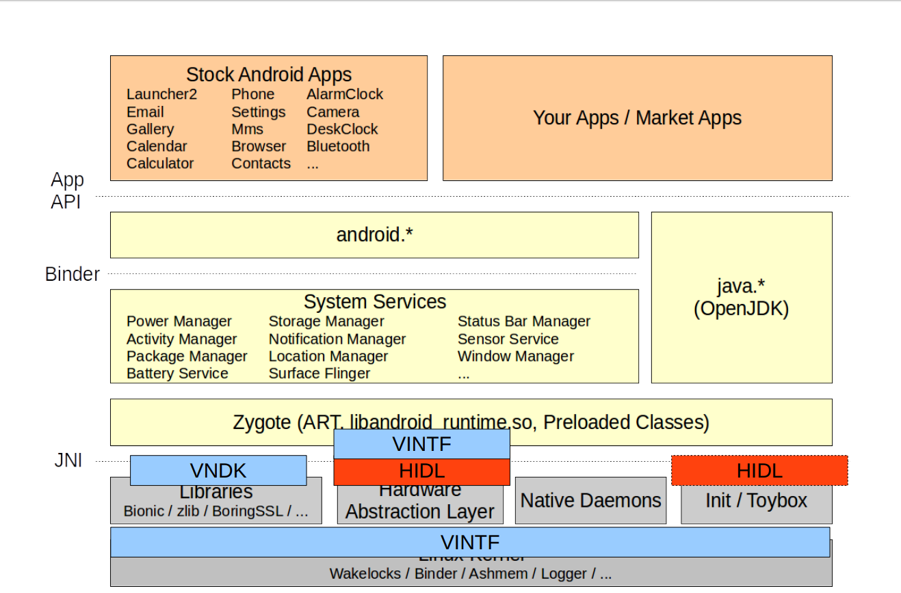
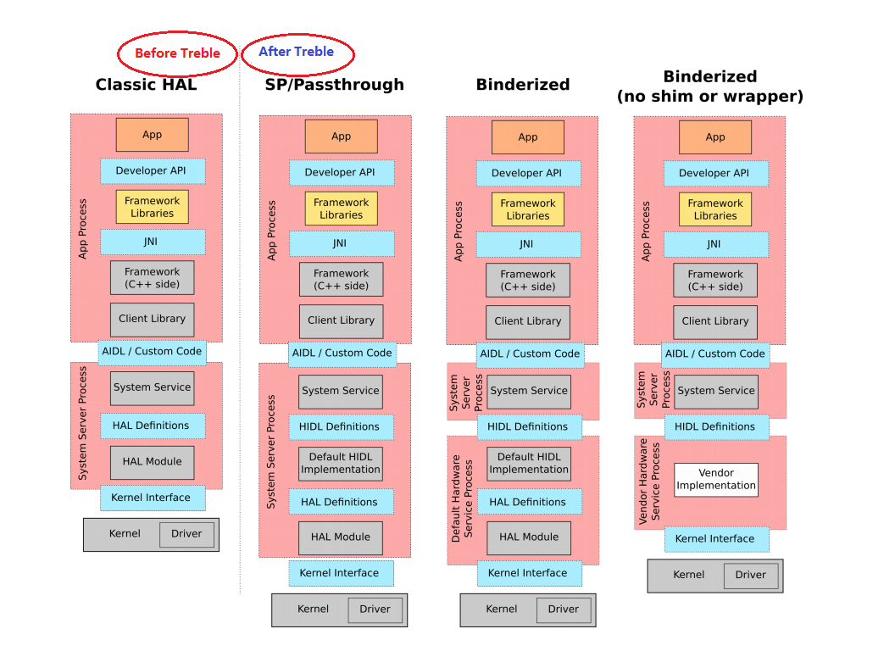
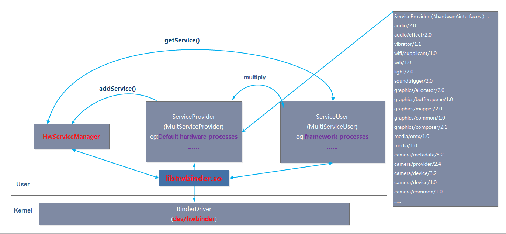
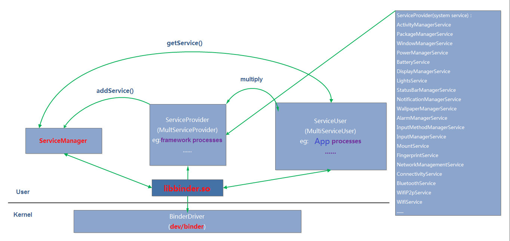
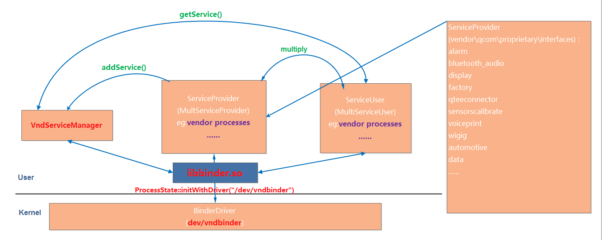
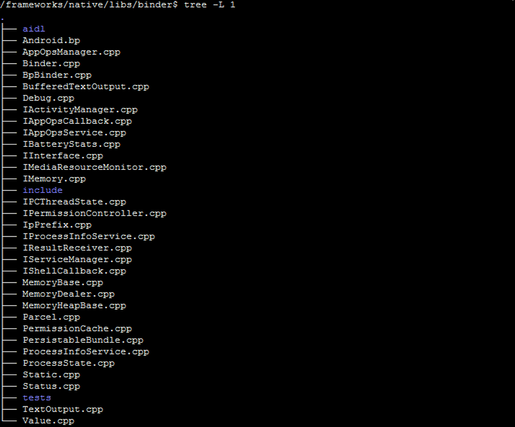
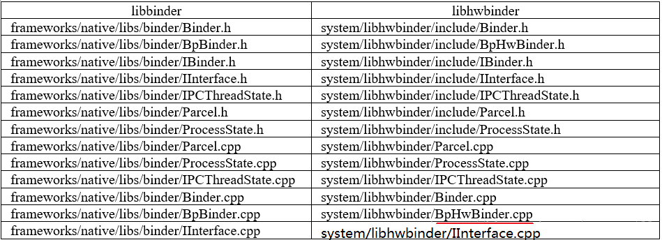
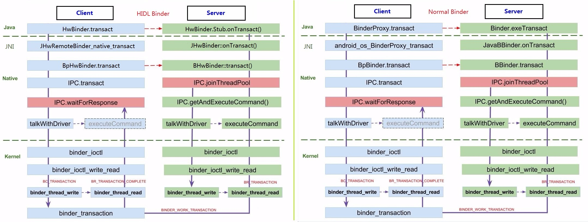
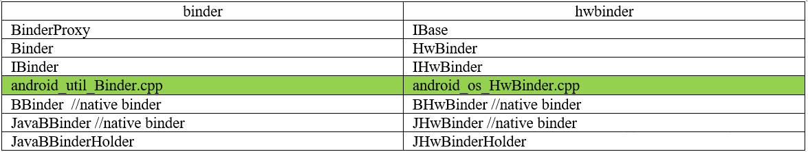
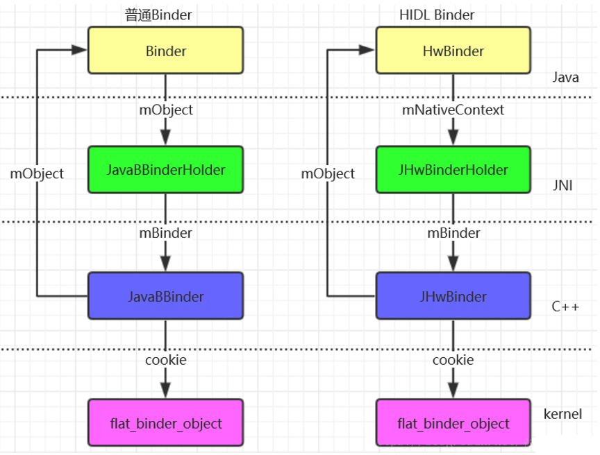

# Android O Treble 架构 - HIDL源代码分析

源码位置

> Java框架


```
/frameworks/base/core/java/android/os/（JAVA）
	IHwInterface.java
	HwBinder.java
	HwRemoteBinder.java
	IHwBinder.java
	HwParcel.java

/frameworks/base/core/jni/（JNI）
	android_os_HwRemoteBinder.cpp
	android_os_HwBinder.cpp
	android_os_HwParcel.cpp
```

> Native框架

```
/system/libhwbinder/
	Binder.cpp
	BpHwBinder.cpp
	IInterface.cpp
	IPCThreadState.cpp
	Parcel.cpp
	ProcessState.cpp

/system/libhidl/transport/
	HidlBinderSupport.cpp
	HidlTransportSupport.cpp
	ServiceManagement.cpp
	/manager/1.0/IServiceManager.hal
	/manager/1.0/IServiceNotification.hal
/system/hwservicemanager/
	HidlService.cpp
	hwservicemanager.rc
	ServiceManager.cpp
	service.cpp
```

> Binder Driver（Kernel）


```
/drivers/android/
	binder.c
	binder_alloc.c
```

> 源码编译生成路径（hardware/interfaces/）

```
\out\soong.intermediates\system\
	libhidl\transport\manager\1.1\android.hidl.manager@1.1_genc++
\out\soong.intermediates\hardware\interfaces*	
	light\2.0\android.hardware.light@2.0_genc++
	audio\2.0\android.hardware.audio@2.0_genc++
	camera*
	graphics*
	media*
	wifi*
```

# 1.Android O Treble 架构介绍
## 1.0、Android整体架构变化（VNDK、VINTF、HIDL）





AndroidO引入Treble架构后的变化:

* 增加了2个服务管家，Android O 之前版本有且只有一个servicemanager，现在增加到3个(`servicemanager`、`hwservicemanager`、`vndservicemanager`)，他们分管不同的服务。
* 增加了binder通信库，这是为了适配binder域的扩展。
* 增加了binder域，系统定义了3个binder设备节点，binder驱动分别处理这3个binder设备节点上的binder通信事件。

## 1.1.Binder通信域变化

Treble架构的引入足以说明Binder通信的重要性，之前APP和Framework之间通过binder实现跨进程调用，当然这个调用对开发者来说是透明的，相当于函数本地调用。Treble引入后，Framework和HAL又实现了进程分离，Framework和HAL之间依然使用binder通信，通过HIDL来定义通信接口。那binder通信有什么变化呢？ 在Treble中，引入了多个binder域，主要是增加了多个binder设备，binder驱动实现原理基本没变，变化了一些细节。增加binder设备应该是为了**实现更换的权限控制**，使用不同binder设备的主体和客体之间的selinux权限有所不同，同时，Android 框架和 HAL 现在使用 Binder 互相通信。由于这种通信方式极大地增加了 Binder 流量。

Multiple Binder Domains

* Each domain has its own:
	* Device node (`/dev/binder`,`/dev/hwbinder`,...)
	* ServiceManager(service registration and discovery)
* Domain are isolated from each other
	* **binder**:(aka "framework binder")communication between non-vendor processes
	* **hwbinder**:communication between non-vendor processes and vendor process(HALs) and between vendor processes that implement HIDL interfaces
	* **vndbinder**:communicaiton between vendor processes that implement AIDL interfaces.

为了明确地拆分框架（与设备无关）和供应商（与具体设备相关）代码之间的 Binder 流量，Android O 引入了“Binder 上下文”这一概念。每个 Binder 上下文都有自己的设备节点和上下文（服务）管理器。您只能通过上下文管理器所属的设备节点对其进行访问，并且在通过特定上下文传递 Binder 节点时，只能由另一个进程从相同的上下文访问上下文管理器，从而确保这些域完全互相隔离。为了显示 `/dev/vndbinder`，请确保内核配置项CONFIG_ANDROID_BINDER_DEVICES设为”binder,hwbinder,vndbinder”

```c
[->kernel/android/configs/android-base.cfg]
CONFIG_ANDROID_BINDER_DEVICES=binder,hwbinder,vndbinder

[->kernel/drivers/android/binder.c]
static char *binder_devices_param = CONFIG_ANDROID_BINDER_DEVICES;
module_param_named(devices, binder_devices_param, charp, S_IRUGO)
static int __init binder_init(void)
{
	int ret;
	......
	/*
	 * Copy the module_parameter string, because we don't want to
	 * tokenize it in-place.
	 */
	device_names = kzalloc(strlen(binder_devices_param) + 1, GFP_KERNEL);
	......
	strcpy(device_names, binder_devices_param);

	while ((device_name = strsep(&device_names, ","))) {
		ret = init_binder_device(device_name);
		......
	}

	return ret;
	......
}
static int __init init_binder_device(const char *name)
{
	int ret;
	struct binder_device *binder_device;

	binder_device = kzalloc(sizeof(*binder_device), GFP_KERNEL);
	......
	ret = misc_register(&binder_device->miscdev);
	......
	hlist_add_head(&binder_device->hlist, &binder_devices);

	return ret;
}
```
以kernel参数形式得到配置的binder设备节点名称，然后在binder驱动中创建不同的binder设备：
这样在驱动中就创建了`binder`、`vndbinder`、`hwbinder`三个驱动设备，并保存在binder设备列表binder_devices中。`/dev/binder`设备节点成为了框架进程的专属节点，这意味着oem进程将无法再访问该节点。oem进程可以访问 `/dev/hwbinder`，但必须将其 AIDL 接口转为使用 HIDL。

## 1.2 vndbinder && vndservicemanager
一直以来，供应商进程都使用 Binder 进程间通信 (IPC) 技术进行通信。在 Android O 中，`/dev/binder `设备节点成为了框架进程的专属节点，这意味着供应商进程将无法再访问该节点。供应商进程可以访问 `/dev/hwbinder`，但必须将其 AIDL 接口转为使用**HIDL**。对于想要继续在供应商进程之间使用 AIDL接口的供应商，Android 会按以下方式支持 Binder IPC。

### 1.2.1 vndbinder
Android O 支持供应商服务使用新的 Binder 域，这可通过使用 `/dev/vndbinder`（而非 `/dev/binder`）进行访问。添加`/dev/vndbinder`后，Android 现在拥有以下 3 个 IPC 域：

通常，供应商进程不直接打开 Binder 驱动程序，而是链接到打开 Binder 驱动程序的 libbinder 用户空间库。为`::android::ProcessState()`添加方法可为 `libbinder`选择 Binder 驱动程序。供应商进程应该在调用 ProcessState,、IPCThreadState 或发出任何普通 Binder 调用之前调用此方法。要使用该方法，请在供应商进程（客户端和服务器）的 `main()` 后放置以下调用：

```cpp
ProcessState::initWithDriver("/dev/vnbinder");
```

#### 1.2.2 vndservicemanager



以前，Binder 服务通过 servicemanager 注册，其他进程可从中检索这些服务。在 Android O 中，servicemanager 现在专用于框架和应用进程，供应商进程无法再对其进行访问。

不过，供应商服务现在可以使用 vndservicemanager，这是一个使用`/dev/vndbinder`作为构建基础的源代码与框架 servicemanager 相同`/frameworks/native/cmds/servicemanager/`）而非 `/dev/binder `的 `servicemanager` 的新实例。供应商进程无需更改即可与 `vndservicemanager`通信；当供应商进程打开` /dev/vndbinder `时，服务查询会自动转至 vndservicemanager。

vndservicemanager 二进制文件包含在 Android 的默认设备 Makefile 中。
servicemanager和vndservicemanager使用的是同一份代码，都是由service_manager.c编译而来。

```c
[->/frameworks/native/cmds/servicemanager/service_manager.c]
int main(int argc,char** argv){
	struct binder_state *bs;
	union selinux_callback cb;
	char *driver;
	
	if(argc>1)
		drivers = argv[1];// /dev/vndbinder
	else
		driver = "/dev/binder";

	bs = binder_open(driver,128*1024);
	...
	if(binder_become_context_manager(bs)){
		ALOGE("cannot become context manager (%s)\n",strerror(errno));
		return -1;
	}

	cb.func_audit = audit_callback;
	selinux_set_callback(SELINUX_CB_AUDIO,cb);
	cb.func_log = selinux_log_callback;
	selinux_set_callback(SELINUX_CB_LOG,cb);

#ifdef VENDORRSERVICEMANAGER
	sehandle = selinux_android_vendor_service_context_handle();
#else
	sehandle = selinux_android_service_context_handle();
#endif
	selinux_status_open(true);
	...
	binder_loop(bs,svcmgr_handler);
	return 0;
}
```
在启动servicemanager 时，并没有传参，而启动vndservicemanager时，传递了binder设备节点。

```
[->/frameworks/native/cmds/servicemanager/vndservicemanager.rc]
service vndservicemanager /vendor/bin/vndservicemanager /dev/vndbinder
	class core
	user system
	group system readproc
	writepid /dev/cpuset/system-background/tasks
	shutdown critical

[->/frameworks/native/cmds/servicemanager/servicemanager.rc]
service servicemanager /system/bin/servicemanager
    class core animation
    user system
    group system readproc
    critical
    onrestart restart healthd
    onrestart restart zygote
    onrestart restart audioserver
    onrestart restart media
    onrestart restart surfaceflinger
    onrestart restart inputflinger
    onrestart restart drm
    onrestart restart cameraserver
    onrestart restart keystore
    onrestart restart gatekeeperd
    writepid /dev/cpuset/system-background/tasks
    shutdown critical
```

### 1.2.3 servicemanager



## 1.3 hwservicemanager
hwservicemanager用于管理hidl服务，因此其实现和servicemanager完全不同，使用的binder库也完全不同。



## 1.4 Binder库变化
servicemanager和vndservicemanager都使用libbinder库，只是他们使用的binder驱动不同而已，而hwservicemanager使用libhwbinder库，binder驱动也不同。

libbinder库源码(`\frameworks\native\libs\binder`)


libhwbinder库源码：



文件对比：



## 1.5 Binder通信框架变化



* 在普通Java Binder框架中，Client端Proxy类完成数据打包，然后交给mRemotebinder代理来完成数据传输。Server端Stub类完成数据解析，然后交给其子类实现。
* 在普通Native Binder框架中，Client端BpXXX类完成数据打包，然后交给mRemoteBpBinder来完成数据传输。Server端BnXXX类完成数据解析，然后交个其子类实现
* 在HwBinder框架中，Client端的BpHwXXX类完成数据打包，然后交给`mRemoteBpHwBinder`来完成数据传输。Server端的`BnHwXXX`类完成数据解析，然后交给`_hidl_mImpl`来实现。

## 1.6 框架层Binder对象变化



