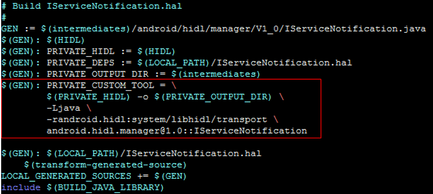
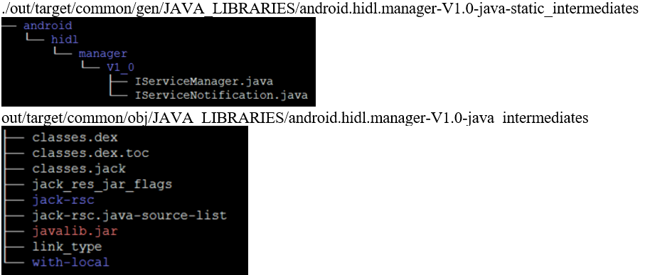
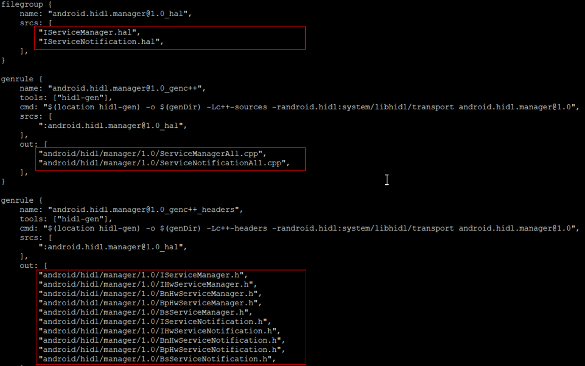
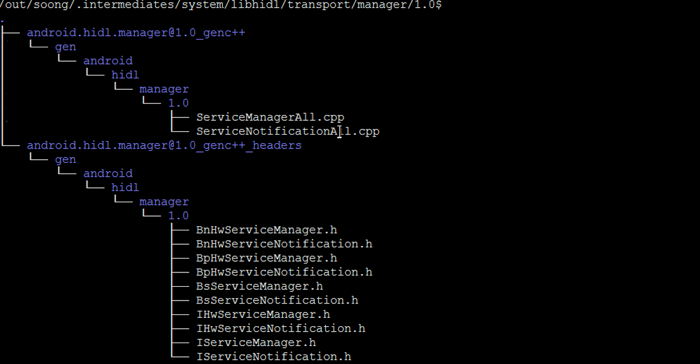
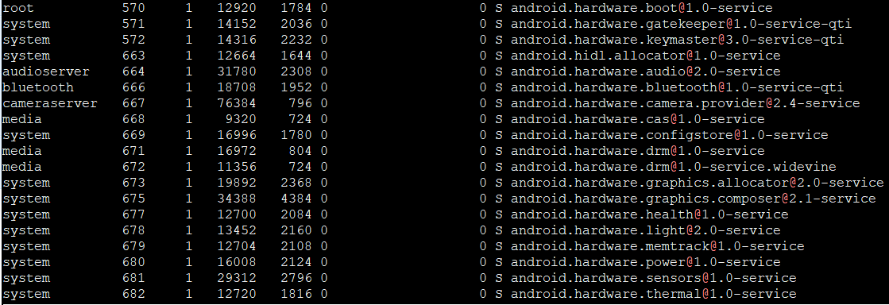

#（二）、Android O Treble 之 HIDL文件（.hal文件）接口文件编译
HIDL是一种接口定义语言，描述了HAL和它的用户之间的接口。同aidi类似，我们只需要为hal定义相关接口，然后通过`hidl-gen`工具即可自动编译生成对应的C++或者java源文件，定义hal接口的文件命名为xxx.hal，为了编译这些`.hal`文件，需要编写相应的Android.bp或者Android.mk文件:

* Android.bp文件用于编译C++；??
* Android.mk文件用于编译Java；

## 2.1 生成子Android.mk和Android.bp文件
所有的HIDL Interface 都是通过一个`.hal`文件来描述，为了方便编译生成每一个子hal。Google在系统默认提供了一个脚本`update-makefiles.sh`，位于`hardware/interfaces/`、`frameworks/hardware/interfaces/`、`system/hardware/interfaces/`、`system/libhidl/`。以`hardware/interfaces/`里面的代码为实例做介绍：

```bash
#!/bin/bash

source /system/tools/hidl/update-makefiles-helper.sh

do_makefiles_update \
	"android.hardware:hardware/interfaces" \
```

这个脚本的主要作用：根据hal文件生成Android.mk(makefile)和Android.bp(blueprint)文件。在`hardware/interfaces`的子目录里面，存在`.hal`文件的目录，都会产生`Android.bp`和`Android.mk`文件。详细分析如下：`

* 1.`source system/tools`下面的update-makefiles-helper.sh，然后执行`do_makefiles_update`
* 2.解析传入进去的参数。参数`android.hardware:hardware/interfaces`:
	* `android.hardware`: `android.hardware`表示包名。
	* `hardware/interfaces`：表示相对于根目录的文件路径。

会输出如下LOG：

```
Updating makefiles for android.hardware in hardware/interfaces.
Updating ….
```

* 3.获取所有的包名。通过`function get_packages()`函数，获取`hardware/interfaces`路径下面的所有hal文件所在的目录路径，比如子目录Light里面的hal文件的路径是`\hardware\interfaces\light\2.0`，加上当前的参数包名hardware/interfaces，通过点的方式连接，将`light/2.0+hardware/interfaces`里面的斜线转换成点,最终获取的包名就是 `android.hardware.light@2.0`，依次类推获取所有的包名。
* 4.执行hidl-gen命令.将c步骤里面获取的参数和包名还有类名传入hidl-gen命令，在`\hardware\interfaces\light\2.0`目录下产生Android.mk和Android.bp文件。
	*	`Android.mk`: `hidl-gen -Lmakefile -r android.hardware:hardware/interfaces -r `
`android.hidl:system/libhidl/transport android.hardware.light@2.0`


编译最终在`./out/target/common/gen/JAVA_LIBRARIES`目录下生成Java源文件。



* `Android.bp`: `hidl-gen -Landroidbp -r android.hardware:hardware/interfaces -r android.hidl:system/libhidl/transport android.hidl.manager@1.0`



编译最终在`./out/soong/.intermediates/hardware/interfaces`目录下生成C++源文件。




* 5.在`hardware/interfaces`的每个子目录下面产生Android.bp文件，文件内容主要是subdirs的初始化，存放当前目录需要包含的子目录。比如`hardware/interfaces/light/`下面的Android.bp文件。

经过以上步骤，就会在对应的子目录产生Android.mk和Android.bp文件。这样以后我们就可以执行正常的编译命令进行编译了。比如`mmm hardware/interfaces/light/`,默认情况下，在源码中，Android.mk和Android.bp文件已经存在。

## 2.2hidl-gen工具
在Treble架构中，系统定义的所有的.hal接口，都是通过hidl-gen工具转换成对应的代码。比如`\hardware\interfaces\light\2.0\ILight.hal`，会通过hidl-gen转换成`\out\soong.intermediates\hardware\interfaces\light\2.0\android.hardware.light@2.0_genc++\gen\android\hardware\light\2.0\LightAll.cpp`文件。
hidl-gen源码路径：`system/tools/hidl`，是在ubuntu上可执行的二进制文件。
使用方法：`hidl-gen -o output-path -L language (-r interface-root) fqname`
参数含义：

* `-L`： 语言类型，包括c++, c++-headers, c++-sources, export-header, c++-impl, java, java-constants, vts, makefile, androidbp, androidbp-impl, hash等。hidl-gen可根据传入的语言类型产生不同的文件。fqname：完全限定名称的输入文件。比如本例中android.hardware.light@2.0，要求在源码目录下必须有`hardware/interfaces/light/2.0/`目录。对于单个文件来说，格式如下：`package@version::fileName`，比如`android.hardware.light@1.0::types.Feature`。对于目录来说。格式如下`package@version`，比如`android.hardware.light@2.0`。
* `-r`： 格式`package:path`，可选，对fqname对应的文件来说，用来指定包名和文件所在的目录到Android系统源码根目录的路径。如果没有制定，前缀默认是：android.hardware，目录是Android源码的根目录。
* `-o`： 存放hidl-gen产生的中间文件的路径。我们查看`\hardware\interfaces\light\2.0\Android.bp`，可以看到，`-o`参数都是写的`$(genDir)`,一般都是在`\out\soong.intermediates\hardware\interfaces\light\2.0\`下面，根据`-L`的不同，后面产生的路径可能不太一样，比如c++，那么就会就是`\out\soong.intermediates\hardware\interfaces\light\2.0\gen`，如果是`c++-headers`，那么就是`\out\soong.intermediates\hardware\interfaces\light\2.0\android.hardware.light@2.0_genc++_headers\gen`。

对于实例来说，fqname是：android.hardware.light@2.0，包名是android.hardware，文件所在的目录是`hardware/interfaces`。例子中的命令会在`\out\soong.intermediates\hardware\interfaces\light\2.0\`下面产生对应的c++文件。

在`\hardware\interfaces\light\2.0\`目录下mm编译将生成：

```
\system\lib64\android.hardware.light@2.0.so
\symbols\vendor\lib64\hw\android.hardware.light@2.0-impl.so
\vendor\etc\init\android.hardware.light@2.0-service.rc
\vendor\bin\hw\android.hardware.light@2.0-service
```
android.hardware.light@2.0-service为hal进程的可执行文件，在android.hardware.light@2.0-service.rc是hal进程启动的配置脚本文件：

```
[->\hardware\interfaces\light\2.0\default\android.hardware.light@2.0-service.rc]
service light-hal-2-0 /vendor/bin/hw/android.hardware.light@2.0-service
    class hal
    user system
    group system
```
也就是说AndroidO的Treble架构下，所有hal都运行在独立的进程空间：

