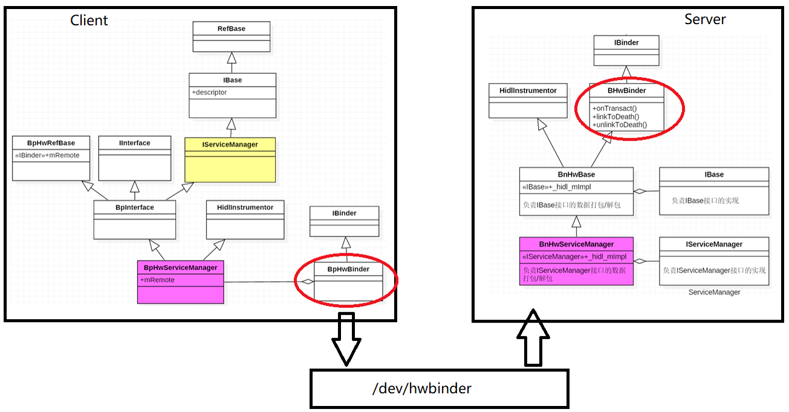

`hwservicemanager`是hidl服务管理中心，负责管理系统中的所有hidl服务，由init进程启动。

```
[->/system/core/rootdir/init.rc]
on post-fs
    # Load properties from
    #     /system/build.prop,
    #     /odm/build.prop,
    #     /vendor/build.prop and
    #     /factory/factory.prop
    load_system_props
    # start essential services
    start logd
    start servicemanager
    start hwservicemanager
    start vndservicemanager
```
可以看到在文件系统刚初始化没多久，就启动了系统非常重要的三个管理服务，接下来分析hwservicemanager的启动流程。

```
[->\system\hwservicemanager\hwservicemanager.rc]
service hwservicemanager /system/bin/hwservicemanager
    user system
    disabled
    group system readproc
    critical
    onrestart setprop hwservicemanager.ready false
    onrestart class_restart hal
    onrestart class_restart early_hal
    writepid /dev/cpuset/system-background/tasks
    class animation
```
hwservicemanager的源码位于`system\hwservicemanager\s`。
我们从`system\hwservicemanager\service.cpp`的main()入口函数开始：

```cpp
[->system\hwservicemanager\service.cpp]
int main(){
	configureRpcThreadpool(1,true/*callWillJoin*/);
	//创建ServiceManager对象
	ServiceManager *manager = new ServiceManager();
	//将ServiceManager对象自身注册到mServiceMap表中
	if(!manager->add(serviceName,manager)){
		ALOGE("Failed to register hwservicemanager with iteself.");
	}
	//创建TokenManager对象
	TokenManager *tokenManger = new TokenManager();
	//将TokenManager对象自身注册到mServiceMap表中
	if(!manager->add(serviceName,tokenManager)){
		ALOGE("Failed to register ITokenManager with hwservicemanager");
	}
	//建立消息循环
	sp<Looper> looper(Looper::prepare(0/*opts*/));
	
	int binder_fd = -1;
	//将主线程加入binder线程池，并得到/dev/hwbinder句柄
	IPCThreadState::self()->setupPolling(&binder_fd);
	if(binder_fd<0){
		ALOGE("Failed to aquire binder FD,Aborting ...");
		return -1;
	}
	//Flush after setupPolling(),to make sure the binder driver
	//knows about this thread handling commands
	IPCThreadState::self()->flushCommands();
	//主线程监听EVENT_INPUT,通过回调BinderCallback处理
	sp<BinderCallback> cn(new BinderCallback());
	if(looper->addFd(binder_fd,Looper::POLL_CALLBACK,Looper::EVENT_INPUT,cb,nullptr)!1){
		ALOGE("Failed to add hwbinder FD to Looper,Aborting ...");
		return -1;
	}
	//创建BnHwServiceManager对象
	//Tell IPCThreadState we're the serivce manager
	sp<BnHwServiceManager> service = new BnHwServiceManager(manager);
	IPCThreadState::self()->setTheContextObeject(service);
	//Then tell binder kernel
	ioctrl(binder_fd,BINDER_SET_CONTEXT_MGR,0);
	//Only enable FIFO inheritance for hwbinder
	//FIXME: remove define when in the kernel
#define BINDER_SET_INHERIT_FIFIO_PRIO _IO('b',10)
	
	int rc = ioctrl(binder_fd,BINDER_SET_INTHERIT_FIFO_PRIO);
	if(rc){
		ALOGE("BINDER_SET_INHERIT_FIFO_PRIO failed with error%d \n",rc);
	}
	//通过属性方式告知其他进程，hwservicemanager已经就绪
	rc=property_set("hwservicemanager.ready","true");
	if(rc){
		ALOGE("Failed to set \"hwservicemanager.read \" (error %d ."\
			"HAL services will not start!\n");	
	}
	//进入消息循环
	while(true){
		looper->pollAll(-1/*timeoutMillis*/);
	}
	return 0;
}
```
hwservicemanager启动过程比较简单，最重要的就是以下几行：

## 3.1 创建BnHwServiceManager

```cpp
sp<BnHwServiceManager> service = new BnHwServiceManager(manager);
IPCThreadState::self()->setTheContextObject(service);
//then tell binder kernel
ioctl(binder_fd,BINDER_SET_CONTEXT_MGR,0);
//监听请求
sp<BinderCallback> cb(new BinderCallback);
looper->addFd(binder_fd,Looper::POLL_CALLBACK,Looper::EVENT_INPUT,cb,nullptr);
```

这里创建一个binder本地对象BnHwServiceManager，然后注册到binder驱动中，让其他client进程都可以找到这个binder本地对象，然后为其创建binder代理对象。需要注意的是`BnHwServiceManager`的成员变量`_hidl_mImpl`保存的是ServiceManager实例，ServiceManager类实现了IServiceManager接口。

```java
[->\out\soong\.intermediates\system\libhidl\transport\manager\1.1\android.hidl.manager@1.1_genc++\gen\android\hidl\manager\1.1\ServiceManagerAll.cpp]
[->\out\soong\.intermediates\system\libhidl\transport\manager\1.1\android.hidl.manager@1.1_genc++\gen\android\hidl\manager\1.1\ServiceManagerAll.cpp]

BnHwServiceManager::BnHwServiceManager(const ::android::sp<IServiceManager> &_hidl_impl)
        : ::android::hidl::base::V1_0::BnHwBase(_hidl_impl, "android.hidl.manager@1.1", "IServiceManager") { 
            _hidl_mImpl = _hidl_impl;
            auto prio = ::android::hardware::details::gServicePrioMap.get(_hidl_impl, {SCHED_NORMAL, 0});
            mSchedPolicy = prio.sched_policy;
            mSchedPriority = prio.prio;
}
```

## 3.2IPCThreadState->setTheContextObject(service)

```cpp
//将BnHwServiceManager设置到IPCThreadState内部对象当中：
sp<BHWBinder> mContextObject;
void IPCThreadState::setTheContextObject(sp<BHWBinder> obj)
{
	mContextObject = obj;
}
```

## 3.3 BinderCallback
通过循环监听binder_fd，当有请求时会回调BinderCallback的handleEvent()函数，这部分的知识请参考 [【Android 7.1.2 (Android N) Android消息机制–Handler、Looper、Message 分析】](http://zhoujinjian.cc/2017/08/01/Android-7-1-2-Android-N-Android%E6%B6%88%E6%81%AF%E6%9C%BA%E5%88%B6%E2%80%93Handler%E3%80%81Looper%E3%80%81Message/)

```cpp
[->system\core\libutils\Looper.cpp]
int Looper::pollInner(int timeoutMills){
...
	int callback =response.request.callback->handleEvent(fd,events,data);
...
}
```
处理请求 handlePolledCommands：

```cpp
class BinderCallback : public LooperCallback {
public :
	BinderCallback () {}
	~ BinderCallback() override {}
	
	int handleEvent(int /*fd*/,int /*events*/,void */*data*/) override{
		IPCThreadState::self()->handlePolledCommands();
		return 1;//continue receiving callback
	}
};
```
进一步通过`talkWithDriver()` 和 `executeCommand(cmd)` 处理请求，这一部分跟普通的binder通信就没有区别了，这里就不做分析了。

```cpp
[->\system\libhwbinder\IPCThreadState.cpp]
status_t IPCThreadStae::handlePolledCommands(){
	status_t result;
	do{
		result = getAndExecuteCommand();
	} while(mIn.dataPostion() < mIn.dataSize());
	processPendingDerefs();
	flushCommands();
	return result;
}
status_t IPCThreadState::getAndExecuteCommand(){
	status_t result;
	int32_t cmd;
	
	result = talkWithDriver();
	if(result >= NO_ERROR) {
		size_t IN = mIn.dataAvali();
		if ( IN <sizeof(int32_t)) return result;
		cmd = mIn.readInt32();
		...
		result = executeCommand(cmd);
		...
	}
	return result;
}
```

## 3.4 hwserviemanager继承关系
hwservicemanager进程中的servicemanager作为hidl服务，同样适用了hwbinder框架，其类继承关系图如下：



