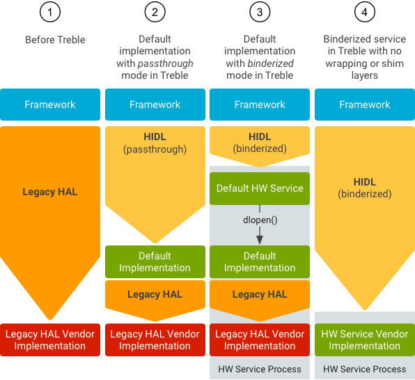
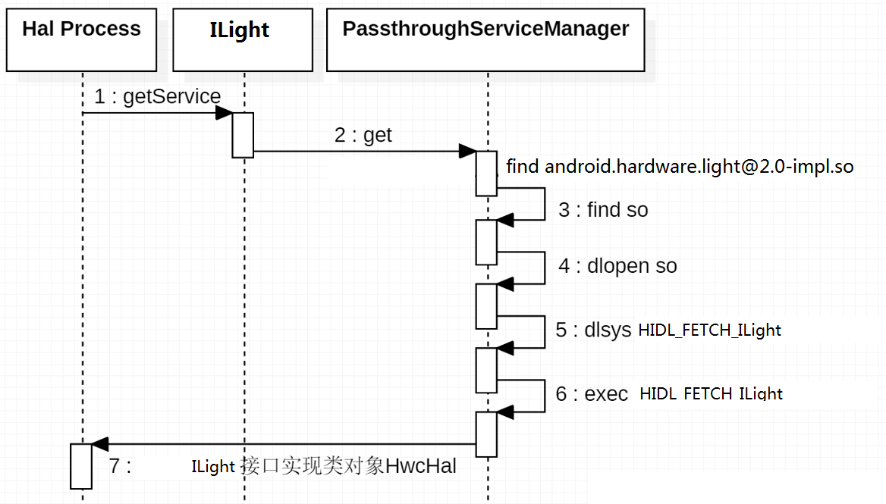
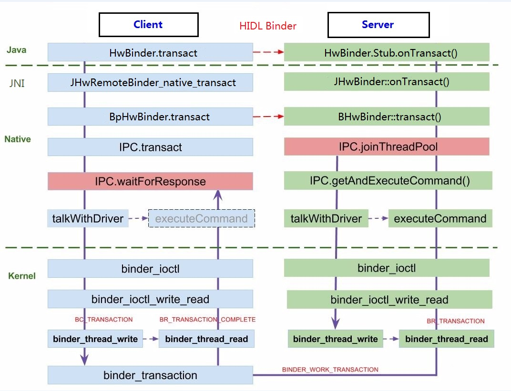
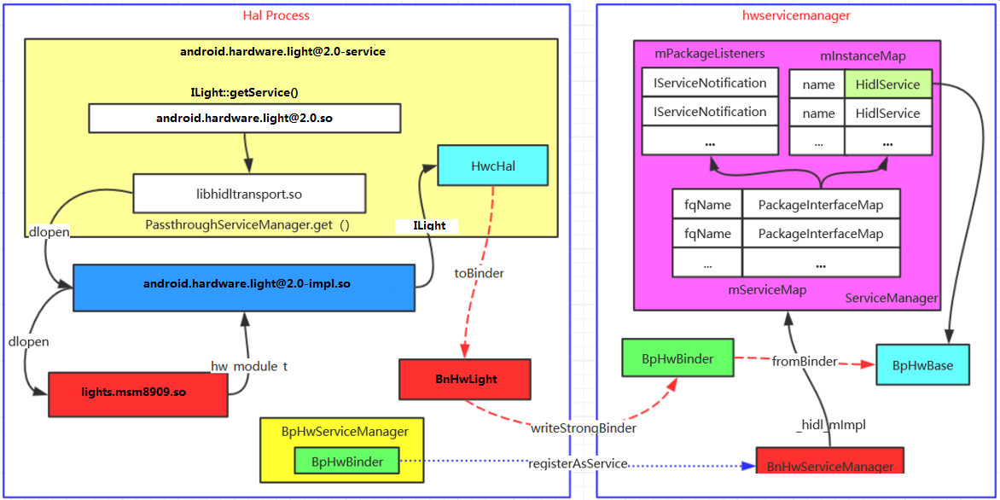

这里以light模块为例子（其他模块类似）:

[Android 7.0 init.rc的一点改变](https://blog.csdn.net/ly890700/article/details/62424821)

在Android 7之前的版本中，系统Native服务，不管它们的可执行文件位于系统什么位置都定义在根分区的init.*.rc文件中。这造成init＊.rc文件臃肿庞大，给维护带来了一些不便，而且其中定义的一些服务的二进制文件根本不存在。


但在Android 7.0中，对该机制做了一些改变 。单一的`init＊.rc`，被拆分，服务根据其二进制文件的位置（`/system`，`/vendor`，`/odm`）定义到对应分区的`etc/init`目录中，每个服务一个rc文件。与该服务相关的触发器、操作等也定义在同一rc文件中。

* `/system/etc/init`，包含系统核心服务的定义，如SurfaceFlinger、MediaServer、Logcatd等。
* `/vendor/etc/init`， SOC厂商针对SOC核心功能定义的一些服务。比如高通、MTK某一款SOC的相关的服务。
* `/odm/etc/init`，`OEM/ODM厂`商如小米、华为、OPP其产品所使用的外设以及差异化功能相关的服务。

这样的目录结构拆分，也与Android产品的开发流程相吻合，减轻了维护的负担。下图为Android7.0
模拟器`/system/etc/init`中定义的服务。

```
[->\hardware\interfaces\light\2.0\default\android.hardware.light@2.0-service.rc]
service light-hal-2-0 /vendor/bin/hw/android.hardware.light@2.0-service
    class hal
    user system
    group system

[编译生成路径（真机 /vendor/etc/init）]
[->\out\target\product\msm8909go\vendor\etc\init\android.hardware.light@2.0-service.rc]
```
开机会注册android.hardware.light@2.0-service， 直接看main()函数

```cpp
[->\hardware\interfaces\light\2.0\default\service.cpp]
int main() {
	return defaultPassthroughServiceImplementation<ILight>();
}
```
接着调用`defaultPassthroughServiceImplementation()`模板函数

```cpp
[->\system\libhidl\transport\include\hidl\LegacySupport.h]
template<class Interface>
__attribute__((warn_unused_result))
status_t registerPassthroghServiceImplementation(
	std::string name ="default"){
	sp<Interface> service =Interface::getService(name,true/*getStub*/);
	...
	status_t status = service->registerAsService(name);
	...
	return status;
}
template<class Interface>
__attribute__((warn_unused_result))
status_t defaultPassThroughServiceImplementation(std::string name,
								size_t maxThreads = 1) {
	configureRpcThreadPool(maxThreads,true);
	status_t result = registerPassThroughServiceImplementation<Interface>(name);
	....
	joinRpcThreadpoll();
	return 0;
}
template<class Interface>
__attribute__((warn_unused_result))
status_t defaultPassThroughServiceImplementation(size_t maxThreads =1 ) {
	return defaultPassThroughServiceImplmentation<Interface>("default,maxThreads");
}
```

```cpp
[->\out\soong\.intermediates\hardware\interfaces\light\2.0\android.hardware.light@2.0_genc++\gen\android\hardware\light\2.0\LightAll.cpp]
// static
::android::sp<ILight> ILight::getService(const std::string &serviceName, const bool getStub) {
    using ::android::hardware::defaultServiceManager;
    using ::android::hardware::details::waitForHwService;
    using ::android::hardware::getPassthroughServiceManager;
    using ::android::hardware::Return;
    using ::android::sp;
    using Transport = ::android::hidl::manager::V1_0::IServiceManager::Transport;

    sp<ILight> iface = nullptr;

    const sp<::android::hidl::manager::V1_0::IServiceManager> sm = defaultServiceManager();

    Return<Transport> transportRet = sm->getTransport(ILight::descriptor, serviceName);
    
    Transport transport = transportRet;
    const bool vintfHwbinder = (transport == Transport::HWBINDER);
    const bool vintfPassthru = (transport == Transport::PASSTHROUGH);
    ......
    if (getStub || vintfPassthru || vintfLegacy) {
        const sp<::android::hidl::manager::V1_0::IServiceManager> pm = getPassthroughServiceManager();
        if (pm != nullptr) {
            Return<sp<::android::hidl::base::V1_0::IBase>> ret = 
                    pm->get(ILight::descriptor, serviceName);
            if (ret.isOk()) {
                sp<::android::hidl::base::V1_0::IBase> baseInterface = ret;
                if (baseInterface != nullptr) {
                    iface = ILight::castFrom(baseInterface);
                    if (!getStub || trebleTestingOverride) {
                        iface = new BsLight(iface);
                    }
                }
            }
        }
    }
    return iface;
}
```

`spservice = Interface::getService(name, true / getStub /)`所以getStub=true. 这里通过PassthroughServiceManager来获取ILight对象。其实所有的Hal 进程都是通过PassthroughServiceManager来得到hidl服务对象的，而作为Hal进程的Client端Framework进程在获取hidl服务对象时，需要通过hal的Transport类型来选择获取方式。

```xml
[\device\qcom\xxx\manifest.xml]
<hal format = "hidl">
	<name>android.hardware.light</name>
	<transport>hwbinder</transport>
	<version>2.0</version>
	<interface>
		<name>ILight</name>
		<instance>default</instance>
	</interface>
</hal>
```



```cpp
[->system\libhidl\transport\ServiceManagement.cpp]

struct PassThroughServiceManager : IServiceManager1_1 {
	static void openLibs(const std::string & fpName,
		std::function<bool/*continue*/(void*/*handle*/,
			const std::string& /*lib*/,const std::string& /*sym*/)> eachLib) {
		//fpName looks like android.hardware.foo@1.0::IFoo
		size_t idx = fpName.find("::");
		
		std::string packageAndVersion = fpName.substr(0,idx);
		std::string ifaceName = fpName.substr(idx + strlen("::");
		
		const std::string prefix = packageAndVersion + "-impl";
		const std::string sym = "HIDL_FETCH" + ifaceName;
		
		const int dlMode = RTLD_LAZY;
		void *handle = nullptr;
		std::vector<std::string> paths ={HAL_LIBRARY_PATH_ODM, HAL_LIBRARY_PATH_VENDOR,HAL_LIBRARY_PATH_VNDK_SP, HAL_LIBRARY_PATH_SYSTEM};
		for(const std::string& path:paths){
			std::vector<std::string> libs = search(path,prefix,".so");
			
			for(const std::string &lib: libs){
				const std::string fullpath = path + lib;
				if(path != HAL_LIBRARY_PATH_SYSTEM){
					handle = android_load_sphal_library(funllPath.c_str(),dlMode);
				} else {
					handle = dlopen(fullPathc_str(),dlMode);
				}
				...
				if(!eachLib(handle,lib,sym)){
					return;
				}
			}
		}
	}
}
```
这里只是简单的创建了一个PassthroughServiceManager对象。PassthroughServiceManager也实现了IServiceManager接口。然后通过PassthroughServiceManager询服务：

根据传入的fqName获取当前的接口名ILight，拼接出后面需要查找的函数名HIDL_FETCH_ILight和库名字`android.hardware.light@2.0-impl.so`,然后查找”`/system/lib64/hw/`“、”`/vendor/lib64/hw/`“、”`/odm/lib64/hw/`“下是否有对应的so库。接着通过dlopen载入`/vendor/lib/hw/android.hardware.light@2.0-impl.so`，然后通过dlsym查找并调用HIDL_FETCH_ILight函数。

```cpp
[->\hardware\interfaces\light\2.0\default\Light.cpp]
ILight* HIDL_FETCH_ILight(const char* /*name*/){
	std::map<Type,light_device_t*> lights;
	
	for(auto const &pair:kLogicalLights){
		Type type = pair.first;
		const char* name = pair.second;
	
		light_device_t* light = getLightDevice(name);
		if(light !=nullptr) {
			lights[type] = light;
		}
	}
	if(light.size() ==0 ){
		//log information,but still return new Light
		//Some devies may not have any lights
		ALOGI("Could not open any lights.");
	}
	return new Light(std::move(lights));
}
```



## 4.1 ILight::registerAsService()
首先会调用`registerAsService()`注册服务，然后`joinRpcThreadpool()`加入线程池

```cpp
[->\out\soong\.intermediates\hardware\interfaces\light\2.0\android.hardware.light@2.0_genc++\gen\android\hardware\light\2.0\LightAll.cpp]

::android::status_t ILight::registerAsService(const std::string &serviceName) {
    ::android::hardware::details::onRegistration("android.hardware.light@2.0", "ILight", serviceName);

    const ::android::sp<::android::hidl::manager::V1_0::IServiceManager> sm
            = ::android::hardware::defaultServiceManager();
    if (sm == nullptr) {
        return ::android::INVALID_OPERATION;
    }
    ::android::hardware::Return<bool> ret = sm->add(serviceName.c_str(), this);
    return ret.isOk() && ret ? ::android::OK : ::android::UNKNOWN_ERROR;
}
```
通过`defaultServiceManager()`获取IServiceManager，接着`add()`添加服务

首先根据属性”hwservicemanager.ready”值判断hwservicemanager进程是否启动就绪，如果hwservicemanager已经启动，那么通过`fromBinder( ProcessState::self()->getContextObject(NULL))`来获取hwservicemanager的代理。

```cpp
[->\system\libhidl\transport\ServiceManagement.cpp]
sp<IServiceManager1_0> defaultServiceManager() {
	return defaultServiceManager1_1();
}
sp<IServceManager1_1> defaultServiceManager1_1() {
	{
		AutoMutex _l(details::gDefaultServiceManagerLock);
		if(details::gDefaultServiceManager !=NULL){
			return details::gDefaultServiceManager;
		}
		if(access("/dev/hwbinder",F_OK|R_OK|W_OK)!=0){
			return nullptr;
		}
		waitForHwServiceManager();
		while(details::gDefaultServiceManager == NULL){
			details::gDefaultServiceManager= 
				fromBinder<IServiceManager1_1,BpHwServiceManager,BnHwServiceManager>(
					ProcessState::self()->getContextObject(NULL));
				...
		}
	}
	return details::gDefaultServiceManager;
}
```
首先看看`ProcessState::getContextObject()`,因此通过`ProcessState::self()->getContextObject(NULL)`将得到一个BpHwBinder对象，然后通过fromBinder进行转换。

```cpp
[->\system\libhwbinder\ProcessState.cpp]
sp<IBinder> ProcessState::getContextObject(const sp<IBinder> &/*caller*/){
	return getStrongProxyForHanle(0);
}
sp<IBinder> ProcessState::getStrongProxyForHanle(int32_t handle)
{
	sp<IBinder> result;
	AutoMutex _l(mLock);
	handle_entry *e = lookupHanleLocked(handle);
	if(e != NULL ) {
		IBinder *b = e->binder;
		if( b ==NULL || !e->refs->attemptIncWeak(this) {
			b = new BpHwBinder(handle);
			e->binder = b;
			if (b) e->refs = b->getWeakRefs();
			result = b;
		} else {
			result.force_set(b);
			e->refs->decWeak(this);
		}
	}
	return result;
}
```

第一次调用会调用`fromBinder()`函数，在这里将创建一个`BpHwServiceManager`对象，`ProcessState::self()->getContextObject(NULL)`如果返回的是远程binder对象，那么基于BpHwBinder创建BpHwServiceManager对象，BpHwBinder负责数据传输，而BpHwServiceManager服务数据业务，业务数据在BpHwServiceManager层打包好后，转交给BpHwBinder发送。如果`getContextObject(NULL)`返回的是本地binder对象，那么将这个本地binder对象强制转换为BnHwBase类型，从上图可知BnHwBase继承BHwBinder类，BHwBinder即是本地binder对象。

`static_cast(binderIface.get())`然后通过`BnHwBase的getImpl()`函数得到其业务实现对象IBase。
`spbase =static_cast(binderIface.get())->getImpl();`

然后检查业务接口是否相同：
`if (details::canCastInterface(base.get(),IType::descriptor))`:如果业务接口类型相同，那么再次将这个本地binder对象转换为孙类BnHwServiceManager类型：`BnHwServiceManager stub = static_cast<BnHwServiceManager>(binderIface.get());`
然后返回业务实现类对象ServiceManager对象。

```cpp
[->\system\libhidl\transport\include\hidl\HidlBinderSupport.h]
template <typename IType,typename ProxyType,typename StubType>
sp<IType> fromBinder(const sp<IBinder>& binderIface) {
	using ::android::hidl::base::V1_0::IBase;
	using ::android::hidl::base::V1_0::BnHwBase;
	
	if(binderIface.get() == nullptr ){
		return nullptr;
	}
	if(binderIface->localBinder() == nullptr){
		return new ProxyType(binderIface);
	}
	sp<IBinder> base = static_cast<BnHwBase*>(binderIface.get())->getImpl();
	if(details::canCastInterface(base.get(),IType::descriptor)) {
		StubType* stub = static_cast<StubType*>(binderIface.get());
		return stub->getImpl();
	} else {
		return nullptr;
	}
}
```

调用`getImpl()`函数实现，返回的是

```cpp
[->\out\soong\.intermediates\system\libhidl\transport\manager\1.0\android.hidl.manager@1.0_genc++_headers\gen\android\hidl\manager\1.0\BnHwServiceManager.h]

::android::sp<IServiceManager> _hidl_mImpl;
::android::sp<IServiceManager> getImpl() { return _hidl_mImpl; };
```

## 4.2 sm->add(serviceName.c_str(),this)添加light service

```cpp
[->\out\soong\.intermediates\system\libhidl\transport\manager\1.0\android.hidl.manager@1.0_genc++\gen\android\hidl\manager\1.0\ServiceManagerAll.cpp]
::android::hardware::Return<bool> BpHwServiceManager::add(const ::android::hardware::hidl_string& name,const ::android::sp<::android::hidle::base::V1_0::IBase>& service){
	::android::hardware::Return<bool> _hidl_out = ::android::hidl::manager::V1_0::BpHwServiceManager::hidl_add(this,this,name,service);
	return _hidl_out;
}
::android::hardware::Return<bool> BpHwServiceManager::_hidl_add(::android::hardware::IInterface *_hidl_this,::android::hardware::details::HidlInstrumentor,const ::android::hardware::hidl_string& name,
	const ::android::sp<::android::hidl::base::V1_0::IBase>& servivce){
	...
	::android::hardware::Parcel _hidl_data;
	::android::hardware::Parcel _hidl_reply;
	::android::status_t _hidl_err;
	::android::hardware::Status _hidl_status;

	//...
	::android::hardware::PrcessState::self()->startThreadPool();
	_hidl_err = ::android::hardware::IInterface::asBinder(_hidl_this)->transact(2/*add*/,_hidl_data,&_hidl_reply);
	...
}

//[->\system\libhwbinder\BpHwBinder.cpp]
status_t BpHwBinder::transact(
	uint32_t code, const Parcel& data, Parcel* reply, uint32_t flags, TransactCallback /*callback*/){
	//once a binder has died,it will never come back to life
	if(mAlive){
		status_t status = IPCThreadState::self()->transact(
			mHandle,code,data,reply,flags);
		if(status == DEAD_OBJECT) mAlive = 0;
		return status;
	}
	return DEAD_OBJECT;
}
//[->/system/libhwbinder/IPCThreadState.cpp]
status_t IPCThreadState::transact(int32_t handle,uint32_t code,
	const,Parcel& data,Parcel* reply,uint32_t flags){
	status_t err = data.erroCheck();
	flags |= TF_ACCCPT_FDS;
	...
	if(err == NO_ERROR){
		err= writeTransacitonData(BC_TRANSACTIO_SG,flags,handle,code,data,NULL);
	}
	if((flags & TF_ONE_WAY == 0)){
		...
		if( reply ) {
			err = waitForRepsonse(reply);
		} else {
			Parcel fakeReply;
			err = waitForResponse(&fakeReply);
		}
		...
	} else {
		err = waitForResponse(NULL,NULL);
	}
	...
	return err;
}
```
`waitForResponse()`会通过底层binder 驱动进入到服务端，服务端监听消息来到处理过后会调用onTransact()函数



```cpp
[->/system/libhwbinder/Binder.cpp]
status_t BHwBinder::transact(
uint32_t code,const Parcel& data,Parcel* reply,uin32_t flags,TransactCallback callback
){
	data.setDataPostion(0);
	status_t err = NO_ERROR;
	swith(code){
		default:
			err = onTransact(code,data,reply,flags,
				[&](auto & replyParcel){
					replyParcel.setDataPostion(0);
					if(callback!=NULL){
						callback(replyParcel);
					}
				});
			break;
	}
	return err;
}
```

```cpp
[->\out\soong\.intermediates\system\libhidl\transport\manager\1.0\android.hidl.manager@1.0_genc++\gen\android\hidl\manager\1.0\ServiceManagerAll.cpp]
::android::status_t BnHwServiceManager::onTransact(
        uint32_t _hidl_code,
        const ::android::hardware::Parcel &_hidl_data,
        ::android::hardware::Parcel *_hidl_reply,
        uint32_t _hidl_flags,
        TransactCallback _hidl_cb) {
    ::android::status_t _hidl_err = ::android::OK;

    switch (_hidl_code) {
        ......
        case 2 /* add */:
        {
            bool _hidl_is_oneway = _hidl_flags & ::android::hardware::IBinder::FLAG_ONEWAY;
            if (_hidl_is_oneway != false) {
                return ::android::UNKNOWN_ERROR;
            }

            _hidl_err = ::android::hidl::manager::V1_0::BnHwServiceManager::_hidl_add(this, _hidl_data, _hidl_reply, _hidl_cb);
            break;
        }
        ......
}


::android::status_t BnHwServiceManager::_hidl_add(
        ::android::hidl::base::V1_0::BnHwBase* _hidl_this,
        const ::android::hardware::Parcel &_hidl_data,
        ::android::hardware::Parcel *_hidl_reply,
        TransactCallback _hidl_cb) {
    ......

    const ::android::hardware::hidl_string* name;
    ::android::sp<::android::hidl::base::V1_0::IBase> service;

    size_t _hidl_name_parent;

    _hidl_err = _hidl_data.readBuffer(sizeof(*name), &_hidl_name_parent,  reinterpret_cast<const void **>(&name));

    if (_hidl_err != ::android::OK) { return _hidl_err; }

    _hidl_err = ::android::hardware::readEmbeddedFromParcel(
            const_cast<::android::hardware::hidl_string &>(*name),
            _hidl_data,
            _hidl_name_parent,
            0 /* parentOffset */);

    if (_hidl_err != ::android::OK) { return _hidl_err; }

    {
        ::android::sp<::android::hardware::IBinder> _hidl_service_binder;
        _hidl_err = _hidl_data.readNullableStrongBinder(&_hidl_service_binder);
        if (_hidl_err != ::android::OK) { return _hidl_err; }

        service = ::android::hardware::fromBinder<::android::hidl::base::V1_0::IBase,::android::hidl::base::V1_0::BpHwBase,::android::hidl::base::V1_0::BnHwBase>(_hidl_service_binder);
    }

    atrace_begin(ATRACE_TAG_HAL, "HIDL::IServiceManager::add::server");
    ......

    bool _hidl_out_success = static_cast<BnHwServiceManager*>(_hidl_this)->_hidl_mImpl->add(*name, service);

    ......
    return _hidl_err;
}
```
此处的_hidl_mImpl即之前得到的::android::sp==_hidl_mImpl== 对象，所以会调用

```cpp
[->\system\hwservicemanager\ServiceManager.cpp]
Return<bool> ServiceManager::add(const hidl_string& name, const sp<IBase>& service) {
    ......
    pid_t pid = IPCThreadState::self()->getCallingPid();
    auto context = mAcl.getContext(pid);

    auto ret = service->interfaceChain([&](const auto &interfaceChain) {
    
        ......
        for(size_t i = 0; i < interfaceChain.size(); i++) {
            std::string fqName = interfaceChain[i];

            PackageInterfaceMap &ifaceMap = mServiceMap[fqName];
            HidlService *hidlService = ifaceMap.lookup(name);

            if (hidlService == nullptr) {
                ifaceMap.insertService(
                    std::make_unique<HidlService>(fqName, name, service, pid));
            } else {
                if (hidlService->getService() != nullptr) {
                    auto ret = hidlService->getService()->unlinkToDeath(this);
                    ret.isOk(); // ignore
                }
                hidlService->setService(service, pid);
            }

            ifaceMap.sendPackageRegistrationNotification(fqName, name);
        }

        auto linkRet = service->linkToDeath(this, 0 /*cookie*/);
        linkRet.isOk(); // ignore
        isValidService = true;
    });
    ......
    return isValidService;
}
```
完成插入到PackageInterfaceMap &ifaceMap 对象中，并添加一些监听。之后就可以查询到light service了。

## 4.3 joinRpcThreadpool()
加入线程池，至此Light service 就启动起来了，可以等待Client的请求了

```cpp
[->\system\libhidl\transport\HidlTransportSupport.cpp]
void joinRpcThreadpool() {
    // TODO(b/32756130) this should be transport-dependent
    joinBinderRpcThreadpool();
}
```

```cpp
[->\system\libhidl\transport\HidlBinderSupport.cpp]
void joinBinderRpcThreadpool() {
    IPCThreadState::self()->joinThreadPool();
}

[->\system\libhwbinder\IPCThreadState.cpp]
void IPCThreadState::joinThreadPool(bool isMain)
{
    ......
    mOut.writeInt32(isMain ? BC_ENTER_LOOPER : BC_REGISTER_LOOPER);

    status_t result;
    do {
        processPendingDerefs();
        // now get the next command to be processed, waiting if necessary
        result = getAndExecuteCommand();

        ......
    } while (result != -ECONNREFUSED && result != -EBADF);
    
    mOut.writeInt32(BC_EXIT_LOOPER);
    talkWithDriver(false);
}
```
到此就完成了hidl服务注册。


