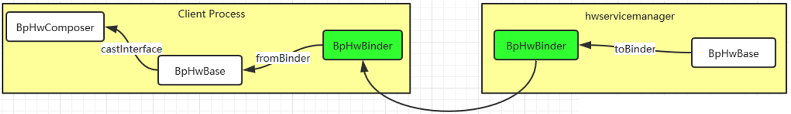
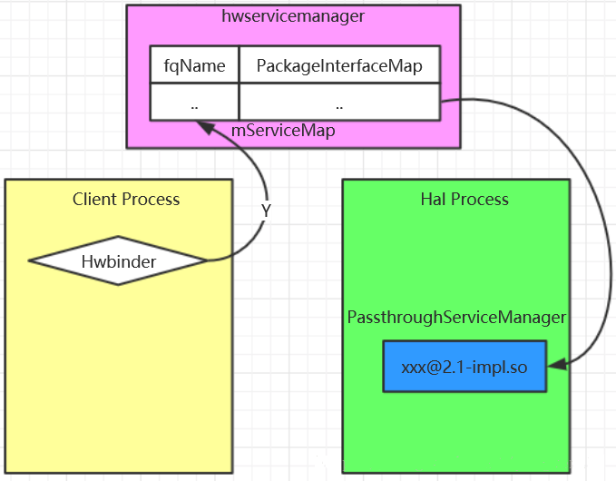
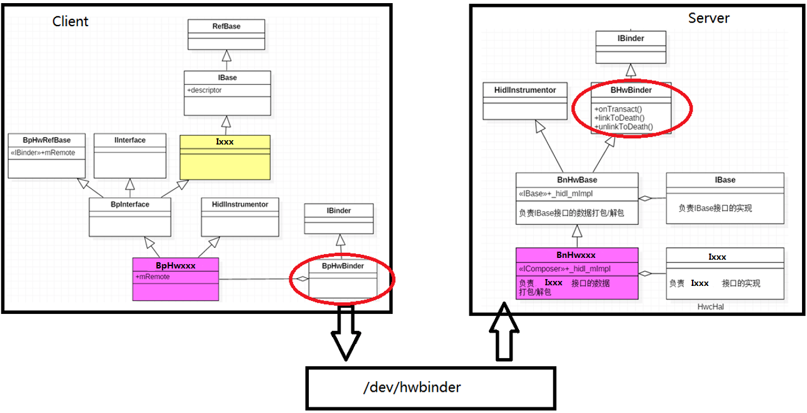

# Android O Treble 之 hwservicemanager 查询服务（get）过程

这里以light模块为例子（其他模块类似）：

通过前面的分析我们知道，Hal进程启动时，会向hwservicemanager进程注册hidl服务，那么当Framework Server需要通过hal访问硬件设备时，首先需要查询对应的hidl服务，那么Client进程是如何查询hidl服务的呢？这篇文章将展开分析，这里再次以ILight为例进行展开。



```c
[->/frameworks/base/services/core/java/com/android/server/lights/LightsService.java]
static native void setLight_native(int light, int color, int mode,
            int onMS, int offMS, int brightnessMode);
```

```c
[->/frameworks/base/services/core/jni/com_android_server_lights_LightsService.cpp]
static void setLight_native(
		JNIEnv* /* env */,
        jobject /* clazz */,
        jint light,
        jint colorARGB,
        jint flashMode,
        jint onMS,
        jint offMS,
        jint brightnessMode
	) {
	...
	sp<ILight> hal = LightHal::associate(colorARGB, flashMode, onMS, offMS, brightnessMode);
	...
	Type type = static_cast<Type>(light);
	LightState state = construtState();
	{
		android::base::Time t;
		Return<Status> ret = hal->setLight(type,state);
		processReturn(ret,type,state);
		if(t.duration()>50ms)ALOGD("Excessive delay setting light");
	}
}
```
`associate()`会获取`ILight::getService()`;这里通过`ILight::getService()`函数来查询ILight这个HIDL服务，由于这里没有传递任何参数，因此函数最终会调用：

```cpp
[->\out\soong\.intermediates\hardware\interfaces\light\2.0\android.hardware.light@2.0_genc++_headers\gen\android\hardware\light\2.0\ILight.h]
static ::android::sp<ILight> getService(const std::string &serviceName="default",bool getStub=false);
```
注意，这里的**getStub**为**false**，说明加载**hidl**服务方式是由当前hidl服务的**transport**类型决定。

```xml
[\device\qcom\xxx\manifest.xml]
<hal format = "hidl">
	<name>android.hardware.light</name>
	<transport>hwbinder</transport>
	<version>2.0</version>
	<interface>
		<name>ILight</name>
		<instance>default</instance>
	</interface>
</hal>
```
由于ILight的transport是**hwbinder**类型，那么将从hwservicemanager中查询hidl服务。

```cpp
[\out\soong\.intermediates\hardware\interfaces\light\2.0\android.hardware.light@2.0_genc++\gen\android\hardware\light\2.0\LightAll.cpp]
// static
::android::sp<ILight> ILight::getService(const std::string &serviceName,const bool getStub){
	using ::android::hardware::defaultServiceManager;
	using ::android::hardware::details::waitForHwService;
	using ::android::hardware::getPassthroughServiceManager;
	using ::android::hardware::Return;
	
	using Transport = ::android::hidl::manager::V1_0::IServiceManager::Transport;
	
	sp<ILight> iface = nullptr;
	const sp<::android::hidl::manager::V1_0::IServiceManager> sm = defaultServiceManager();
	Retrun<Transport> transport= sm->getTransport(ILight::descriptor,serviceName);
	
	Transport transport = transport;
	const bool vintfHwbinder = (transport == Transport::HWBINDER);
	const bool vintfPassthru = (transport == Transport::PASSTHROUGH);
	
	for(int tries =0;!getStub && (vintfHwbinder ||(vintfLegacy && tries ==0));tries++){
		if(vintfHwbinder && tries >0){
			waitforHwService(ILight::descripotr,serviceName);
		}
		Return<sp<::android::hidl::base::V1_0::IBase>> ret = 
			sm->get(ILight::descriptor,serviceName);
		sp<::android::hidl::base::V1_0::IBase> base =ret;
		Return<sp<ILight>> castRet = ILight::castFrom(base,true/*emitError*/);
		iface = castRet;
		return iface;
	}
	if(getStub || vintfPassthru || vintfLegacy){
		const sp<::andrdoi::hidl::manager::V1_0::IServiceManager>pm = getPasstroughServiceManger();
		if(pm!=nullptr){
			Return<sp<::android::hidl::base::V1_0::IBase>> ret = 
				pm->get(ILight::descriptor,serviceName);
			if(ret.isOK()){
				sp<::android::hidl::base::V1_0::IBase> baseInterface =ret;
				if(baseInterface != nullptr){
					iface = ILight::castFrom(baseInterface);
					if(!getStub || trebleTestingOverride){
						iface = new BsLight(iface);
					}
				}
			}
		}
	}
	return iface;
}

```
这里通过`sm->get(ILight::descriptor, serviceName)`查询ILight这个hidl服务，得到IBase对象后，在通过`ILight::castFrom`转换为ILight对象。



## 5.1服务查询_hidl_get()

```cpp
[->\out\soong\.intermediates\system\libhidl\transport\manager\1.1\android.hidl.manager@1.0_genc++\gen\android\hidl\manager\1.1\ServiceManagerAll.cpp]
::android::hardware::Return<::android::sp<::android::hidl::base::V1_0::IBase>> BpHwServiceManager::get(const ::android::hardware::hidl_string& fqName, const ::android::hardware::hidl_string& name){
    ::android::hardware::Return<::android::sp<::android::hidl::base::V1_0::IBase>>  _hidl_out = ::android::hidl::manager::V1_0::BpHwServiceManager::_hidl_get(this, this, fqName, name);

    return _hidl_out;
}
```

```cpp
[->\out\soong\.intermediates\system\libhidl\transport\manager\1.0\android.hidl.manager@1.0_genc++\gen\android\hidl\manager\1.0\ServiceManagerAll.cpp]

::android::hardware::Return<::android::sp<::android::hidl::base::V1_0::IBase>> BpHwServiceManager::_hidl_get(::android::hardware::IInterface *_hidl_this, ::android::hardware::details::HidlInstrumentor *_hidl_this_instrumentor, const ::android::hardware::hidl_string& fqName, const ::android::hardware::hidl_string& name) {
    
    ::android::hardware::Parcel _hidl_data;
    ::android::hardware::Parcel _hidl_reply;
    ::android::status_t _hidl_err;
    ::android::hardware::Status _hidl_status;

    ::android::sp<::android::hidl::base::V1_0::IBase> _hidl_out_service;

    _hidl_err = _hidl_data.writeInterfaceToken(BpHwServiceManager::descriptor);

    size_t _hidl_fqName_parent;

    _hidl_err = _hidl_data.writeBuffer(&fqName, sizeof(fqName), &_hidl_fqName_parent);

    _hidl_err = ::android::hardware::writeEmbeddedToParcel(
            fqName,
            &_hidl_data,
            _hidl_fqName_parent,
            0 /* parentOffset */);


    size_t _hidl_name_parent;

    _hidl_err = _hidl_data.writeBuffer(&name, sizeof(name), &_hidl_name_parent);

    _hidl_err = ::android::hardware::writeEmbeddedToParcel(
            name,
            &_hidl_data,
            _hidl_name_parent,
            0 /* parentOffset */);


    _hidl_err = ::android::hardware::IInterface::asBinder(_hidl_this)->transact(1 /* get */, _hidl_data, &_hidl_reply);

    _hidl_err = ::android::hardware::readFromParcel(&_hidl_status, _hidl_reply);


    {
        ::android::sp<::android::hardware::IBinder> _hidl__hidl_out_service_binder;
        _hidl_err = _hidl_reply.readNullableStrongBinder(&_hidl__hidl_out_service_binder);

        _hidl_out_service = ::android::hardware::fromBinder<::android::hidl::base::V1_0::IBase,::android::hidl::base::V1_0::BpHwBase,::android::hidl::base::V1_0::BnHwBase>(_hidl__hidl_out_service_binder);
    }

    _hidl_status.setFromStatusT(_hidl_err);
    return ::android::hardware::Return<::android::sp<::android::hidl::base::V1_0::IBase>>(_hidl_out_service);
}
```
整个调用过程和hidl 添加服务过程完全一致，就是一个从`BpHwServiceManager –> BnHwServiceManager –> ServiceManager`的过程。但需要注意，BpHwServiceManager得到BnHwServiceManager返回过来的binder代理后，会通过fromBinder函数进行对象转换：

```cpp
::android::hardware::fromBinder<::android::hidl::base::V1_0::IBase,::android::hidl::base::V1_0::BpHwBase,::android::hidl::base::V1_0::BnHwBase>(_hidl__hidl_out_service_binder)
```
hwservicemanager将ILight的binder代理BpHwBinder发给Framework Server进程，Framework Server进程拿到的依然是ILight的binder代理BpHwBinder对象，因此在fromBinder函数中将创建BpHwBase对象来封装BpHwBinder。

```cpp
[->\out\soong\.intermediates\system\libhidl\transport\manager\1.0\android.hidl.manager@1.0_genc++\gen\android\hidl\manager\1.0\ServiceManagerAll.cpp]

::android::status_t BnHwServiceManager::_hidl_get(
        ::android::hidl::base::V1_0::BnHwBase* _hidl_this,
        const ::android::hardware::Parcel &_hidl_data,
        ::android::hardware::Parcel *_hidl_reply,
        TransactCallback _hidl_cb) {


    const ::android::hardware::hidl_string* fqName;
    const ::android::hardware::hidl_string* name;

    size_t _hidl_fqName_parent;

    _hidl_err = _hidl_data.readBuffer(sizeof(*fqName), &_hidl_fqName_parent,  reinterpret_cast<const void **>(&fqName));


    _hidl_err = ::android::hardware::readEmbeddedFromParcel(
            const_cast<::android::hardware::hidl_string &>(*fqName),
            _hidl_data,
            _hidl_fqName_parent,
            0 /* parentOffset */);

    size_t _hidl_name_parent;

    _hidl_err = _hidl_data.readBuffer(sizeof(*name), &_hidl_name_parent,  reinterpret_cast<const void **>(&name));

    _hidl_err = ::android::hardware::readEmbeddedFromParcel(
            const_cast<::android::hardware::hidl_string &>(*name),
            _hidl_data,
            _hidl_name_parent,
            0 /* parentOffset */);

    ::android::sp<::android::hidl::base::V1_0::IBase> _hidl_out_service = static_cast<BnHwServiceManager*>(_hidl_this)->_hidl_mImpl->get(*fqName, *name);

    ::android::hardware::writeToParcel(::android::hardware::Status::ok(), _hidl_reply);

    if (_hidl_out_service == nullptr) {
        _hidl_err = _hidl_reply->writeStrongBinder(nullptr);
    } else {
        ::android::sp<::android::hardware::IBinder> _hidl_binder = ::android::hardware::toBinder<
                ::android::hidl::base::V1_0::IBase>(_hidl_out_service);
        if (_hidl_binder.get() != nullptr) {
            _hidl_err = _hidl_reply->writeStrongBinder(_hidl_binder);
        } else {
            _hidl_err = ::android::UNKNOWN_ERROR;
        }
    }

    _hidl_cb(*_hidl_reply);
    return _hidl_err;
}
```
BnHwServiceManager通过ServiceManager对象查询到对应的hidl服务，返回IBase对象后，会调用toBinder函数转换为IBinder类型对象：

```cpp
::android::hardware::toBinder< ::android::hidl::base::V1_0::IBase>(_hidl_out_service)
```
由于在hwservicemanager这边，保存的是ILight的BpHwBase对象，因此在toBinder函数中将调用IInterface::asBinder来得到BpHwBase的成员变量中的BpHwBinder对象。

```cpp
if (ifacePtr->isRemote()) {
	return ::android::hardware::IInterface::asBinder(static_cast<ProxyType *>(ifacePtr));
}
```
服务查询过程其实就是根据接口包名及服务名称，从hwservicemanager管理的表中查询对应的IBase服务对象，然后在Client进程空间分别创建BpHwBinder和BpHwBase对象。

## 5.2 接口转换IXXX::castFrom()
Framework Server进程通过上述hidl服务查询，得到了BpHwBase对象后，需要将其转换为与业务相关的代理对象，这就是通过：

```cpp
[->\out\soong\.intermediates\hardware\interfaces\light\2.0\android.hardware.light@2.0_genc++\gen\android\hardware\light\2.0\LightAll.cpp]

::android::hardware::Return<::android::sp<ILight>> ILight::castFrom(const ::android::sp<::android::hidl::base::V1_0::IBase>& parent, bool emitError) {
    return ::android::hardware::details::castInterface<ILight, ::android::hidl::base::V1_0::IBase, BpHwLight>(
            parent, "android.hardware.light@2.0::ILight", emitError);
}
```

```cpp
//system\libhidl\transport\include\hidl\HidlTransportSupport.h
// cast the interface IParent to IChild.
// Return nonnull if cast successful.
// Return nullptr if:
// 1. parent is null
// 2. cast failed because IChild is not a child type of IParent.
// 3. !emitError, calling into parent fails.
// Return an error Return object if:
// 1. emitError, calling into parent fails.
template<typename IChild, typename IParent, typename BpChild, typename BpParent>
Return<sp<IChild>> castInterface(sp<IParent> parent, const char *childIndicator, bool emitError) {
    if (parent.get() == nullptr) {
        // casts always succeed with nullptrs.
        return nullptr;
    }
    Return<bool> canCastRet = details::canCastInterface(parent.get(), childIndicator, emitError);
    if (!canCastRet.isOk()) {
        // call fails, propagate the error if emitError
        return emitError
                ? details::StatusOf<bool, sp<IChild>>(canCastRet)
                : Return<sp<IChild>>(sp<IChild>(nullptr));
    }
 
    if (!canCastRet) {
        return sp<IChild>(nullptr); // cast failed.
    }
    // TODO b/32001926 Needs to be fixed for socket mode.
    if (parent->isRemote()) {
        // binderized mode. Got BpChild. grab the remote and wrap it.
        return sp<IChild>(new BpChild(toBinder<IParent, BpParent>(parent)));
    }
    // Passthrough mode. Got BnChild and BsChild.
    return sp<IChild>(static_cast<IChild *>(parent.get()));
}
 
}  // namespace details
```
这个模板函数展开后如下：

```cpp
Return<sp<ILight>> castInterface(sp<IBase> parent, const char *childIndicator, bool emitError) {
    if (parent.get() == nullptr) {
        // casts always succeed with nullptrs.
        return nullptr;
    }
    Return<bool> canCastRet = details::canCastInterface(parent.get(), childIndicator, emitError);
    if (!canCastRet.isOk()) {
        // call fails, propagate the error if emitError
        return emitError
                ? details::StatusOf<bool, sp<ILight>>(canCastRet)
                : Return<sp<ILight>>(sp<ILight>(nullptr));
    }
 
    if (!canCastRet) {
        return sp<ILight>(nullptr); // cast failed.
    }
    // TODO b/32001926 Needs to be fixed for socket mode.
    if (parent->isRemote()) {
        // binderized mode. Got BpChild. grab the remote and wrap it.
        return sp<ILight>(new BpHwLight(toBinder<IBase, BpParent>(parent)));
    }
    // Passthrough mode. Got BnChild and BsChild.
    return sp<ILight>(static_cast<ILight*>(parent.get()));
}
```
因此最终会创建一个BpHwLight对象。new BpHwLight(toBinder(parent))

