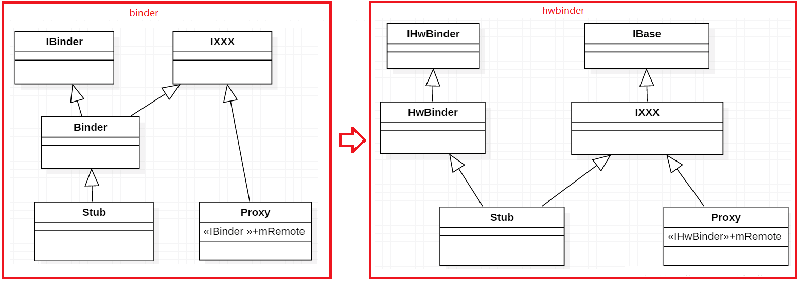
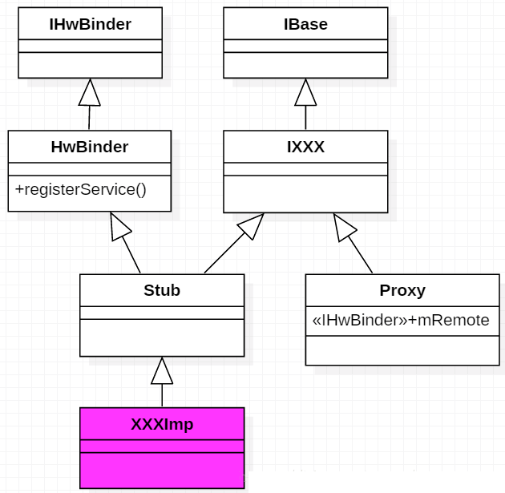
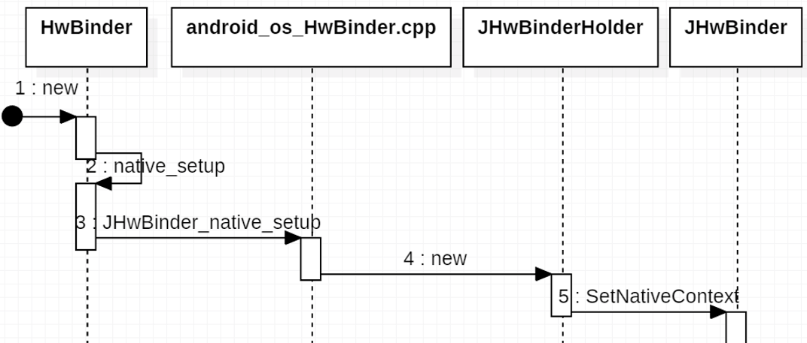
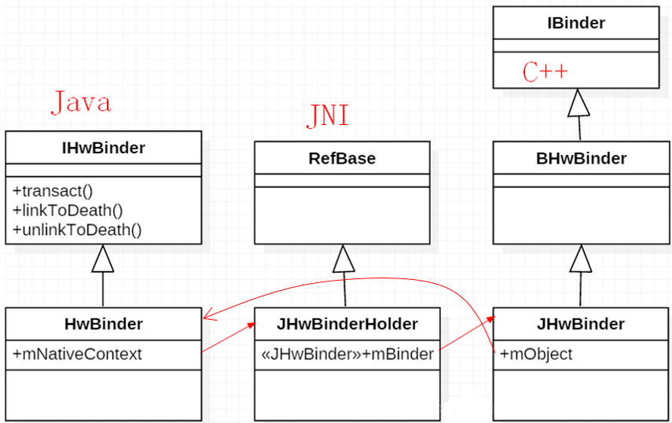
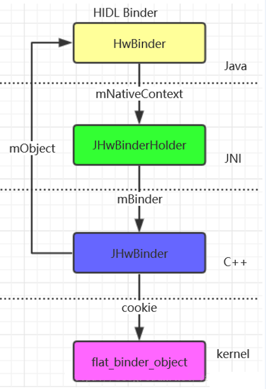

# Android O Treble 之 HIDL服务Java框架实现
前面介绍了HIDL服务在native层的实现过程，包括HIDL服务加载创建、服务注册、服务查询过程等，那么Java层是否也实现了相关的服务框架呢？ 通常情况下，所有的Hal都实现在native层面，每个hal进程都是一个native进程，由init进程启动，在hal进程启动时会完成HIDL服务注册，Framework Server进程不一定完全是native进程，比如system_server进程，它运行在虚拟机环境中，由zygote进程fork而来，这时，Java层也需要请求HIDL服务，因此Android不仅在native层HIDL化了hal，在Java层同样也定义了相关的服务框架。



上图是Java层binder和hwbinder之间的类基础图对比。当我们定义一个.hal接口文件时，通过hidl-gen编译为Java文件后，将按上图中的类继承关系自动生成代码。



如上图所示，当我们定义IXXX.hal文件后，通过编译将在`out/target/common/gen/JAVA_LIBRARIES`目录下生成对应的`IXXX.java`，该文件按上述类继承关系自动生成相关代码，我们只需要定义一个XXXImp类，继承Stub并实现所有方法，然后在某个服务进程中创建一个XXXImp对象，并调用registerService（）函数进行hidl服务注册，如下所示：

```java
XXXImp mXXXImp = new XXXImp();
mXXXImp.registerAsService("XXXImp");
```
这样就完成了一个Java层的hidl服务注册，当然在当前Android系统中，大部分还是native层的hidl服务，Java层的hidl服务还是比较少的。从上述可知，Java层的hidl服务包括2个步骤：

* hidl服务对象创建；
* hidl服务注册

## 6.1 Java hidl服务创建过程

从上面的类继承图可知，hidl服务实现类继承于Stub，Stub又继承于HwBinder，因此创建一个XXXImp对象时，会调用HwBinder的构造函数。



```java
//frameworks\base\core\java\android\os\HwBinder.java

public HwBinder() {
	native_setup();
 
	sNativeRegistry.registerNativeAllocation(
			this,
			mNativeContext);
}
static {
	long freeFunction = native_init();
 
	sNativeRegistry = new NativeAllocationRegistry(
			HwBinder.class.getClassLoader(),
			freeFunction,
			128 /* size */);
}
```

创建HwBinder对象会首先执行native_init()函数，然后调用native_setup()函数。
`frameworks\base\core\jni\android_os_HwBinder.cpp`

```cpp
static jlong JHwBinder_native_init(JNIEnv *env) {
    JHwBinder::InitClass(env);
 
    return reinterpret_cast<jlong>(&releaseNativeContext);
}
 
static void JHwBinder_native_setup(JNIEnv *env, jobject thiz) {
    sp<JHwBinderHolder> context = new JHwBinderHolder;
    JHwBinder::SetNativeContext(env, thiz, context);
}
```
这里创建一个JHwBinderHolder 对象，并保存在HwBinder类的mNativeContext变量中。

```cpp
sp<JHwBinderHolder> JHwBinder::SetNativeContext(
        JNIEnv *env, jobject thiz, const sp<JHwBinderHolder> &context) {
    sp<JHwBinderHolder> old =
        (JHwBinderHolder *)env->GetLongField(thiz, gFields.contextID);
 
    if (context != NULL) {
        context->incStrong(NULL /* id */);
    }
 
    if (old != NULL) {
        old->decStrong(NULL /* id */);
    }
 
    env->SetLongField(thiz, gFields.contextID, (long)context.get());
 
    return old;
}
```
这里出现了多个binder类型：HwBinder、JHwBinderHolder、JHwBinder他们的类继承图如下：



红线标识了这3个类对象之间的关系，为了更加清晰地描述他们之间的关联关系，如下图所示：



## 6.2、Java层服务注册（add）查询（get）过程
服务注册查询过程本质也是通过Native层的hwservicemanager来进行的。

请参考大牛博客:[Android O Treble架构下HIDL服务Java框架实现](https://blog.csdn.net/yangwen123/article/details/79876534)

到此Treble架构下的hwBinder实现过程就基本介绍完成。


.jpg)


