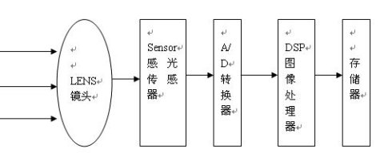

# 0 摄像头结构
1、摄像头结构

拍摄景物通过镜头，将生成的光学图像投射到传感器上，然后光学图像被转换成电信号，电信号再经过模数转换变为数字信号，数字信号经过DSP加工处理，再被送到电脑中进行处理，最终转换成手机屏幕上能够看到的图像。

# 1、Camera 的成像原理

**数据传输过程**

景物通过镜头(LENS)生成的光学图像投射到图像传感器(Sensor)表面上,然后转为模拟的电信号,经过`A/D`(模数转换)转换后变为数字图像信号,再送到**数字信号处理芯片**(DSP)中加工处理,再通过 IO 接口传输到 CPU 中处理,通过 LCD 就可以看到图像了。

图像传感器(SENSOR)是一种半导体芯片,其表面包含有几十万到几百万的光电二极管。光电二极管受到光照射时,就会产生电荷。目前的 SENSOR 类型有两种:

* CCD(Charge Couple Device),电荷耦合器件,它是目前高像素类 sensor 中比较成熟的成像器件,是以一行为单位的电流信号。
* CMOS(Complementary Metal Oxide Semiconductor),互补金属氧化物半导体。CMOS的信号是以点为单位的电荷信号,更为敏感,速度也更快,更为省电。

**性能**：

* ISP(Image Single Processor)的性能是决定**影像流畅**的关键,JPEG encoder的性能也是关键指标之一。而 JPEG encoder 又分为
	* 硬件 JPEG 压缩方式
	* 软件 RGB 压缩方式。
* DSP控制芯片的作用是:将感光芯片获取的数据及时快速地传到 baseband中并刷新感光芯片,因此控制芯片的好坏,直接决定画面品质(比如色彩饱和度、清晰度)与流畅度。

# 2.Camera 常见的数据输出格式
常见的数据输出格式有:Rawdata格式、YUV格式、RGB格式。

### 2.1 RGB格式
RGB 格式:采用这种编码方法,每种颜色都可用三个变量来表示红色、绿色以及蓝色的强度。每一个像素有三原色 R 红色、G 绿色、B 蓝色组成.

传统的红绿蓝格式，比如RGB565，RGB888，其16-bit数据格式为5-bit R + 6-bit G + 5-bit B。G多一位，原因是人眼对绿色比较敏感。

### 2.2 YUV格式
YUV 格式:其中“Y”表示明亮度(Luminance 或 Luma),就是灰阶值;而“U”和“V”表示色度(Chrominance 或 Chroma),是描述影像色彩及饱和度,用于指定像素的颜色。

色度(UV)定义了颜色的两个方面─色调与饱和度，分别用CB和CR表示。其中，Cr反映了RGB输入信号红色部分与RGB信号亮度值之间的差异。而Cb反映的是RGB输入信号蓝色部分与RGB信号亮度值之间的差异。

主要的采样格式有YCbCr`4:2:0`、YCbCr`4:2:2`、YCbCr`4:1:1`和 YCbCr`4:4:4`。

### 2.3 RAW DATA 
RAW DATA格式:是 CCD 或 CMOS 在将光信号转换为电信号时的电平高低的原始记录,单纯地将**没有进行任何处理的图像数据**,即摄像元件直接得到的电信号进行数字化处理而得到的。

### 2.4 不同格式的区别

支持`YUV/RGB`格式的模组,一般会在模组上集成ISP(Image Single Processor),经过`A/D`转换过的原始数据经过ISP处理生成YUV标准格式传到BB。一般来说,这种设计适用于低像素 Camera 的要求,会在主板上省去**一个DSP**,可降低成本。在调试过程中,`YUV/RGB`格式的摄像头,其所有参数都可在 kernel 层通过寄存器来控制。调试一般由 sensor的原厂支持。

支持 RawData 格式的模组,由于感光区域的需求,不会再模组内集成 ISP以**最大程度的增大感光区域的面积**,提高照片质量。模组把原始的数字信号传给BB上的 DSP进行处理,MTK自带的 DSP一般包含: ISP、JPEG encoder、和 DSP 控制芯片。在调试的时候**图像的效果需要MTK在HAL层的参数**进行支持。

CAMERA驱动整个框架分为：三个部分hal部分逻辑调用，kernel层的通用驱动sensorlist.c和具体**IC的驱动**xxxx_mipi_raw.c

这里主要介绍kernel部分和HAL层部分。

camera开机流程：poweron上电开机，然后通过i2c地址匹配i2c通讯，rest和powerdown上电（上电代码在kd_camera_hw.c中的kdCISModulePowerOn。主要有

* VCAM:主要给ISP供电
* VCAM_IO：数字IO电源，主要给I2C供电
* VCAMA：模拟供电，主要给感光区和ADC部分供电
* VCAMAF：主要给对焦马达供电；

具体根据datasheet添加，有时会影响cts），读取sensor的ID（具体ic驱动里面的open和get_imgsensor_id都有读取id的操作，sensor id只要大于0、小于0xffffffff都是合法的。），然后**软复位**，下载preview参数为预览做准备，下载capture为拍照做准备，然后执行下电操作。

## 3 图像解析度/分辨率(Resolution)

SXGA(1280 x1024)又称130万像素

　　XGA(1024 x768)又称80万像素

　　SVGA(800 x600)又称50万像素

　　VGA(640x480)又称30万像素(35万是指648X488)

　　CIF(352x288) 又称10万像素

　　SIF/QVGA(320x240)

　　QCIF(176x144)

　　QSIF/QQVGA(160x120)

## 4. 彩色深度(色彩位数)：

256色灰阶，有256种灰色（包括黑白）。

15或16位彩色（高彩色）：65,536种颜色。

24位彩色（真彩色）：每种原色都有256个层次，它们的组合便有256*256*256种颜色。

32位彩色：除了24位彩色的颜色外，额外的8位是储存重叠图层的图形资料(alpha频道)。

## 5.光学变焦和数码变焦

* 光学变焦： 通过镜头的调整，拉近拉远所要拍摄的对象，保持像素不变和画质基本不变，却可以拍到自己理想的物像。     
* 数码变焦：其实没有什么变焦，只是从原图片中截取出来放大，你从液晶屏幕上看到变大了，实际上画质并没有本质提高，而像素比你相机能拍摄的最大像素降低了。 画质上说基本是**鸡肋**把，但是可以提供一些方便。

## 6图像压缩方式：

JPEG/M-JPEG

H.261/H.263

MPEG

H.264 

## 7. 图像噪音
指的是图像中的杂点干挠。表现为图像中有固定的彩色杂点。

## 8.自动白平衡处理技术(auto White Balance)

 简单来说就是：摄像机对白色物体的还原。相关概念：色温。

## 9.视角
与人的眼睛成像是相成原理，简单说就是成像范围

## 10. 自动对焦

自动对焦可以分成两大类：一类是基于镜头与被拍摄目标之间距离测量的测距自动对焦，另一类是基于对焦屏上成像清晰的聚焦检测自动对焦(清晰度算法)。

注：变焦就是把远处的物体拉近。对焦是让图像清晰。

## 11 自动曝光和Gamma：

就是光圈和快门的组合。光圈，快门速度，ISO。Gamma即人眼对亮度的响应曲线。

# 总结

* 1.HAL层运行Search sensor这个线程
* 2.HAL层遍历sensorlist列表并挂载HAL层性能3A等一些参数获取的接口
* 3.HAL层下达setDriver的cmd，并下传正在遍历的sensorlist列表中的ID
* 4.Driver层根据这个ID，挂载Driver层sensorlist中对应的Sensorlist中对应的Sensor和具体Sensor底层操作接口（例如Sub_GC2355_MIPI_RAW_SensorInit）
* 5.HAL层对正确遍历的sensor下达check ID的指令
* 6.比较读取ID结果（配置的和读到的ID），不匹配，return error，继续遍历
* 7.匹配，HAL层下达其他指令收集sensor信息

最后sensor下电
