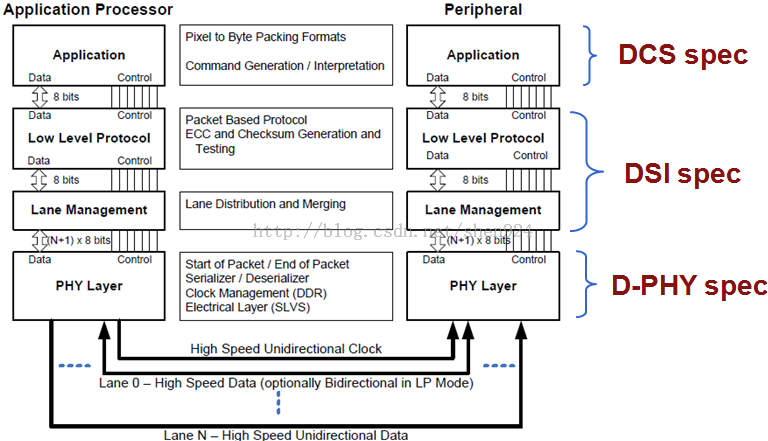
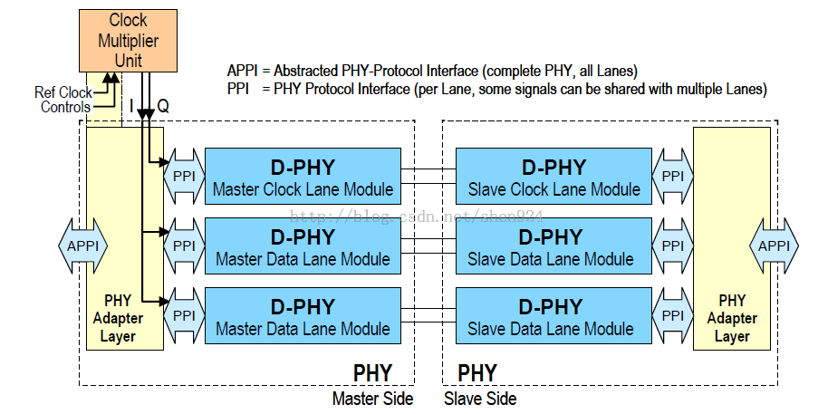
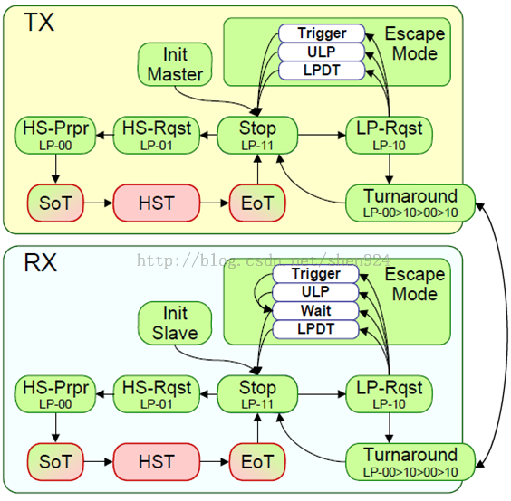
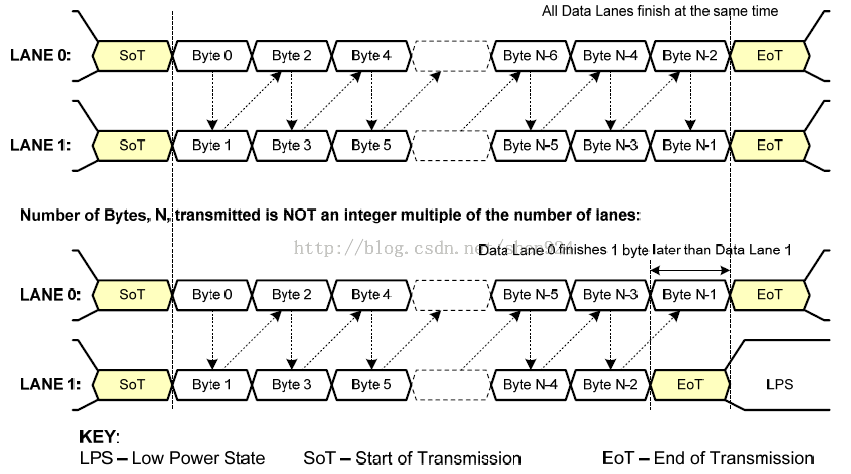
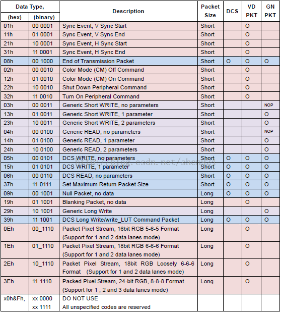

# MIPI

MIPI（移动行业处理器接口）是Mobile Industry Processor Interface的缩写。MIPI（移动行业处理器接口）是MIPI联盟发起的为移动应用处理器制定的开放标准。

已经完成和正在计划中的规范如下：

MIPI是差分串口传输，速度快，抗干扰。主流手机模组现在都是用MIPI传输，传输时使用4对差分信号传输图像数据和一对差分时钟信号；最初是为了减少LCD屏和主控芯片之间连线的数量而设计的，后来发展到高速了，支持高分辨率的显示屏，现在基本上都是MIPI接口了。

MIPI摄像头有三个电源：VDDIO（IO电源），AVDD（模拟电源），DVDD（内核数字电源），不同sensor模组的摄像头供电不同，AVDD有2.8V或3.3V的；DVDD一般使用1.5V或更高，不同厂家的设计不同，1.5V可能由sensor模组提供或外部供给，可以使用外部供电则建议使用外部供，电压需大于内部的DVDD；VDDIO电压应与MIPI信号线的电平一致，若信号线是2.8V电平，则VDDIO也应供2.8V，有些sensor模组也可以不供VDDIO，由内部提供。

**补充说明**：

* MIPI的camera接口叫`CSI`，MIPI的display接口叫`DSI`。
* **差分信号**：差分传输是一种信号传输的技术，区别于传统的一根信号线一根地线的做法，差分传输在这**两根线上**都传输信号，这两个信号的振幅相同，相位相反。在这两根线上的传输的信号就是差分信号。信号接收端比较这两个电压的差值来判断发送端发送的逻辑状态。在电路板上，差分走线必须是等长、等宽、紧密靠近、且在同一层面的两根线。

# 2.MIPI DSI规范　　
## 2.1、名词解释

* DCS （DisplayCommandSet）：DCS是一个标准化的命令集，用于命令模式的显示模组。
* DSI， CSI （DisplaySerialInterface， CameraSerialInterface
	* DSI 定义了一个位于处理器和显示模组之间的高速串行接口。
	* CSI 定义了一个位于处理器和摄像模组之间的高速串行接口。
* D-PHY：提供DSI和CSI的物理层定义

## 2.2.DSI分层结构

DSI分四层，对应D-PHY、DSI、DCS规范；分层结构图如下：

* PHY Layer层：定义了传输媒介，输入/输出电路和和时钟和信号机制。
* Lane Management层：发送和收集数据流到每条lane。
* Low Level Protocol层：定义了如何组帧和解析以及错误检测等。
* Application层：描述高层编码和解析数据流

## 2.3.Command和Video模式 

DSI兼容的外设支持Command或Video操作模式，用哪个模式由外设的构架决定 ；

* Command模式是指采用发送命令和数据到具有显示缓存的控制器，主机通过命令间接的控制外设；Command模式采用双向接口 ；
* Video模式是指从主机传输到外设采用实时象素流，这种模式只能以高速传输，为减少复杂性和节约成本，只采用Video模式的系统可能只有一个单向数据路径；  

# D-PHY介绍

## 1.D-PHY 描述了一同步、高速、低功耗、低代价的PHY

一个 PHY配置包括 :

* 一个时钟lane 
* 一个或多个数据lane

## 2.两个Lane的 PHY配置如下图

## 3.PHY由D-PHY(Lane模块)组成,lane(通路，同way,path) 

D-PHY可能包含：

* 低功耗发送器（LP-TX） 
* 低功耗接收器（LP-RX） 
* 高速发送器（HS-TX） 
* 高速接收器（HS-RX） 
* 低功耗竞争检测器（LP-CD）

## 4.三个主要的lane的类型

单向时钟Lane 

*  Master：HS-TX, LP-TX 
*  Slave：HS-RX, LP-RX

单向数据Lane

* Master：HS-TX, LP-TX
* Slave：HS-RX, LP-RX 

双向数据lane

* Master, Slave：HS-TX, LP-TX, HS-RX, LP-RX, LP-CD

## 5.D-PHY的传输模式

* 低功耗（Low-Power）信号模式（用于控制）：10MHz (max) 
* 高速（High-Speed）信号模式（用于高速数据传输）：80Mbps ~ 1Gbps/Lane 
* D-PHY低层协议规定最小数据单位是一个字节 
* 发送数据时必须**低位在前**，**高位在后**

## 6.Lane状态和电压

Lane状态 :

* LP-00, LP-01, LP-10, LP-11 (单端) 
* HS-0, HS-1 (差分)

Lane电压（典型） :

*  LP：0-1.2V 
*  HS：100-300mV (200mV) 

## 7.操作模式 

数据Lane的三种操作模式 ：**Escape mode**, **High-Speed(Burst) mode**, **Control mode** ；

从控制模式的停止状态开始的可能事件有

* Escape mode request (LP-11→LP-10→LP-00→LP-01→LP-00) 
* High-Speed mode request (LP-11→LP-01→LP-00) 
* Turn around request (LP-11→LP-10→LP-00→LP-10→LP-00) 

Escape mode是数据Lane在LP状态下的一种特殊操作 ，在这种模式下，可以进入一些额外的功能：LPDT、ULPS、Trigger ，数据Lane进入Escape mode模式通过LP-11→LP-10→LP-00→LP-01→LP-00 ；
一旦进入Escape mode模式，发送端必须发送1个8-bit的命令来响应请求的动作 ，Escape mode 使用Spaced-One-Hot Encoding 

* 超低功耗状态（Ultra-Low Power State） 这个状态下，lines处于空状态 (LP-00) 
* 时钟Lane的超低功耗状态 ：
* 时钟Lane通过LP-11→LP-10→LP-00进入ULPS状态 
* 通过LP-10 → TWAKEUP →LP-11退出这种状态，最小TWAKEUP时间为1ms 
* 高速数据传输 
* 发送高速串行数据的行为称为高速数据传输或触发（burst） 
* 全部Lanes门同步开始，结束的时间可能不同。 
* 时钟应该处于高速模式 

各模操作式下的传输过程 
* 进入Escape模式的过程 ：LP-11→LP-10→LP-00→LP-01→LP-00→Entry Code → LPD (10MHz) 
* 退出Escape模式的过程：LP-10→LP-11 
* 进入高速模式的过程：LP-11→LP-01→LP-00→SoT(00011101) → HSD (80Mbps ~ 1Gbps) 
* 退出高速模式的过程：EoT→LP-11 
* 控制模式 - BTA 传输过程：LP-11→LP-10→LP-00→LP-10→LP-00 
* 控制模式 - BTA 接收过程：LP-00→LP-10→LP-11 

状态转换关系图：

# 4.DSI介绍

## 4.1 DSI是一种Lane可扩展的接口，1个时钟Lane/1-4个数据Lane

DSI兼容的外设支持1个或2个基本的操作模式：

* Command Mode（类似于MPU接口）
* Video Mode（类似于RGB接口）- 必须用高速模式传输数据，支持3种格式的数据传输 
* Non-Burst 同步脉冲模式
* Non-Burst 同步事件模式 
* Burst模式 
* 高速信号模式（High-Speed signaling mode） 
* 低功耗信号模式（Low-Power signaling mode） - 只使用数据lane 0（时钟是由DP，DN异或而来）

 帧类型 ：

*  短帧：4 bytes (固定) 
*  长帧：6~65541 bytes (可变) 

两个数据Lane高速传输示例 ：

2、短帧结构 

* 帧头部（4个字节） 
* 数据标识(DI) 1个字节 
* 帧数据- 2个字节 （长度固定为2个字节） 
* 错误检测(ECC) 1个字节 
* 帧大小 

长度固定为4个字节 

3、长帧结构 

* 帧头部（4个字节） 
* 数据标识(DI) 1个字节 
* 数据计数- 2个字节 （数据填充的个数） 
* 错误检测(ECC) 1个字节 
* 数据填充(0~65535 字节) 
* 长度=WC*字节 
* 帧尾：校验和（2个字节）

帧大小：  4 + (0~65535) + 2 = 6 ~ 65541 字节

4、数据帧类型

传输模式和操作模式是不同的概念

* Video Mode**操作模式下**必须使用High-Speed的传输模式
* Command Mode**操作模式**并没有规定使用High-Speed或Low Power的传输模式，

即使外部LCD模组为Video Mode，但通常在LCD模组初始化时还是使用Command Mode模式来读写寄存器，因为在**低速下数据不容易出错并且容易测量**。Video Mode也可以用High-Speed的方式来发送指令，Command Mode操作模式也可以使用High-Speed，只是没有必要这么做。

