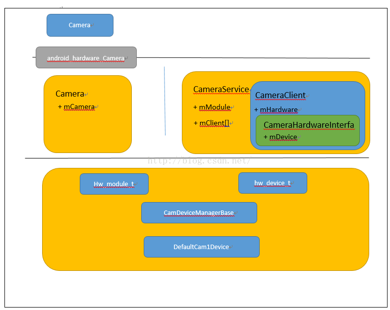

# 1.Android　Camera 框架



如上图为Camera的主要框架，其中最上面的Camera.java是应用的使用的接口，它处理维护一个在java层的状态外核心功能都是通过Android_hardware_Camera这个JNI调到C++层实现的。其实他对应的是C++层的一个同名的Camera类。

在C++层的Camera类其实是Binder的client端，对应的Service端是CameraService。每次请求Camera服务时会在CameraService端创建一个CameraClient，并保存在mClient数组里面，同时返回给Client保存在Camera类的mCamera对象里面。这样子CameraService 和Client端的Camera.cpp对象就彻底撒手。对后续的关于Camera操作都是java层调用Camera.cpp,然后直接转交给mCamera，也就是调用CameraClient的方法。CameraService里面的mClient数组的最大长度就是Camera的个数。CameraService在第一次 引用的时候会通过HAL标准规范获得一个hw_module_t对象mModule。

CameraClient在创建的时候会获得mModule对象，同时还会创建一个类型为CameraHardwareInterface的mHardware对象，并通过mModule的open函数获得一个HAL设备对象hw_device_t mDevice，这个mDevice与HAL层里面的DefaultCam1Device里面的一个属性对应。CameraDeviceManagerBase顾名思义就是管理Cam1Device的。如此Camera的操作就在CameraClient中交给mHardWare，进一步交给mDevice，再进一步到了Cam1Device。

# 2.关于Camera的主要代码目录：

* java层：
	* `frameworks/base/core/java/android/hardware/Camera.java`
* jni层:
	* `frameworks/base/core/jni/android_hardware_Camera.cpp`
* client端:
	* `frameworks/av/camera/Camera.cpp`
	* `frameworks/av/camera/CameraBase.cpp` 
	* `frameworks/av/camera/ICameraService.cpp`
* Service端
	* `frameworks/av/services/camera/libcameraservice/CameraService.cpp`
	* `frameworks/av/services/camera/libcameraservice/api1/CameraClient.cpp`
	* `frameworks/av/services/camera/libcameraservice/device1/CameraHardwareInterface.cpp`
* hal层:
	* `vendor\mediatek\proprietary\hardware\mtkcam\module_hal\module\module.h`
	* `vendor\mediatek\proprietary\hardware\mtkcam\module_hal\devicemgr\CamDeviceManagerBase.cpp`
	* `vendor\mediatek\proprietary\hardware\mtkcam\v1\device\Cam1DeviceBase.cpp`

# 3.主要调用过程

1.camera的打开的过程:

```
Camera.open()---->native_setup()----> android_hardware_Camera_native_setup() ----> Camera::connect()---->CameraBase::connect() ----> CameraService::conect()---->CameraService::connectHelperLocked() ----> new CameraClient()
```

2.设置Preview窗口的过程

```
Camera.setPreviewDisplay() ----> setPreviewSurface----> android_hardware_Camera_setPreviewSurface() ---->Camera:: setPreviewTarget()----> c->setPreviewTarget() ---->CameraClient ----> CameraClient::setPreviewTarget()----> CameraClient::setPreviewWindow ----> CameraHardwareInterface::setPreviewWindow ----> mDevice->ops->set_preview_window (hw_device_t) ---->Cam1Device:: camera_set_preview_window() ----> Cam1Device:: setPreviewWindow()----> Cam1DeviceBase::setPreviewWindow() ----> Cam1DeviceBase::

initDisplayClient() ----> Cam1DeviceBase::initDisplayClient() ----> DisplayClient::setWindow()  ---->  DisplayClient:: set_preview_stream_ops() ----> mpStreamOps = window
```

3.数据被读取到图像缓冲区的过程

```
Cam1DeviceBase::setPreviewWindow() ----> Cam1DeviceBase::initDisplayClient()---->IDisplayClient::createInstance() ----> DisplayClient::init()----> createDisplayThread()&& createImgBufQueue()---->Cam1DeviceBase::enableDisplayClient()---->DisplayClient::enableDisplay()---->DisplayClient::enableDisplay()----> mpDisplayThread-> postCommand(Command(Command::eID_WAKEUP)) ---->DisplayThread::threadLoop() ----> DisplayClient::onThreadLoop()---->DisplayClient::waitAndHandleReturnBuffers ---->rpBufQueue->dequeProcessor(vQueNode)----> DisplayClient::handleReturnBuffers() ----> enquePrvOps() ----> mpStreamOps->enqueue_buffer(mpStreamOps,rpImgBuf->getBufHndlPtr())
```

所以总体来说是在DisplayClient的init的时候创建了一个线程和一个消息队列:

```
mpDisplayThread =IDisplayThread::createInstance(this)

mpImgBufQueue = new ImgBufQueue(IImgBufProvider::eID_DISPLAY, "CameraDisplay@ImgBufQue");
```

然后mpDisplayThread等待ImgBufQueue有数据的时候通过dequeProcessor取到要渲染的数据，交给mpStreamOps也就是preview_stream_ops对象，其实preview_stream_ops只是对ANativeWindow的简单封装，最后调用的其实是ANativeWindow的queueBuffer函数，到这里一个流程基本结束，其实还是比较简单的，一个线程等待一个队列，有数据后把他塞到ANativeWindow中

4.**在preview的时候数据的产生过程：**

IImgBufQueue继承于IImgBufProvider和IImgBufProcessor数据通过IImgBufProvider提供的接口写入，通过IImgBufProcessor的接口消费，ImgBufProvidersManager是个大管家，管理着所有的IImgBufProvider，可以通过getDisplayPvdr(),getRecCBPvdr()等接口获取到对应的IImgBufProvider，然后把数据塞给他，于是对应的饥肠辘辘的消费者就开始消费了，比如DisplayClient。

**IImgBufProvider的设置过程**：

```
DisplayClient::enableDisplay ()---->DisplayClient::setImgBufProviderClient (mpCamAdapter)----> IImgBufProviderClient::onImgBufProviderCreated(mpImgBufQueue) ---->BaseCamAdapter::

onImgBufProviderCreated(sp<IImgBufProvider>const&rpProvider) ----> ImgBufProvidersManager::setProvider()
```

**Camera的数据来源**

```
DefaultCam1Device::onStartPreview()----> Cam1DeviceBase::initCameraAdapter() ----> CamAdapter::init() ---->IPreviewCmdQueThread::createInstance() ----> CamAdapter::startPreview() ---->StateIdle::onStartPreview() ----> CamAdapter::onHandleStartPreview() ---->mpPreviewCmdQueThread->postCommand(PrvCmdCookie::eUpdate, PrvCmdCookie::eSemBefore)----> PreviewCmdQueThread::threadLoop()----> PreviewCmdQueThread::update()----> PreviewCmdQueThread::updateOne() ----> PreviewBufMgr::enqueBuffer()----> IImgBufProvider:: enqueProvider()
```

5.**Camera回调的过程**

以takepicture为例，Callback的设置过程

```c
mDevice->ops->set_callbacks--> Cam1Device::camera_set_callbacks() --> Cam1DeviceBase::setCallbacks--> mpCamMsgCbInfo->mDataCb=data_cb
```

拍照的流程：

```
CamAdapter::takePicture()-> IState::onCapture() ->IStateHandler::onHandleCapture() ->CamAdapter::onHandleCapture()CamAdapter::onHandleCapture() ->CaptureCmdQueThread::onCapture() -> CaptureCmdQueThread::threadLoop() ->CamAdapter::onCaptureThreadLoop()->CapBufShot::sendCommand()->CapBufShot::onCmd_capture()-> SingleShot::startOne()在这里组装IImgBuffer
```

回调的流程：

```
SingleShot::startOne() --> CamShotImp::handleDataCallback() --> CamShotImp::onDataCallback--> CapBufShot::fgCamShotDataCb --> CapBufShot::handleJpegData  -->CamAdapter::onCB_RawImage -->mpCamMsgCbInfo->mDataCb
```

# 4.介绍

1.所谓的Camera主要就是从摄像头取一点数据放到LCD上显示，所以打蛇打七寸，我们首先介绍HAL层的Window对象是mpStrwamOps。而这个对象被设置的流程是：

```
Cam1DeviceBase::setPreviewWindow()  --->  initDisplayClient()  ---> DisplayClient::setWindow()  ---> set_preview_stream_ops()  ---> mpStreamOps = window
```

2.2.另一个面我们看下数据的获取流程，Camera HAL层数据主要通过ImgBufQueue对象传递，而这个对象最开始的赋值过程如下：

```
CamAdapter::takePicture() -> IState::onCapture() ->IStateHandler::onHandleCapture() -> CamAdapter::onHandleCapture()CamAdapter::onHandleCapture() -> CaptureCmdQueThread::onCapture() -> CaptureCmdQueThread::threadLoop() -> CamAdapter::onCaptureThreadLoop()->CapBufShot::sendCommand()->CapBufShot::onCmd_capture() -> SingleShot::startOne()
```

在这里组装IImgBuffer