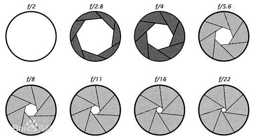
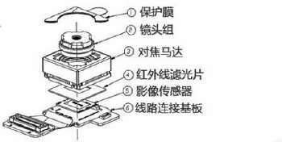

# 1.曝光三要素

* 光圈大小: 光圈就是指曝光瞬间开孔多大;
* 快门速度: 快门速度就是指快门开启的时间;
* 感光度(ISO): 感光度是指图像传感器对光线的敏感程度。

# 1.1.光圈
光圈是一个用来控制光线透过镜头,进入机身内感光面光量的装置,它通常是在镜头内。

表达光圈大小我们是用f值。对于已经制造好的镜头,我们不可能随意改变镜头的直径,但是我们可以通过在镜头内部加入多边形或者圆形,并且面积可变的孔状光栅来达到控制镜头通光量,这个装置就叫做光圈。

`光圈F值 = 镜头的焦距 / 镜头光圈的直径`

完整的光圈值系列如下：

`1/1.0，1/1.4，1/2.0，1/2.8，1/4.0，1/5.6，1/8.0，1/11，1/16，1/22，1/32，1/44，1/64`

光圈的档位设计是相邻的两档的数值相差1.4倍(2的平方根1.414的近似值)相邻的两档之间,透光孔直径相差根号2倍,透光孔的面积相差一倍,底片上形成的影像的亮度相差一倍,维持相同曝光量所需要的时间相差一倍。

**当光圈开得越大**:背景虚化效果越明显
**小光圈**:背景虚化效果则越不明显。

在拍摄时,背景越虚化,主体突出就越明显,相对于一些人像、静物运用比较多。如果你需要烘托环境,不希望背景虚化到什么都看不清,那么采用**小光圈**,**大景深**就更适合了。

## 1.2.快门速度

用时间表示。30s，15s，8s，4s，2s，1s，`1/2  1/4  1/8   1/15   1/30  1/60    1/125    1/250   1/500   1/1000    1/2000......`

同样相邻的快门速度相差一档曝光量。很明显,数值上相差一倍。

简单的说就是：当你改变快门速度的同时也意味着改变了运动物体成像的方式(**是否叠加**)。

* 快门速度越慢:运动物体越模糊;
* 速度越快:运动物体越清晰。 

## 1.3.ISO感光度
国标表示ISO100   200    400   800  1600   3200   6400....

同样相邻的ISO相差一档曝光量。很明显,数值上成2的级数。

ISO越大噪点越明显,画质越差;但ISO提高可以使用**小光圈**或提高**快门速度**,有利于摄影师意图的实现。

# 2.摄像头构成

* 1,镜头:就是凸透镜用来成像
* 2,对焦马达:用来调整焦距
* 3,红外滤光片: 用来滤除红外光,调整光线摄入角度为直角,来达到更好的成像效果。
* 4,影像传感器: 核心器件，用来将光学图像转化为数字化的图片raw data。 

## 2.1 图像传感器

图像传感器是将光信号转换为电信号的装置.

## 2.2 自动聚焦

自动聚焦目的是获得清晰度更高得图像。常用的聚焦方法分两类,传统的聚焦方法和基于数字图像处理方式的图像聚焦方法。

* 传统的方式中,自动聚焦**通过红外线**或者**超生波测距**的方式来实现。
* 数字处理方法中,自动聚焦的关键在于构造图像的清晰度评价函数。
己经提出的图像清晰度评价函数苞括灰度方差、梯度能量、嫡函数和一些频域函数法。图像清晰度评价函数必须具有良好的单峰性和尖锐性,而且要计算量适度,从而可以快速的实现精准对焦.

## 2.3 白平衡

白平衡:字面上的理解是白色的平衡。用色彩学的知识解释,白色是指反射到人眼中的光线由于蓝、绿、红三种色光比例相同且具有一定的亮度所形成的视觉反应。摄像头并不能像人眼那样具有适应性，所以如果摄像机的色彩调整同景物照明的色温不一致就会发生偏色。白平衡就是针对不同色温条件下，通过调摄像头内部的色彩电路使拍摄出来的影像抵消偏色，更接近人眼的视觉习惯。白平衡也可以简单地理解为在任意色温条件下，摄像头所拍摄的标准白色经过电路的调整，使之成像后仍然为白色。

自动白平衡

白平衡电路自动调节红、绿、蓝增益,使得白色物体无论在任何光源下都呈白色。

* 手动模式：红、绿、蓝增益由手动控制。
* 自动模式：红、绿、蓝增益由自动白平衡电路控制。

## 2.4 电子快门
摄像机基本都是电子快门,概念和传统照相机中快门的概念有些出入,但基本原理都是一样的,摄像机是一秒有多少个画面,相机中的快门也是类似的.