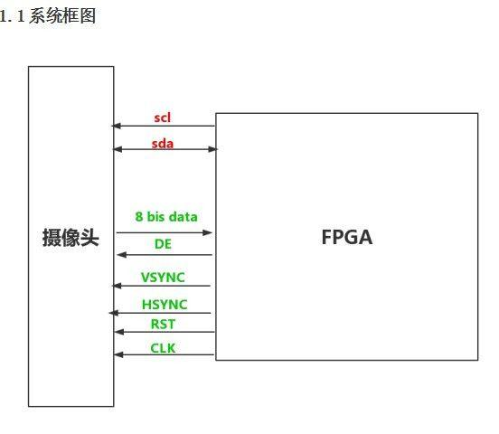
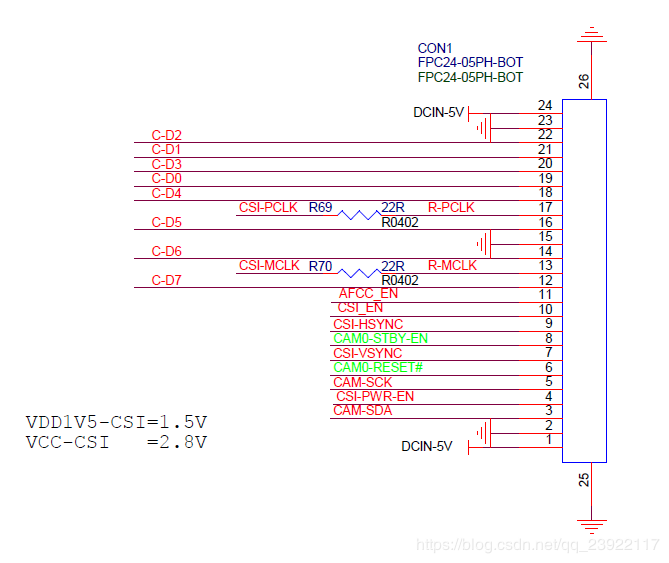

术语：

* CMOS：CMOS和CCD一样同为在数码相机中可记录光线变化的半导体。CMOS的制造技术和一般计算机芯片没什么差别，主要是利用硅和锗这两种元素所做成的半导体，使其在CMOS上共存着带N（带–电） 和 P（带+电）级的半导体，这两个互补效应所产生的电流即可被处理芯片纪录和解读成影像。然而，CMOS的缺点就是太容易出现杂点, 这主要是因为早期的设计使CMOS在处理快速变化的影像时，由于电流变化过于频繁而会产生过热的现象。
* CCD：CCD使用一种高感光度的半导体材料制成，能把光线转变成电荷，通过模数转换器芯片转换成数字信号，数字信号经过压缩以后由相机内部的闪速存储器或内置硬盘卡保存
* CSI
* FPGA：现场可编程门阵列（FPGA）技术提供了专用硬件电路所特有的可靠性、真正的并行执行和闪电般的快速闭环控制性能。与处理器不同，FPGA使用专用硬件进行逻辑处理，而不具有操作系统。FPGA在本质上是完全并行的，故不同的处理操作不必竞争相同的资源。

上海格科微的GC2035的camera,2M pixel(1616V x 1232H)

分为两部分一部分是CSI控制器,一部分是CCI控制器,其中CCI控制器,我们这里使用其I2C部分,其它用的都是CSI部分.

我们来看一下板子的电路图:

结合电路图,我们看一下全志的dataset(CSI和CCI两部分):

CSI框架

CCI的框架图

CSI的时序图

从上图的figure 6-3我们可以知道,全志平台的CSI控制器支持`8/10/12` bit的Sensor,我们这里是使用的8 bit,因为摄像头模组gc2035是8 bit的,下面看一下CSI寄存器的列表,具体配置列表这里就不列出来了,只列一个列表:

