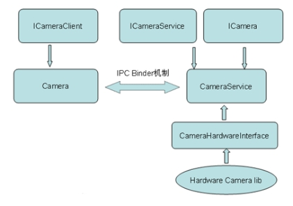

# 1.1 Android系统架构
要分析Android Camera架构，首先从Android本身的架构分析。如下图：


从Android框架看，分为四层：应用层、应用框架层、库层、内核层。

应用层主要工作在Android SDK之上，利用Android提供的API进行开发，生成APK包。

应用框架层整合了Android自带各种控件和类，为应用开发提供高效、方便的API接口。这个对上实现统一的接口，对下也提供统一的标准方便各种库的移入。

库层是Android与底层硬件通信接口，它封装底层硬件接口实现该模块的具体逻辑，并以服务的形式通过Binder通讯机制暴露给应用框架。

内核层则是直接与硬件联系的一层，可以理解为设备驱动。

## 1.2 MTK Android Camera架构分层及代码结构

Android的Camera包含**取景器**（viewfinder）和**拍摄照片**（takepicture）的功能。目前MTK Android Camera程序的架构分成客户端和服务器两个部分，它们建立在Android的进程间通讯Binder的结构上。Camera模块同样遵循Android的框架，如下图所示。


1.**应用层**

Camera的应用层在Android上表现为直接调用SDK API开发的一个Camera 应用APK包。代码在`\packages\apps\Camera`下。主要是Java写的基于android.hardware.Camera类调用的封装，并且实现Camera应用的业务逻辑和UI显示。`android.hardware.Camera`就是Android提供给上层调用的**Camera类**。这个类用来连接或断开一个Camera服务，设置拍摄参数，开始、停止预览，拍照等。它也是Android Camera应用框架封装暴露出来的接口。一个Android应用中若要使用这个类，需要在Manifest文件声明Camera的权限，另外还需要添加一些`<uses-feature>`元素来声明应用中的Camera特性，如自动对焦等。具体做法可如下：

```xml
<uses-permission android:name="android.permission.CAMERA" />
<uses-feature android:name="android.hardware.camera" />
<uses-feature android:name="android.hardware.camera.autofocus" />
```

2.**应用框架层**

Camera框架层将应用与底层的实现隔离开来，实现了一套Android定义的对上对下接口规范，方便应用及底层硬件的开发和移植。这一层对上以Java类的形式包装出`android.hardware.Camera`，提供给应用层调用；对下在CameraHardwareInterface.h头文件中定义了Camera硬件抽象层的接口，这是一个包含纯虚函数的类，必须被实现类继承才能使用。这个实现类也即是下层中将讲到的用户库层，它继承CameraHardwareInterface接口，实例化对底层硬件驱动的封装，最终生成`libcamera.so`供框架的`libcameraservice.so`调用。这样做的好处是让Camera的应用框架代码独立，不受底层硬件驱动改变的影响，方便在不同平台上porting 驱动代码，而保持上层的代码不用变化。

从代码上看，这一层包含Java到JNI到C++的代码。源代码主要在以下路径：

```
\android\frameworks\base\core\java\android\hardware\Camera.java
```

这个类作为Android SDK Camera部分提供给上层应用，并通过JNI的方式调用本地C++代码。

```
\android\frameworks\base\core\jni\android_hardware_Camera.cpp
```

android_hardware_Camera.cpp是Camera 的JAVA本地调用部分，是承接**JAVA代码到C++代码的桥梁**。编译生成libandroid_runtime.so。

`\android\frameworks\base\libs\ui` 包含文件：

```
Camera.cpp
CameraParameters.cpp
ICamera.cpp
ICameraClient.cpp
ICameraService.cpp
```
它们的头文件在`\android\frameworks\base\include\ui`目录下。这部分的内容编译生成**libui.so**。在Camera模块的各个库中，libui.so位于核心的位置，作为Camera框架的**Client客户端部分**，与另外一部分内容服务端libcameraservice.so通过进程间通讯（即Binder机制）的方式进行通讯。

`\android\frameworks\base\camera\libcameraservice`CameraService是Camera服务，Camera框架的中间层，用于链接CameraHardwareInterface 和 Client，它通过调用实际的Camera硬件接口来实现功能。这部分内容被编译成库**libcameraservice.so**。

libandroid_runtime.so和libui.so两个库是公用的,其中除了Camera还有其他方面的功能。整个Camera在运行的时候，可以大致上分成Client和Server两个部分，它们分别在两个进程中运行，它们之间使用Binder机制实现进程间通讯。这样在client调用接口，功能则在server中实现，但是在client中调用就好像直接调用server中的功能，进程间通讯的部分对上层程序不可见。

当Camera Client端通过Binder机制与Camera Server端通讯，Server端的实现传递到Client端。而Server端的实现又是调用硬件接口来实现。

3.**HAL层**

这个层次其实就是用户空间的驱动代码。前面有介绍过框架层对下在CameraHardwareInterface.h头文件中定义了Camera硬件抽象层的接口，它是包含纯虚函数的类，必须被实现类继承才能使用。HAL层正好继承CameraHardwareInterface接口，依据V4l2规范实例化底层硬件驱动，使用`ioctl`方式调用驱动，最终生成libcamera.so供框架的libcameraservice.so调用。

这层的代码在`\android\hardware\XXX\libcamera`目录下（也有可能在vendor目录中对应的libcamera下）。注意这里的XXX是不同厂商为不同产品（板子）而建的目录，以高通msm平台为例，这里XXX用msm7k表示，这样高通msm平台下这个HAL的目录即为`\android\hardware\msm7k\libcamera`。不难看出，如果要在某硬件平台上运行Android，也就**主要在这一层进行修改**，因为它是直接和底层硬件驱动相关的。上面也讲过，应用框架层对上对下都定义的标准接口，这样做的目的也就是使上层的代码独立，在porting中不受影响。所以我们现在可以基本确定，如果要改Camera的硬件，框架层以上的部分都可以不动，要改就改HAL到内核层的部分，这也是Android底层开发的主要工作。

4.**内核层**
这一层主要是基于Linux的设备驱动。对Camera来说，一般是按V4l2规范将Camera原子功能以ioctl的形式暴露出来供HAL层调用的实现。主要功能的实现代码在`\android\kernel\drivers\media\video\XXX`下。跟HAL层目录一样，XXX是不同厂商不同平台的目录，以高通msm平台为例，这个目录就是`\android\kernel\drivers\media\video\msm`。所以要在Android平台上添加硬件功能，首先考虑将它的驱动加到Android的Linux内核中。

5.**Camera库文件**
前面已提到Camera模块主要包含libandroid_runtime.so、libcamera_client.s0(libui.so)、libcameraservice.so和一个与Camera硬件相关的硬件库libcamera.so。其中libandroid_runtime.so、libcamera_client.s0(libui.so)是与android系统构架相关的， 不需要对进行其修改

**libameraservice.so**和**libcamera.so**则是和硬件设备相关联的，而**cameralib.so**实际上就是设备的linxu驱动，所以Camera设备的系统继承主要是通过移植CameraLinux驱动和修改libcameraservice.so库来完成。

`Libcameraservice.so`构建规则中使用宏USE_CAMERA_STUB决定 是否使用真的Camera，如果宏为真，则使用CameraHardwareStub.cpp和FakeCamera.cpp构造一个假的Camera，如果为假则使用libcamera来构造一个实际上的Camera服务。

在CameraHardwareStub.cpp中定义了CameraHardwareStub类，它继承并实现了抽象类CameraHardwareInterface中定义的真正操作Camera设备的所有的纯虚函数。通过openCameraHardware()将返回一个CameraHardwareInterface类的对象，但由于CameraHardwareInterface类是抽象类所以它并不能创建对象，而它的派生类CameraHardwareStub完全实现了其父类的 纯虚函数所以openCameraHardware（）返回一个指向派生类对象的基类指针用于底层设备的操作。由于CameraHardwareStub类定义的函数是去操作一个假的Camera，故通过openCameraHardware返回的指针主要用于仿真环境对Camera的模拟操作，要想通过openCameraHardware返回的指针操作真正的硬件设备则需完成以下步骤：

* 1.CameraHardwareInterface类中的所有纯虚函数的声明改为虚函数的声明（即去掉虚函数声明后的“=0”）;
* 2.编写一个源文件去定义CameraHardwareInterface类中声明的所有虚函数;
* 3.编写Android.mk文件用于生成一个包含步2，编写的源文件和其他相关文件的libcamera.so文件;
* 4.将宏USE_CAMERA_STUB改成false，这样生成libcameraservice.so时就会包含libcamera.so库。（注：如果CameraHardwareInterface类的成员函数并没有直接操作硬件而是调用Camera的linux驱动来间接对硬件操作，那么包含这样的CameraHardwareInterface类的libcamera.so库就相当于一个HAL）。

以上Camera的结构层次可以简单的概括成如下流程图：

