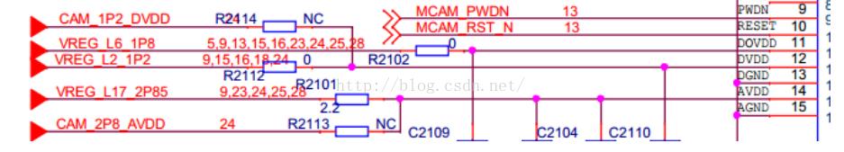

众所周知，camera在我们生活中应用十分广泛，在未来智能硬件社会，camera就是设备的眼睛，它的机器视觉也将扮演非常重要的角色。在我们移动设备终端中，我们知道camera模组是由镜头(lens)、传感器（sensor）、软板（FPC）、图像处理芯片（DSP）等4部分组成。

决定一个摄像头好坏的重要部件是：镜头（lens）、图像处理芯片 （DSP）、传感器（sensor）。而今天我们主要偏向于软件侧，来介绍下Dragonboard410C Camera sensor bring up的一个配置。

本文主要分为两部分来介绍要注意的配置
* 第一部分、 Kernel 及  vendor porting（ Sensor dtsi 及上下电时序）
* 第二部分 vendor层参数（其中包括  csiphy 、csid和其他参数）
(针对的是 msm8916,也兼容msm8926平台)

# 一、 Kernel及Vendor porting

## 1.1、新 Porting 一颗 sensor kernel 需要添加和配置的


```
@arch/arm/configs/msm8226_defconfig
+ CONFIG_IMX135=y

@arch/arm/mach-msm/clock-8226.c
+ CLK_LOOKUP("cam_src_clk", mclk0_clk_src.c, "20.qcom,camera"),
+ CLK_LOOKUP("cam_clk", camss_mclk0_clk.c, "20.qcom,camera"),
+ CLK_LOOKUP("cam_src_clk", mclk0_clk_src.c, "20.qcom,eeprom"),
+ CLK_LOOKUP("cam_clk", camss_mclk0_clk.c, "20.qcom,eeprom"),

@arch/arm/boot/dts/msm8226-camera-sensor-qrd.dtsi
+ "qcom,imx135"

@ drivers/media/platform/msm/camera_v2/Kconfig
+ config IMX135

@drivers/media/platform/msm/camera_v2/sensor/Makefile
+ obj-$(CONFIG_IMX135) += imx135.o

@drivers/media/platform/msm/camera_v2/sensor/imx135.c
```

## 1.2.新 Porting 一颗 sensor User 需要添加和配置的

```
@vendor/qcom/proprietary/common/config/device-vendor.mk
+ MM_CAMERA += libchromatix_imx135_common
+ MM_CAMERA += libchromatix_imx135_default_video
+ MM_CAMERA += libchromatix_imx135_hfr_60
+ MM_CAMERA += libchromatix_imx135_hfr_90
+ MM_CAMERA += libchromatix_imx135_hfr_120
+ MM_CAMERA += libchromatix_imx135_liveshot
+ MM_CAMERA += libchromatix_imx135_preview
+ MM_CAMERA += libchromatix_imx135_snapshot
+ MM_CAMERA += libchromatix_imx135_video_hd
+ MM_CAMERA += libchromatix_imx135_zsl
+ MM_CAMERA += libmmcamera_imx135

@vendor/qcom/proprietary/mm-camera/mm-camera2/media-controller/modules/sensors/sensor_libs/imx135

Add imx135 folder
Android.mk/imx135_lib.c imx135_lib.h
Note: build 出来的库放在 system/vendor/lib/下面

@vendor/qcom/proprietary/mm-camera/mm-camera2/media-controller/modules/sensors/chro
matix/0301/libchromatix/

Add chromatix_imx135 folder
Note: build 出来的库放在 system/vendor/lib/下面
```

## 1.3、 kernel 中需要客制化的地方
**1**） kernel 中 dtsi 详解
```
&cci { ……
	qcom,camera@20 {
		compatible = "qcom,imx135";
		reg = <0x20>;
		qcom,slave-id = <0x20 0x0016 0x0135>; //0x20 是 sensor I2C 地址，高 7bit 是 I2C slave 地址，最低位是写标记 0
											  //0x16 sensor ID 高位地址 0x17 ID 低位地址
											  //msm_sensor.c 中读取 id 的时候设置为双字节读取，所以这里设置高位地址即可
		qcom,csiphy-sd-index = <0>; // 1:前置 mipi 0:后者 mipi 根据硬件连接决定 cs0、 cs1.
		qcom,csid-sd-index = <0>; // CSID 的连接，选哪个
		qcom,actuator-src = <&actuator1>;
		qcom,led-flash-src = <&led_flash1>;
		
		//qcom,eeprom-src = <&eeprom1>; add by chenqiang for CR01296254 20140618
		qcom,mount-angle = <90>;//sensor 成像方向与手机主板的角度
		qcom,sensor-name = "imx135";
					//sensor 的名字，这个名字影响到加载 lib.so 库，在 kernel 层解析完会传到 vendor 层的
					//sensor.c 中，在这个函数中会去获取到这个名字，这个名字必须和 lib 库的名字一样，否则
					//无法解析出 lib 库，即无法获取到 lib 库中的函数
		cam_vdig-supply = <&pm8226_l5>;//L5 的意思是电源类型是 LDO 输出
		cam_vana-supply = <&pm8226_l19>;
		cam_vio-supply = <&pm8226_lvs1>;//LVS 输出
		cam_vaf-supply = <&pm8226_l15>;
		qcom,cam-vreg-name = "cam_vdig", "cam_vio", "cam_vana","cam_vaf";
		qcom,cam-vreg-type = <0 1 0 0>; //0 : LDO 1:LVS
		qcom,cam-vreg-min-voltage = <1200000 0 2850000 2800000>;
		
		//这里是设置具体的电压范围或者值
		qcom,cam-vreg-max-voltage = <1200000 0 2850000 2800000>;
		qcom,cam-vreg-op-mode = <200000 0 80000 100000>; //电流值
		qcom,gpio-no-mux = <0>; // 1、表示 gpio mux 不可用 0、表示可用
		gpios = <&msmgpio 26 0>,
				<&msmgpio 37 0>,
				<&msmgpio 36 0>,
				<&msmgpio 38 0>,//avdd
				<&msmgpio 22 0>,//dvdd
				<&msmgpio 34 0>;//AF
		qcom,gpio-reset = <1>;
		qcom,gpio-standby = <2>;
		qcom,gpio-vana = <3>;
		qcom,gpio-vdig = <4>;
		qcom,gpio-af-pwdm = <5>;
		qcom,gpio-req-tbl-num = <0 1 2 3 4 5>;
		qcom,gpio-req-tbl-flags = <1 0 0 0 0 0>;

		//gpio 的输入输出设定，第一位是 MCLK，不属于 gpio，所以这里设定为 1
		qcom,gpio-req-tbl-label = "CAMIF_MCLK",
								  "CAM_RESET",
								  "CAM_STANDBY",
								  "CAM_VANA",
								  "CAM_VDIG",
								  "CAM_AF_PWDM";
		qcom,gpio-set-tbl-num = <1 1>;
		qcom,gpio-set-tbl-flags = <0 2>;
		qcom,gpio-set-tbl-delay = <1000 30000>;
		qcom,csi-lane-assign = <0x4320>;

	    //这个和硬件原理图对应，表示 4 3 2 0 这几条线作为 mipi 数据线， 1 作为时钟线
		qcom,csi-lane-mask = <0x1F>; // 使用几条 lan 这里是使用 4 条 0x1f = 00o1 1111
		qcom,sensor-position = <0>; // 1:前置 0:后置
		qcom,sensor-mode = <0>; // 传感器的数据格式 1:yuv 格式 0:bayer 格式
		qcom,sensor-type = <0>;
		qcom,cci-master = <0>;
		status = "ok";
};
……
}
```

**2**） **kernel 中上电时序**, Power setting 需要根据 datasheet 的上电时序来写


Sensor 的上下电时序以数组的格式写于驱动的 msm_sensor_power_setting 数据结
构中,

```c
static struct msm_sensor_power_setting imx135_power_setting[] = {
…
	{
		.seq_type = SENSOR_GPIO,
		.seq_val = SENSOR_GPIO_VDIG,
		.config_val = GPIO_OUT_LOW,
		.delay = 0,
	},
… }
```
DateSheet 中对电压和时序的说明:


```
// msm8226-camera-sensor-qrd.dtsi
	cam_vdig-supply = <&pm8226_l5>;
	cam_vana-supply = <&pm8226_l19>;
	cam_vio-supply = <&pm8226_lvs1>;
	cam_vaf-supply = <&pm8226_l15>;
	qcom,cam-vreg-name = "cam_vdig", "cam_vio", "cam_vana","cam_vaf";
	qcom,cam-vreg-type = <0 1 0 0>;
	qcom,cam-vreg-min-voltage = <1200000 0 2850000 2800000>;
	qcom,cam-vreg-max-voltage = <1200000 0 2850000 2800000>;
	qcom,cam-vreg-op-mode = <200000 0 80000 100000>;


//msm8226-regulator.dtsi
	rpm-regulator-ldoa5 {
		status = "okay";
			pm8226_l5: regulator-l5 {
				regulator-name = "8226_l5";
				regulator-min-microvolt = <1200000>;
				regulator-max-microvolt = <1200000>;
				qcom,init-voltage = <1200000>;
				status = "okay";
			};
	};
```



上电时序和下电时序都可以分别加在 msm_sensor_power_setting_array 数组中. 如果
`power_down_setting/size_down` 数据成员没有添加,下电时序会使用上电时序的反时序.


# 二、 Vendor 层参数
## 2.1 CSIPHY、 CSID


CCI

* I2C
* GPIO

如上图所示， CSID 是一个数据流控制器

像 8939 上有 3 个 D-PHY 对应有四个 csid，前两个 csid 分别控制前两个 D-PHY,后两个 csid 各有分工，因为 8939 支持第三路 D-PHY 可以用作 4lane 的 camera.也可以用作 1lane 的两个 camera 如果是后一种情况的话，就需要两个 csid 来分别走数据流。

### 2.1.1 MIPI 接收器配置 (CSIPHY CSID)
Sensor 通过 MIPI CSI2 传输图像，高通**接收器**通过 MIPI `CSI PHY` 和 `CSID` 接收相应数据。

在 vendor 层中有 csi 的配置，具体配置结构体如下：

```c
static struct csi_lane_params_t csi_lane_params = {
	.csi_lane_assign = 0x4320,
	.csi_lane_mask = 0x1F,//0001 1111
	.csi_if = 1,
	.csid_core = { 0 },
	.csi_phy_sel = 0,
};

static struct msm_camera_csid_vc_cfg imx135_cid_cfg[] = {
	{ 0, CSI_RAW10, CSI_DECODE_10BIT },
	{ 1, 0x35, CSI_DECODE_8BIT },
	{ 2, CSI_EMBED_DATA, CSI_DECODE_8BIT}
};

static struct msm_camera_csi2_params imx135_csi_params = {
	.csid_params = {
		.lane_cnt = 4,
		.lut_params = {
			.num_cid = ARRAY_SIZE(imx135_cid_cfg),
			.vc_cfg = {
				&imx135_cid_cfg[0],
				&imx135_cid_cfg[1],
				&imx135_cid_cfg[2],
			},
		},
	},
	.csiphy_params = {
		.lane_cnt = 4,
		.settle_cnt = 0x1B, //mipi 从低速到高速的一个缓冲时间
	},
};
```


CSI-配置


### 2.1.2 Vendor 层其他参数

**1**）输出尺寸表 out_info

```c
{
	/* full size @ 22.27 fps*/
	.x_output = 4208,
	.y_output = 3120,
	.line_length_pclk = 4572,
	.frame_length_lines = 3142,
	.vt_pixel_clk = 360000000, //PCLK 时钟，数据同步时钟，
	.op_pixel_clk = 360000000,
	.binning_factor = 1, //当这个为 0 和 1 的时候没有影响，当为 2 的时候会影响到 line_count
的大小
	.max_fps = 24.01, //VFE 的时钟，
	.min_fps = 7.5,
	.mode = SENSOR_DEFAULT_MODE,
},
```


**2**）曝光设定寄存器地址

```c
static struct msm_sensor_exp_gain_info_t exp_gain_info = {
	.coarse_int_time_addr = 0x0202,
	.global_gain_addr = 0x0205,
	.vert_offset = 4,
};
```


vert_offset – 曝光行数上限的边界值，曝光行数任何情况下都应该小于
frame_length_lines 减去 vert_offset.

**3**）输出控制寄存器地址

```c
static struct msm_sensor_output_reg_addr_t output_reg_addr = {
	.x_output = 0x034C,
	.y_output = 0x034E,
	.line_length_pclk = 0x0342,
	.frame_length_lines = 0x0340,
};
```


**4**)sensor_stream_info_t

```c
static struct sensor_pix_fmt_info_t imx135_pix_fmt0_fourcc[] = {
	{ V4L2_PIX_FMT_SRGGB10 },
	{ MSM_V4L2_PIX_FMT_META },
};

static struct sensor_pix_fmt_info_t 	imx135_pix_fmt1_fourcc[] = {
	{ MSM_V4L2_PIX_FMT_META },
};
static sensor_stream_info_t imx135_stream_info[] = {
	{ 2, &imx135_cid_cfg[0], imx135_pix_fmt0_fourcc },
	{ 1, &imx135_cid_cfg[1], imx135_pix_fmt1_fourcc },
};
这个和 kernel 中的 v4l2_subdev_info.Code 对应
```

**5**) Gain 转换函数

real gain 换算成寄存器 gain（写到寄存器里的那个值）

```c
static uint16_t imx135_real_to_register_gain(float gain) {
	uint16_t reg_gain;
	if (gain < 1.0)
		gain = 1.0;

	if (gain > 8.0)
		gain = 8.0;

	reg_gain = (uint16_t)(256.0 - 256.0 / gain);
	
	return reg_gain;
}

//sensor gain 换算成 real gain
float imx135_register_to_real_gain(uint16_t reg_gain) {
	float gain;
	if (reg_gain > 224)
		reg_gain = 224;

	gain = 256.0 / (256.0 - reg_gain);

	return gain;
}
```
Datasheet 中有 gain 的转换


**6**）

```c
static int32_t imx135_calculate_exposure
exp_info->reg_gain = imx135_real_to_register_gain(real_gain);//（ real gain 换算从 sensor register gain）
exp_info->digital_gain = real_gain / sensor_real_gain;//（用 ISP gain 补上 real gain 到 sensor gain 换算中带来的损失）
exp_info->line_count = line_count;//（曝光时间）
```

**7**) imx135_fill_exposure_array
执行 AEC 的结果，写曝光时间和 gain（需要保证 frame_length_lines 至少要比coarse_int_time 长 vert_offset）
这个要根据 sensor 的曝光时间和 gain 的写法更改