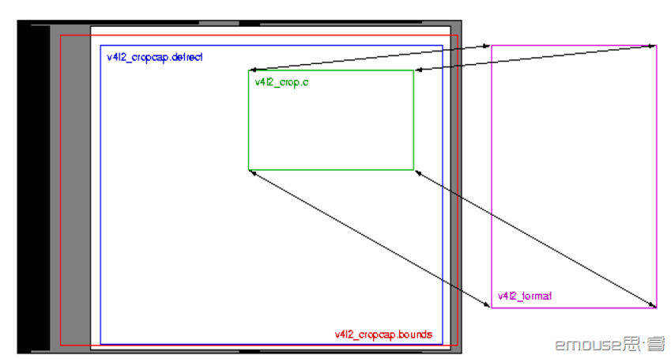

[V4l2介绍](https://www.cnblogs.com/silence-hust/p/4464291.html)

# 1.定义
V4L2(Video For Linux Two) 是内核提供给应用程序访问音、视频驱动的统一接口。包括一套数据结构和底层V4L2驱动接口。只能在linux下使用。它使程序有发现设备和操作设备的能力。它主要是用一系列的回调函数来实现这些功能。像设置摄像头的频率、帧频、视频压缩格式和图像参数等等。当然也可以用于其他多媒体的开发，如音频等。

在Linux下，所有外设都被看成一种特殊的文件，成为“设备文件”，可以象访问普通文件一样对其进行读写。一般来说，采用V4L2驱动的摄像头设备文是`/dev/v4l/video0`。为了通用，可以建立一个到`/dev/video0`的**链接**。V4L2支持两种方式来采集图像：内存映射方式(mmap)和直接读取方式(read)。

`V4L2在include/linux/videodev.h`文件中定义了一些重要的数据结构，在采集图像的过程中，就是通过对这些数据的操作来获得最终的图像数据。Linux系统V4L2的能力可在Linux内核编译阶段配置，默认情况下都有此开发接口。V4L2从Linux 2.5.x版本的内核中开始出现。

V4L2规范中不仅定义了通用API元素(Common API Elements)，图像的格式(Image Formats)，`输入/输出`方法(`Input/Output`)，还定义了Linux内核驱动处理视频信息的一系列接口(Interfaces)，这些接口主要有：

* 视频采集接口——Video Capture Interface;
* 视频输出接口—— Video Output Interface;
* 视频覆盖/预览接口——Video Overlay Interface;
* 视频输出覆盖接口——Video Output Overlay Interface;
* 编解码接口——Codec Interface。

# 2.工作流程

* 1.打开设备
* 2.检查和设置设备属性
* 3.设置帧格式
* 4.设置一种输入输出方法（缓冲 区管理
* 5.循环获取数据
* 6.关闭设备。

## 2.1 设备打开或关闭

**注意**：V4L2 的相关定义包含在头文件`<linux/videodev2.h> `中.

```c
#include <fcntl.h>
#include <unistd.h>

int open(const char *device_name, int flags);
int close(int fd);
```

举例：

```c
// 打开设备
int fd = open("/dev/video0", O_RDWR);

// 关闭设备
close(fd);
```

## 2.2 查询设备属性 VIDIOC_QUERYCAP

操作函数

```c
int ioctl(int fd, int request, struct v4l2_capability *argp);
```

结构体

```c
struct v4l2_capability
{
	u8 driver[16];  //驱动名字
	u8 card[32];   // 设备名字
	u8 bus_info[32]; //设备在系统中的位置
	u32 version; // 驱动版本号
	u32 capabilities; //设备支持的操作
	u32 reserved[4];  //保留字段
};
```

capabilities 常用值:`V4L2_CAP_VIDEO_CAPTURE // 是否支持图像获取`

显示设备信息:

```c
struct v4l2_capability cap;

ioctl(fd, VIDIOC_QUERYCAP, &cap);

printf(“Driver Name:%s\nCard Name:%s\nBus info:%s\nDriver Version:%u.%u.%u\n”,
	cap.driver,cap.card,cap.bus_info,(cap.version>>16)&0XFF, (cap.version>>8)&0XFF,cap.version&0XFF);
```

## 2.3 设置视频的制式和帧格式
制式包括PAL，NTSC，帧的格式个包括宽度和高度等。

> 相关函数

```c
int ioctl(int fd, int request, struct v4l2_fmtdesc *argp);

int ioctl(int fd, int request, struct v4l2_format *argp);
```

> 相关结构体

* v4l2_cropcap 结构体用来设置摄像头的捕捉能力，在捕捉上视频时应先先设置
* v4l2_cropcap 的 type 域，再通过 VIDIO_CROPCAP 操作命令获取设备捕捉能力的参数，保存于 v4l2_cropcap 结构体中，包括 bounds（最大捕捉方框的左上角坐标和宽高），defrect（默认捕捉方框的左上角坐标和宽高）等。
* v4l2_format 结构体用来设置摄像头的视频制式、帧格式等，在设置这个参数时应先填 好 v4l2_format 的各个域
	* 如 type（传输流类型）
	* fmt.pix.width(宽)
	* fmt.pix.heigth(高)
	* fmt.pix.field(采样区域，如隔行采样)
	* fmt.pix.pixelformat(采样类型，如 YUV4:2:2)
 然后通过 VIDIO_S_FMT 操作命令设置视频捕捉格式。


### 2.3.1  查询并显示所有支持的格式：VIDIOC_ENUM_FMT

函数

```c
int ioctl(int fd, int request, struct v4l2_fmtdesc *argp);
```

相关结构体

```c
struct v4l2_fmtdesc
{
	u32 index; //要查询的格式序号，应用程序设置
	enum v4l2_buf_type type; //帧类型，应用程序设置
    u32 flag;  //是否压缩格式
	u8 description[32]; //格式名称
	u32 pixelformat; //格式
	u32 reserved[4]; //保留
};
```

例：显示所有支持的格式

```c
struct v4l2_fmtdesc fmtdesc;
fmtdesc.index = 0;
fmtdesc.type = V4L2_BUF_TYPE_VIDEO_CAPTURE;
printf("Support format:\n");

while (ioctl(fd, VIDIOC_ENUM_FMT, &fmtdesc) != -1) {
	printf("\t%d.%s\n",fmtdesc.index+1,
		fmtdesc.description);
	fmtdesc.index ++;
}
```

### 2.3.3 查看或设置当前格式： VIDIOC_G_FMT, VIDIOC_S_FMT

检查是否支持某种格式：VIDIOC_TRY_FMT. 相关函数

```c
int ioctl(int fd, int request, struct v4l2_format *argp);
```

相关结构体

```c
struct v4l2_format {
	enum v4l2_buf_type type; //帧类型，应用程序设置
	union fmt {
		struct v4l2_pix_format pix; //视频设备使用
		struct v4l2_window win;
		struct v4l2_vbi_format vbi;
		struct v4l2_sliced_vbi_format sliced;
		u8 raw_data[200];
	};
};

struct v4l2_pix_format {
	u32 width; //帧宽，单位像素
	u32 height; //帧高，单位像素
	u32 pixelformat; //帧格式
	enum v4l2_field field;
	u32 bytesperline;
	u32 sizeimage;
	enum v4l2_colorspace colorspace;
	u32 priv;
};
```

显示当前帧的相关信息

```c
struct v4l2_format fmt;
fmt.type = V4L2_BUF_TYPE_VIDEO_CAPTURE;
ioctl(fd, VIDIOC_G_FMT, &fmt);

printf(Current data format information:\n\twidth:%d\n\theight:%d\n",fmt.fmt.pix.width,fmt.fmt.pix.height);

struct v4l2.fmtdesc fmtdesc;
fmtdesc.index = 0;
fmtdesc.type = V4L2_BUF_YTPE_VIDEO_CAPTURE;

while (ioctl(fd, VIDIOC_ENUM_FMT, &fmtdesc) != -1) {
	if (fmtdesc.pixelformat & fmt.fmt.pix.pixelformat) {
		printf(“\tformat:%s\n”,fmtdesc.description);

break;
	}
	fmtdesc.index++;
}
```

检查是否支持某种帧格式:

```c
struct v4l2_format fmt; fmt.type=V4L2_BUF_TYPE_VIDEO_CAPTURE; fmt.fmt.pix.pixelformat=V4L2_PIX_FMT_RGB32;

 if(ioctl(fd,VIDIOC_TRY_FMT,&fmt)==-1) 
	if(errno==EINVAL)
		printf(“not support format RGB32!\n”);
```

# 3.图像的缩放 VIDIOC_CROPCAP

相关函数

```c
int ioctl(int fd, int request, struct v4l2_cropcap *argp);
int ioctl(int fd, int request, struct v4l2_crop *argp);
int ioctl(int fd, int request, const struct v4l2_crop *argp);
```

相关结构体：

Cropping 和 scaling 主要指的是图像的取景范围及图片的比例缩放的支持。

* Crop 就 是把得到的数据作一定的裁剪和伸缩，裁剪可以只取样我们可以得到的图像大小的一部分， 剪裁的主要参数是位置、长度、宽度。
* Scale 的设置是通过 VIDIOC_G_FMT 和 VIDIOC_S_FMT 来获得和设置当前的 image 的长度，宽度来实现的。



我们可以假设 bounds 是 sensor 最大能捕捉到的图像范围，而 defrect 是设备默认 的最大取样范围，这个可以通过 VIDIOC_CROPCAP 的 ioctl 来获得设备的 crap 相关的属 性 v4l2_cropcap，其中的 bounds 就是这个 bounds，其实就是上限。每个设备都有个默 认的取样范围，就是 defrect，就是 default rect 的意思，它比 bounds 要小一些。这 个范围也是通过 VIDIOC_CROPCAP 的 ioctl 来获得的 v4l2_cropcap 结构中的 defrect 来表示的，我们可以通过 VIDIOC_G_CROP 和 VIDIOC_S_CROP 来获取和设置设备当前的 crop 设置。

## 3.1 设置设备捕捉能力的参数

相关函数

```c
int ioctl(int fd, int request, struct v4l2_cropcap *argp);
```

相关结构体

```c
struct v4l2_cropcap {
	enum v4l2_buf_type type; //数据流的类型，应用程序设置
	struct v4l2_rect bounds; //这是camera的镜头能捕捉到的窗口大小的局限
	struct v4l2_rect deferect; //定义默认大小，包括起点位置及长，宽的大小，大小以像素为单位
	struct v4l2_fract pixelaspect; //定义图片的宽高比
};
```

## 3.2 设置窗口取景参数VIDIOC_G_CROP 和 VIDIOC_S_CROP
相关函数

```c
int ioctl(int fd, int request, struct v4l2_crop *argp);
int ioctl(int fd, int request, const struct v4l2_crop *argp);
```

相关结构体

```c
struct v4l2_crop
{
enum v4l2_buf_type type;// 应用程序设置
struct v4l2_rect c;
}
```

# 4.video Inputs and Outputs

VIDIOC_G_INPUT 和 VIDIOC_S_INPUT 用来查询和选则当前的 input，一个 video 设备 节点可能对应多个***视频源**，比如`saf711`可以最多支持四路 cvbs 输入，如果上层想在四个cvbs视频输入间切换，那么就要调用 `ioctl(fd, VIDIOC_S_INPUT, &input)` 来切换。

VIDIOC_G_INPUT and VIDIOC_G_OUTPUT 返回当前的video input和output的index.

相关函数

```c
int ioctl(int fd, int request, struct v4l2_input *argp);
```

相关结构体

```c
struct v4l2_input {
	__u32 index; // which input
	__8 name[32]; // Label
	__32 type; // Type of input
	__32 audioset; // Associcated audios (bitfield)
	__32 tuner; // Associated tuner
	v4l2_std_id std;
	__u32 status;
	__u32 reserved[4];
};
```

我们可以通过VIDIOC_ENUMINPUT and VIDIOC_ENUMOUTPUT 分别列举一个input或者 output的信息，我们使用一个v4l2_input结构体来存放查询结果，这个结构体中有一个 index域用来指定你索要查询的是第几个`input/ouput`,如果你所查询的这个input是当前正 在使用的，那么在v4l2_input还会包含一些当前的状态信息，如果所 查询的`input/output` 不存在，那么回返回**EINVAL**错误，所以，我们通过循环查找，直到返回错误来遍历所有的 input/output. VIDIOC_G_INPUT and VIDIOC_G_OUTPUT 返回当前的video input和output 的index.

列举当前输入视频所支持的视频格式

```c
struct v4l2_input input;
struct v4l2_standard standard;

memset (&input, 0, sizeof (input));

//首先获得当前输入的 index,注意只是 index，要获得具体的信息，就的调用列举操作
if (-1 == ioctl (fd, VIDIOC_G_INPUT, &input.index)) {
	perror (”VIDIOC_G_INPUT”);
	exit (EXIT_FAILURE);
}

// 调用列举操作，获得 input.index 对应的输入的具体信息
if (-1 == ioctl (fd, VIDIOC_ENUMINPUT, &input)) {
	perror (”VIDIOC_ENUM_INPUT”);
	exit (EXIT_FAILURE);
}
printf (”Current input %s supports:\n”, input.name);
memset (&standard, 0, sizeof (standard));
standard.index = 0;

// 列举所有支持的standard，如果standard.id与当前input的input.std有共同的
// bit flag,意味着当前的输入支持这个standart，这样将所有驱动所支持的standard列举一遍
// 就可以找到该输入所支持的所有standard了
while (0 == ioctl(fd, VIDIOC_ENUMSTD, &standard)) {	
	if (standard.id & input.std) {
		printf("%s\n", standard.name);
		standard.index ++;
	}
}

/* EINVAL indicates the end of the enumeration, 
which cannot be empty unless this device falls under the USB exception. */
if (errno != EINVAL || standard.index == 0) {
	perror("VIDIOC_ENUMSTD");
	exit(EXIT_FAILURE);
}
```

## 4.1 Video standards

相关函数：

```c
v4l2_std_id std_id; //这个就是个64bit得数
int ioctl(int fd, int request, struct v4l2_standard *argp);
```

相关结构体:

```c
typedef u64 v4l2_std_id;

struct v4l2_standard {
	u32 index;
	v4l2_std_id id;
	u8 name[24];
	struct v4l2_fract frameperiod; /* Frames, not fields */
	u32 framelines;
	u32 reserved[4];
};
```
当然世界上现在有多个视频标准，如NTSC和PAL，他们又细分为好多种，那么我们的设 备输入/输出究竟支持什么样的标准呢？我们的当前在使用的输入和输出正在使用的是哪 个标准呢？我们怎么设置我们的某个输入输出使用的标准呢？这都是有方法的。

查询我们的输入支持什么标准，首先就得找到当前的这个输入的index，然后查出它的 属性，在其属性里面可以得到该输入所支持的标准，将它所支持的各个标准与所有的标准 的信息进行比较，就可以获知所支持的各个标准的属性。一个输入所支持的标准应该是一个集合，而这个集合是用bit与的方式用一个64位数字表示。因此我们所查到的是一个数字。

Example： Information about the current video standard v4l2_std_id std_id; //这个就是个64bit得数

```c
struct v4l2_standard standard;

// VIDIOC_G_STD就是获得当前输入使用的standard，不过这里只是得到了该标准的id
// 即flag，还没有得到其具体的属性信息，具体的属性信息要通过列举操作来得到。

if (-1 == ioctl (fd, VIDIOC_G_STD, &std_id)) { //获得了当前输入使用的standard
	// Note when VIDIOC_ENUMSTD always returns EINVAL this is no video device
	// or it falls under the USB exception, and VIDIOC_G_STD returning EINVAL
	// is no error.
	perror (”VIDIOC_G_STD”);
	exit (EXIT_FAILURE);
}

memset (&standard, 0, sizeof (standard));

standard.index = 0; //从第一个开始列举

// VIDIOC_ENUMSTD用来列举所支持的所有的video标准的信息，不过要先给standard
// 结构的index域制定一个数值，所列举的标 准的信息属性包含在standard里面，
// 如果我们所列举的标准和std_id有共同的bit，那么就意味着这个标准就是当前输
// 入所使用的标准，这样我们就得到了当前输入使用的标准的属性信息
while (0 == ioctl (fd, VIDIOC_ENUMSTD, &standard)) {
	if (standard.id & std_id) {
		printf (”Current video standard: %s\n”, standard.name);
		exit (EXIT_SUCCESS);
	}
	standard.index++;
}

/* EINVAL indicates the end of the enumeration, which cannot be empty unless this device falls under the USB exception. */

if (errno == EINVAL || standard.index == 0) {
	perror (”VIDIOC_ENUMSTD”);
	exit (EXIT_FAILURE);
}
```

# 5.申请和管理缓冲区

应用程序和设备有三种交换数据的方法，直接 read/write、内存映射(memory mapping)

和用户指针。这里只讨论内存映射(memory mapping)。

## 5.1 向设备申请缓冲区 VIDIOC_REQBUFS

相关函数

```c
int ioctl(int fd, int request, struct v4l2_requestbuffers *argp);
```

相关结构体

```c
struct v4l2_requestbuffers
{
	u32 count; //缓冲区内缓冲帧的数目
	enum v4l2_buf_type type; //缓冲帧数据格式
	enum v4l2_memory memory; //区别是内存映射还是用户指针方式
	u32 reserved[2];
};

enum v4l2_memory
{
	V4L2_MEMORY_MMAP,V4L2_MEMORY_SERPTR;
};
```

注意：count, type, memeory都要应用程序设置

例如：申请一个拥有四个缓冲帧的缓冲区

```c
struct v4l2_requestbuffers req;
req.count=4;
req.type=V4L2_BUF_TYPE_VIDEO_CAPTURE; 
req.memory=V4L2_MEMORY_MMAP;
ioctl(fd,VIDIOC_REQBUFS,&req);
```

## 5.2 获取缓冲帧的地址，长度：VIDIOC_QUERYBUF
相关函数：

```c
int ioctl(int fd, int request, struct v4l2_buffer *argp);
```

相关结构体：

```c
struct v4l2_buffer
{
	u32 index; //buffer序号
	enum v4l2_buf_type type; //buffer类型
	u32 byteused; //buffer中已经使用字节数
	u32 flags; // 区分是MMAP 还是USERPTR
	enum v4l2_field field;
	struct timeval timestamp; // 获取第一个字节时的系统时间
	struct v4l2_timecode timecode;
	u32 sequence; // 队列中的序号
	enum v4l2_memory memory; //IO 方式，被应用程序设置
	union m
	{
		u32 offset; // 缓冲帧地址，只对MMAP 有效
		unsigned long userptr;
	};

	u32 length; // 缓冲帧长度
	u32 input;
	u32 reserved;
};
```

## 4.3 内存映射MMAP 及定义一个结构体来映射每个缓冲帧。 

相关函数

```c
#include <sys/mman.h>

void *mmap(void *addr, size_t length, int prot, int flags, int fd, off_t offset)
int munmap(void *addr, size_t length);// 断开映射
```

* addr 映射起始地址，一般为NULL ，让内核自动选择
* length 被映射内存块的长度
* prot 标志映射后能否被读写，其值为PROT_EXEC,PROT_READ,PROT_WRITE, PROT_NONE
* flags 确定此内存映射能否被其他进程共享，MAP_SHARED,MAP_PRIVATE
* fd,offset, 确定被映射的内存地址 返回成功映射后的地址，不成功返回MAP_FAILED ((void*)-1)


相关结构体：

```c
struct buffer
{
	void *start;
	unsigned int length;
} *buffers;
```

例：将四个已申请到的缓冲帧映射到应用程序，用buffers 指针记录。

```c
buffers = (struct buffer *)calloc(req.count, sizeof(*buffer));

if (!buffers) {
	//映射
	fprintf(stderr, "Out of memory\n");
	exit(EXIT_FAILURE);
}

for (unsigned int n_buffers = 0; n_buffers < req.count; ++n_buffers) {
	struct v4l2_buffer buf;
	memset(&buf, 0, sizeof(buf));
	buf.type = V4L2_BUF_TYPE_VIDEO_CAPTURE;
	buf.memory = V4L2_MEMORY_MMAP;
	buf.index = n_buffers;
	// 插叙序号为n_buffers的缓冲区，得到其实物理地址和大小
	if (-1 == ioctl(fd, VIDIOC_QUERYBUF, &buf)) 
		exit(-1);
	buffers[n_buffers].length = buf.length;

	// 映射内存
	buffers[n_buffers].start = mmap(NULL,buf.length,PROT_READ|PROT_WRITE,MAP_SHARED,fd,buf.m.offset);
	if (MAP_FAILED == buffers[n_buffers].start)
		exit(-1);
}
```

# 5.缓冲区处理好之后，就可以开始获取数据了
## 5.1 10.1 启动 或 停止数据流 VIDIOC_STREAMON， VIDIOC_STREAMOFF

函数

```c
int ioctl(int fd, int request, const int *argp);
```
* arg为流类型指针，如V4L2_BUF_TYPE_VIDEO_CAPTURE

## 5.2 在开始之前，还应当把缓冲帧放入缓冲队列：

* VIDIOC_QBUF// 把帧放入队列

* VIDIOC_DQBUF// 从队列中取出帧

```c
int ioctl(int fd, int request, struct v4l2_buffer *argp);
```

例：把四个缓冲帧放入队列，并启动数据流

```c
unsigned int i;
enum v4l2_buf_type type;

for (i = 0; i < 4; ++i) {
	struct v4l2_buffer buf;
	buf.type = V4L2_BUF_TYPE_VIDEO_CAPTURE;
	buf.memory = V4L2_MEMORY_MMAP;
	buf.index = i;
	ioctl (fd, VIDIOC_QBUF, &buf);
}

type = V4L2_BUF_TYPE_VIDEO_CAPTURE;
ioctl(fd, VIDIOC_STREAMON, &type);
```

例：获取一帧并处理

```c
struct v4l2_buffer buf; CLEAR (buf);
buf.type = V4L2_BUF_TYPE_VIDEO_CAPTURE;
buf.memory = V4L2_MEMORY_MMAP;
ioctl (fd, VIDIOC_DQBUF, &buf); // 从缓冲区取出一个缓冲帧
process_image (buffers[buf.index.]start); //
ioctl (fdVIDIOC_QBUF&buf); //
```