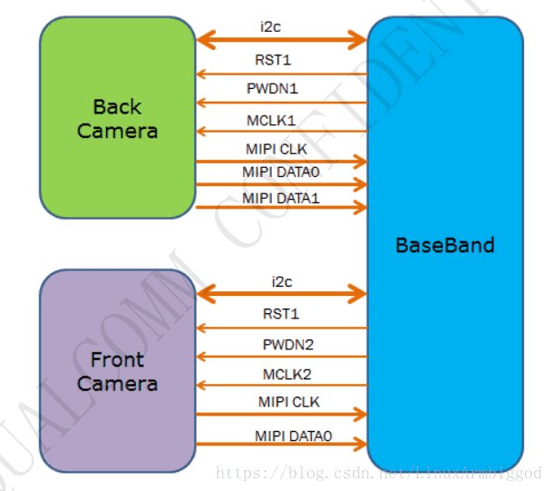
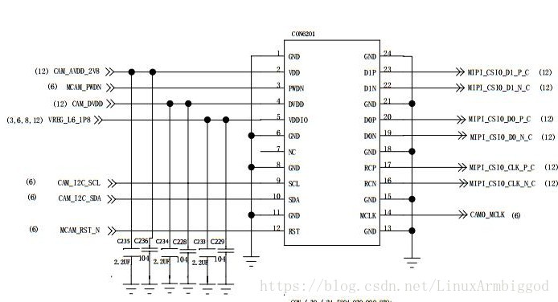
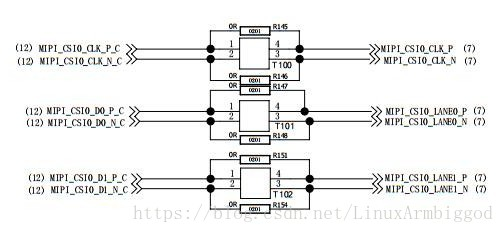
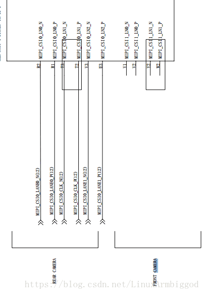
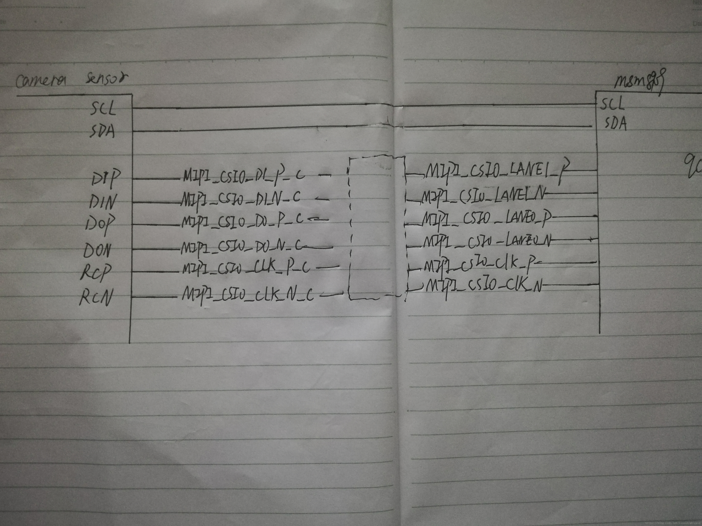
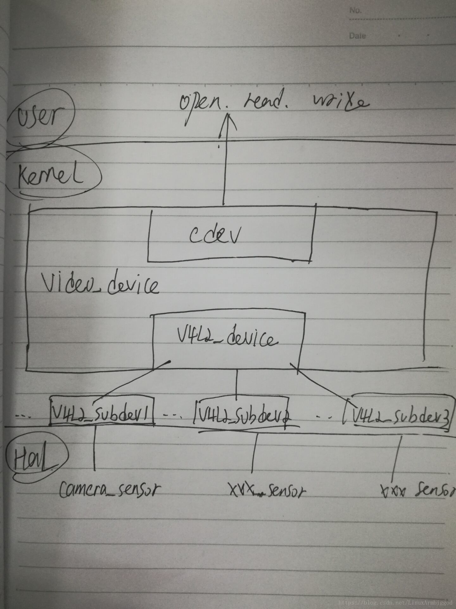

# V4L2框架简述（结合高通平台）

# 1 硬件
## 1.1 硬件结构分析
常用的电脑摄像头是USB接口,主流的智能手机摄像头是MIPI接口,树莓派等硬件却常常为CSI接口本项目是智能手机 camera采用MIPI接口，电路框架以及电路图如下：


camera传感器分前后两个，分别是前置摄像头和后置摄像头，两个camera都挂载在i2c总线上

## 1.2 电路分析




电路图线路结构大致如下：



```
camera sensor控制器 与 主控之间的连接如下：1~24 pin

1 GND   --------------------- 24 GND
2 VDD	--------------------- 23 D1P 
3 PWDN  --------------------- 22 D1N
4 DVDD  --------------------- 21 GND
5 IOVDD --------------------- 20 D0P
6 GND   --------------------- 19 D0N    
7 NC    --------------------- 18 GND
8 GND   --------------------- 17 RCP
9 SCL   --------------------- 16 RCN
10 SDA  --------------------- 15 GND
11 GND  --------------------- 14 MCLK
12 RST  --------------------- 13 GND
```
说明：

* MCLK 主时钟24MHZ
* SCL I2C时钟线
* SDA I2C数据线
* PWDN GPIO控制sensor的power down pin
* RST GPIO控制sensor的reset pin 
* VDD 提供给sensor的三路供电引脚
* DVDD 提供给sensor的三路供电引脚
* IOVDD 提供给sensor的三路供电引脚

用于MIPI的图像传感器接口：

* 主摄像头：2Lane mipi接口
	* CSI0-LN0-P/CSI0-LN0-N
	* CSI0-LN1-P/CSI0-LN1-N 
* 副摄像头：1Lane mipi接口
	* CSI1-LN0-P/CSI1-LN0-N 

# 2 软件
Linux中，所有的外设都被当作“文件”处理，就是我们常说的“设备文件”，可以像访问普通文件一样访问外设，对外设进行读写操作。linux驱动按照面向对象的不同被划分为“面向字符设备”，“面向块设备”，“面向网络设备”三大类设备。字符设备和块设备驱动在文件系统中形成类似文件的“虚拟文件”，即节点（node）,在/dev目录下统一处理，系统调用open read write等进行操作,而面向网络接口的设备不会被映射到文件系统中，被分配的设备名类似eth0等等，他的驱动调用方式也不是open等。

v4l2驱动框架概述：
V4L2(video for linux two)是linux为**视频设备提供的一套标准接口**，主要包括一套V4L2相关的底层数据结构 和 V4L2相关的底层驱动的接口作用是使得程序有发现和操作设备的能力。V4L2驱动框架分为两部分：

* `V4L2核心部分`:主要功能是构建内核中标准的视频设备驱动框架以及注册字符设备为上层用户提供访问接口.
* `V4L2下层接口`:V4L2下层接口部分的主要功能是挂接底层硬件IC

重点内容 v4l2驱动框架分层：

* 第一层 v4l2核心驱动框架 ：video_device 以及 v4l2_device 的创建、初始化、注册
* 第二层 v4l2下层接口驱动框架 ：将camera sensor挂接到i2c总线上

本文是基于高通平台msm8909, v4l2 kernel driver框架源码路径如下：

* 1.`/kernel/drivers/media/platform/msm/camera_v2` : v4l2以及i2c注册等
	* 1.1 `drivers/media/platform/vivi.c` ： v4l2框架核驱动（虚拟）
	* 1.2 `drivers/media/v4l2-core/… `: v4l2框架中各个代码接口的实现
	* 1.3 `drivers/media/platform/msm/camera_v2/sensor/msm_sensor_driver.c`：挂接在i2c总线上的camera sensor驱动
* 2 /kernel/arch/arm/boot/dts/qcom/msmxxx.dtsi :i2c配置
* 3./kenrel/arch/arm/boot/dts/qcom/msmxxx-camera-sensor-skua.dtsi :电源以及gpio配置

## 2.1 v4l2驱动框架
### 2.1.1 v4l2驱动框架代码目录分布

V4L2驱动的代码在`drivers\media\v4l2-core`文件夹下，打开该目录可以看到如下一系列文件，看似很多其实可以归类，比如

* videobufxx_xxx.c系列文件是用于实现视频的内存分配的
* videobuf2_xxx系列文件是对应V4L2
* videobuf—xxx.c系列文件是对应于 V4L(video for linux one)。
* v4l2-dev.c对应于video_device的实现
* 4l2-device.c对应 v4l2_device的实现
* v4l2-ioctl.c对应 ioctl的实现
* v4l2-subdev.c对应 42vl_subdev的实现等等。。。

**video驱动**代码位于`drivers\media`下，该路径下有很多子目录，其中比如 i2c mmc usb tuners radio等目录都是对应各个`subdev`的实现，platform目录用于存放不同**soc的驱动代码**

V4l2驱动框架图如下所示：

```
用户空间       v42l 应用接口（open read write）
-------------------------------------------------
内核空间         
    第一层    v4l2核心驱动框架：drivers/media/platform/vivi.c
             v42l核心驱动 : 对应video_device(v4l2核心驱动框架)
             video设备驱动 : 对应v4l2_device(v4l2核心驱动框架)
    第二层    v4l2下层接口驱动框架：drivers/media/platform/msm/camera_v2/sensor/msm_sensor_driver.c
             video子设备驱动 :对应v4l2_subdev(v4l2下层接口驱动框架)
-------------------------------------------------
			 video设备接口
             -------------------
	物理底层  
-------------------------------------------------
```

* v4l2核心：此部分视频设备核心。对应结构体video_device，是v4l2驱动框架向上层用户提供的接口
* video设备驱动：此部分驱动需要我们填充，代表一个v4l2设备，主要工作是根据 4vl2提供的驱动模型，完成对具体视频设备硬件底层实现，Ｌinux提供4vl2示例代码：vivi.c
* video子设备驱动：4vl2驱动所连接的子设备，如摄像头传感器ＩＣ，解编码器IC，音频IC等等，对应结构体v4l2_subdev，是v4l2驱动框架向下提供的接口
* 42l 应用接口: 应用程序通过V4L2提供read()、write()、ioctl()编程接口，来控制操作视频设备，如：设置图像分辨率、视频数据格式、开始/结束视频捕获等等。
* video设备：视频设备按照`输入输出来区分`，摄像头属于输入设备，显示器属于输出设备
* video设备接口：本文讨论的是摄像头，所以此处的设备接口即摄像头接口，一般目前流行的camera接口有 mipi 和 usb，mipi是当前主流的便携式设备(手机)camera接口

本文项目也是mipi接口。一般的usb接口camera常见于台式或者笔记本上，usb协议有专门针对video设备的接口类
### 2.1.2 v4l2驱动核心结构体

* `struct video_device` :保存管理v4l2_device设备（4vl2设备）数据，注册成功之后 以类似`/dev/videoxxx`的字符设备形式提供给上层，包含底层驱动结构体 v4l2_device 以及 为上层提供的接口cdev
* `struct v4l2_device` :代表一个 4vl2设备,保存设备实例的数据
* `struct v4l2_subdev`:由于目前 v4l2驱动 随着需求以及硬件的变化越来越复杂，，因为v4l2驱动需要支持音频，视频，解码，编码等ic,使得大部分 v4l2设备都包含了多个子设备ＩＣ,例如 解编码器，传感器，摄像头控制器等等,所以在`/dev`目录下不仅仅要建立v4l2的节点，还需要建立各个ＩＣ的设备节点，如fb,i2c,input，alsa等设备节点,通常这些ＩＣ通过i2c总线与主板连接，以上设备统称为sub-devices 子设备,代表 实实在在的camera等传感器设备，通常指挂在i2c总线。驱动需要与子设备进行通信，这些子设备一般情况下就是音频处理，编解码器等，camera常见的子设备有传感器和摄像头控制器，为了方便代码管理，内核 v4l2 提供了一个统一的接口给这些子设备，即`v4l2_subdev`结构体

```c
//kernel/include/media/v4l2-dev.h
struct video_device {
	const struct v4l2_file_operations *fops; //设备操作函数集
	struct cdev *cdev; // 字符设备 对应上层接口 open/read/write
	struct v4l2_device *v4l2_dev; // v4l2设备
	int minor; // system系统的video-xxx的此设备号
	const struct v4l2_ioctl_ops *ioctl_ops; //具体功能的实现函数
	...
};

//kernel/include/media/v4l2-device.h
struct v4l2_device {
	struct list_head subdevs;    //用链表管理注册的subdev
};

// kernel/inlcude/media/v4l2-subdev.h
struct v4l2_subdev {
	...
	struct list_head list; /* 链接至 v4l2_device */
	struct v4l2_device *v4l2_dev; // struct v4l2_device
	const struct v4l2_subdev_ops *ops; //设备功能集
}；

struct v4l2_subdev_ops {
	const struct v4l2_subdev_core_ops  *core; // 通用操作集合
	const struct v4l2_subdev_tuner_ops *tuner; // 调谐器操作合集
	const struct v4l2_subdev_audio_ops *audio; // 音频操作合集
	const struct v4l2_subdev_video_ops *video; //视频操作合集
	const struct v4l2_subdev_vbi_ops   *vbi;
	const struct v4l2_subdev_ir_ops    *ir;
	const struct v4l2_subdev_sensor_ops *sensor;
	const struct v4l2_subdev_pad_ops   *pad;
};
```

open ---> `/dev/videoxx`  ---> `cdev->file_opration` --->
`file_operations->v4l2_file_oprations.open`

## 2.2 v4l2核心驱动框架
内核提供了示例驱动：`drivers/media/platform/vivi.c`主要工作：

* 1 构建video_device结构，包括`.fops`以及`.ioctl_ops`
* 2 初始化v4l2_device结构体（代表一个 v4l2设备）
* 3 注册video_device结构体（video_device 是内核对 v4l2_device的官方封装，用于管理v4l2_device数据），向上层用户提供访问接口

```
// v4l2_device 设备的自定义封装
struct vivi_dev {
	struct list head    vivi_devlist;
	struct v4l2_device  v4l2_dev; //v4l2_device 设备
	struct video_devic; vdev;
	...
};

// file_operations的一个子集
static const struct v4l2_file_operations vivi_fops =
{
	.owner = THIS_MODULE,
	.open = v4l2_fh_open,
	.release = vb2_fop_release,
	.read = vb2_fop_read,
	.poll = vb2_fop_poll,
	.unlocked_ioctl = video_ioctl2, /* V4L2	 ioctl handler */
	.mmap = vb2_fop_mmap,
};

static const struct v4l2_ioctl_ops vivi_ioctl_ops = {
	.vidioc_querycap = vidioc_querycap,
	.vidioc_enum_fmt_vid_cap  = vidioc_enum_fmt_vid_cap,
	.vidioc_g_fmt_vid_cap     = vidioc_g_fmt_vid_cap,
	.vidioc_enum_framesizes   = vidioc_enum_framesizes,
	.vidioc_reqbufs       = vb2_ioctl_reqbufs,
	.vidioc_create_bufs   = vb2_ioctl_create_bufs,
	.vidioc_prepare_buf   = vb2_ioctl_prepare_buf,
	.vidioc_querybuf      = vb2_ioctl_querybuf,
	.vidioc_qbuf          = vb2_ioctl_qbuf,
	.vidioc_dqbuf         = vb2_ioctl_dqbuf,
	.vidioc_enum_input    = vidioc_enum_input,
	.vidioc_g_input       = vidioc_g_input,
	.vidioc_s_input       = vidioc_s_input,
	.vidioc_enum_frameintervals = vidioc_enum_frameintervals,
	.vidioc_g_parm        = vidioc_g_parm,
	.vidioc_s_parm        = vidioc_s_parm,
	.vidioc_streamon      = vb2_ioctl_streamon,
	.vidioc_streamoff     = vb2_ioctl_streamoff,
	.vidioc_log_status    = v4l2_ctrl_log_status,
	.vidioc_subscribe_event = v4l2_ctrl_subscribe_event,
	.vidioc_unsubscribe_event = v4l2_event_unsubscribe,
};

// struct video_device 的构造
static const struct video_device vivi_template = {
	.name = "vivi",
	.fops = &vivi_fops, //用户open相关内容
	.ioctl_ops = &vivi_ioctl_ops, // 用户iotrl 对应的内容
	.release = video_device_release_empty,
}；

// 注册camera 设备
static int __init vivi_create_instance(int inst)
{
	struct vivi_dev *dev;
	struct video_device *vfd;
	int ret;

	// 注册v4l2_device设备,内部只是一些初始化v4l2_device行为，并无实质注册动作
	ret = v4l2_device_register(NULL, &dev->v4l2_dev);
	
	// 注册video_device设备:VFL_TYPE_GARBBER代表camera video 设备类型
	ret = video_register_device(vfd, VFL_TYPE_GRABBER, video_nr);
}
```
## 2.3 v4l2下层接口驱动框架
不同的camera有不同的驱动，但是他都凌驾在i2c的控制器上。故实现camera的驱动，通常都是实现`i2c_driver`和`i2c_client`的相关内容。
drivers/media/platform/msm/camera_v2/sensor/msm_sensor_driver.c： 挂载在i2c总线上面的 camera sensor

先注册platform平台，然后挂载到i2c总线上。

```c
static const struct of_device_id msm_sensor_driver_dt_match[] = {
{.compatible = "qcom,camera"},
{}
};

MODULE_DEVICE_TABLE(of, msm_sensor_driver_dt_match);

static struct platform_driver msm_sensor_platform_driver = {
	.driver = {
    	.name = "qcom,camera",
    	.owner = THIS_MODULE,
    	.of_match_table = msm_sensor_driver_dt_match,
	},
	.remove = msm_sensor_platform_remove,
};

.....

static const struct i2c_device_id i2c_id[] = {
	{SENSOR_DRIVER_I2C, (kernel_ulong_t)NULL},
	{ }
};

static struct i2c_driver msm_sensor_driver_i2c = {
	.id_table = i2c_id,
	.probe  = msm_sensor_driver_i2c_probe,
	.remove = msm_sensor_driver_i2c_remove,
	.driver = {
    	.name = SENSOR_DRIVER_I2C,
    },
};
```
具体i2c挂载sensor代码不做详细说明，只说明框架。

设备树：camera sensor的挂接，以及gpio设置

```
&i2c_3 {
	qcom,camera@0 { //后摄像头 0
    	cell-index = <0>;
    	compatible = "qcom,camera";
    	reg = <0x2>;
    	qcom,csiphy-sd-index = <0>;
    	qcom,csid-sd-index = <0>;
    	qcom,mount-angle = <90>;
    	cam_vana-supply = <&pm8909_l17>;
    	cam_vio-supply = <&pm8909_l6>;
    	qcom,cam-vreg-name = "cam_vio", "cam_vana";
    	qcom,cam-vreg-type = <1 0>;
    	qcom,cam-vreg-min-voltage = <0 2800000>;
    	qcom,cam-vreg-max-voltage = <0 2850000>;
    	qcom,cam-vreg-op-mode = <0 80000>;
    	pinctrl-names = "cam_default", "cam_suspend";
    	pinctrl-0 = <&cam_sensor_mclk0_default
            		 &cam_sensor_rear_default>;
    	pinctrl-1 = <&cam_sensor_mclk0_sleep 				  				 &cam_sensor_rear_sleep>;
    	gpios = <&msm_gpio 26 0>, //后摄像头的 mclk
        		<&msm_gpio 35 0>, //后摄像头的 reset
        		<&msm_gpio 34 0>; //后摄像头的 pwdn
   	    qcom,gpio-reset = <1>;
    	qcom,gpio-standby = <2>;
    	qcom,gpio-req-tbl-num = <0 1 2>;
    	qcom,gpio-req-tbl-flags = <1 0 0>;
    	qcom,gpio-req-tbl-label = "CAMIF_MCLK",
        						  "CAM_RESET1",
                                  "CAM_STANDBY";
    	qcom,sensor-position = <0>;
    	qcom,sensor-mode = <0>;
    	qcom,cci-master = <0>;
    	status = "ok";
    	clocks = <&clock_gcc clk_mclk0_clk_src>,
            	 <&clock_gcc clk_gcc_camss_mclk0_clk>;
   		 clock-names = "cam_src_clk", "cam_clk";
};

qcom,camera@1 {
    cell-index = <1>;
    compatible = "qcom,camera";
    reg = <0x1>;
    qcom,csiphy-sd-index = <0>;
    qcom,csid-sd-index = <0>;
    qcom,mount-angle = <90>;
    cam_vana-supply = <&pm8909_l17>;
    cam_vio-supply = <&pm8909_l6>;
    qcom,cam-vreg-name = "cam_vio", "cam_vana";
    qcom,cam-vreg-type = <1 0>;
    qcom,cam-vreg-min-voltage = <0 2850000>;
    qcom,cam-vreg-max-voltage = <0 2850000>;
    qcom,cam-vreg-op-mode = <0 80000>;
    pinctrl-names = "cam_default", "cam_suspend";
    pinctrl-0 = <&cam_sensor_mclk1_default &cam_sensor_front_default>;
    pinctrl-1 = <&cam_sensor_mclk1_sleep &cam_sensor_front_sleep>;
    gpios = <&msm_gpio 27 0>,
        <&msm_gpio 28 0>,
        <&msm_gpio 33 0>;
    qcom,gpio-reset = <1>;
    qcom,gpio-standby = <2>;
    qcom,gpio-req-tbl-num = <0 1 2>;
    qcom,gpio-req-tbl-flags = <1 0 0>;
    qcom,gpio-req-tbl-label = "CAMIF_MCLK",
        "CAM_RESET",
        "CAM_STANDBY";
    qcom,cci-master = <0>;
    status = "ok";
    clocks = <&clock_gcc clk_mclk1_clk_src>,
            <&clock_gcc clk_gcc_camss_mclk1_clk>;
    clock-names = "cam_src_clk", "cam_clk";
};
```
综上所述：v4l2框架如下：




