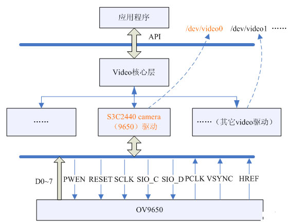

编写基于V4L2视频驱动主要涉及到以下几个知识点：

* 摄像头方面的知识
	* 要了解选用的摄像头的特性，包括访问控制方法、各种参数的配置方法、信号输出类型等。
	* Camera解码器、控制器: 如果摄像头是模拟量输出的，要熟悉解码器的配置。最后数字视频信号进入camera控制器后，还要熟悉camera控制器的操作。
* V4L2的API和数据结构:编写驱动前要熟悉应用程序访问V4L2的方法及设计到的数据结构。
* V4L2的驱动架构:最后编写出符合V4L2规范的视频驱动。

本文介绍基于S3C2440硬件平台的V4L2视频驱动开发。摄像头采用OmniVision公司的OV9650和OV9655。主要包含以下几个方面的内容：

视频驱动的整体驱动框架:3C2440 camera控制器+ov9650（ov9655）

* V4L2 API及数据结构
* V4L2驱动框架
* ov9650（ov9655）+s3c2440+V4L2实例

# 1.视频驱动的整体框架

视频驱动的整体框架见下图：

# 二、S3C2440 camera控制器+ov9650（ov9655）

（1）S3C2440 camera控制器介绍
