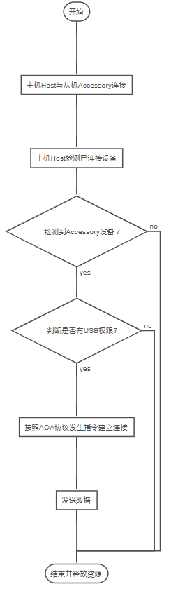
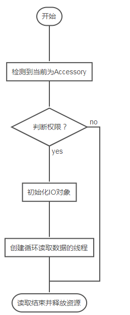

# Android AOA协议通信总结
Android从3.1版本可开始引进了对AOA协议 ( Android Open Accessory Protocol) 的支持，这是一种允许外部USB硬件与Android设备进行交互的特殊Accessory模式。

Android 开放配件 (AOA) 支持功能可让外部 USB 硬件（Android USB 配件）与处于配件模式下的 Android 设备进行交互。当某台 Android 设备处于配件模式时，所连接的配件会充当USB主机（为**总线供电并列举设备**），而 Android 设备则充当 USB 配件。

Android USB 配件专门用于和 Android 设备相连。这些配件遵循 AOA 要求，从而能够检测到支持配件模式的 Android 设备，并且必须提供 500 毫安（电压为 5 伏）的充电电流。之前发布的部分 Android 设备只能充当 USB 设备，无法发起与外部 USB 设备的连接。AOA 支持功能打破了这一局限，让您能够构建可以与各种 Android 设备建立连接并与其进行交互的配件。

# 1. Host端流程



host端发送数据总的流程如上图。示例代码如下
## 1.1 AndroidManifest.xml配置

```xml
<uses-feature android:name="android.hardware.usb.host"/>
 <!-- 添加activity自启动，这里采用的是vnd.android.document/root 也可以监听UsbManager.ACTION_USB_ACCESSORY_ATTACHED-->
        <activity android:name=".activity.MainActivity">
            <intent-filter>
                <action android:name="android.intent.action.MAIN"/>

                <category android:name="android.intent.category.LAUNCHER"/>
            </intent-filter>
            <intent-filter>
                <action android:name="android.intent.action.VIEW" />
                <category android:name="android.intent.category.DEFAULT" />
                <data android:mimeType="vnd.android.document/root" />
            </intent-filter>
        </activity>
```

## 1.2.检测USB权限
Activity启动说明**检测到设备插入**，此时判断应用是否已经被授权。应用如果是system的，系统自带PASS，代码如下

```java
private UsbManager mUsbManager;
private OpenDevicesReceiver  mOpenDevicesReceiver;
...
private void openDevices() {
    mUsbManager = (UsbManager) getSystemService(Context.USB_SERVICE);

    PendingIntent pendingIntent = PendingIntent.getBroadcast(mContext, 0, new Intent(USB_ACTION), 0);
    IntentFilter intentFilter = new IntentFilter(USB_ACTION);
    mOpenDevicesReceiver = new OpenDevicesReceiver(this);
    registerReceiver(mOpenDevicesReceiver, intentFilter);

    if (mUsbManager.hasPermission(usbDevice)) {
        initAccessory(usbDevice);//已经有权限继续操作
    } else {
        mUsbManager.requestPermission(usbDevice, pendingIntent);//申请权限，结果触发pendingIntent中广播
    }
}

...

// 申请USB权限的广播
class OpenDevicesReceiver extends BroadcastReceiver {
    @Override
    public void onReceive(Context context, Intent intent) {
        UsbDevice usbDevice = intent.getParcelableExtra(UsbManager.EXTRA_DEVICE);
        if (intent.getBooleanExtra(UsbManager.EXTRA_PERMISSION_GRANTED, false)) {
            if (usbDevice != null) {
                 initAccessory(usbDevice);//已获取权限继续操作
            } else {
                //usbDevice 为 null
            }
        } else {
            //未获取权限
        }
    }
}
```

## 1.3 与Accessory建立连接

根据AOA协议需要发送三种指令：

* 1.发送 51 控制**请求（“获取协议”）**以确定设备是否支持 Android 配件协议。如果设备支持协议，则返回一个非零数字，代表所支持的协议版本。该控制请求为端点 0 上的请求，具有以下特征：

```
requestType: USB_DIR_IN | USB_TYPE_VENDOR
request: 51
value: 0
index: 0
data: protocol version number (16 bits little endian sent from the
device to the accessory)
```

* 2.如果设备返回所支持的协议版本，则**向设备发送含标识字符串信息的控制请求**。该信息让设备可以确定适合配件的应用（如果没有适合配件的应用，则向用户呈现一个网址）。该控制请求为端点 0 上的请求（适用每个字符串 ID），具有以下特征：

```
requestType: USB_DIR_OUT | USB_TYPE_VENDOR
request: 52
value: 0
index: string ID
data zero terminated UTF8 string sent from accessory to device
支持以下字符串 ID，并且每个字符串的最大值为 256 个字节（必须以零结束，以 \0 结尾）。
manufacturer name: 0
model name: 1
description: 2
version: 3
URI: 4
serial number: 5
```
* 3.发送控制请求，要求**设备以配件模式启动**。该控制请求为端点 0 上的请求，具有以下特征：

```
requestType: USB_DIR_OUT | USB_TYPE_VENDOR
request: 53
value: 0
index: 0
data: none
```
发送代码如下，第一条指令的作用就是获取AOA版本号，可以省略。

```java
private void initAccessory(UsbDevice usbDevice) {
    UsbDeviceConnection usbDeviceConnection = mUsbManager.openDevice(usbDevice);
    if (usbDeviceConnection == null) {
        // 建立连接失败
        return;
    }
    // 发送51指令  可以省略(IN)
    byte[] bytes = new byte[]{(byte)0x00,(byte)0x00,(byte)0x00,(byte)0x00,
            (byte)0x00,(byte)0x00,(byte)0x00,(byte)0x00,
            (byte)0x00,(byte)0x00,(byte)0x00,(byte)0x00,
            (byte)0x00,(byte)0x00,(byte)0x00,(byte)0x02};
    int i = usbDeviceConnection.controlTransfer(0xc0, 51, 0, 0, bytes, 16, 100);
    Log.i(TAG, "i " + i);
    // 发送52指令，MANUFACTURER MODEL  VERSION 对应Accessory端 xml中配置，其余的可自行填补，省略亦可。(OUT)
    initStringControlTransfer(usbDeviceConnection, 0, "Demo, Inc."); // MANUFACTURER
    initStringControlTransfer(usbDeviceConnection, 1, "AccessoryChat"); // MODEL
    initStringControlTransfer(usbDeviceConnection, 2, "Accessory Demo"); // DESCRIPTION
    initStringControlTransfer(usbDeviceConnection, 3, "1.1"); // VERSION
    initStringControlTransfer(usbDeviceConnection, 4, "http://www.android.com"); // URI
    initStringControlTransfer(usbDeviceConnection, 5, "0123456789"); // SERIAL
    // 发送53指令(OUT)
    usbDeviceConnection.controlTransfer(0x40, 53, 0, 0, new byte[]{}, 0, 100);
    // 释放资源
    usbDeviceConnection.close();
    // 启动AOA连接后一些参数初始化
    initDevice();
}
private void initStringControlTransfer(UsbDeviceConnection deviceConnection, int index, String string) {
    deviceConnection.controlTransfer(0x40, 52, 0, index, string.getBytes(), string.length(), 100);
}
private void initDevice() {
    Runnable mRunnable = new Runnable() {
        @Override
        public void run() {
            // 发送过AOA指令后，设备会由MTP,ADB变成Android Accessory Interface状态
            // AOA当前不支持同时进行AOA连接和MTP连接。要从AOA切换到 MTP，配件必须首先与 USB 设备断开连接（断开物理连接或以电气等效的方式断开），然后使用 MTP 重新连接 USB 设备。
            HashMap<String, UsbDevice> deviceList = mUsbManager.getDeviceList();
            Collection<UsbDevice> values = deviceList.values();
            if (!values.isEmpty()) {
                // 一般都只有一个device，多个需要修改判断
                for (UsbDevice usbDevice : values) {
                    int productId = usbDevice.getProductId();
                        // 设备ID是否符合要求，正常AOA协议发送成功建立连接后，模式和ID都会改变
                        if (productId == 0x2D00 || productId == 0x2D01) {
                            if (mUsbManager.hasPermission(usbDevice)) {
                                mUsbDeviceConnection = mUsbManager.openDevice(usbDevice);
                                if (mUsbDeviceConnection != null) {
                                    // 正常默认0是Android Accessory Interface （配件如果打开usb调试 ）1表示 ADB
                                    // 所以也没必要遍历了，参数直接给0
                                    mUsbInterface = usbDevice.getInterface(0);
                                    int endpointCount = mUsbInterface.getEndpointCount();
                                    for (int i = 0; i < endpointCount; i++) {
                                        UsbEndpoint usbEndpoint = mUsbInterface.getEndpoint(i);
                                        // 获取 mUsbEndpointOut 与 mUsbEndpointIn ，分别表示输出/读取流
                                        if (usbEndpoint.getType() == UsbConstants.USB_ENDPOINT_XFER_BULK) {
                                            if (usbEndpoint.getDirection() == UsbConstants.USB_DIR_OUT) {
                                                mUsbEndpointOut = usbEndpoint;
                                            } else if (usbEndpoint.getDirection() == UsbConstants.USB_DIR_IN) {
                                                mUsbEndpointIn = usbEndpoint;
                                            }
                                        }
                                    }
                                    if (mUsbEndpointOut != null && mUsbEndpointIn != null) {
                                        // 到这里一切都正常说明连接真正OK，接下来可以使用读写数据了
                                    }
                                }
                            }
                        }
                    }
                }
            }
        }
    }
```
## 1.4 数据流读写方式
使用系统API即可，AOA传输速度会比`MTP/ADB`慢一些，示例代码如下:

```java
try {
    in = new FileInputStream("/storage/emulated/0/test.zip");
} catch (FileNotFoundException e) {
    Log.e(TAG, "FileNotFoundException " + e.toString());
    return;
}

// 使用bulkTransfer传输API时，最大 BUFFER SIZE 就是 16384（16k）
// 如果设置BUFFER 多大，多余的数据会丢失
byte[] bytes = new byte[16 * 1024];
int n = 0;
try {
    while ((n = in.read(bytes, 0, bytes.length)) != -1) {
        // 使用mUsbEndpointOut 表示输出，换成mUsbEndpointIn 即读取
        i = mUsbDeviceConnection.bulkTransfer(mUsbEndpointOut, bytes, n, 3000);
        // 数据 发送/读取 成功会返回数据大小byte，返回-1表示数据发送失败
        if (i > 0) {
            // 数据 发送/读取 成功
        }
}
in.close();
} catch (IOException e) {
    Log.e(TAG, "IOException " + e.toString());
    return;
}
Log.e(TAG, "end " + in);
```

# 2.Accessory端流程


Accessory端接收数据总的流程如上图。示例代码如下

## 2.1 AndroidManifest.xml配置

Activity添加USB_ACCESSORY_ATTACHED action自启动，同时需要添加meta-data，指定`resource="@xml/accessory_filter"`

```xml
<uses-feature android:name="android.hardware.usb.accessory"/>
<activity android:name=".activity.MainActivity">
    <intent-filter>
        <action android:name="android.intent.action.MAIN"/>
        <action android:name="android.hardware.usb.action.USB_ACCESSORY_ATTACHED"/>
        <category android:name="android.intent.category.LAUNCHER"/>
    </intent-filter>

    <meta-data
        android:name="android.hardware.usb.action.USB_ACCESSORY_ATTACHED"
        android:resource="@xml/accessory_filter"/>
</activity>
```
accessory_filter.xml 如下，和主机端发送52指令要匹配

```xml
<?xml version="1.0" encoding="utf-8"?>
<resources>
    <!--<usb-accessory />-->
    <usb-accessory
        manufacturer="OldSix, Inc."
        model="AccessoryChat"
        version="1.1"/>
</resources>
```

## 2.2、系统启动AOA应用
接收到主机端发出AOA这个匹配的信息后，在SystemUI中会启动对应
Activity：相关代码目录 `frameworks/base/packages/SystemUI/src/com/android/systemui/usb/UsbConfirmActivity.java` – 确认启动AOA应用

* UsbConfirmActivity.java – 确认启动AOA应用
* UsbPermissionActivity – AOA应用（非系统应用签名）需要申请权限
* UsbAccessoryUriActivity – 无对应的AOA应用，如果主机端发送的52指令中URI有效，显示URIUsbResolverActivity – 多个匹配的应用选择器

## 2.3、检测USB权限
检测权限与host端类似，参数不同

```java
private UsbManager mUsbManager;

private void initData() {
    mUsbManager = (UsbManager) getSystemService(Context.USB_SERVICE);

    // 这监听ACTION_USB_ACCESSORY_DETACHED广播，当退出AOA状态时需要做一些操作
    mUsbDetachedReceiver = new UsbDetachedReceiver(this);
    IntentFilter filter = new IntentFilter(UsbManager.ACTION_USB_ACCESSORY_DETACHED);
    registerReceiver(mUsbDetachedReceiver, filter);

    // 这监听权限申请广播，USB_ACTION为自定义字段
    mOpenAccessoryReceiver = new OpenAccessoryReceiver(this);
    PendingIntent pendingIntent = PendingIntent.getBroadcast(this, 0, new Intent(USB_ACTION), 0);
    IntentFilter intentFilter = new IntentFilter(USB_ACTION);
    registerReceiver(mOpenAccessoryReceiver, intentFilter);

    UsbAccessory[] accessories = mUsbManager.getAccessoryList();
    UsbAccessory usbAccessory = (accessories == null ? null : accessories[0]);
    if (usbAccessory != null) {
        Log.i(TAG, "usbAccessory " + mUsbManager.hasPermission(usbAccessory));
        if (mUsbManager.hasPermission(usbAccessory)) {
            openAccessory(usbAccessory);
        } else {
            mUsbManager.requestPermission(usbAccessory, pendingIntent);
        }
    }
}

public class OpenAccessoryReceiver extends BroadcastReceiver {

    @Override
    public void onReceive(Context context, Intent intent) {
        UsbAccessory usbAccessory = intent.getParcelableExtra(UsbManager.EXTRA_ACCESSORY);
        if (intent.getBooleanExtra(UsbManager.EXTRA_PERMISSION_GRANTED, false)) {
            if (usbAccessory != null) {
                // 已获取权限
            } else {
                // 异常情况
            }
        } else {
            // 未授予权限
        }
    }
}
```

## 2.4、读取数据
读取数据需要开一个单独的循环线程，不断的去读buffer中数据

```java
private ParcelFileDescriptor mParcelFileDescriptor;
private FileInputStream mFileInputStream;
private FileOutputStream mFileOutputStream;

private void openAccessory(UsbAccessory usbAccessory) {
    mParcelFileDescriptor = mUsbManager.openAccessory(usbAccessory);
    Log.i(TAG, "mParcelFileDescriptor " + mParcelFileDescriptor);
    if (mParcelFileDescriptor != null) {
        FileDescriptor fileDescriptor = mParcelFileDescriptor.getFileDescriptor();
        mFileInputStream = new FileInputStream(fileDescriptor);
        mFileOutputStream = new FileOutputStream(fileDescriptor);

        new Thread(new Runnable() {
            @Override
            public void run() {
                int i = 0;
                // 将读取的数据保存到本地文件
                try {
                    out = new FileOutputStream("/cache/update.zip");
                } catch (FileNotFoundException e) {
                    Log.e(TAG, "FileNotFoundException " + e.toString());
                }
                while (i >= 0) {
                    try {
                        i = mFileInputStream.read(mBytes);
                    } catch (IOException e) {
                        Log.e(TAG, "IOException " + e.toString());
                        break;
                    }
                    if (i > 0) {
                        try {
                            out.write(mBytes, 0, i);
                        } catch (IOException e) {
                            Log.e(TAG, "write IOException " + e.toString());
                            break;
                        }
                    }
                }
                try {
                    out.close();
                } catch (IOException e) {
                    Log.e(TAG, "close IOException " + e.toString());
                }
            }
        }).start();
    }
}
```
如果需要向主机端传数据，需要向buffer中写数据，让主机端去读

`mFileOutputStream.write(byte[] byte);`