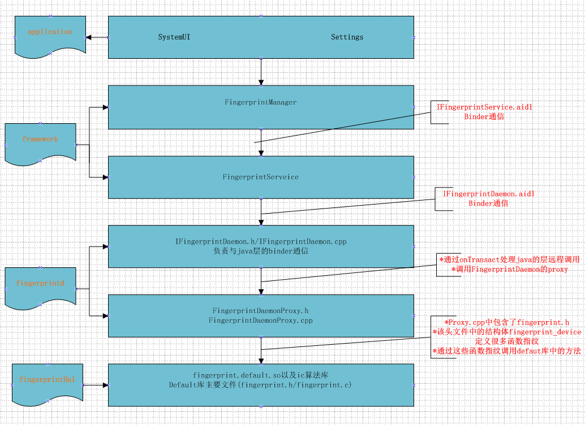
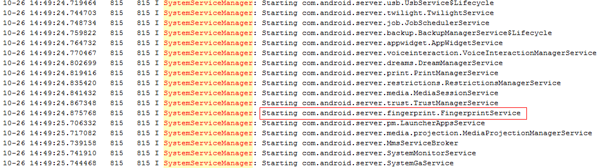
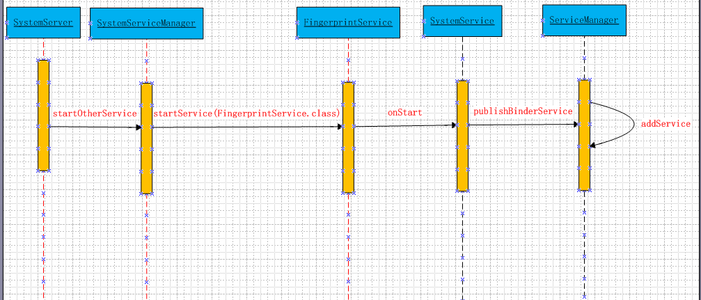
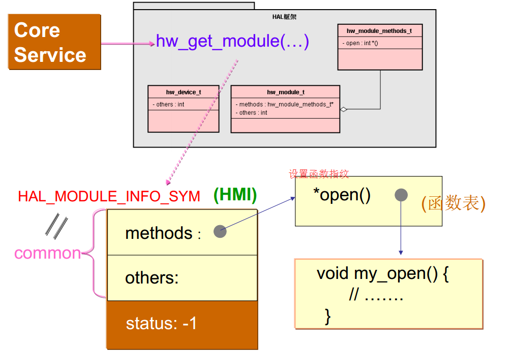

# 1.Fingerprint模块架构

Fingerprint模块架构图如下，这里分为`application`，`framework`，`fingerprintd`和`FingerprintHal`这几个部分,不涉及**指纹的IC库**(Integrated Circuit Card，集成电路卡)和**驱动**这部分,这部分逻辑由指纹厂商来实现，目前了解的并不多。



# 2.Fingerprint framework初始化流程
在系统开机的时候，会启动各种Service，包括FingerprintService。从下图的开机log（sys_log.boot）中可以看出：


FingerprintService的启动在SystemServer.Java的startOtherService方法中：

```java
/*
	start a miscelanous grab bag of stuff that has yet be refactored and organized
*/
private void startOtherServices(){
	final Context context=mSystemContext;
	...
	//启动FingerprintService
	if(mPackManager.hasSystemFeature(PackagerManager.FEATURE_FINGERPRINT)){
		mSystemServiceManager.startService(FingerprintService.class);
	}
}
```
这里会通过PackageManager来判断是否支持指纹功能，这个判断是N新加的，如果支持的话，需要在`framework/native/data/ect/`目录下添加`Android.hardware.fingerprint.xml`来支持该功能，这样才能启动FingerprintService。 

```xml
<!--this is the standard set of features for a biometric计量 fingerprint sensor. -->
<permissions>
	<feature name="android.hardware.fingerprint"/>
</permissions>
```
这里启动的时候，会将FingerprintService添加到ServiceManager中去，如下图：


将FingerprintService添加到ServiceManager中后，在SystemServiceRegistry.java中静态代码块中注册服务的时候，可以从ServiceManager中获取FingerprintService的Binder对象，从而可以构造出FingerprintManager对象，这样app端就可以通过Context来获取FingerprintManager对象。 

```java
registerService(Context.FINGER_SERVICE,FingerprintManager.class,new CachedServiceFetcher<FingerprintManager>()){
	@Override
	public FingerprintManager createService(ContextImpl ctx){
		IBinder binder=ServiceManager.getService(Context.FINGERPRINT_SERVICE);
		IFingerprintService service=IFingerprintService.Stub.asInterface(binder);
		return new FingerprintManager(ctx.getOuterContext(),service);
	}
}
```
这样，app端通过Context获取FingerprintManager，通过调用FingerprintManager的接口来实现相应的功能，FingerprintManager转调FingerprintService中方法，FingerprintService负责`管理整个注册`，`识别`、`删除指纹`、`检查权限`等流程的逻辑，FingerprintService调用fingerprintd的接口，**通过fingerprintd和FingerprintHal层进行通信**。

在FingerprintService的getFingerprintDaemon方法中有如下步骤：

* 1.获取fingerprintd
* 2.向fingerprintd注册回调函数mDaemonCallback
* 3.调用获取fingerprintd的openhal函数
* 4.建立fingerprint文件系统节点，设置节点访问权限，调用fingerprintd的setActiveGroup，将路径传递下去。此路径一般用来存储指纹模板的图片等。

```java
public IFingerprintDaemon getFingerprintDaemon(){
	if(mDaemon == null){
		//1.获取fingerprintd
		mDaemon=IFingerprintDaemon.Stub.asInterface(ServiceManager.getService(FINGERPRINT_SERVICED));
		if(mDeamon!=null){
			try{
				mDaemon.asBinder().linkToDeath(this,0);
				//2.向fingerprintd注册回调函数mDaemonCallback
				mDaemon.init(mDaemonCallback);
				//3.调动获取fingerprintd的openHanl函数
				mHalDeviceId=mDaemon.openHal();
				//4.建立fingerprint文件系统节点，设置节点访问权限
				//调用fingerprintd的setActiveGroup，将路径传递下去，此路径一般用来存储指纹模板图片等
				if(mHalDeviceId!=null){
					updateActiveGroup(ActivityManager.getCurrentUser());
				}else{
					Slog.w(TAG,"Failed to open Fingerprint HAL!");
					mDaemon = null;
				}
			}catch(RemoteException e){
				Slog.e(TAG,"Failed to open fingerprintd HAL",e);		
				mDaemon=null;//try again later!
			}
		}else{
			Slog.w(TAG,"fingerprint service not avaliable");
		}
	}
	return mDaemon;
}
```

### 2.1总结

* 1.FingerprintService在framework模块负责指纹的大部分逻辑，FingerprintService会在开机的时候初始化；
* 2.application调用framework通过FingerprintManager接口即可实现；
* 3.framework中FingerManager和FingerprintService的通信使用Binder机制实现，表现即使用aidl这个接口定义语言实现
* 4.framework调往fingerprintd的同样属于Binder通信，两者分属于不同的进程。不过这部分跟java层Binder处理有点不一样，是**java层往native层的调用**。

## 3.fingerprintd部分的初始化

在`system/core/fingerprintd`目录下,有如下文件，可将fingerprintd划分为四个部分：

* 1.`fingerprintd.cpp`:负责将fingerprintd加入到ServiceManager中，便于FingerprintService能够获取
* 2.`IFingerprintDeamon.h/IFingerprintDaemon.cpp`:负责java层到fingerprintd的Binder通信
* 3.`FingerprintDamonProxy.h/FingerprintDamonProxy.cpp`:负责fingerprintd和Fignerprint hal层的通信
* 4.`IFingerprintDaemonCallback.h/IFingerprintDaemonCallback.cpp`:负责将指纹的回调结果传给java层

fingerprintd在init.rc有相应的开机启动脚本，所以一开机就会跑它的main函数。fingerprintd作为一个独立的进程运行，负责将Framework和Hal层的通信连接起来。

```cpp
int main(){
	ALOGI("Starting"LOG_TAG);
	android::sp<android::IServiceManager> serviceManager=android::defaultServiceManager();
	android::sp<android::FingerprintDaemonProxy> proxy=android::FingerprintDaemonProxy::getInstance();
	android::status_t ret=serviceManager->addService(android::FingerpritnDaemonProxy::descriptor,proxy);
	if(ret!=android::OK){
		ALOGE("Couldn't register " LOG_TAG" binder service");
	}
	/*we're the only thread in existence,
	so we're just going to process Binder transaction as as single-threaded program*/
	android::IPCThreadState::self()->joinThreadPool();
	ALOGI("Done");
	return 0;
}
```
fingerprintd 的main函数就是将fingerprintd添加到servicemanager中管理。然后开了一个线程，等待binder消息。

# 4.IFingerDaemon和Framework通信
来看下IFingerprintDaemon.h文件：

```cpp
#ifndef IFINGERPRINT_DAEMON_H_
#define IFINGERPRINT_DAEMON_H_

#include <binder/IInterface.h>
#include <binder/Parcel.h>
/*
Abstract base class for native implemtation of FingerprintService
Note:This must be kept mannully in sync with IFingerprintDamon.aidl
*/
namespace android{
class IFingerprintDaemon:public IInterface,public IBinder::DaethRecipient{
	public:
		enum{
			AUTEHENTICATE=IBinder::FIRSTT_CALL_TRANSACTION+0,
			CANCEL_AUTHENICATION=IBinder::FIRST_CALL_TRANSACTION+1,
			ENROLL=IBinder::FIRST_CALL_TRANSACTION+2,
			CANCEL_ENROLLMENT=IBinder::FIRST_CALL_TRANSACATION+3,
			PRE_ENROLL=IBinder::FIRST_CALL_TRANSACTIO+4,
			REMOVCE=IBinder::FIRST_CALL_TRANSACTION+5,
			GET_AUTHENTICATOR_ID=IBinder::FIRST_CALL_TRANSACTION+6,
			SET_ACTIVE_GROUP=IBinder::FIRST_TRANSACTION+7,
			OPEN_HAL=IBinder::FITST_CALL_TRANSACTION+8,
			CLOSE_HAL=IBinder::FIRST_TRANSACTION+9,
			INIT=IBinder::FIRST_CALL_TRANSACTION+10,
			POST_ENROLL=IBinder::FIRST_CALL_TRANSACTION+11,
			ENUMERATE=IBinder::FIRST_CALL_TRANSACTION+12,
		};
		IFingerprintDaemon(){};
		virtual ~IFingerprintDaemon(){}
		virtual const android::String16& getInterfaceDescriptor() const;
		//Binder interface methods
		virtual void init(const sp<IFingerprintDaemonCallback>& callback)=0;
		virtual int32_t enroll(const uint8_t *token,ssize_t tokenLength,int32_t groupId,int32_t timeout)=0;
		virtual uint64_t preEnroll()=0;
		virtual int32_t postEnroll()=0;
		virtual int32_t stopEnrollment()=0;
		virtual int32_t authenticate(uint64_t sessionId,uint32_t groupId)=0;
		virtual int32_t stopAuthentication()=0;
		virtual int32_t remove(int32_t fingerId,int32_t groupId)=0;
		virtual int32_t enumerate()=0;
		virtual uint64_t getAuthenticatorId()=0;
		
		virtual int32_t setActiveGroup(int32_t groupId,const uint8_t*path,sszie_t pathLen)=0;
		virtual int64_t openHal()=0;
		virtual int32_t closeHal()=0;
		//DECLARE_META_INTERFACE -C++ client interface not needed
		static const android::String16 descriptor;
		static void hal_notify_callback(const fingerprint_msg_t *msg);
};
/*======================*/
class BnFingerprintDaemon:public BnInterface<IFingerprintDaemon>{
	public virtual status_t onTransact(uint32_t code,const Parcel&data,Parcel *reply,uint32_t flags=0);
	private:
		bool checkPermission(const String16& permisssion);
}
};
#endif 
```
java层到fingerprintd的通信这里同样是采用binder方式，注意到上面IFingerprintDaemon.h第30行的NOTE，需要手动保证`IFingerprintDaemon.h`文件与`IFingerprintDaemon.aidl`文件一致，由于java层aidl文件编译时会自动编译成IFingerprintDaemon.java文件。当添加接口来调用指纹底层暴露的接口，在IFingerprintDaemon.h文件中添加类似上面35行到68行的枚举，枚举的值需要与java层aidl自动生成的java文件中的枚举保持一致。另外还需要在上面68行处加上描述这些接口的纯虚函数（c++中的纯虚函数类似java的抽象方法，用于定义接口的规范，在C++中，一个具有纯虚函数的基类被称为抽象类）。

我们发现IFingerprintDaemon.cpp和java层aidl生成的IFingerprintDaemon.java在onTransact是基本一致的。这样我们也就明白了为什么上面说需要手动和IFingerprintDaemon.aidl保持同步了，这样方式类似我们平时在三方应用使用aidl文件，需要保持client端和server端aidl文件一致。

```cpp
//IFingerprintDaemon.cpp
/*
code:整形唯一标识，区分执行方法，客户端传递参数，告诉服务端执行那个方法
data:客服端传递过来的参数
reply:服务端返回回去的值
flags:标明是否有返回值,0为有(双向),1为没有(单向)
*/
status 
BnFingerprintDaemon::onTransact(uin32_t code,const Parcel& data,Parcel*reply,uint32_t flags){
	switch(code){
		case AUTHENICATE:
			CHECK_INTERFACE(IFingerprintDaemon,data,reply);
			if(!checkPermission(HAL_FINGERPRINT_PERMISSIN)){
				return PERMISSION_DENIED;
			}
			const uint64_t sessionId=data.readInt64();
			const uint32_t groupId=data.readInt32();
			const int32_t ret=authenticate(sessionId,groupId);
			reply->writeNoException();
			reply->writeInt32(ret);
			reture NO_ERROR;
	}
}
```
IFingerprintDaemon.aidl文件生成的IFingerprintDaemon.java文件 

```java
//IFingerprintDaemon.java
@Override public boolean onTransact(int code,android.os.Parcel data,Parcel reply,int flags){
	switch(code){
		case INTERFACE_TRANSACTION:
			reply.writeString(DESCRIPOTR);
			return true;
		case TRANSACTION_authenticate:
			data.enforceInterface(DESCRIPTOR);
			long _arg0=data.readLong();
			int _arg1=data.readInt();
			int _result=this.authenticate(_arg0,_arg1);
			reply.writeNoException();
			reply.writeInt(_result);
			return true;
	}
}
```

# 5.fingerprintd和Fingerprint Hal层传递数据

说到Hal层，即**硬件抽象层**，Android系统为HAL层中的模块接口定义了规范，所有工作于HAL的模块必须按照这个规范来编写模块接口，否则将无法正常访问硬件。 


指纹的HAL层规范fingerprint.h在`/hardware/libhardware/include/hardware/`下可以看到。
我们注意到在fingerprint.h中定义了两个结构体，分别是`fingerprint_device_t`和`fingerprint_module_t`,如下:

```c
typedef fingerprint_device_t{
...
int (*authenticate)(struct fingerprint_device*dev,uint64_t operation_id,uint32 gid);
}fingerprint_device_t;
typdef fingerprint_module_t{
	//Common methods of the fingerprint module,This must be the first member
	//of fingerprint_module as users fo the structure will cast a hw_module_t
	//of fingerprint_module poniter in contexts where it's known the 
	//hw_module_t references a fingerprint_module
	struct hw_module_t common;
}fingerprint_module_t;

```

* `fingerprint_device_t`结构体，用于描述指纹硬件设备；
* `fingerprint_module_t`结构体，用于描述指纹硬件模块。

在FingerprintDaemonProxy.cpp就是通过拿到`fingerprint_device_t`**这个结构体来和`Fingerprint HAL`层通信的**。
 
当需要添加接口调用指纹底层时，在这个fingerprint.h中同样需要添加函数指针，然后通过FingerprintDaemonProxy.cpp中拿到这个fingerprint_device_t来调用fingerprint.h中定义的函数指针，也就相当于调用指纹HAL层。

我们重点看一下它的`openHal（）`函数。

```cpp
int64_t FingerprintDaemonProxy::openHal(){
	ALOG(LOG_VERBOSE,LOG_TAG,"nativeOpenHal()\n");
	int err;
	const hw_module_t* hw_module=NULL;
	if(0!=(err=hw_get_module(FINGERPRINT_HARDWARE_MODULE_ID,&hw_module))){
		ALOGE("Can't open fingerprint HW Module,error :%d",err);
		return 0;
	}
	if(NULL == hw_module){
		ALOGE("No valid fingerprint module");
		return 0;
	}
	mMoudle=reinterpret_cast<const fingerprint_module_t*>(hw_module);
	if(mModule->common.methods->open==NULL){
		ALOGE("No valid open method");	
		return 0;
	}
	hw_device_t* device=NULL;
	if(0 !=(err=mModule->common.methods->open(hw_module,NULL,&device))){
		ALOGE("Can't open fingerprint methods,error:%d",err);
		return 0;
	}
	if(kVersion!=device->version){
		ALOGE("Wrong fp verison,Expected %d,got %d",kVersion,device->version);
		return 0;//FIXME
	}
	mDevice=reintepret_cast<fingerprint_device_t*>(device);
	err=mDevice->set_notify(mDevice,hal_notify_callback);
	if(err<0){
		ALOGE("Failed in call to set_notify(),err=%d",err);
		return 0;
	}
	if(mDevice->notify!=hal_notify_callback){
		ALOGE("NOTIFY not set properly:%p !=%p",mDevice->notify,hal_notify_callback);
	}
	ALOGE(LOG_VERBOSE,LOG_TAG,"fingerprint HAL successfully initialized.");
	return reinterpret_cat<int64_t>(mDevice);//this is just a hanlde
}
```
openHal的方法这里主要看上面三个部分： 

* 1.根据名称获取指纹hal层模块。hw_module这个一般由指纹芯片厂商根据 `fingerprint.h`实现，hw_get_module是由HAL框架提供的一个公用的函数，这个函数的主要功能是根据**模块ID**(module_id)去查找注册在当前系统中与id对应的硬件对象，然后载入(load)其相应的HAL层驱动模块的*so文件。 
* 2.调用fingerprint_module_t的open函数 
* 3.向hal层注册消息回调函数，主要回调 注册指纹进度，识别结果，错误信息等等 
* 4.判断向hal层注册消息回调是否注册成功

# 6.HAL层初始化工作
每个Hal层库文件有一个入口，即`HAL_MODULE_INFO_SYM`，上层在调用hal层库文件时会在`/system/lib/hw/`下面寻找对应库文件，找到对应库文件后便从入口HAL_MODULE_INFO_SYM调用Hal层里面的open, init, write, read等接口，Hal层再通过这个接口去读写设备节点。

## 6.1  fingerprint.default.so
1、上一篇讲 Frameworks层初始化指纹模块的时候，Fingerprintd 调用hw_get_module函数获取了一个fingerprint_module_t类型的数据结构。 这个就是在fingerprint.default.so中，由指纹芯片厂商填充实现的。

```cpp
//根据名称获取指纹hal层模块。hw_module这个一般由指纹芯片厂商根据 fingerprint.h实现
if (0 != (err = hw_get_module(FINGERPRINT_HARDWARE_MODULE_ID, &hw_module))) {
    ALOGE("Can't open fingerprint HW Module, error: %d", err);
    return 0;
}
```
我们继续往下看fingerprint.default.so。

```cpp
static struct hw_module_methods_t fingerprint_module_methods = {
.open = fingerprint_open,
};
 
fingerprint_module_t HAL_MODULE_INFO_SYM = {
    .common = {
        .tag                = HARDWARE_MODULE_TAG,
        .module_api_version = FINGERPRINT_MODULE_API_VERSION_2_0,
        .hal_api_version    = HARDWARE_HAL_API_VERSION,
        .id                 = FINGERPRINT_HARDWARE_MODULE_ID,
        .name               = "Fingerprint HAL",
        .author             = "xxx",
        .methods            = &fingerprint_module_methods,
        .dso                = NULL
    },
};
```
hw_get_module就是根据`.id = FINGERPRINT_HARDWARE_MODULE_ID`这个id来找到对应的`fingerprint_module_t`。hal层可能有多个指纹芯片厂商的模块，可以**根据这个id来做兼容**，**选择性的加载不同的指纹模组**。

## 6.2 fingerprint_open
fingerprintd得到了相应的`fingerprint_module_t`，之后就会去调用它的open函数。我们来看一下初始化指纹最核心的`fingerprint_open`。

```cpp
static int fingerprint_open(const hw_module_t* module, const char __unused *id,
                  hw_device_t** device)
{
    ALOGV("fingerprint_open");
 
    if (device == NULL) {
        ALOGE("NULL device on open");
        return -EINVAL;
    }
 
    fingerprint_device_t *dev = (fingerprint_device_t *)
        malloc(sizeof(fingerprint_device_t));
    memset(dev, 0, sizeof(fingerprint_device_t));
 
    dev->common.tag = HARDWARE_DEVICE_TAG;
    dev->common.version = FINGERPRINT_MODULE_API_VERSION_2_0;
    dev->common.module = (struct hw_module_t*) module;
    dev->common.close = fingerprint_close;
 
    dev->pre_enroll = fingerprint_pre_enroll;
    dev->enroll = fingerprint_enroll;
    dev->post_enroll = fingerprint_post_enroll;
    dev->get_authenticator_id = fingerprint_get_auth_id;
    dev->cancel = fingerprint_cancel;
    dev->remove = fingerprint_remove;
    dev->set_active_group = fingerprint_set_active_group;
    dev->authenticate = fingerprint_authenticate;
    dev->set_notify = set_notify_callback;
    dev->notify = NULL;
 
    g_device = dev;
    if(g_device == NULL) {
        ALOGV("g_device is NULL");
    } else {
        ALOGV("g_device is not NULL");
    }
 
    *device = (hw_device_t*) dev;
    
    hal_init(mDevice)；
 
    return 0;
}
```
就是填充实现Android 在fingerprint_device.h定义fingerprint_device_t需要实现的这些接口。然后赋给指针device。上层，也就是fingerprintd，就能用这个device来操作hal层的指纹模块了。

## 6.3 重要的hal_init函数
hal init有如下几个重要的工作要做：
1、 `hal_device_open()`的工作很简单，就是打开指纹驱动层的设备节点，然后初始化一个用来接收驱动层消息的消息队列。当然在此之前，指纹的驱动层肯定已经正常probe，生成了相应的设备节点。

```cpp
fd = open(/dev/xxx_fp, O_RDWR);
...
TAILQ_INIT(&head);
...
```
2、检查指纹芯片是否已经正常工作了（在驱动层probe阶段，就会给芯片上电复位，并且加载相应的指纹固件和配置，正常指纹芯片已经开始正常工作了）。如果没有正常工作，就会给芯片复位。将其重新拉到正常的工作状态。

```cpp
err = hal_get_fw_info(&download_fw_flag);
if (err != GF_SUCCESS) {
    LOG_E(LOG_TAG "[%s] failed to get firmware info", __func__);
}
if (!download_fw_flag) {
    hal_reset_chip();
}
```
3、与指纹ta建立session，然后调用接口初始化指纹ta.

```cpp
result = TEEC_OpenSession(g_context, g_session,
             &UUID, TEEC_LOGIN_PUBLIC, NULL, &operation, NULL);
...
 
TEEC_Operation operation = { 0 };
operation.paramTypes = GF_CMD_TEEC_PARAM_TYPES;
operation.params[0].tmpref.buffer = GF_CMD_INIT;
operation.params[0].tmpref.size = len;
ret = TEEC_InvokeCommand(g_session, GF_OPERATION_ID, &operation, NULL);
...
```
对android指纹模块不了解的人可能会问指纹ta是什么？我们先说一下TEE， Trusted Execution Environment (TEE)是主控芯片厂商（mtk，高通等）提供的一个安全的硬件运行环境。指纹ta就是运行在这样一个硬件安全环境下的程序。它保证了指纹敏感数据的安全性。

4、与指纹驱动层建立通信。这里给大家看一种基于netlink，巧妙而简洁的方式.
4.1.1、通信的接收端（hal层）做了哪些处理？我们往下看

```cpp
//初始化信号量 g_sem，配合消息队列，用于从消息接受者hal_netlink_recv
//到消息处理者handle_thread的消息传递
if (0 != sem_init(&g_sem, 0, 0)) {
    LOG_E(LOG_TAG, "[%s] init semaphore failed", __func__);
    break;
}
 
//消息处理线程handle_thread
if (pthread_create(&g_handle_thread, NULL, handle_thread, NULL) != 0) {
    LOG_E(LOG_TAG, "[%s] pthread_create failed", __func__);
    break;
}
//用ioctl的方式将netlink描述符g_netlink_route传递给驱动层。
//这样驱动层就能用这个g_netlink_route与hal层建立消息管道
if (ioctl(fd, GF_IOC_INIT, &g_netlink_route) != 0) {
    LOG_E(LOG_TAG, "[%s] GF_IOC_INIT ioctl failed", __func__);
    err = GF_ERROR_OPEN_DEVICE_FAILED;
    break;
}
LOG_I(LOG_TAG, "[%s] g_netlink_route = %d", __func__, g_netlink_route);
 
//消息接收线程hal_netlink_recv
if (pthread_create(&g_netlink_thread, NULL, hal_netlink_recv, NULL) != 0) {
    LOG_E(LOG_TAG, "[%s] pthread_create failed", __func__);
    break;
}
```
4.1.2、我们先看消息接收线程hal_netlink_recv做了什么。

```cpp
/* 初始化netlink并binder 下面这些都是netlink的标准流程*/
g_netlink_sock_id = socket(AF_NETLINK, SOCK_RAW, g_netlink_route);
if (g_netlink_sock_id < 0) {
    break;
}

memset(&local, 0, sizeof(struct sockaddr_nl));
local.nl_family = AF_NETLINK;
local.nl_pid = getpid();/*local process id*/

local.nl_groups = 0;

ret = bind(g_netlink_sock_id, (struct sockaddr*) &local, 
            sizeof(struct sockaddr_nl));
if (ret != 0) {
    break;
}


/* send init message */
memset(&dest, 0, sizeof(struct sockaddr_nl));
dest.nl_family = AF_NETLINK;
dest.nl_pid = 0; /*destination is kernel so set to 0*/
dest.nl_groups = 0;

nlh = (struct nlmsghdr *) malloc(NLMSG_SPACE(MAX_NL_MSG_LEN));
if (NULL == nlh) {
    LOG_E(LOG_TAG, "[%s] nlh out of memery", __func__);
    break;
}
nlh->nlmsg_len = NLMSG_SPACE(MAX_NL_MSG_LEN);
nlh->nlmsg_pid = getpid();
nlh->nlmsg_flags = 0;
strcpy(NLMSG_DATA(nlh), "GF");

iov.iov_base = (void*) nlh;
iov.iov_len = nlh->nlmsg_len;

memset(&msg, 0, sizeof(struct msghdr));
msg.msg_iov = &iov;
msg.msg_iovlen = 1;
msg.msg_name = (void*) &dest;
msg.msg_namelen = sizeof(struct sockaddr_nl);

//发送一个包含pid的消息给驱动层，相当于握手，告诉驱动层，我这边已经准备ok了。
if (sendmsg(g_netlink_sock_id, &msg, 0) < 0) {
    break;
}
LOG_D(LOG_TAG, "[%s] send init msg to kernel", __func__);

/* 开启一个循环，接收来自驱动层的消息 */
memset(nlh, 0, NLMSG_SPACE(MAX_NL_MSG_LEN));

while (1) {
    //LOG_D(LOG_TAG, "here wait message from kernel");
    ret = recvmsg(g_netlink_sock_id, &msg, 0);
    if (ret < 0) {
        LOG_E(LOG_TAG, "[%s] recvmsg failed, ret %d", __func__, ret);
        continue;
    }
    if (0 == ret) {
        LOG_E(LOG_TAG, "[%s] recvmsg failed, ret %d", __func__, ret);
        continue;
    }
    value = *((char *) NLMSG_DATA(nlh));
    //根据消息类别做处理
    if (GF_NETLINK_TEST == value) {
        LOG_D(LOG_TAG, "[%s] received GF_NETLINK_TEST command", __func__);

    } else if (NETLINK_IRQ == value || NETLINK_SCREEN_OFF == value
            || NETLINK_SCREEN_ON == value) {
        //如果是中断消息，或者亮灭屏事件，就把消息值push到消息队列。
        //然后post信号量，让消息处理线程去处理了。
        enqueue(value);
        sem_post(&g_netlink_sem);
        LOG_D(LOG_TAG, "[%s] send message : %d", __func__, value);
    } else {
        LOG_E(LOG_TAG, "[%s] wrong netlink command %d", __func__, value);
    }
}
```
4.1.3、再看处理线程，等待信号量，收到之后就从消息队列里边取出消息。然后根据不同的值调用相应的处理函数。

```cpp
void *handle_thread(void *handle) {
 
    while (1) {
        sem_wait(&g_netlink_sem);
 
        err = dequeue(&value);
        if (err != GF_SUCCESS) {
            continue;
        }
 
        if (GF_NETLINK_IRQ == value) {
            hal_irq();
 
        } else if (GF_NETLINK_SCREEN_OFF == value) {
            hal_screen_off();
 
        } else if (GF_NETLINK_SCREEN_ON == value) {
            hal_screen_on();
        }
    } 
}
```
hal层的设计很清晰。由于中断来的很快，频率也很高，所以这边使用快速接收中断，缓存起来，再慢慢处理的方式处理中断事件，类似于内核中断上下文的处理方式。

4.2.1、讲到这里，肯定对驱动层怎么发送接收消息产生了好奇？本来打算在写驱动层的地方讲的，但是这样这部分内容就中断了，还是现在这里写完吧。很简单，直接看下面的代码注释就能理解。

```cpp
static int netlink_init(void)
{
    struct netlink_kernel_cfg cfg;
    memset(&cfg, 0, sizeof(struct netlink_kernel_cfg));
    cfg.input = netlink_recv;
    //创建netlink 驱动层的接收hal层消息函数，注意NETLINK_ROUTE要与hal层一致。
    g_dev->nl_sk = netlink_kernel_create(&init_net, NETLINK_ROUTE, &cfg);
}
```
4.2.2、接收消息的处理：

```cpp
static void netlink_recv(struct sk_buff *__skb)
{
    
    skb = skb_get(__skb);
 
    //消息大于5byte才做处理
 
    if (skb->len >= NLMSG_SPACE(0)) {
        nlh = nlmsg_hdr(skb);
        memcpy(str, NLMSG_DATA(nlh), sizeof(str));
        //拿到了hal层穿下来的pid，保存起来。
        g_gf_dev->pid = nlh->nlmsg_pid;
        
    } else {
        debug(ERR_LOG, "[%s] : not enough data length\n", __func__);
    }
 
    kfree_skb(skb);
}
```
4.2.3、收到中断或者亮灭屏事件，就调用netlink_send通知hal层：

```cpp
void netlink_send(const int command)
{
    //netlink kernel层发送消息的典型流程，就是构造一个消息结构体，然后
    //用api netlink_unicast发出去
    skb = alloc_skb(MAX_NL_MSG_LEN, GFP_ATOMIC);
    if (skb == NULL) {
        gf_debug(ERR_LOG, "[%s] : allocate skb failed\n", __func__);
        return;
    }
 
    nlh = nlmsg_put(skb, 0, 0, 0, MAX_NL_MSG_LEN, 0);
    if (!nlh) {
        kfree_skb(skb);
        return;
    }
 
    NETLINK_CB(skb).portid = 0;
    NETLINK_CB(skb).dst_group = 0;
    //消息类型的赋值，中断，亮灭屏等
    *(char *)NLMSG_DATA(nlh) = command;
    ret = netlink_unicast(g_gf_dev->nl_sk, skb, g_gf_dev->pid, MSG_DONTWAIT);
}
```
这样，hal层和驱动层就建立好了通信管道。以后中断等事件就能从驱动层报给hal层，hal层会根据事件类型，做相应处理。

5、调用ta init，初始化ta。

6、开启看门狗，监听ic状态，如果ic挂了就重启ic。

至此，hal层就算初始化完毕了。接下来，上层就可以开始注册指纹了。