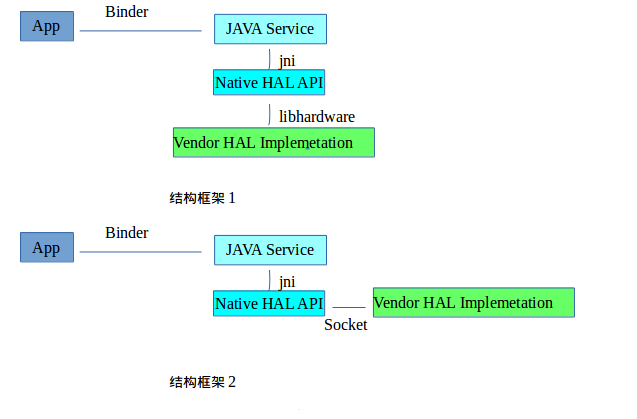
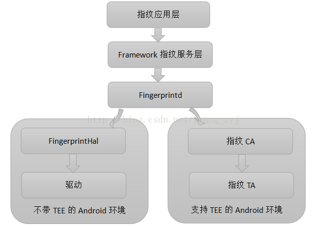
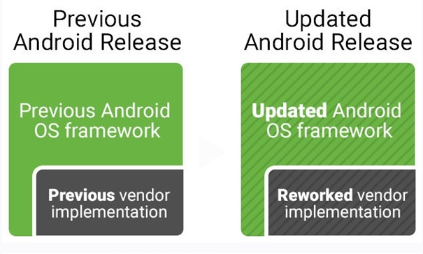
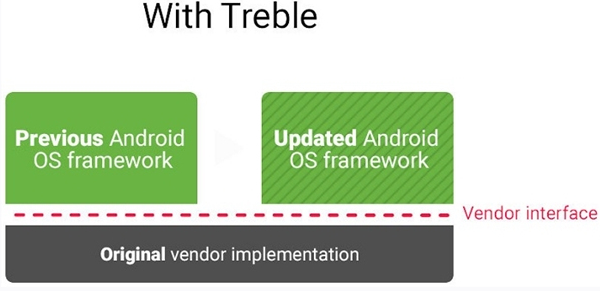
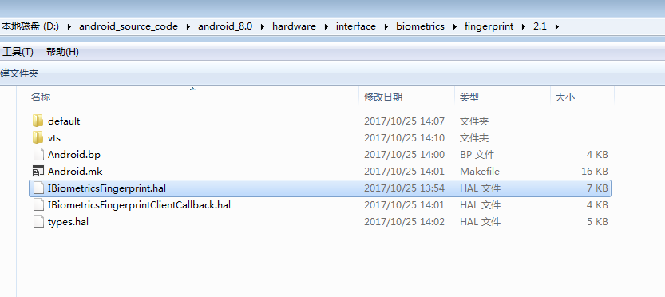
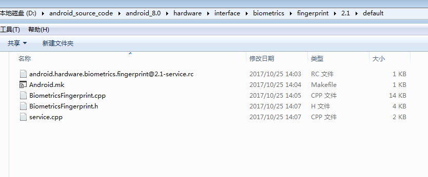

# Android O指纹识别
## 1.Project Treble（三层）
众所周知，Android 碎片化问题比较严重，新版本更新效率比较低，Google 为了解决此类问题，发布了 Project Treble 项目。Google 在Android O上，修改了框架.

Android O与之前的Android 版本相比，多出了一个`vendor.img`分区.在此之前的Android 系统架构当中，**Android Framework 与Android HAL是打包成一个system.img的**，而且`Framewor`与`HAL`之间是紧耦合的，通过`链接的方式`使用相应的硬件相关so库。

老版本的android 的系统框架当中framework与HAL之间的一般架构框架是:





**指纹应用层**，也就是手机上的指纹设置，这是Android系统层定义的指纹管理入口。

上面的框架结构中，Android framework跟Android HAL耦合度比较高，每次升级framework都需要升级对应的HAL，这个需要OEM厂商花费很大的精力。

上面的框架结构中，Android framework跟Android HAL耦合度比较高，每次升级framework都需要升级对应的HAL，这个需要OEM厂商花费很大的精力。 


Android O及之后的版本的框架：

在Android O以及以后的版本当中，Android 更新了框架，引入了一套叫`HIDL`的语言来定义Freamework与HAL之间的接口，新的架构如下图 


跟之前的版本相比，Android O使用HIDL 来解耦Android Framework 与Vendor HAL Implemetation之间的联系。Framework 跟HAL 会放在不同的分区下面，以往的版本HAL是跟Framework 放到system 分区，会被打包成system.img.而在Android O 上面，HAL是跟Framework 会放到不同的系统分区中，HAL会放到新的分区Vendor分区中，framework 还是在system分区中。这样就简化降低了Android 系统升级的影响与难度。



## 2.指纹启动流程分析

### 2.1 Android 6.0

1.`system/core/rootdir/init.rc`中启动`system/core/Fingerprintd`指纹的守护进程。

```
service fingerprintd /system/bin/fingerprintd
	class last_start
	user system
```

2.`fingerprint Hal`通过指纹厂商的驱动程序访问指纹硬件
在这一层，如果不在TEE中实现，则是指纹HAL层库，直接访问指纹硬件驱动。

目前Google要求指纹必须在TEE中实现，因此此处的HAL层也可以称之为`指纹CA`。

一般情况下，指纹CA代码会在如下目录:

```
/hardware/libhardware/include/hardware/fingerprint.h

/hardware/libhardware/modules/fingerprint
```
不同厂商的TEE系统，指纹厂商必须进行适配。

3.指纹TA
由于在TEE系统已经接管了指纹硬件SPI接口，因此指纹TA中封装了操作指纹函数接口。
那指纹驱动现在还有啥作用？

`\kernel-3.18\drivers\misc\mediatek\fingerprint\`:**主要是GPIO的设置以及设备服务操作等等**
### 2.2 Android O

1.`frameworks\base\services\core\java\com\android\server\fingerprint\FingerprintService.java`

```java
public sychronized IBiometricsFingerprint getFingerprintDaemon(){
	if(mDaemon == null){
		Slog.v(TAG,"mDaemon was null ,reconnect to fingerprint");
		try{
			mDaemon=IBiometricsFingerprint.getService();
		}catch(java.util.NoSuchElementException e){
			Slog.e(TAG,"failed to get biometric interface",e);
		}
		if(mDaemon == null){
			Slog.w(TAG,"fingerprint HIDL not availble");
			return null;
		}
		mDaemon.asBinder().linkToDeathe(this,0);
		try{
			mHalDeviceId=mDaemon.setNotify(mDaemonCallback);
		}catch(RemoteException e){
			Slog.e(TAG,"Failed to open fingerprint HAL",e);
			mDaemon = null;//try again later!
		}
		if(DEBUG)Slog.v(TAG,"Fingerprint HAL id:"+mHalDeviceId);
		if(mHalDeviceId !=0){
			loadAuthenticatorIds();
			updateActiveGroup(ActivityManager.getCurrnetUser(),null);
			doFingerprintCleanup(ActivityManager.getCurrentUser());
		}else{
			Slog.w(TAG,"Failed to open fingerprint HAL!");
			MetricsLogger.count(mContext,"fingerprintd_openhal_error",1);
			mDaemon = null;
		}
	}
	return mDaemon;
}
```

`mDaemon= IBiometricsFingerprint.getService();`这句就是获取类似AIDL中的，得到远程服务对象中的本地代码对象。**其实这个就是HIDL接口**，后边会讲到。我们先看下这个IBiometricsFingerprint接口是在哪里定义的，看下包名是在hardware 目录下，我们在此目录搜索

```
import android.hardware.biometrics.fingerprint.V2_1.IBiometricsFingerprint;
import android.hardware.biometrics.fingerprint.V2_1.IBiometricsFingerprintClientCallback;
```
会看到，代码结构如下图所示.
IBiometricsFingerprint.hal 就是我们上面要找到的接口。当然，这只是一个接口，我们需要找到具体的实现地方。在本目录中看到一个default文件夹。 




上面中看到，`BiometricsFingerprint.cpp`文件就是IBiometricsFingerprint接口的实现类。

`android.hardware.biometrics.fingerprint@2.1-service.rc`

```
service fps_hal /vendor/bin/hw/android.hardware.biometrics.fingerprint@2.1-service
# "class hal" causes a race condition on some devices due to files created
# in /data. As a workaround, postpone startup until later in boot once
# /data is mounted.
class late_start
user system
group system input
```
上面的rc文件，会启动fps_hal这个service。

```cpp
#include <android/log.h>
#include <hidl/HidlSupport.h>
#include <hidl/HidlTransportSupport.h>
#include <android/hardware/biometics/fingerprint/2.1/IBiometircsFingerprint.h>
#include <android/hardware/biometrics/fingerprint/2.1/types.h>
#include "BiometricsFingerprint.h"

using android::hardware::biometrics::fingerprint::V2_1::IBiometricsFingerprint;
using android::hardware::biometics::fingerprint::V2_1::implementation::BiometricsFingerprint;
using android::hardware::configRpcTrheadpool;
using android::sp;

int main(){
	android::sp<IBiometricsFingerprint> bio=BiometricsFingerprint::getInstance();
	configureRpcThreadpoll(1,true/*callerWiilJoin*/);
	if(bil !=null){
		bil->registerAsService();
	}else{
		ALOGE("Can't create instance of BiometricsFingerprint,nullptr");
	}
	joinRpcThreadpool();
	return 0;//should never get here
}
```
main函数中会把此service加入到serviceManager中。

`BiometricsFingerprint.cpp`文件，会在构造函数中去打开HAL, 
其他的地方跟android O之前的分析就是一样的。

```cpp
BiometricesFingerprint::BiometricsFingerprint():mClinetCallback(nullptr),mDevice(nullptr){
	sInstance=this;//keep track of the most recent instance
	mDevice=openHal();
	if(!mDevice){
		ALOGE("can't open HAL module");
	}
}
fingerprint_devive_t * BiometricsFingerprint::openHal(){
	int err;
	const hw_module_t *hw_mdl=nullptr;
	ALOGD("Opening fingerprint hal library ...");
	if(0!=(err=hw_get_module(FINGERPRINT_HARDWARE_MODULE_ID,&hw_mdl))){
		ALOGE("can't open fingerprint HW Modlue,error:%d",err);
		return nullptr;
	}
	if(hw_mdl == nullptr){
		ALOGE("No valid fingerprint module");
		return nullptr;
	}
	fingerprint_module_t const *module=reinterpret_cast<const fingerprint_module_t*>(hw_mdl);
	if(module->common.methods->open==nullptr){
		ALOGE("No valid open method");
		return nullptr;
	}
	hw_device_t *device=nullptr;
	if(0 !=(err=module->common.methods->open(hw_mdl,nullptr,&device))){
		ALOGE("can't open fingerprint methods,error:%d",err);
		return nullptr;
	}
	fingerprint_device_t * fp_device=reinterpret_cast<fingerprint_device_t *>(device);
	if(0 ！=(err=fp_device->set_notify(fp_device,BiometricsFingerprint::notify))){
		ALOGE("Can't register fingerprint module callback ,error:%d",err);
		return nullptr;
	}
	return fp_device;
}

```

# 3.总结

* 1.android O去掉了之前版本中的fingerprintd
* 2.fingerprintService.java调用了HIDL接口，HIDL接口的实现类可以由指纹厂家自行去实现
* 3.其他没有变化