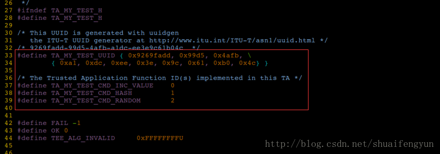

# 1.OP-TEE中添加自己的TA和CA
OP-TEE中添加自有的TA和CA程序，并使其运行起来。在 搭建完成qemu+OP-TEE的环境之后，开始着手添加自有的TA和CA程序。

### 1.1源代码及相关目录准备
`第一步`，为方便操作，首先复制hello_world目录为my_test


`第二步`，修改`my_test/ta`目录中的Makefie并添加自有的**TA部分**的代码,我修改之后的目录文件如下


上述目录文件说明如下：

* `Makefile文件`：编译TA时使用的makefile文件
* * `sub.mk文件`：定义该TA中需要被编译的source code。
* `my_test.c文件`：主要是存放**TA部分代码的入口处理函数**，CA的commond请求最终会被TA_InvokeCommandEntryPoint函数处理。
* `my_test_handle.c文件`：存放具体响应CA的commond请求的功能函数
* `user_ta_header_defines.h文件`：定义UUID等相关宏
* `include/my_test_handle.h文件`：定义了该TA需要使用到的类型
* `include/my_test_ta.h文件`：定义了UUID的宏以及与CA对应的commond ID宏

### 2.修改TA目录中的代码和makefile

1.修改sub.mk文件，将该TA中所有的.c文件添加到编译文件总，修改完成之后如下图所示：


2.定义`UUID值`和`commond ID的值`

编译`include/my_test_ta.h`文件，定义该TA程序的UUID宏为`TA_MY_TEST_UUID`,并定义`commond ID`的宏（**宏的值必须保持与CA部分的commond ID一致**），UUID的值可以自己填写也可以从一下网址中生成：[自动生成宏](http://www.itu.int/en/ITU-T/asn1/Pages/UUID/uuids.aspx)



3.修改`user_ta_header_defines.h`文件
将my_test_ta.h文件`include到`该文件中以便获取UUID的定义


4.修改Makefile文件
修改Makefile文件，将变量`BINARY`的值修改成新增TA的`UUID`值.

```makefile
CFG_TEE_TA_LOG_LEVEL?=4
CPPFLAGS+=-DCFG_TEE_TA_LOG_LEVEL=$(CFG_TEE_TA_LOG_LEVEL)

#The UUID for the Trusted Application
BINARY=9269fadd-99d5-4afb-a1dc-ee3e9c61b04c
include $(TA_DEV_KIT_DIR)/mk/ta_dev_kit.mk
```
5.添加该TA需要处理的逻辑代码

添加TA的具体实现代码，也即是该TA需要实现什么功能，在本例子中将该部分的代码存放在`my_test_handle.c`文件中


# 3.CA部分代码的修改和编写
1.CA部分的代码存放在`my_test/host`目录中，文件结构体如下：


* `main.c文件`：该文件就是在linux中调用CA可执行文件的主函数存在的文件
* `my_test_ca.h文件`：定义相关宏和申明接口，主要包括`UUID`,`commondID`值以及其他结构体
* `Makefile文件`：编译CA可执行文件使用的makefile文件

2.修改Makefile,主要修改`BINARY变量`和`OBJ变量`，如果CA部分的代码不止一个`.c`文件，则需要将所有的`.c`文件编译生成的`.o`文件名称添加到`OBJS`变量中，而`BINARY`变量就是编译完成之后生成的Binary的名称。本例子修改后的结果如下：


# 4.尝试编译TA和CA代码

在my_test目录下有一个`build_ta_mytest_qemu.sh`文件，执行该脚本就能直接单独编译TA和CA的代码，该脚本与helloworld目录中的build_ta_hello_world.sh一样。

修改完my_test目录下的代码之后，在my_test目录下运行`build_ta_mytest_qemu.sh`脚本，如果有错误则按照提示进行修改。执行完成之后，在ta目录下就会生成对应的`ta image`文件


# 5..将TA image和CA binary集成到rootfs和全局的makefile中
该步骤需要修改`build/common.mk`文件和`build/quem.mk`文件

1.修改`build/common.mk`文件
将`TAimage`和`CA binary`集成到fs中需要修改`file-tee-common`目标的内容（该目标主要用来生成启动时的文件脚本）修改如下：


添加my_test的依赖目标：


定义my_test目标需要的路径变量:


2.修改build/qemu.mk文件，添加该TA模块的targe编译目标


# 6.将添加的TA和CA编译到整个工程中
　修改完成之后，在build目录下直接执行`make all`(执行该编译需要将Makefile链接成qemu.mk)，或者执行`make -f qemu.mk all`

# 7.完成运行和测试添加的TA和CA

在build目录下运行`make run-only`或者`make -f qemu.mk run-only`。然后按照上一章节启动qemu并运行`linux`和`OP-TEE`，在启动的`Linux terminal`端直接执行`my_test`的相关指令就行，最终结果如下：

