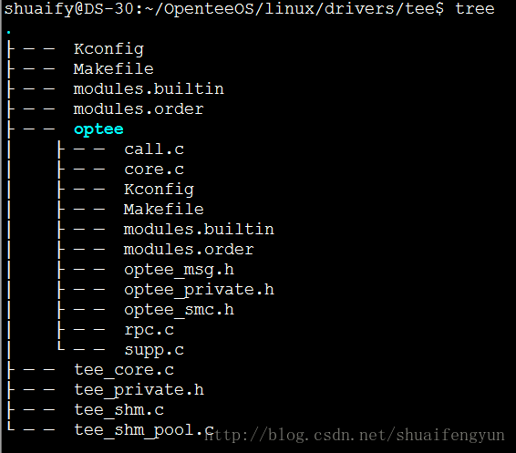
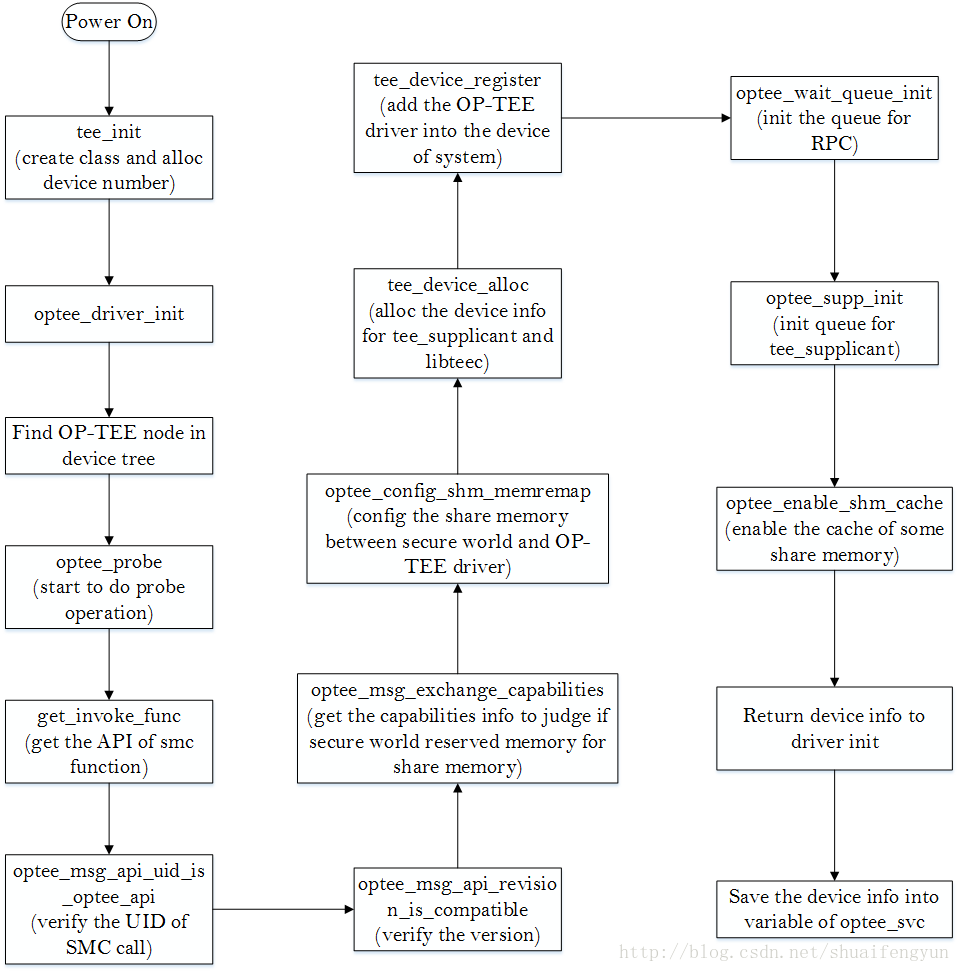

**OP-TEE驱动主要作用**是REE与TEE端进行数据交互的桥梁作用。`tee_supplicant`和`libteec`调用接口之后几乎都会首先通过系统调用陷入到kernel space，然后kernel根据传递的参数找到OP-TEE驱动，并命中驱动的operation结构体中的具体处理函数来完成实际的操作，对于OP-TEE驱动，一般都会触发`SMC`调用，并带参数进入到ARM cortex的monitor模式，在monitor模式中对执行normal world和secure world的切换，待状态切换完成之后，会将驱动端带入的参数传递給OP-TEE中的thread进行进一步的处理。OP-TEE驱动的源代码存放在`linux/drivers/tee`目录中，其内容如下：



# 1.OP-TEE驱动的加载
OP-TEE驱动的加载过程分为两部分:

* 第一部分是`创建class`和`分配设备号`
* 第二部分就是probe过程。

在正式介绍之前首先需要明白两个linux kernel中加载驱动的函数：`subsys_initcall`和`module_init`函数。OP-TEE驱动的第一部分是调用subsys_initcall函数来实现，而第二部分则是调用module_init来实现。整个OP-TEE驱动的初始化流程图如下图所示：



## 1.1  OP-TEE驱动模块的编译后的存放位置和加载过程

OP-TEE驱动通过subsys_initcall和module_init宏来告知系统在初始化的什么时候去加载OP-TEE驱动，subsys_initcall定义在`linux/include/init.h`文件中，内容如下：

```cpp
#define __define_initcall(fn, id) \
	static initcall_t __initcall_##fn##id __used \
	__attribute__((__section__(".initcall" #id ".init"))) = fn;
 
#define core_initcall(fn)		__define_initcall(fn, 1)
#define core_initcall_sync(fn)		__define_initcall(fn, 1s)
#define postcore_initcall(fn)		__define_initcall(fn, 2)
#define postcore_initcall_sync(fn)	__define_initcall(fn, 2s)
#define arch_initcall(fn)		__define_initcall(fn, 3)
#define arch_initcall_sync(fn)		__define_initcall(fn, 3s)
#define subsys_initcall(fn)		__define_initcall(fn, 4)
#define subsys_initcall_sync(fn)	__define_initcall(fn, 4s)
#define fs_initcall(fn)			__define_initcall(fn, 5)
#define fs_initcall_sync(fn)		__define_initcall(fn, 5s)
#define rootfs_initcall(fn)		__define_initcall(fn, rootfs)
#define device_initcall(fn)		__define_initcall(fn, 6)
#define device_initcall_sync(fn)	__define_initcall(fn, 6s)
#define late_initcall(fn)		__define_initcall(fn, 7)
#define late_initcall_sync(fn)		__define_initcall(fn, 7s)

```
使用subsys_initcall宏定义的函数最终会被编译到`.initcall4.init`段中，linux系统在启动的时候会执行`initcallx.init`段中的所有内容，而使用`subsys_initcall`宏定义段的执行优先级为4.

`module_init`的定义和相关扩展在`linux/include/linux/module.h`文件和`linux/include/linux/init.h`中，内容如下：

```cpp
#define device_initcall(fn)		__define_initcall(fn, 6)
#define __initcall(fn) device_initcall(fn)
#define module_init(x)  __initcall(x);
```
由此可见，使用module_init宏构造的函数将会在编译的时候被编译到`initcall6.init`段中，该段在linux系统启动的过程中的优先等级为6.

结合上述两点看，在系统加载OP-TEE驱动的时候，首先**会执行OP-TEE驱动中使用subsys_init定义的函数**，然后再**执行使用module_init定义的函数**。在OP-TEE驱动源代码中使用`subsys_init`定义的函数为`tee_init`，使用`module_init`定义的函数为`optee_driver_init`。

## 1.2 tee_init函数初始化设备号和class
该函数定义在`linux/drivers/tee/tee_core.c`文件中，主要完成class的创建和设备号的分配，其内容如下：

```cpp
static int __init tee_init(void){
	int rc;
	//分配OP-TEE驱动的class
	tee_class=class_create(THIS_MODULE,"tee");
	if(IS_ERR(tee_class)){
		pr_err("couldn't create class \n");
		return PTR_ERR(tee_class);
	}
	//分配OP-TEE的设备号
	rc=alloc_chrdev_region(&tee_devt,0,TEE_NUM_DEVICES,"tee");
	if(rc){
		pr_err("failed to allocate char dev region\n");
		class_destory(tee_class);
		tee_class = NULL;
	}
	retrun rc;
}
```
`设备号`和`class`将会在驱动执行`probe`的时候被使用到

## 1.3 optee_driver_init函数执行
linux启动过程中会执行moudule_init宏定义的函数，在OP-TEE驱动的挂载过程中将会执行`optee_driver_ini`t函数，该函数定义在`linux/drivers/tee/optee/core.c`文件中，其内容如下：

```cpp
static int __init optee_driver_init(void){
	struct device_node* fw_np;
	struct device_node* np;
	struct optee* optee;
	
	//node is supposed to be below /firmware
	//从device tree查找到firmware的节点
	fw_np = of_find_node_by_name(NULL,"firmware");
	if(!fw_np)
		return -ENODEV;
	//匹配device tree 中firmware节点下为linaro，optee-tz内容的节点
	np= of_find_match_node(fw_np,optee_match);
	of_node_put(fw_np);
	if(!np)
		return -ENODEV;
	//使用查找到的节点执行OP-TEE驱动的probe操作
	optee= optee_probe(np);
	of_node_put(np);
	if(IS_ERR(optee))
		return PTR_ERR(optee);
	//保存初始化完成之后OP-TEE设备信息到optee_svc中，以备在卸载时使用
	optee_svc=optee;
	return 0;
}
```

# 2.OP-TEE驱动初始化时的probe操作
OP-TEE驱动在optee_driver_init函数来完成probe操作。该函数首先会通过`device tree`找到`OP-TEE驱动设备信息`，然后将获取到的信息传递給optee_probe函数执行probe操作。optee_probe函数内容如下：

```cpp
static struct optee *optee_probe(struct device_node *np){
	optee_invoke_fn *invoke_fn;
	struct tee_shm_pool* pool;
	struct optee* optee=NULL;
	void *memremaped_shm=NULL;
	struct tee_device* teedev;
	u32 sec_caps;
	int rc;
	
	//获取OP-TEE驱动在device tree中及节点描述内容中的定义的执行切换到monitor模式的接口
	invoke_fn = get_invoke_func(np);
	if(IS_ERR(invoke_fn))
		return (void* )invoke_fn;
	//调用到secure world中获取API版本信息是否匹配
	if(!optee_msg_api_uid_is_optee_api(invoke_fn)){
		pr_warn("api uid mismatch \n");
		return ERR_PTR(-EINVAL);
	}
	//调用到secure world中获取版本信息是否匹配
	if(!optee_msg_api_revision_is_compatible(invoke_fn)){
		pr_warn("api revision mismatch \n");
		return ERR_PTR(-EINVAL);
	}
	//调用到secure world 中获取secure world是否reserved shared memory
	if(!optee_msg_exchange_capbilities(invoke_fn,&sec_caps)){
		pr_warn("capabilities mismatch\n");
		return ERR_PTR(-EINVAL);
	}
	//we have no other option for shared memory,if secure world 
	//doesn't have any reserved memory we can use we can't continue
	//判断secure world中是否reserve了share memory，如果没有则报错
	if(!(sec_caps & OPTEE_SMC_CAP_HAVE_RESERVED_SHM)){
		return ERR_PTR(-EINVAL);
	}
//配置secure world 与驱动之间的shared memory,并进行地质映射到建立共享内存池
	pool= optee_config_shm_memremap(invoke_fn,&memremaped_shm);
	if(IS_ERR(pool)){
		return (void* )pool;
	}
//在kernel space内存空间中分配一块内存用于存放OP-TEE驱动的结构体变量
	optee = kzalloc(sizeof(*optee),GFP_KERNEL);
	if(!optee){
		rc=-ENOMEM;
		goto err;
	}
//将驱动用于实现进入monitor模式的接口赋值到optee结构体中的invoke_fn成员中
	optee->invoke_fn= invoke_fn;
//分配设备信息，填充libteec使用的驱动文件信息和operation结构体
//并创建/dev/tee0文件，libteec将会使用该文件来实现op-tee驱动
	teedev=tee_device_alloc(&optee_desc,NULL,pool,optee);
	if(IS_ERR(teedev)){
		rc=PTR_ERR(teedev);
		goto err;
	}
	
	//libteec使用的驱动文件信息填充到optee中的teedev的成员中
	//分配设备信息，填充被tee_supplicant使用的驱动文件信息和operation结构体并创建
	//到dev/teepri0文件，tee_supplicant将会使用该文件使用op-tee驱动
	teedev=tee_device_alloc(&optee_supp_desc,NULL,pool,optee);
	if(IS_ERR(teedev)){
		rc=PTR_ERR(teedev);
		goto err;
	}
//将tee_supplicant使用的驱动文件信息填充到optee中的supp_teedev成员中
	optee->supp_teedev=teedev;
//将被libteec使用的设备信息注册到系统设备中
	rc=tee_device_register(optee->teedev);
	if(rc)
		goto err;
//将被tee_supplicant 使用的设备信息注册到系统设备中
	tc=tee_device_register(optee->supp_teedev);
	if(rc)
		goto err;
	mutex_init(&optee->call_queue.mutex);
	INIT_LIST_HEAD(&optee->call_queue.waiters);
//初始化RPC操作队列
	optee_wait_queue_init(&optee->wait_queue);
//初始化被tee_supplicant用到的用于存放来自TA的请求队列
	optee_supp_init(&optee->supp);
//填充optee中的共享内存信息和共享内存池信息成员
	optee->memremaped_shm=memremaped_shm;
	optee->pool=pool;
//使能共享内存的cache
	optee_enable_shm_cache(optee);
	ptr_info("initialized driver\n");
	return optee;
err:
	if(optee){
		//tee_device_unregister() is safe to call even if the
		//devices hasn't been registered with tee_device_register() yet
		tee_device_unregister(optee->supp_teedev);
		tee_device_unregister(optee->teedev);
		kfree(optee);
	}
	if(pool)
		tee_shm_pool_free(pool);
	if(memremaped_shm)
		memunmap(memremaped_shm);
	return ERR_PTR(rc);
}
```

## 2.1获取切换到monitor模式的接口
normal world穿透到secure world是通过在monitor模式下设定`SCR寄存器`中的`NS位`来实现的，OP-TEE驱动被上层调用时，最终会通过出发`smc`切换到monitor，见数据发送给secure world来进行处理。而用户出发smc请求的接口函数将在驱动初始化的时候被填充到OP-TEE驱动的device info中，在OP-TEE驱动中通过调用get_invoke_func函数来获取，该函数的内如如下：

```cpp
static optee_invoke_fn *get_invoke_func(struct device_node*np){
	const char*method;
	pr_info("probing for conduit method from DT.\n");
//获取op-tee驱动在device tree中的节中method属性的值
	if(of_property_read_string(np,"method",&methodd)){
		pr_warn("missing \"method\" property\n");
		return ERR_PTR("-ENXIO");
	}
//判定op-tee驱动是使用smc的方式还是使用hvc的方式来实现进入monitor模式的操作，
//根据method的值与hvc还是smc匹配来决定那种切换方法，并将用于切换到monitor的接口
	if(!strcmp("hvc",method))
		return optee_smccc_hvc;
	else if(!strcmp("smc",method))
		return optee_smccc_smc;
	
	pr_warn("invalid \"method\" property:%s\n",method);
	return ERR_PTR(-EINVAL);
}
```
以`optee_smccc_smc`为例，该函数的内容如下：

```cpp
static void optee_smcc_smc(unsigned long a0,unsigned long a1,
	unsigned long a2,unsinged long a3,
	unsinged long a4,unsinged long a4,
	unsinged long a4,unsinged long a5,
	unsinged long a6,unsinged long a7,
	struct arm_smccc_res* res){
	arm_smccc_smc(a0,a1,a2,a3,a4,a5,a6,a7,res);
}
```

也即是函数get_invoke_func执行完成之后会返回arm_smccc_smc函数的地址。arm_smccc_smc函数就是驱动用来将cortex切换到monitor模式的函数，该函数是以汇编的方式编写，定义在`linux/arch/arm/kernel/smccc-call.S`文件中。如果是64位系统，则该函数定义在`linux/arch/arm64/kernel/smccc-call.S`目录中，本文以32位系统为例，该函数内容如下：


```asm
//wrap cmacros in asm macros to delay expansion until after the 
//SMCCC asm macro is expanded
/*SMC_SMC宏，触发smc*/
	.macro SMCCC_SMC
	__SMC(0)
	.endm

/*SMCCC_HVC宏，触发hvc*/
	.macro SMCCC_HVC
	__HVC(0)
	.endm

/*定义SMCCC宏，其参数为instr*/
	.mac SMCCC instr
UNWIND( .fnstart) //将normal world中的寄存器入栈，保存现场
	mov r12,sp
	push {r4-r7}
UNWIND( .save {r4-r7})
	ldm r12,{r4-r7}
	\instr   //执行instr参数的内容，即执行smc切换
	pop {r4-r7}   //出栈操作，恢复现场
	ldr r12,[sp,#(4 * 4)]
	stm r12,{r0-r3}
	bx lr
UNWIND( .fnend)
	.endm

ENTRY(arm_smccc_smc)
	SMCCC SMCCC_SMC
ENDPROC(arm_smccc_smc)
```

## 2.2校验API的UID和OP-TEE的版本信息

驱动加载过程中获取到REE与TEE之间进行交互的接口函数(调用get_invoke_func函数返回的函数地址)之后，op-tee驱动会对API的UID和版本信息进行校验。上述操作是通过调用`optee_msg_api_uid_is_optee_api`函数和`optee_msg_api_revision_is_compatible`函数来实现的。两个函数的内容如下：

```cpp
static pool optee_msg_api_uid_is_optee_api(optee_invoke_fn* invoke_fn)
{
	struct arm_smccc_res res;
//调用执行smc操作的接口函数，带入的common ID 为OPTEE_SMC_CALLS_UID
	invoke_fn(OPTEE_SMC_CALLS_UID,0,0,0,0,0,0,0,&res);
//比较返回的UID的值与子啊驱动中定义的UID的值是否匹配
	if(res.a0==OPTEE_MSG_UID_0 && res.a1 == OPTEE_MSG_UID_1 && 
		res.a2 == OPTEE_MSG_UID_2 && res.a3 == OPTEE_MSG_UID_3){
			return true;
	}
	return false;
}
static bool optee_msg_api_revision_is_compatible(optee_invoke_fn *invoke_fn){
	union{
		struct arm_smccc_res smccc;
		struct optee_smc_calls_revision_result result;
	} res;
//调用执行smc操作的接口函数，带入的commond ID为OPTEE_SMC_CALLS_REVISION
	invoke_fn(OPTEE_SMC_CALLS_REVISON,0,0,0,0,0,0,0,&res.smccc);
//比较返回的版本信息的值与驱动中定义的版本值是否匹配
	if(res.result.major == OPTEE_MSG_REVISON_MAJOR &&
		(int)res.result.minor >= OPTEE_MSG_REVISON_MINOR)
		return true;
	return false;
}
```

## 2.3 判定secure world是否预留了驱动与secure world之间的共享内存空间
`驱动`与`secure world`之间需要进行数据的交互，而进行数据交互则**需要一定的共享内存**来保存sercure world和驱动之间共有的数据。所以在驱动初始化的时候需要检查该共享内存空间是否被预留出来。通过获取secure world中的`相关变量的值`并判定该flag是否相等来判定secure world是否预留了共享内存空间，在OP-TEE OS启动的时候，执行`MMU初始化`的时候会初始化该变量。在驱动端通过调用`optee_msg_exchange_capabilities`函数来获取该变量的值，其内容如下：

```cpp
static pool optee_msg_exchange_capabilities(optee_invoke_fn *invoke_fn,u32* sec_caps){
	union{
		struct arm_smccc_res smccc;
		struct optee_smc_exchange_capabilities_result result;
	} res;
	u32 a1=0;
//TODO this isn't enough to tell if it's UP system
//(from kernel point of view) or not,is_smp() returns the information needed,
//but can't be called directly from here
	if(!IS_ENABLED(CONFIG_SMP) || nr_cpu_ids ==1)
		a1 |=OPTEE_SMC_NSEC_CAP_UNIPROCESSOR;
//调用smc操作接口，获取secure world中的变量
	invoke_fn(OPTEE_SMC_EXCHANGE_CAPABILITES,a1,0,0,0,0,0,0,&res.smccc);
	if(res.result.status != OPTEE_SMC_RETURN_OK){
		return false;
	}
	//将返回值中的变量赋值为sec_caps
	*sec_caps = res.result.capabilities;
	return true;
}
```
当驱动获取到sec_caps的值之后会查看该值是否为宏`OPTEE_SMC_SEC_CAP_HAVE_RESERVED_SHM`定义的值`BIT(0)`，如果该值不为BIT(0)，则会报错，因为在secure world端都没有预留share memory空间，那驱动与secure world之间也就没法传输数据，所以有没有驱动也就没有必要了。
