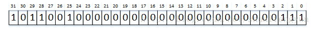
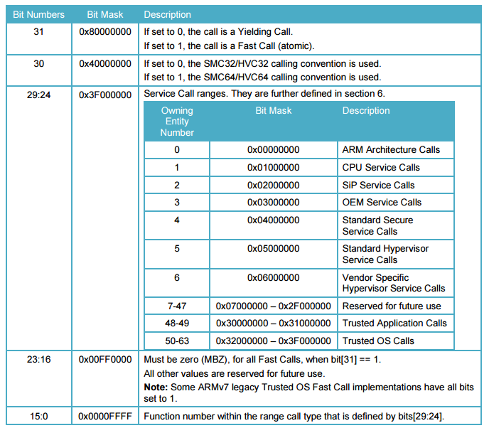

**驱动与secure world之间的数据交互是通过共享内存来完成的**，在OP-TEE启动的时候会将作为共享内存的物理内存块reserve出来，具体的可以查看OP-TEE启动代码中的core_init_mmu_map函数。在OP-TEE驱动初始化阶段会将reserve出来作为共享内存的物理内存配置成驱动的内存池，并且通知OP-TEE OS执行相同的动作。配置完成之后，secure world就能从共享内存中获取到来自于REE端的数据。

# 1.配置驱动与OP-TEE之间的共享内存
在驱动做probe操作时，会调用到`optee_config_shm_memremap`函数来完成OP-TEE驱动和OP-TEE之间共享内存的配置。该函数定义在`linux/drivers/tee/optee/core.c`文件中。其内容如下：

```cpp
static struct tee_shm_pool * optee_config_shm_memremap(optee_invoke_fn* invoke_fn,void **memreamped_shm){
	union{
		struct arm_smccc_res smccc;
		struct optee_smc_get_shm_config_result result;
	} res;
	struct tee_shm_pool* pool;
	unsinged long vaddr;
	phys_addr_t paddr;
	size_t size;
	phys_addr_t begin;
	phys_addr_t end;
	void *va;
	struct tee_shm_pool_mem_info priv_info;
	struct tee_shm_pool_mem_info dmabuf_info;

//调用smc类操作，通知OP-TEE OS返回被reserve出来的共享内存的物理地址和大小
	invoke_fn(OPTEE_SMC_GET_SHM_CONFIG,0,0,0,0,0,,&res.smccc);
	if(res.result.status != OPTEE_SMC_RETURN_OK){
		pr_info("shm service not avaliable \n");
		return ERR_PTR(-ENOENT);
	}
//判断是否提供secure world中的cache
	if(res.result.settings != OPTEE_SMC_SHM_CACHED){
		pr_err("only normal cached shared memory supported\n");
		return ERR_PTR(-EINVAL);
	}
//将对齐操作之后的物理内存块的起始地址赋值给paddr,该块内存的大小赋值给size
	begin =roundup(res.result.start,PAGE_SIZE);
	end=rounddown(res.result.start+res.result.size,PAGE_SIZE);
	paddr=begin;
	size=end - begin;
//判断作为共享内存的物理地址的大小是否大于两个page大小
//如果小于则报错，因为驱动配置用于dma操作和普通共享内训的大小分别为一个page大小
	if(size<2*OPTION_SHM_NUM_PRIV_PAGES*PAGE_SIZE){
		pr_err("too small shared memory area \n");
		return ERR_PTR(-EINVAL);
	}
//配置驱动私有内存空间的虚拟地址的启动地址，物理地址的起始地址以及大小，配置
//dma缓存的虚拟起始地址和物理地址以及大小。
//dmabuf与pribuf两个相邻，分贝为一个page的大小
	priv_info.vaddr=vaddr;
	priv_info.paddr=paddr;
	priv_info.size = OPTEE_SHM_NUM_PRIV_PAGES * PAGE_SIZE;
	dmabuf_info.vaddr=vaddr+OPTEE_SHM_NUM_PRIV_PAGES *PAGE_SIZE;
	dmabuf_info.paddr=paddr+OPTEE_SHM_NUM_PRIV_PAGES*PAGE_SIZE;
	dmabuf_info.size=size-OPTEE_SHM_NUM_PRIV_PAGES*PAGE_SIZE;
//将驱动的私有buffer和dma buffer天剑到内存池中，以便驱动在使用本身的alloc
//函数的时候能够从私有共享和dma buffer中分配内存来使用
	pool= tee_shm_pool_alloc_res_mem(&priv_info,&dmabuf_info);
	if(IS_ERR(pool)){
		memunmap(va);
		goto out;
	}
//将驱动与OP-TEE的共享内存赋值给memremaped_shm变量执行的地址
	*memremaped_shm=va;
out:
	return pool;//返回共享内存池的结构体
}
```
在secure world中reserve出来的内存块作为驱动与sercure world之间的共享内存使用。在**驱动端将会建立一个内存池**，**以便驱动在需要的使用通过调用驱动的alloc函数来完成共享内存的分配**。而共享内存池的建立是通过调用`tee_shm_pool_alloc_res_mem`来实现的。其函数内容如下：

```cpp
struct tee_shm_pool* tee_shm_pool_alloc_res_mem(struct tee_shm_pool_mem_info *priv_info,
	struct tee_shm_pool_mem_info *dmabuf_info){
	struct tee_shm_pool *pool=NULL;
	int ret;
//从内核空间的memory中分配一块用于存放驱动内存池结构体变量的内存
	pool = kzalloc(sizeof(*pool),GFP_KERNEL);
	if(!pool){
		ret = -ENOMEM;
		goto err;
	}
	//TODO create the pool for driver private shared memory
//调用pool相关函数完成内存池的创建，设定alloc的分配算法，并将私有化共享内存的
//其实虚拟地址，其实物理地址以及大小信息保存到私有共享内存池中
	ret = pool_res_mem_mgr_init(&pool->private_mgr,pri_info,3/*8 byte aligned*/);
	if(ret)
		goto err;
	
	//TODO create the pool for dma_buf shared memory
//调用pool相关函数完成内存池的创建，设定alloc时分配算法，并将dma共享内存的起始的
//虚拟地址，起始物理地址以及大小信息保存到dma的共享内存池中
	ret = pool_res_mem_mgr_init(&pool->dma_buf_mgr,dmabuf_info,PAGE_SHIFT);
	if(ret)
		goto err;
//设定销毁共享内存池的接口函数
	pool->destory = pool_res_mem_destory;
	return pool;//返回内存池结构体
err:
	if(ret == -ENOMEM)
		pr_err("%s:can't allocate memory for res_mem shared memory pool\n",__func__);
	if(pool && pool->private_mgr.private_data)
		gen_pool_destory(pool->private_mgr.private_data);
	kfree(pool);
	return ERR_PTR(ret);
}
```

# 2. 分配和设置OP-TEE驱动作为被libteec和tee_supplicant使用的设备信息结构体变量
在OP-TEE驱动做probe操作时会分配和设置两个tee_device结构体变量，分别用来表示被libteec和tee_supplicant使用的设备。分别通过调用`tee_device_alloc(&optee_desc, NULL, pool, optee)和tee_device_alloc(&optee_supp_desc, NULL, pool, optee)`来实现，主要是设置驱动作为被libteec和tee_supplicant使用的设备的具体操作和表示该设备对应的名称等信息

* 当**libteec调用**文件操作函数执行打开，关闭等操作`/dev/tee0`设备文件的时，其最终将调用到optee_desc中具体的函数来实现对应操作。
* 当**tee_supplicant调用文件**操作函数执行打开，关闭等操作`/dev/teepriv0`设备文件的时，其最终将调用到optee_supp_desc中具体的函数来实现对应操作。

上述配置操作都是通过调用tee_device_alloc函数来实现的，该函数内容如下：

```cpp
static tee_device* tee_device_alloc(const struct tee_desc *teedesc,struct device*dev,struct tee_shm_pool* pool,void *driver_data){
	struct tee_device* teedev;
	void *ret;
	int rc;
	int offs=0;

//参数检查
	if(!teedesc || !teedesc->name ||!teedesc->ops||
		!teedesc->ops->get_version || !teedesc->ops->open ||
		|| !teedesc->ops->release ||!pool){
		return ERR_PTR(-EINVAL);
	}
//从kernel space中分配用于存放tee_device变量的内存
	teedev=kzalloc(sizeof(*teedev),GFP_KERNEL);
	if(!teedev){
		ret=ERR_PTR(-ENOMEM);
		goto err;
	}
//判定当前分配的设备结构体是提供给libteec还是tee_supplicant,如果该设备时分配
//给tee_supplicant，则将offs设置成16，offs将会在用于设置设备的id时被使用 
	if(teedesc->flags & TEE_DESC_PRIVILEGED)
		offs = TEE_NUM_DEVICES /2;
//查找dev_mask中的从Offs开始的第一个为0的bit位，然后将该值作为设备的id值
	spin_lock(&driver_lock);
	teedev->id=find_next_zero_bit(dev_mask,TEE_NUM_DEVICES,offs);
	if(teedev->id<TEE_NUM_DEVICES)
		set_bit(teedev_id,dev_mask);
	spin_unlock();
//判断设定的设备id是否超出最大数
	if(teedev->id >= TEE_NUM_DEVICES){
		ret =ERR_PTR(-ENOMEM);
		goto err;
	}
// 组合出设备名，对于libteec来说，设备名为tee0。对于tee_supplicant来说，设备名为teepriv0
	snprintf(teedev->name, sizeof(teedev->name), "tee%s%d",
		 teedesc->flags & TEE_DESC_PRIVILEGED ? "priv" : "",
		 teedev->id - offs);
//设定设备的class,tee_class在tee_init函数中被分配。设定执行设备release的操作函数
   和dev.parent
	teedev->dev.class = tee_class;	
	teedev->dev.release = tee_release_device;
	teedev->dev.parent=dev;
//将设备的主设备号和设备ID组合后转化成dev_t类型 
	teedev->dev.devt=MKDEV(MAJOR(tee_devt),teedev->id);
//设置设备名，驱动被libteec使用时设备名为tee0,驱动被tee_supplicant使用时设备名为teepriv0
	rc = dev_set_name(&teedev->dev, "%s", teedev->name);
	if (rc) {
		ret = ERR_PTR(rc);
		goto err_devt;
	}
//设置驱动作为字符设备的操作函数接口，即指定该驱动在执行open,close, ioctl的函数接口
	cdev_init(&teedev->cdev, &tee_fops);
	teedev->cdev.owner = teedesc->owner;	//初始化字符设备的owner
	teedev->cdev.kobj.parent = &teedev->dev.kobj;	//初始化kobj.parent成员
//设置设备的私有数据
	dev_set_drvdata(&teedev->dev, driver_data);
//初始化设备
	device_initialize(&teedev->dev);
//1 as tee_device_unregister() does one final tee_device_put()
	teedev->num_users =1;//标记改设备可以被使用
	init_completion(&teedev->c_no_users);
	mutex_init(&teedev->mutex);
	idr_init(&teedev->idr);

//设定设备的desc成员，该成员包含设备最终执行具体操作的函数接口
	teedev->desc=teedesc;
//设置设备的内存池，主要是驱动与secure world之间共享内存的私有共享内存和dma操作共享内存
	teedev->pool = pool;
	return teedev;
err_devt:
	unregister_chrdev_region(teedev->dev.devt,1);
err:
	pr_err("could not register %s driver\n",teedesc->flags & TEE_DESC_PRIVILEGED?"privlieged":"client");
	if(teedev && teedev->id< TEE_NUM_DEVICES){
		spin_lock(&driver_lock);
		clear_bit(teedev->id,dev_mask);
		spin_unlock(&driver_lock);
	}
	kfree(teedev);
	return ret;
}
```

# 3.设备注册
完成版本检查，共享内存池配置，不同设备的配置之后就需要将这些配置好的设备注册到系统中去。对于被liteec和tee_supplicant使用的设备分别通过调用`tee_device_register(optee->teedev)`和`tee_device_register(optee->supp_teedev)`来实现。其中`optee->teedev`和`optee->supp_teedev`就是在上一章中被配置好的分别被libteec和tee_supplicant使用的设备结构体。调用`tee_device_register`函数来实现将设备注册到系统的目的，该函数内容如下：

```cpp
int tee_device_register(struct tee_device*teedev){
	int rc;
//判定设备是否已经被注册过
	if(teedev->flags & TEE_DEVICE_FLAG_REGISERED){
		dev_err(&teedev->dev,"attempt to register twice\n");
		return -EINVAL;
	}
//注册字符设备
	rc=cdev_add(&teedev->cdev,teedev->dev.devt,1);
	if(rc){
		dev_err(&teedev->dev,
			"unable to cdev_add() %s, major %d, minor %d, err=%d\n",
			teedev->name, MAJOR(teedev->dev.devt),
			MINOR(teedev->dev.devt), rc
		return rc;
	}
//将设备添加到linux的设备模块中,在该步中将会在/dev目录下创设备驱动文件节点，即对于
//被libteec使用的设备，在该步将创建/dev/tee0设备驱动文件。对于被tee_supplicant使用的设备，在该步将创建/dev/teepriv0设备文件
	rc=device_add(&teedev->dev);
	if(rc){
		dev_err(&teedev->dev,
			"unable to device_add() %s, major %d, minor %d, err=%d\n",
			teedev->name, MAJOR(teedev->dev.devt),
			MINOR(teedev->dev.devt), rc
			goto err_device_add;
	}
//在/sys目录下创建设备的属性文件
	rc=sysfs_create_group(&teedev->dev.kobj,&tee_dev_group);
	if(rc){
		dev_err(&teedev->dev,
			"failed to create sysfs attributes, err=%d\n", rc);
		goto err_sysfs_create_group;
	}
// 设定该设备以及被注册过
	teedev->flags |=TEE_DEVICE_FLAG_REGISTERED;
	return 0;
err_sysfs_create_group:
	device_del(&teedev->dev);
err_device_add:
	cdev_del(&teedev->cdev);
	return rc;
}
```

# 4.两个队列的建立
在OP-TEE驱动提供两个设备，分别被libteec使用的`/dev/tee0`和被tee_supplicant使用的`/dev/teepriv0`。为确保normal world与secure world之间数据交互便利和能在normal world端进行异步处理。OP-TEE驱动在挂载的时候会建立两个类似于消息队列的队列，用于保存normal world的请求数据以及secure world请求。**optee_wait_queue_init**用于初始化`/dev/tee0`设备使用的队列，**optee_supp_init**用于初始化`/dev/teepriv0`设备使用的队列。其代码分别如:

```cpp
void optee_wait_queue_init(struct optee_wait_queue* priv){
	mutex_init(&priv->mu);
	INIT_LIST_HEAD(&priv-db);
}

void optee_supp_init(struct optee_supp* supp){
	memset(supp,0,sizeof(*supp));
	mutex_init(&supp->mutex);
	init_comletion(&supp->reqs_c);
	idr_init(&supp->idr);
	INIT_LIST_HEAD(&supp-reqs);
	supp->req_id=-1;
}
```

# 6.通知OP-TEE使能一些共享内存的cache
当一切做完之后，最终就剩下**通知OP-TEE使能共享内存的cache**了，在驱动挂载过程中调用optee_enable_shm_cache函数来实现，该函数内容如下：

```cpp
void optee_enable_shm_cache(struct optee*optee){
	struct optee_call_waiter w;
	//we need to retry until secure world isn't busy
//确定secure world是否ready
	optee_cp_wait_init(&optee->call_queue,&w);
//进入loop循环，通知secure world执行相应操作，知道返回OK后跳出
	while(true){
		struct arm_smccc_res res;
//通知smc操作，通知secure world执行使能共享内存cache的操作
		optee->invoke_fn(OPTEE_SMC_ENABLE_SHM_CACHE,0,0,0,0,0,0,&res);
		if(res.a0 == OPTEE_SMC_RETURN_OK)
			break;
		optee_cq_wait_for_completion(&optee->call_queue,&w);
	}
	optee_cq_wait_final(&optee->call_queue,&w);
}
```

# 6.fast smc与std smc

在OP-TEE驱动的挂载过程中会使用fast smc的方式从OP-TEE中获取到相关数据，例如从secure world中获取reserve的共享内存信息时就是通过调用如下函数来实现的：

```c
invoke_fn(OPTEE_SMC_GET_SHM_CONFIG, 0, 0, 0, 0, 0, 0, 0, &res.smccc);
```
在支持smc操作的32位系统中该函数等价于:

```
arm_smccc_smc(OPTEE_SMC_GET_SHM_CONFIG, 0, 0, 0, 0, 0, 0, 0, &res.smccc);
```
而OPTEE_SMC_ENABLE_SHM_CACHE的定义如下：

```
#define OPTEE_SMC_FUNCID_GET_SHM_CONFIG 7

#define OPTEE_SMC_GET_SHM_CONFIG OPTEE_SMC_FAST_CALL_VAL(OPTEE_SMC_FUNCID_GET_SHM_CONFIG)
```
完全展开之`OPTEE_SMC_GET_SHM_CONFIG`宏的值的各个bit中的数值如下如所示：


在执行smc操作时，cortex会解读第一个参数中的相关位来决定进入到monitor模式后的相关操作，在ARM官方定义了第一个参数`(a0)`的定义如下


当bit31为1时，则表示进入monitor模式后会执行`fast smc`的中断处理函数，而在不带ATF的ARCH32中，monitor的中断向量表如下：

```asm
FUNC thread_vector_table , :
UNWIND( .fnstart)
UNWIND( .cantunwind)
	b vector_std_smc_entry
	b vector_fast_smc_entry
	b vector_cpu_on_entry
	b vector_cpu_off_entry
	b vector_cpu_resume_entry
	b vector_cpu_suspend_entry
	b vector_fiq_entry
	b vector_system_off_entry
	b vector_system_reset_entry
UNWIND( .fnend)
END_FUNC thread_vector_table
```
由此可以见:

* 驱动**挂载的时候**请求共享内存配置数据的请求将会被`vector_fast_smc_entry`处理。
* 当请求来自于CA的请求时，驱动会将第一个参数的`bi31`设置成`0`，也就是CA的请求会被`vector_std_smc_entry`进行处理

# 总结
OP-TEE的驱动的挂载过程来看，OP-TEE驱动会分别针对libteec和tee_supplicant建立不同的设备`/dev/tee0`和`/dev/teepriv0`。**并且为两个设备中的des执行各自独有的operation**，并建立类似消息队列来存放normal world与secure world之间的请求，这样libteec和tee_supplicant使用OP-TEE驱动的时候就能做到相对的独立。secure world与OP-TEE驱动之间使用共享内存进行数据交互。用于作为共享内存的物理内存块在OP-TEE启动的时做MMU初始化时需要被reserve出来，在OP-TEE挂载过程中需要将该内存块映射到系统内存中。
