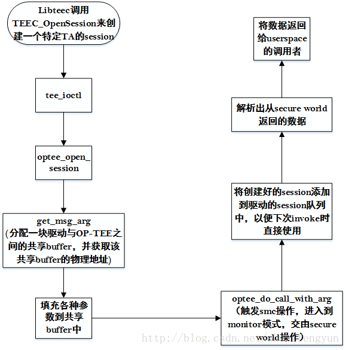

libteec提供给上层使用的接口总共有十个，这十个接口的功能和定义介绍请参阅《21. OP-TEE中TA与CA执行流程-------libteec介绍》，这十个接口通过系统调用最终会调用到驱动中，在接口libteec中调用Open函数的时候，在驱动中就对调用到file_operations结构体变量tee_fops中的Open成员。同理在libteec接口中调用ioctl函数，则在驱动中最终会调用tee_fops中的ioctl函数。本文将介绍驱动中file_operation结构体变量`tee_fops`中各成员函数的具体实现.

# 1.libteec和tee_supplicant执行Open操作
在libteec中调用open函数来打开`/dev/tee0`设备的时候，最终会调用到tee_fops中的open成员指定的函数指针tee_open，该函数的内容如下：

```cpp
static int tee_open(struct inode*inode,struct file*filp){
	struct tee_context *ctx;
//调用container_of函数，获取设备的tee_device变量的内容 。该变量对于/dev/tee0
//和/dev/teepriv0设备时不一样的，这点可以在驱动过载的过程中查阅
	ctx=teedev_open(container_of(inode->icdev,struct tee_device,cdev));
	if(IS_ERR(ctx)){
		return PTR_ERR(ctx);
	}
	filp->private_data=ctx;
	return 0;
}

static struct tee_context *teedev_open(struct tee_device* teedev){
	int rc;
	struct tee_context* ctx;
//标记该设备的使用者加一
	if(!tee_device_get(teedev))
		return ERR_PTR(-EINVAL);
//分配tee_context结构体空间
	ctx=kzalloc(sizeof(*ctx),GFP_KERNEL);
	if(!ctx){
		rc=-ENOMEM;
		goto err;
	}
//将tee_context结构体汇中teedev变量赋值
	ctx->teedev=teedev;
	INIT_LIST_HEAD(&ctx->list_shm);
//调用设备的des中的open执行设备几倍的open操作
	rc=teedev->desc->ops->open(ctx);
	if(rc)
		goto err;
	return ctx;
err:
	kfree(ctx);
	tee_device_put(teedev);
	return ERR_PTR(rc);
}
```
对于设备级别(`/dev/tee0`和`/dev/teepriv0`)，最终会调用到optee_open函数，该函数内容如下：

```cpp
static int optee_open(struct tee_context*ctx){
	struct optee_context_data* ctxdata;
	struct tee_device*teedev=ctx->teedev;
	struct optee* optee=tee_get_drvdata(teedev);
//分配optee_context_data 结构体变量空间
	ctxdata=kzalloc(sizeof(*ctxdata),GFP_KERNEL);
	if(!ctxdata)
		return -ENOMEM;
//通过teedev的值是否为 optee->supp_teedev，以此来判定当前的Open操作是打
//开/dev/tee0设备还是/dev/teepriv0设备，如果相等，则表示当前是打开/dev/teepriv0设备
	if(teedev == optee->supp_teedev){
		bool busy=true;//标记/dev/teepriv0正在使用
		mutex_lock(&optee->supp.mutex);
		if(!optee->supp.ctx){
			busy=false;
			optee->supp.ctx=ctx;
		}
		mutex_unlock(&optee->supp.mutex);
		if(busy){
			kfree(ctxdata);
			return -EBUSY;
		}
	}
//初始化互斥提队列
	mutex_init(&ctxdata->mutex);
	INIT_LIST_HEAD(&ctxdata->sess_list);
//赋值
	ctx->data=ctxdata;
	return 0;
}
```

# 2. libteec和tee_supplicant执行release操作
当在libteec和tee_supplicant打开了对应的设备之后，如果需要release设备，则可以调用该设备的release来实现，在userspace层面调用完成之后，最终会调用到OP-TEE驱动的release成员变量tee_release，该函数内容如下：

```cpp
static int tee_release(struct inode *inode, struct file *filp)
{
	teedev_close_context(filp->private_data);
	return 0;
}
static void teedev_close_context(struct tee_context *ctx)
{
	struct tee_shm *shm;
 
/* 调用/dev/tee0或者是/dev/teepriv0设备的release操作函数 */
	ctx->teedev->desc->ops->release(ctx);
	mutex_lock(&ctx->teedev->mutex);
/* 清空设备分配的共享内存，并将其指针指向NULL */
	list_for_each_entry(shm, &ctx->list_shm, link)
		shm->ctx = NULL;
	mutex_unlock(&ctx->teedev->mutex);
	tee_device_put(ctx->teedev); //设备使用者数量减一，如果已经没有使用者则将desc指向NULL
	kfree(ctx);
}
```
`ctx->teedev->desc->ops->release(ctx);`将会执行optee_release函数，其内容如下：

```cpp
static void optee_release(struct tee_context *ctx)
{
	struct optee_context_data *ctxdata = ctx->data;
	struct tee_device *teedev = ctx->teedev;
	struct optee *optee = tee_get_drvdata(teedev);
	struct tee_shm *shm;
	struct optee_msg_arg *arg = NULL;
	phys_addr_t parg;
	struct optee_session *sess;
	struct optee_session *sess_tmp;
 
	if (!ctxdata)
		return;
 
/* 分配驱动与secure world之间的共享内存 */
	shm = tee_shm_alloc(ctx, sizeof(struct optee_msg_arg), TEE_SHM_MAPPED);
	if (!IS_ERR(shm)) {
		arg = tee_shm_get_va(shm, 0); //获取共享内存的虚拟地址
		/*
		 * If va2pa fails for some reason, we can't call
		 * optee_close_session(), only free the memory. Secure OS
		 * will leak sessions and finally refuse more sessions, but
		 * we will at least let normal world reclaim its memory.
		 */
		if (!IS_ERR(arg))
			tee_shm_va2pa(shm, arg, &parg); //解析共享内存的虚拟地址得到物理地址，存放在parg中
	}
 
/*遍历存放使用该设备的所有session通知secure worldOP-TEE执行关闭session操作*/
	list_for_each_entry_safe(sess, sess_tmp, &ctxdata->sess_list,
				 list_node) {
		list_del(&sess->list_node);
		if (!IS_ERR_OR_NULL(arg)) {
			memset(arg, 0, sizeof(*arg));
			arg->cmd = OPTEE_MSG_CMD_CLOSE_SESSION;
			arg->session = sess->session_id;
			optee_do_call_with_arg(ctx, parg);
		}
		kfree(sess);
	}
	kfree(ctxdata);
 
/* 释放共享内存 */
	if (!IS_ERR(shm))
		tee_shm_free(shm);
 
	ctx->data = NULL;
 
/* 如果是对/dev/teepriv0设备进行release操作，则指向optee_supp_release操作，释放该设
备在使用的时候建立的各种队列 */
	if (teedev == optee->supp_teedev)
		optee_supp_release(&optee->supp);
}
```

# 3. libteec和tee_supplicant中执行ioctl操作
在libteec中获取OP-TEE版本信息，创建和关闭session，调用TA，分配和注册共享内存和fd以及释放共享内存，接收来自OP-TEE的请求以及回复数据给OP-TEE都是通过ioctl来完成的。在libteec和tee_supplicant中通过带上对应的参数调用ioctl函数来实现对应的操作需求，最终会调用到OP-TEE驱动中file_operation结构体变量tee_fops变量中的tee_ioctl函数，该函数的内容如下：

```cpp
static long tee_ioctl(struct file *filp, unsigned int cmd, unsigned long arg)
{
	struct tee_context *ctx = filp->private_data;	//获取设备的私有数据
	void __user *uarg = (void __user *)arg; 	//定义指向userspace层面输入参数的指针变量
 
	switch (cmd) {
/* 和获取OP-TEE OS的版本 */
	case TEE_IOC_VERSION:
		return tee_ioctl_version(ctx, uarg);
 
/* 分配,注册，释放共享内存操作 */
	case TEE_IOC_SHM_ALLOC:
		return tee_ioctl_shm_alloc(ctx, uarg);
 
/* 注册共享文件句柄 */
	case TEE_IOC_SHM_REGISTER_FD:
		return tee_ioctl_shm_register_fd(ctx, uarg);
 
/* 打开CA与TA通信的session */
	case TEE_IOC_OPEN_SESSION:
		return tee_ioctl_open_session(ctx, uarg);
 
/* 调用TA,让根据参数中的command ID让TA执行特定的command */
	case TEE_IOC_INVOKE:
		return tee_ioctl_invoke(ctx, uarg);
 
/* 通知TA取消掉对某一个来自normal world请求的响应 */
	case TEE_IOC_CANCEL:
		return tee_ioctl_cancel(ctx, uarg);
 
/* 关闭CA与TA之间通信的session */
	case TEE_IOC_CLOSE_SESSION:
		return tee_ioctl_close_session(ctx, uarg);
 
/* 接收来自secure world的请求 */
	case TEE_IOC_SUPPL_RECV:
		return tee_ioctl_supp_recv(ctx, uarg);
 
/* 根据来自secure world的请求执行处理后回复数据给secure world */
	case TEE_IOC_SUPPL_SEND:
		return tee_ioctl_supp_send(ctx, uarg);
	default:
		return -EINVAL;
	}
}
```

## 3.1 获取OP-TEE版本信息
当libteec和tee_supplicant调用ioctl来获取OP-TEE OS的版本信息时，驱动会执行tee_ioctl_version函数，该函数内容如下：

```cpp
static int tee_ioctl_version(struct tee_context *ctx,
			     struct tee_ioctl_version_data __user *uvers)
{
	struct tee_ioctl_version_data vers;
 
/* 调用设备的get_version操作 */
	ctx->teedev->desc->ops->get_version(ctx->teedev, &vers);
 
/* 判定该操作是来至于tee_supplicant还是libteec */
	if (ctx->teedev->desc->flags & TEE_DESC_PRIVILEGED)
		vers.gen_caps |= TEE_GEN_CAP_PRIVILEGED;
 
/* 将获取到的版本信息数据拷贝到userspace层面提供的buffer中 */
	if (copy_to_user(uvers, &vers, sizeof(vers)))
		return -EFAULT;
 
	return 0;
}
```
而设备的`get_version`的内容如下：

```cpp
static void optee_get_version(struct tee_device *teedev,
			      struct tee_ioctl_version_data *vers)
{
	struct tee_ioctl_version_data v = {
		.impl_id = TEE_IMPL_ID_OPTEE,
		.impl_caps = TEE_OPTEE_CAP_TZ,
		.gen_caps = TEE_GEN_CAP_GP,
	};
	*vers = v;
}
```

## 3.2 分配和注册共享内存操作
当libteec和tee_supplicant需要分配和注册于secure world之间的共享内存时，可以通过调用驱动的ioctl方法来实现，然后驱动调用tee_ioctl_shm_alloc来实现具体的分配，注册共享内存的操作。该函数的内容如下：

```cpp
static int tee_ioctl_shm_alloc(struct tee_context *ctx,
			       struct tee_ioctl_shm_alloc_data __user *udata)
{
	long ret;
	struct tee_ioctl_shm_alloc_data data;
	struct tee_shm *shm;
 
/* 将userspace传递的参数数据拷贝到kernel的buffer中 */
	if (copy_from_user(&data, udata, sizeof(data)))
		return -EFAULT;
 
	/* Currently no input flags are supported */
	if (data.flags)
		return -EINVAL;
 
/* 将共享内存的ID值设置成-1,以便分配好共享内存之后重新赋值 */
	data.id = -1;
 
/* 调用tee_shm_all函数，从驱动与secure world之间的共享内存池中分配对应大小的内存，
并设定对应的ID值 */
	shm = tee_shm_alloc(ctx, data.size, TEE_SHM_MAPPED | TEE_SHM_DMA_BUF);
	if (IS_ERR(shm))
		return PTR_ERR(shm);
 
/* 设定需要返回给userspace的数据 */
	data.id = shm->id;
	data.flags = shm->flags;
	data.size = shm->size;
 
/* 将需要返回的数据从kernespace拷贝到userspace层面 */
	if (copy_to_user(udata, &data, sizeof(data)))
		ret = -EFAULT;
	else
		ret = tee_shm_get_fd(shm);
 
	/*
	 * When user space closes the file descriptor the shared memory
	 * should be freed or if tee_shm_get_fd() failed then it will
	 * be freed immediately.
	 */
	tee_shm_put(shm); //如果分配的是DMA的buffer则要减少count值
	return ret;
}
```
而在tee_shm_all中驱动做了什么操作呢？该函数的内容如下：

```cpp
struct tee_shm *tee_shm_alloc(struct tee_context *ctx, size_t size, u32 flags)
{
	struct tee_device *teedev = ctx->teedev;
	struct tee_shm_pool_mgr *poolm = NULL;
	struct tee_shm *shm;
	void *ret;
	int rc;
 
/* 判定参数是否合法 */
	if (!(flags & TEE_SHM_MAPPED)) {
		dev_err(teedev->dev.parent,
			"only mapped allocations supported\n");
		return ERR_PTR(-EINVAL);
	}
 
/* 判定flags，表明该操作只能从驱动的私有共享呢村或者DMA buffer中进行分配 */
	if ((flags & ~(TEE_SHM_MAPPED | TEE_SHM_DMA_BUF))) {
		dev_err(teedev->dev.parent, "invalid shm flags 0x%x", flags);
		return ERR_PTR(-EINVAL);
	}
 
/* 获取设备结构体 */
	if (!tee_device_get(teedev))
		return ERR_PTR(-EINVAL);
 
/* 判定设备的poll成员是否存在，该成员在驱动挂载的时候会被初始化成驱动与secure world
之间的共享内存池结构体 */
	if (!teedev->pool) {
		/* teedev has been detached from driver */
		ret = ERR_PTR(-EINVAL);
		goto err_dev_put;
	}
 
/* 分配存放shm的kernel空间的内存 */
	shm = kzalloc(sizeof(*shm), GFP_KERNEL);
	if (!shm) {
		ret = ERR_PTR(-ENOMEM);
		goto err_dev_put;
	}
 
/* 设定该块共享内存的flag以及对应的使用者 */
	shm->flags = flags;
	shm->teedev = teedev;
	shm->ctx = ctx;
 
/* 通过传入的flags来判定是从驱动的私有共享内存池还是工dma buffer中来进行分配 */
	if (flags & TEE_SHM_DMA_BUF)
		poolm = &teedev->pool->dma_buf_mgr;
	else
		poolm = &teedev->pool->private_mgr;
 
/* 调用pool中对应的alloc操作分配size大小的共享内存 */
	rc = poolm->ops->alloc(poolm, shm, size);
	if (rc) {
		ret = ERR_PTR(rc);
		goto err_kfree;
	}
 
/* 获取分配好的共享内存的id */
	mutex_lock(&teedev->mutex);
	shm->id = idr_alloc(&teedev->idr, shm, 1, 0, GFP_KERNEL);
	mutex_unlock(&teedev->mutex);
	if (shm->id < 0) {
		ret = ERR_PTR(shm->id);
		goto err_pool_free;
	}
 
/* 如果指定的是DMA buffer,则指定相关的operation */
	if (flags & TEE_SHM_DMA_BUF) {
		DEFINE_DMA_BUF_EXPORT_INFO(exp_info);
 
		exp_info.ops = &tee_shm_dma_buf_ops;
		exp_info.size = shm->size;
		exp_info.flags = O_RDWR;
		exp_info.priv = shm;
 
		shm->dmabuf = dma_buf_export(&exp_info);
		if (IS_ERR(shm->dmabuf)) {
			ret = ERR_CAST(shm->dmabuf);
			goto err_rem;
		}
	}
 
/* 将分配的内存链接到共享内存队列的末尾 */
	mutex_lock(&teedev->mutex);
	list_add_tail(&shm->link, &ctx->list_shm);
	mutex_unlock(&teedev->mutex);
 
	return shm;
err_rem:
	mutex_lock(&teedev->mutex);
	idr_remove(&teedev->idr, shm->id);
	mutex_unlock(&teedev->mutex);
err_pool_free:
	poolm->ops->free(poolm, shm);
err_kfree:
	kfree(shm);
err_dev_put:
	tee_device_put(teedev);
	return ret;
}
```
从整个过程来看

* 如果在libteec执行`共享内存`的分配或者是`注册操作`时，驱动都会从驱动与secure world的共享内存池中分配一块内存，然后将该分配好的内存的id值返回给libteec，然后在libteec中
* 如果是调用`TEEC_AllocateSharedMemory`函数，则会将该共享内存的id值进行mmap，然后将map后的值赋值给shm中的buffer成员。如果调用的是`TEEC_RegisterSharedMemory`，则会将共享内存id执行mmap之后的值赋值给shm中的shadow_buffer成员。

由此可见，当libteec中是执行注册共享内存操作时，并不是讲userspace的内存直接共享给secure world，而是将userspace的内存与驱动中分配的一块共享内存做shadow操作，是两者实现一个类似映射的关系。

## 3.3libteec中打开session的操作
当用户调用libteec中的TEEC_OpenSession接口时会执行驱动中ioctl函数的TEE_IOC_OPEN_SESSION分支去执行tee_ioctl_open_session函数，该函数只会在打开了`/dev/tee0`设备之后才能被使用，其的内容如下：

```cpp
static int tee_ioctl_open_session(struct tee_context *ctx,
				  struct tee_ioctl_buf_data __user *ubuf)
{
	int rc;
	size_t n;
	struct tee_ioctl_buf_data buf;
	struct tee_ioctl_open_session_arg __user *uarg;
	struct tee_ioctl_open_session_arg arg;
	struct tee_ioctl_param __user *uparams = NULL;
	struct tee_param *params = NULL;
	bool have_session = false;
 
/* 判定设备是否存在open_session函数 */
	if (!ctx->teedev->desc->ops->open_session)
		return -EINVAL;
 
/* 将userspace传入的参数拷贝到kernelspace */
	if (copy_from_user(&buf, ubuf, sizeof(buf)))
		return -EFAULT;
 
/* 判定传入的参数的大小是否合法 */
	if (buf.buf_len > TEE_MAX_ARG_SIZE ||
	    buf.buf_len < sizeof(struct tee_ioctl_open_session_arg))
		return -EINVAL;
 
/* 为兼容性64位系统做出转换，并将数据拷贝到arg变量中 */
	uarg = u64_to_user_ptr(buf.buf_ptr);
	if (copy_from_user(&arg, uarg, sizeof(arg)))
		return -EFAULT;
 
	if (sizeof(arg) + TEE_IOCTL_PARAM_SIZE(arg.num_params) != buf.buf_len)
		return -EINVAL;
 
/* 判定userspace层面传递的参数的个数并在kernelspace中分配对应的空间，将该空间的起
始地址保存在params，然后userspace中的参数数据存放到params中 */
	if (arg.num_params) {
		params = kcalloc(arg.num_params, sizeof(struct tee_param),
				 GFP_KERNEL);
		if (!params)
			return -ENOMEM;
		uparams = uarg->params;
 
 /* 将来自userspace的参数数据保存到刚刚分配的params指向的内存中 */
		rc = params_from_user(ctx, params, arg.num_params, uparams);
		if (rc)
			goto out;
	}
 
/* 调用设备的open_session方法，并将参数传递給该函数  */
	rc = ctx->teedev->desc->ops->open_session(ctx, &arg, params);
	if (rc)
		goto out;
	have_session = true;
 
	if (put_user(arg.session, &uarg->session) ||
	    put_user(arg.ret, &uarg->ret) ||
	    put_user(arg.ret_origin, &uarg->ret_origin)) {
		rc = -EFAULT;
		goto out;
	}
/* 将从secure world中返回的数据保存到userspace对应的buffer中 */
	rc = params_to_user(uparams, arg.num_params, params);
out:
	/*
	 * If we've succeeded to open the session but failed to communicate
	 * it back to user space, close the session again to avoid leakage.
	 */
/* 如果调用不成功则执行close session操作 */
	if (rc && have_session && ctx->teedev->desc->ops->close_session)
 
	if (params) {
		/* Decrease ref count for all valid shared memory pointers */
		for (n = 0; n < arg.num_params; n++)
			if (tee_param_is_memref(params + n) &&
			    params[n].u.memref.shm)
				tee_shm_put(params[n].u.memref.shm);
		kfree(params);
	}
 
	return rc;
}
```
调用设备的open_session操作来完成向OP-TEE发送打开与特定TA的session操作，open_session函数的执行流程如下图所示：



整个调用中会调用`optee_do_call_with_arg`函数来完成驱动与secure world之间的交互，该函数的内容如下：

```cpp
u32 optee_do_call_with_arg(struct tee_context *ctx, phys_addr_t parg)
{
	struct optee *optee = tee_get_drvdata(ctx->teedev);
	struct optee_call_waiter w;
	struct optee_rpc_param param = { };
	u32 ret;
 
/* 设定触发smc操作的第一个参数a0的值为OPTEE_SMC_CALL_WITH_ARG
    通过OPTEE_SMC_CALL_WITH_ARG值可以知道，该函数将会执行std的smc操作 */
	param.a0 = OPTEE_SMC_CALL_WITH_ARG;
	reg_pair_from_64(¶m.a1, ¶m.a2, parg);
	/* Initialize waiter */
/* 初始化调用的等待队列 */
	optee_cq_wait_init(&optee->call_queue, &w);
 
/*进入到loop循环，触发smc操作并等待secure world的返回*/
	while (true) {
		struct arm_smccc_res res;
 
/* 触发smc操作 */
		optee->invoke_fn(param.a0, param.a1, param.a2, param.a3,
				 param.a4, param.a5, param.a6, param.a7,
				 &res);
 
/* 判定secure world是否超时，如果超时，完成一次啊调用，进入下一次循环
    知道secure world端完成open session请求 */
		if (res.a0 == OPTEE_SMC_RETURN_ETHREAD_LIMIT) {
			/*
			 * Out of threads in secure world, wait for a thread
			 * become available.
			 */
			optee_cq_wait_for_completion(&optee->call_queue, &w);
		} else if (OPTEE_SMC_RETURN_IS_RPC(res.a0)) {
/* 处理rpc操作 */
			param.a0 = res.a0;
			param.a1 = res.a1;
			param.a2 = res.a2;
			param.a3 = res.a3;
			optee_handle_rpc(ctx, ¶m);
		} else {
/* 创建session完成之后跳出loop，并返回a0的值 */
			ret = res.a0;
			break;
		}
	}
 
	/*
	 * We're done with our thread in secure world, if there's any
	 * thread waiters wake up one.
	 */
/* 执行等待队列最后完成操作 */
	optee_cq_wait_final(&optee->call_queue, &w);
 
	return ret;
}
```

## 3.4 libteec中执行invoke的操作

当完成了session打开之后，用户就可以调用TEEC_InvokeCommand接口来调用对应的TA中执行特定的操作了，TEEC_InvokeCommand函数最终会调用驱动的tee_ioctl_invoke函数来完成具体的操作。该函数内如如下：

```cpp
static int tee_ioctl_invoke(struct tee_context *ctx,
			    struct tee_ioctl_buf_data __user *ubuf)
{
	int rc;
	size_t n;
	struct tee_ioctl_buf_data buf;
	struct tee_ioctl_invoke_arg __user *uarg;
	struct tee_ioctl_invoke_arg arg;
	struct tee_ioctl_param __user *uparams = NULL;
	struct tee_param *params = NULL;
 
/* 参数检查 */
	if (!ctx->teedev->desc->ops->invoke_func)
		return -EINVAL;
 
/* 数据拷贝到kernel space */
	if (copy_from_user(&buf, ubuf, sizeof(buf)))
		return -EFAULT;
 
	if (buf.buf_len > TEE_MAX_ARG_SIZE ||
	    buf.buf_len < sizeof(struct tee_ioctl_invoke_arg))
		return -EINVAL;
 
	uarg = u64_to_user_ptr(buf.buf_ptr);
	if (copy_from_user(&arg, uarg, sizeof(arg)))
		return -EFAULT;
 
	if (sizeof(arg) + TEE_IOCTL_PARAM_SIZE(arg.num_params) != buf.buf_len)
		return -EINVAL;
 
/* 组合需要传递到secure world中的参数buffer */
	if (arg.num_params) {
		params = kcalloc(arg.num_params, sizeof(struct tee_param),
				 GFP_KERNEL);
		if (!params)
			return -ENOMEM;
		uparams = uarg->params;
		rc = params_from_user(ctx, params, arg.num_params, uparams);
		if (rc)
			goto out;
	}
 
/* 使用对应的session出发smc操作 */
	rc = ctx->teedev->desc->ops->invoke_func(ctx, &arg, params);
	if (rc)
		goto out;
 
/* 检查和解析返回的数据，并将数据拷贝到userspace用户体用的Buffser中 */
	if (put_user(arg.ret, &uarg->ret) ||
	    put_user(arg.ret_origin, &uarg->ret_origin)) {
		rc = -EFAULT;
		goto out;
	}
	rc = params_to_user(uparams, arg.num_params, params);
out:
	if (params) {
		/* Decrease ref count for all valid shared memory pointers */
		for (n = 0; n < arg.num_params; n++)
			if (tee_param_is_memref(params + n) &&
			    params[n].u.memref.shm)
				tee_shm_put(params[n].u.memref.shm);
		kfree(params);
	}
	return rc;
}
```