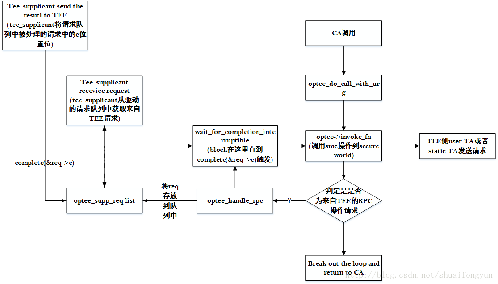

在`《22. OP-TEE中TA与CA执行流程-------tee-supplicant（一）》`一文中介绍了tee_supplicant主要作用，用来实现`secure world端操作REE侧文件系统`，`EMMC的rpmb分区`,`网络socket操作`，`数据库操作`的需求。tee_supplicant与secure world之间的交互模式类似于**生产者**与**消费者**的方式进行配合来是实现上述需求。完成上述需求的整个过程包含三部分：
1. 驱动获取来自TEE侧的请求
2. tee_supplicant从驱动中获取TEE侧的请求。
3. 驱动返回请求操作结果给TEE侧。其整个过程的框图如下：


当libtee调用驱动来与OP-TEE进行数据的交互的时候，最终会调用`optee_do_call_with_arg`函数完成完成smc的操作，而该函数中有一个loop循环，每次触发smc操作之后会对从secure world中返回的参数`res.a0`进行判断，判定当前从secure world返回的数据是**要执行RPC操作**还是直接**返回到CA**。

* 如果是来自TEE的RPC请求，则会将请求存放到请求队列req中。然后block住，直到tee_supplicant处理完请求并将`req->c`标记为完成之后才会进入下一个loop，重新出发smc操作，将处理结果返回给TEE。

# 1. 驱动获取来自TEE侧的请求
当libteec调用了需要做smc操作的请求之后，最终会调用到驱动的optee_do_call_with_arg函数，该函数会进入到死循环，第一条语句就会调用smc操作，进userspace的请求发送到secure world，待从secure world中返回之后。会对返回值进行判定。如果返回的`res.a0`参数是需要驱动做RPC操作，则该函数会调用到optee_handle_rpc操作。经过各种参数分析和函数调用之后，程序最后会调用`optee_supp_thrd_req`函数来将来自TEE的请求存放到tee_supplicant的请求队列中。该函数的内容如下：

```cpp
u32 optee_supp_thrd_req(struct tee_context *ctx, u32 func, size_t num_params,
			struct tee_param *param)
 
{
	struct optee *optee = tee_get_drvdata(ctx->teedev);
	struct optee_supp *supp = &optee->supp;
	struct optee_supp_req *req = kzalloc(sizeof(*req), GFP_KERNEL);
	bool interruptable;
	u32 ret;
 
	if (!req)
		return TEEC_ERROR_OUT_OF_MEMORY;
 
/* 初始化该请求消息的c成员并配置请求数据 */
	init_completion(&req->c);
	req->func = func;
	req->num_params = num_params;
	req->param = param;
 
	/* Insert the request in the request list */
/* 将接受到的请求添加到驱动的TEE请求消息队列中 */
	mutex_lock(&supp->mutex);
	list_add_tail(&req->link, &supp->reqs);
	mutex_unlock(&supp->mutex);
 
	/* Tell an eventual waiter there's a new request */
/* 将supp->reqs_c置位，通知tee_supplicant的receve操作，当前驱动中
   有一个来自TEE的请求 */
	complete(&supp->reqs_c);
 
	/*
	 * Wait for supplicant to process and return result, once we've
	 * returned from wait_for_completion(&req->c) successfully we have
	 * exclusive access again.
	 */
/* block在这里，通过判定req->c是否被置位来判定当前请求是否被处理完毕，
    而req->c的置位是有tee_supplicant的send调用来完成的，如果被置位，则进入到
   while循环中进行返回值的设定并跳出while*/
	while (wait_for_completion_interruptible(&req->c)) {
		mutex_lock(&supp->mutex);
		interruptable = !supp->ctx;
		if (interruptable) {
			/*
			 * There's no supplicant available and since the
			 * supp->mutex currently is held none can
			 * become available until the mutex released
			 * again.
			 *
			 * Interrupting an RPC to supplicant is only
			 * allowed as a way of slightly improving the user
			 * experience in case the supplicant hasn't been
			 * started yet. During normal operation the supplicant
			 * will serve all requests in a timely manner and
			 * interrupting then wouldn't make sense.
			 */
			interruptable = !req->busy;
			if (!req->busy)
				list_del(&req->link);
		}
		mutex_unlock(&supp->mutex);
 
		if (interruptable) {
			req->ret = TEEC_ERROR_COMMUNICATION;
			break;
		}
	}
 
	ret = req->ret;
	kfree(req);
 
	return ret;
}
```
当请求被处理完成之后，函数返回处理后的数据到optee_do_call_with_arg函数中，并进入optee_do_call_with_arg函数中while中的下一次循环，将处理结果返回给secure world.

# 2. tee_supplicant从驱动中获取TEE侧的请求
在tee_supplicant会调用read_request函数来从驱动的请求队列中获取当前存在的来自TEE的请求。该函数最终会调用到驱动中的optee_supp_recv函数。该函数的内容如下：

```cpp
int optee_supp_recv(struct tee_context *ctx, u32 *func, u32 *num_params,
		    struct tee_param *param)
{
	struct tee_device *teedev = ctx->teedev;
	struct optee *optee = tee_get_drvdata(teedev);
	struct optee_supp *supp = &optee->supp;
	struct optee_supp_req *req = NULL;
	int id;
	size_t num_meta;
	int rc;
 
/* 对被用来存放TEE请求参数的数据的buffer进行检查 */
	rc = supp_check_recv_params(*num_params, param, &num_meta);
	if (rc)
		return rc;
 
/* 进入到loop循环中，从 驱动的请求消息队列中获取来自TEE中的请求，直到获取之后才会
跳出该loop*/
	while (true) {
		mutex_lock(&supp->mutex);
/* 尝试从驱动的请求消息队列中获取来自TEE的一条请求 */
		req = supp_pop_entry(supp, *num_params - num_meta, &id);
		mutex_unlock(&supp->mutex);
 
/* 判定是否获取到请求如果获取到了则跳出该loop */
		if (req) {
			if (IS_ERR(req))
				return PTR_ERR(req);
			break;
		}
 
		/*
		 * If we didn't get a request we'll block in
		 * wait_for_completion() to avoid needless spinning.
		 *
		 * This is where supplicant will be hanging most of
		 * the time, let's make this interruptable so we
		 * can easily restart supplicant if needed.
		 */
/* block在这里，直到在optee_supp_thrd_req函数中发送了
complete(&supp->reqs_c)操作后才继续往下执行 */
		if (wait_for_completion_interruptible(&supp->reqs_c))
			return -ERESTARTSYS;
	}
 
/* 设定参数进行异步处理请求的条件 */
	if (num_meta) {
		/*
		 * tee-supplicant support meta parameters -> requsts can be
		 * processed asynchronously.
		 */
		param->attr = TEE_IOCTL_PARAM_ATTR_TYPE_VALUE_INOUT |
			      TEE_IOCTL_PARAM_ATTR_META;
		param->u.value.a = id;
		param->u.value.b = 0;
		param->u.value.c = 0;
	} else {
		mutex_lock(&supp->mutex);
		supp->req_id = id;
		mutex_unlock(&supp->mutex);
	}
 
/* 解析参数，设定tee_supplicant将要执行的具体(加载TA，操作文件系统，操作EMMC的
rpmb分区等)操作和相关参数 */
	*func = req->func;
	*num_params = req->num_params + num_meta;
	memcpy(param + num_meta, req->param,
	       sizeof(struct tee_param) * req->num_params);
 
	return 0;
}
```
从请求消息队列中获取到来自TEE的请求之后，返回到tee_supplicant中继续执行。根据返回的func值和参数执行TEE要求在REE端需要的操作。

# 3.驱动返回请求操作的结果给TEE侧
当tee_supplicant执行完TEE请求的操作之后，会调用write_response函数来实现将数据返回给TEE。而write_response函数最终会调用到驱动的optee_supp_send函数。该函数主要是调用`complete(&req->c);`操作来完成对该请求的c成员的置位，告诉optee_supp_thrd_req函数执行下一步操作，返回到optee_do_call_with_arg函数中进入该函数中的下一轮loop中，调用smc操作将结果返回给TEE侧。optee_supp_send函数的内容如下：

```cpp
int optee_supp_send(struct tee_context *ctx, u32 ret, u32 num_params,
		    struct tee_param *param)
{
	struct tee_device *teedev = ctx->teedev;
	struct optee *optee = tee_get_drvdata(teedev);
	struct optee_supp *supp = &optee->supp;
	struct optee_supp_req *req;
	size_t n;
	size_t num_meta;
 
	mutex_lock(&supp->mutex);
/* 驱动中请求队列的pop操作 */
	req = supp_pop_req(supp, num_params, param, &num_meta);
	mutex_unlock(&supp->mutex);
 
	if (IS_ERR(req)) {
		/* Something is wrong, let supplicant restart. */
		return PTR_ERR(req);
	}
 
	/* Update out and in/out parameters */
/* 使用传入的参数，更新请求的参数区域，将需要返回给TEE侧的数据填入到对应的位置 */
	for (n = 0; n < req->num_params; n++) {
		struct tee_param *p = req->param + n;
 
		switch (p->attr & TEE_IOCTL_PARAM_ATTR_TYPE_MASK) {
		case TEE_IOCTL_PARAM_ATTR_TYPE_VALUE_OUTPUT:
		case TEE_IOCTL_PARAM_ATTR_TYPE_VALUE_INOUT:
			p->u.value.a = param[n + num_meta].u.value.a;
			p->u.value.b = param[n + num_meta].u.value.b;
			p->u.value.c = param[n + num_meta].u.value.c;
			break;
		case TEE_IOCTL_PARAM_ATTR_TYPE_MEMREF_OUTPUT:
		case TEE_IOCTL_PARAM_ATTR_TYPE_MEMREF_INOUT:
			p->u.memref.size = param[n + num_meta].u.memref.size;
			break;
		default:
			break;
		}
	}
	req->ret = ret;
 
	/* Let the requesting thread continue */
/* 通知optee_supp_thrd_req函数，一个来自TEE侧的请求已经被处理完毕，
可以继续往下执行 */
	complete(&req->c);
	return 0;
}
```

# 总结
从tee_supplicant处理来自TEE侧的请求来看主要是有三个点：

* 第一是驱动在触发smc操作之后会进入到loop循环中，根据secure world中的返回值来判定该返回时来自TEE的RPC请求还是最终处理结果，如果是RPC请求，也就是需要驱动或者tee_supplicant执行其他操作，驱动将RPC请求会保存到驱动的请求消息队列中，然后block住等待请求处理结果。
* 第二是在tee_supplicant作为一个常驻进程存在于REE中，它会不停的尝试从驱动的请求消息队列中获取到来自TEE侧的请求。如果请求消息队列中并没有请求则会block住，直到拿到了请求才返回。拿到请求之后会对请求进行解析，然后根据func执行具体的操作。
* 第三是在tee_supplicant处理完来自TEE的请求后，会调用send操作将处理结果存放到该消息队列的参数区域，并使用complete函数通知驱动该请求已经被处理完毕。驱动block住的地方可以继续往下执行，调用smc操作将结果返回给TEE侧