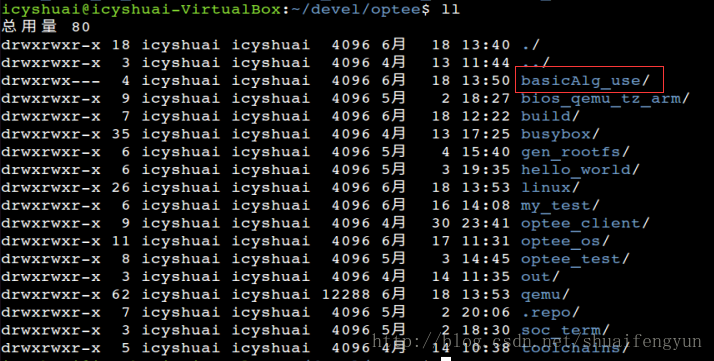
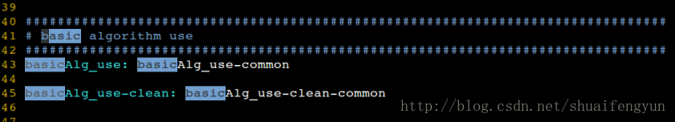
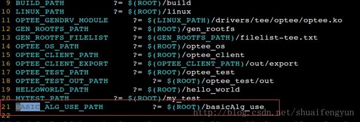
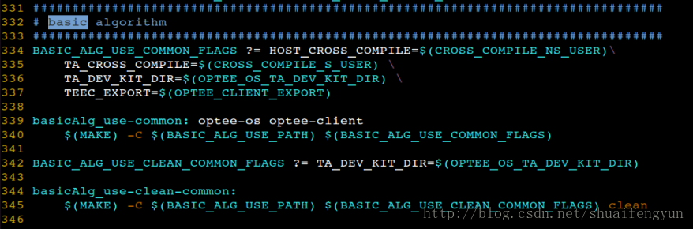
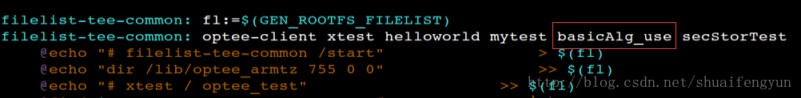
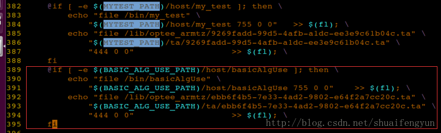
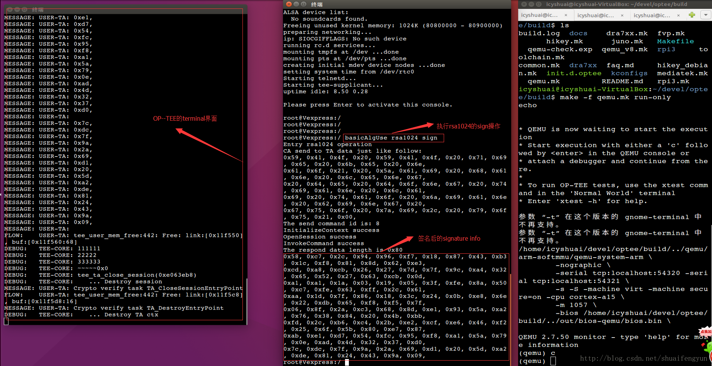

OP-TEE根据GP标准支持当前主流的基本算法，包括`RAS/AES/HMAC/SHA/RANDOM`等，本文将介绍在OP-TEE中添加一个TA和CA来调用上述算法的GP接口实现对`数据的加密`，`解密`，`签名`，`验签`，`计算hash值`等操作。

在xtest中也有上述算法的接口调用用例，但是查看下来比较零散，并不符合使用者直接调用。例如在xtest中，如果要对数据进行AES的加密操作，在xtest中可能需要在TA和CA之间多次传递数据来完成。而正常的用户希望能达到的效果是只要在CA中带需要被处理的数据调用接口就能够对数据的完成AES操作。

# 1.测试编译下载的代码

进入到basicAlg_use目录然后运行`build_ta_cryverify_qemu.sh`脚本来测试代码是否能够编译通过（需要OP-TEE已经编译通过）

# 2.将basicAlg的TA和CA集成到系统中

如果运行`build_ta_cryverify_qemu.sh`脚本测试编译通过之后。可以将basicAlg_use这个TA和CA添加到系统中去，代码在qemu+OP-TEE的方式运行是通过的。

## 2.1 修改Makefile文件

修改build目录中的Makefile或者qemu.mk，我将build目录下的Make链接成了qemu.mk，在Makefile中添加编译basicAlg_use的target，内容如下：

## 2.2 修改comm.mk文件
修改build目录下的common.mk文件，添加basicAlg_use所在目录变量：`BASIC_ALG_USE_PATH`:

添加编译basicAlg的相关配置变量，添加的内容如下图所示

在filelist-tee-common的target中添加对basicAlg_use的依赖

在filelist-tee-common的target中添加basicAlg的相关操作，主要是在编译的时候将basicAlg_use的TA image和CA binary添加到REE中的文件系统中。添加的内容如下图中的红框中部分：

# 3.其他
　在basicAlg_use目录中可以修改CA binary的名字，记得修改之后也需要同步修改comm.mk文件中的file-tee-common中的部分。同样也可以根据实际情况修改TA image的UUID，同时修改之后也需要同步修改comm.mk文件中的file-tee-common中的部分。关于如何修改UUID，怎么将自己的代码作为TA程序来运行的方法可参考《2. OP-TEE中添加自己的TA和CA》。
# 4.整体编译工程进行测试
修改完毕之后，进入到build目录中运行make -f qemu.mk all编译整个工程。关于如何使用basicAlg_use的CA binary，请参与basicAlg_use目录中的README.md一文。

编译完成之后在build目录下执行`make -f qemu.mk run-only`开始启动QEMU+OP-TEE的环境，启动完成之后在启动的linux shell端直接安全REAMME.md文中运行指令就可以调用TA来执行相关的算法。

