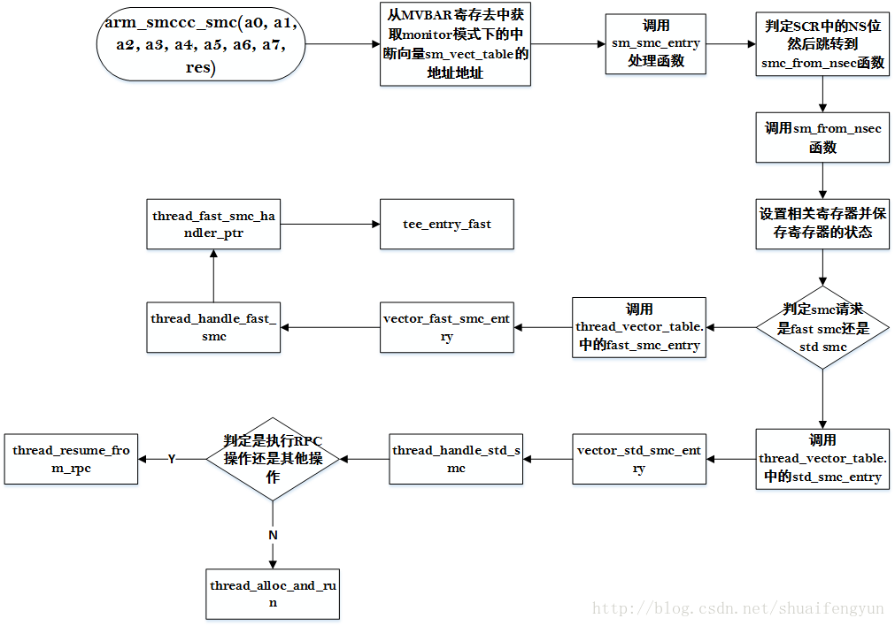

libteec和tee_supplicant调用接口之后最终会调用到OP-TEE驱动来触发对应的SMC操作。在OP-TEE驱动中触发SMC操作的方法是调用`arm_smccc_smc(a0, a1, a2, a3, a4, a5, a6, a7, res)`来实现，其中在REE端需要传递給TEE侧的数据被存放在`a0~a7`中。调用上述函数自后，CPU中的cortex就会切换到monitor模式，进入monitor模式之后首先会去获取`MVBAR寄存器`中存放的monitor模式的`中断向量表地址`，然后查找monitor模式的中断向量表，命中smc的处理函数。

进入到处理函数之后再根据从REE侧带入的参数判定是进行`快速smc处理`还是`标准的smc处理`。关于monitor模式下如何实现normal world到secure world之间的切换过程请参考文章《18. OP-TEE中secur world和non-secure world的切换过程》。在REE端触发smc请求之后在monitor的处理流程如下图所示：



当程序运行到sm_from_nsec的时候就已经完成了normal world与secure world的切换，从该函数开始就进入到了OP-TEE的处理范畴。

# 1.Monitor模式的中断向量表中的smc处理函数
当在REE侧触发了smc请求时，cortex切换到monitor模式并获取monitor模式的中断向量表`sm_vect_table`的地址，该向量表的地址在OP-TEE的启动的时候会被保存到MVBAR寄存器中。触发了smc请求之后将会调用向量表中的sm_smc_entry函数来对请求进行处理。sm_smc_entry函数是用汇编编写的，其内容在以前的文章中有详细的介绍。如果系统支持ATF，则该部分的处理将会发生在ATF的``bl31阶段。本文不考虑ATF的情况。

在sm_smc_entry中对当前SCR寄存器中的NS为来判定请求是来自于secure world还是normal world。如果请求来自于REE侧，则程序会执行smc_from_nsec分支完成SCR中NS的设置并调转到sm_from_nsec函数继续执行。

# 2.判定smc请求类型

smc请求处理函数执行到sm_from_nsec函数后就会对smc请求的类型进行判定，判定该smc请求时属于快速smc还是标准的smc请求。该判定是通过判定`r0寄存器`中存放的数据中的`第31个bit`的值是1还是0，如果bit31的值是1，则表面该smc请求时快速smc(fast smc)，如果该值为0则是标准smc请求。关于r0参数每个bit的函数请参考文章《25. OP-TEE驱动篇----驱动编译，加载和初始化（二）》中的最后一个章节。sm_from_nsec函数的内容如下：

```cpp
bool sm_from_nsec(struct sm_ctx *ctx)
{
	uint32_t *nsec_r0 = (uint32_t *)(&ctx->nsec.r0);
 
/* 平台相关处理 */
	if (!sm_platform_handler(ctx))
		return false;
 
#ifdef CFG_PSCI_ARM32
	if (OPTEE_SMC_OWNER_NUM(*nsec_r0) == OPTEE_SMC_OWNER_STANDARD) {
		smc_std_handler((struct thread_smc_args *)nsec_r0);
		return false;	/* Return to non secure state */
	}
#endif
 
/* 保存non-secure world各种寄存器的值 */
	sm_save_modes_regs(&ctx->nsec.mode_regs);
 
/* 恢复secure world的寄存器的值 */
	sm_restore_modes_regs(&ctx->sec.mode_regs);
 
/* 将从驱动传递过来的第一个参数r0拷贝到ctx->sec.ro中 */
	memcpy(&ctx->sec.r0, nsec_r0, sizeof(uint32_t) * 8);
 
/* 判定第一个参数的bit31的值是否为1 */
	if (OPTEE_SMC_IS_FAST_CALL(ctx->sec.r0))
 /* Bit 31的值为1，调用fast smc的thread进行处理 */
		ctx->sec.mon_lr = (uint32_t)&thread_vector_table.fast_smc_entry;
	else
/* Bit 31的值为0，调用std smc的thread进行处理 */
		ctx->sec.mon_lr = (uint32_t)&thread_vector_table.std_smc_entry;
	return true;	/* return into secure state */
}
```

# 3. OP-TEE中的线程向量表----thread_vector_table

在OP-TEE中用于处理各种来自外部或者的monitor模式请求的入口函数都存放在OP-TEE的线程向量表thread_vector_table中。该项量的实现在`optee_os/core/arch/arm/kernel/thread_a32.S`文件中。其内容如下：

```cpp
FUNC thread_vector_table , :
UNWIND(	.fnstart)
UNWIND(	.cantunwind)
	b	vector_std_smc_entry	//OP-TEE中处理标准smc请求
	b	vector_fast_smc_entry	//OP-TEE中处理快速smc
	b	vector_cpu_on_entry	//OP-TEE中处理cpu on操作
	b	vector_cpu_off_entry	//OP-TEE中处理cpu off操作
	b	vector_cpu_resume_entry	//OP-TEE中处理resume操作
	b	vector_cpu_suspend_entry	//OP-TEE中处理cpu suspend操作
	b	vector_fiq_entry		//OP-TEE中处理处理快速中断操作
	b	vector_system_off_entry		//OP-TEE中处理系统off操作
	b	vector_system_reset_entry	//OP-TEE中处理系统重启操作
UNWIND(	.fnend)
END_FUNC thread_vector_table
```

**注意**:该`线程向量表`与OP-TEE的中断处理向量表`thread_vect_table`是不一样的。`thread_vector_table` 属于线程级别，会被monitor模式或者其他中断处理函数调用到，而`thread_vect_table`才是OP-TEE存放在VBAR寄存器中的中断向量表。当在secure world状态下产生了FIQ事件时，将会调用中断向量表thread_vect_table中的FIQ中断处理函数，然后才会调用到thread_vector_table中给的vector_fiq_entry来执行FIQ的后续处理。


