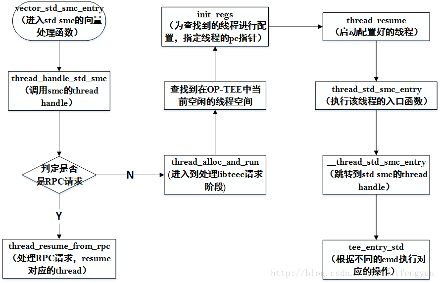

当在驱动中触发的是标准smc时（std smc），经过monitor模式下程序的处理后最终会调用到OP-TEE中的vector_std_smc_entry来对请求进行处理，该过程与上一文判定是fast smc请求一样。都是进入monitor模式的smc中断处理函数，然后根据a0参数中的bit31来判定是快速smc还是标准smc。如果bit31的值是0,则会进入到标准smc的处理逻辑。进入到正式操作之前的流程如如下：



用于处理标准smc的向量处理函数如下：

```asm
LOCAL_FUNC vector_std_smc_entry , :
UNWIND(	.fnstart)
UNWIND(	.cantunwind)
	push	{r0-r7}	//将参数入栈
	mov	r0, sp	//将栈指针赋值给r0寄存器
	bl	thread_handle_std_smc	//调用处理函数，参数的地址存放在r0寄存器中
	/*
	 * Normally thread_handle_std_smc() should return via
	 * thread_exit(), thread_rpc(), but if thread_handle_std_smc()
	 * hasn't switched stack (error detected) it will do a normal "C"
	 * return.
	 */
	pop	{r1-r8}	//出栈操作
	ldr	r0, =TEESMC_OPTEED_RETURN_CALL_DONE	//标记OP-TEE处理完成
	smc	#0	//调用smc切回到normal world
	b	.	/* SMC should not return */
UNWIND(	.fnend)
END_FUNC vector_std_smc_entry
```

函数thread_handle_std_smc的内容如下：

```cpp
void thread_handle_std_smc(struct thread_smc_args *args)
{
/* 检查堆栈 */
	thread_check_canaries();
 
	if (args->a0 == OPTEE_SMC_CALL_RETURN_FROM_RPC)
//处理由tee_supplican回复的RPC请求处理结果
		thread_resume_from_rpc(args);
	else
//处理来自Libteec的请求，主要包括open session, close session, invoke等
		thread_alloc_and_run(args);	
}
```
只有在libteec中触发的smc后，需要OP-TEE作出相应的操作后才可能产生来自RPC请求，故先介绍OP-TEE对来自libteec请求部分，主要是对打开session, 关闭close, 调用特定TA的command，取消command等操作。

# 1. OP-TEE中处理来自libteec的smc请求操作

在《21. OP-TEE中TA与CA执行流程-------libteec介绍》一文中介绍了libteec提供给上层使用的所有接口，这些接口调用之后就会就有可能需要OP-TEE进行对应的操作。在monitor模式对这些请求处理之后会进入到OP-TEE中，然后调用thread_alloc_and_run创建一个线程来对请求做专门的处理。而且在处理过成中还有可能TEE与REE侧之间的RPC请求等。thread_alloc_and_run函数的内容如下：

```cpp
static void thread_alloc_and_run(struct thread_smc_args *args)
{
	size_t n;
/* 获取当前CPU的ID，并返回该CPU core的对应结构体 */
	struct thread_core_local *l = thread_get_core_local();
	bool found_thread = false;
 
/* 判定是否有thread正在占用CPU */
	assert(l->curr_thread == -1);
 
/* 锁定线程状态 */
	lock_global();
 
/* 查找系统中那个线程空间当前可用 */
	for (n = 0; n < CFG_NUM_THREADS; n++) {
		if (threads[n].state == THREAD_STATE_FREE) {
			threads[n].state = THREAD_STATE_ACTIVE;
			found_thread = true;
			break;
		}
	}
 
/* 解锁 */
	unlock_global();
 
/* 初步设定返回给REE侧驱动的结果为OPTEE_SMC_RETURN_ETHREAD_LIMIT，返回的
数据在后续处理中会被更改 */
	if (!found_thread) {
		args->a0 = OPTEE_SMC_RETURN_ETHREAD_LIMIT;
		return;
	}
 
/* 记录当前cortex使用了那个thread空间来执行操作 */
	l->curr_thread = n;
 
/* 设置选中的thread空间的flag为0*/
	threads[n].flags = 0;
 
/*并对该thread中使用的pc，cpsr等相关寄存器进行设置,并且将参数传递到thread context的
reg.ro~reg.r7中 */
	init_regs(threads + n, args);
 
	/* Save Hypervisor Client ID */
/* 保存Hypervisor客户端的ID值 */
	threads[n].hyp_clnt_id = args->a7;
 
/* 保存vfp相关数据 */
	thread_lazy_save_ns_vfp();
 
/* 调用thread_resume函数，开始执行被初始化好的thread */
	thread_resume(&threads[n].regs);
}
```
thread_alloc_and_run会建立一个thread，并通过init_regs函数初始化该thread的运行上下文，指定该thread的入口函数以及运行时的参数，初始化完成之后，调用thread_resume启动该线程。thread的运行上下文的配置和初始化在init_regs函数中实现，内容如下：

```cpp
static void init_regs(struct thread_ctx *thread,
		struct thread_smc_args *args)
{	
/* 指定该线程上下文中PC指针的地址，当该thread resume回来之后就会开始执行regs.pc执
行的函数 */
	thread->regs.pc = (uint32_t)thread_std_smc_entry;
 
	/*
	 * Stdcalls starts in SVC mode with masked foreign interrupts, masked
	 * Asynchronous abort and unmasked native interrupts.
	 */
/* 设定cpsr寄存器的值，屏蔽外部中断，进入SVC模式 */
	thread->regs.cpsr = read_cpsr() & ARM32_CPSR_E;
	thread->regs.cpsr |= CPSR_MODE_SVC | CPSR_A |
			(THREAD_EXCP_FOREIGN_INTR << ARM32_CPSR_F_SHIFT);
	/* Enable thumb mode if it's a thumb instruction */
	if (thread->regs.pc & 1)
		thread->regs.cpsr |= CPSR_T;
	/* Reinitialize stack pointer */
	thread->regs.svc_sp = thread->stack_va_end; 	//重新定位栈地址
 
	/*
	 * Copy arguments into context. This will make the
	 * arguments appear in r0-r7 when thread is started.
	 */
/* 配置运行时传入的参数 */
	thread->regs.r0 = args->a0;
	thread->regs.r1 = args->a1;
	thread->regs.r2 = args->a2;
	thread->regs.r3 = args->a3;
	thread->regs.r4 = args->a4;
	thread->regs.r5 = args->a5;
	thread->regs.r6 = args->a6;
	thread->regs.r7 = args->a7;
}
```

## 1.1 thread的resum操作

通过init_regs配置完thread的运行上下文之后，通过调用thread_resume函数来唤醒该线程，让其进入到执行状态。resume函数使用汇编来实现，主要是保存一些寄存器状态，指定thread运行在什么模式。

```cpp
FUNC thread_resume , :
UNWIND(	.fnstart)
UNWIND(	.cantunwind)
	add	r12, r0, #(13 * 4)	/* Restore registers r0-r12 later */
 
	cps	#CPSR_MODE_SYS	//进入sys模式
	ldm	r12!, {sp, lr}	
 
	cps	#CPSR_MODE_SVC	//进入到svc模式
	ldm	r12!, {r1, sp, lr}		
	msr	spsr_fsxc, r1
 
	cps	#CPSR_MODE_SVC	//进入到svc模式
	ldm	r12, {r1, r2}
	push	{r1, r2}	//出栈操作
 
	ldm	r0, {r0-r12}	//将参数存放到r0~r12中
 
	/* Restore CPSR and jump to the instruction to resume at */
	rfefd	sp!	//跳转到thread的pc指针出执行并返回
UNWIND(	.fnend)
END_FUNC thread_resume
```

##　1.2 用于处理标准smc的thread的入口函数

在init_regs中的regs.pc中已经制定了该thread被resume回来之后的pc指针为thread_std_smc_entry，当thread被resume之后就会去执行该函数

```cpp
FUNC thread_std_smc_entry , :
UNWIND(	.fnstart)
UNWIND(	.cantunwind)
	/* Pass r0-r7 in a struct thread_smc_args */
	push	{r0-r7}	//入栈操作，将r0~r7的数据入栈
	mov	r0, sp	//将r0执行栈地址作为参数传递給__thread_std_smc_entry
	bl	__thread_std_smc_entry		//正式对标准smc进行处理
	/*
	 * Load the returned r0-r3 into preserved registers and skip the
	 * "returned" r4-r7 since they will not be returned to normal
	 * world.
	 */
	pop	{r4-r7}
	add	sp, #(4 * 4)
 
	/* Disable interrupts before switching to temporary stack */
	cpsid	aif	//关闭中断
	bl	thread_get_tmp_sp	//获取堆栈
	mov	sp, r0	//将r0的值存放到sp中
 
	bl	thread_state_free	//释放thread
 
	ldr	r0, =TEESMC_OPTEED_RETURN_CALL_DONE//设置返回到normal的r0寄存器的值
	mov	r1, r4
	mov	r2, r5
	mov	r3, r6
	mov	r4, r7
	smc	#0	//调用smc，切回到normal world
	b	.	/* SMC should not return */
UNWIND(	.fnend)
END_FUNC thread_std_smc_entry
```

## 1.3 标准smc请求的handle

在`__thread_std_smc_entry`函数中最终会调用thread_std_smc_handler_ptr来对请求做正式的处理，而thread_std_smc_handler_ptr是在OP-TEE启动的过程中执行init_handlers函数时被初始化成了`handlers->std_smc`。而`handlers->std_smc`根据不同的板级可能有所不同，在vexpress板级中std_smc的值为tee_entry_std。

```cpp
void tee_entry_std(struct thread_smc_args *smc_args)
{
	paddr_t parg;
	struct optee_msg_arg *arg = NULL;	/* fix gcc warning */
	uint32_t num_params;
 
/* 判定a0是否合法 */
	if (smc_args->a0 != OPTEE_SMC_CALL_WITH_ARG) {
		EMSG("Unknown SMC 0x%" PRIx64, (uint64_t)smc_args->a0);
		DMSG("Expected 0x%x\n", OPTEE_SMC_CALL_WITH_ARG);
		smc_args->a0 = OPTEE_SMC_RETURN_EBADCMD;
		return;
	}
/* 判定传入参数起始地址否存属于non-secure memory中，因为驱动与OP-TEE之间使用共
享内存来共享数据，而共享内存属于非安全内存 */
	parg = (uint64_t)smc_args->a1 << 32 | smc_args->a2;
	if (!tee_pbuf_is_non_sec(parg, sizeof(struct optee_msg_arg)) ||
	    !ALIGNMENT_IS_OK(parg, struct optee_msg_arg) ||
	    !(arg = phys_to_virt(parg, MEM_AREA_NSEC_SHM))) {
		EMSG("Bad arg address 0x%" PRIxPA, parg);
		smc_args->a0 = OPTEE_SMC_RETURN_EBADADDR;
		return;
	}
 
/* 检查所有参数是否存放在non-secure memory中 */
	num_params = arg->num_params;
	if (!tee_pbuf_is_non_sec(parg, OPTEE_MSG_GET_ARG_SIZE(num_params))) {
		EMSG("Bad arg address 0x%" PRIxPA, parg);
		smc_args->a0 = OPTEE_SMC_RETURN_EBADADDR;
		return;
	}
 
	/* Enable foreign interrupts for STD calls */
	thread_set_foreign_intr(true);	//使能中断
 
/* 根据参数的cmd成员来判定来自libteec的请求是要求OP-TEE做什么操作 */
	switch (arg->cmd) {
/* 执行打开session操作 */
	case OPTEE_MSG_CMD_OPEN_SESSION:
		entry_open_session(smc_args, arg, num_params);
		break;
/* 执行关闭session的操作 */
	case OPTEE_MSG_CMD_CLOSE_SESSION:
		entry_close_session(smc_args, arg, num_params);
		break;
/* 请求特定TA执行特定的command */
	case OPTEE_MSG_CMD_INVOKE_COMMAND:
		entry_invoke_command(smc_args, arg, num_params);
		break;
/* 请求cancel掉某个session的command */
	case OPTEE_MSG_CMD_CANCEL:
		entry_cancel(smc_args, arg, num_params);
		break;
	default:
		EMSG("Unknown cmd 0x%x\n", arg->cmd);
		smc_args->a0 = OPTEE_SMC_RETURN_EBADCMD;
	}
}
```
当进入到tee_entry_std函数之后，根据不同的cmd值来判定是执行session还是执行调用TA的command的操作。尤其是在执行打开session的操作时，根据TA image的不同类型可以能会触发RPC请求，当TA image存放在文件系统中时，在打开session的时候OP-TEE就会触发RPC请求，请求tee_supplicant从文件系统中读取TA image的内容，并将内容传递給OP-TEE，然后经过对image的校验判定完成TA image的加载操作，并将该session添加到session的队列中。

# 总结

如果TA image是被存放在文件系统中，即该TA为动态TA，那么在执行open session操作的时候需要通过RPC机制，借助tee_supplicant将TA image加载到OP-TEE中。在这个过程中会有多次的normal world和secure world的切换，并且有多次的RPC请求。