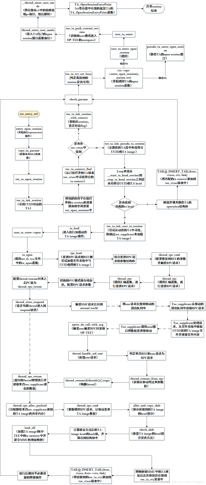

session是CA调用TA的基础，如果CA没与TA之间没有建立session，那么CA就无法调用TA中的任何command。在libteec中通过执行TEEC_OpenSession函数来建议CA与特定TA之间的session的操作，该函数执行时会调用到OP-TEE驱动中的optee_open_session函数通知OP-TEE开始执行创建session的操作。在OP-TEE中的TEE端一次对动态TA完整的open session操作的流程如下图所示：



OP-TEE支持动态TA和静态TA。

* 即可以将TA镜像与OP-TEE的镜像编译在同一image中，只是静态TA镜像会存放在OP-TEE镜像的特定分区中。在OP-TEE启动的时候会被加载到属性为MEM_AREA_TA_RAM的安全内存中。
* 而动态TA的方式则是将TA镜像文件保存到文件系统中，在打开session的时候再通过RPC请求加载到OP-TEE的安全内存中。

open session在OP-TEE中的操作都是根据`UUID值`找到对应的TA镜像，然后读取`TA image head部分`的数据，并将相关数据保存到`tee_ta_ctx`结构体变量中，然后将填充好的tee_ta_ctx结构体变量保存到tee_ctxes链表中，以便后期CA执行invoke操作来调用TA中的command的时候可以通过查找tee_ctxes链表来获取对应的session，然后根据session的内容进入到TA中根据command ID执行特定的command操作。由于该部分代码量较大，故不对每一步的代码进行讲解，只对比较迷惑或者关键的地方进行介绍。详细内容可以结合上图和实际代码进行了解。

# 1. 静态TA的open session操作

由于静态的TA是与OP-TEE OS镜像编译在一起，在OP-TEE的启动阶段该，静态TA镜像的内容会被加载OP-TEE的安全内存中，而且在启动过程中会调用`verify_pseudo_tas_conformance`函数对所有的静态TA镜像的内容进行检查。

调用Open session操作后，OP-TEE首先会在已经被打开的session链表中查找是否有匹配，如果匹配则将该session的ID直接返回给REE侧，如果没有找到则会根据UUID去静态TA的段中进行查找，然后将找到的静态TA的相关信息填充到tee_ta_ctx结构体变量中，然后在添加到全局的tee_ctxes链表中。该函数内容如下：

```cpp
TEE_Result tee_ta_init_pseudo_ta_session(const TEE_UUID *uuid,
			struct tee_ta_session *s)
{
	struct pseudo_ta_ctx *stc = NULL;
	struct tee_ta_ctx *ctx;
	const struct pseudo_ta_head *ta;
 
	DMSG("   Lookup for pseudo TA %pUl", (void *)uuid);
 
/* 获取静态TA的head的起始地址 */
	ta = &__start_ta_head_section;
 
/* 进入到loop循环，遍历整个段，根据UUID是否匹配来判定在静态TA的head段中是否有
相应的TA */
	while (true) {
		if (ta >= &__stop_ta_head_section)
			return TEE_ERROR_ITEM_NOT_FOUND;
		if (memcmp(&ta->uuid, uuid, sizeof(TEE_UUID)) == 0)
			break;
		ta++;
	}
 
	/* Load a new TA and create a session */
	DMSG("      Open %s", ta->name);
/* 分配存放pseudo_ta_ctx结构体变量的内存空间 */
	stc = calloc(1, sizeof(struct pseudo_ta_ctx));
	if (!stc)
		return TEE_ERROR_OUT_OF_MEMORY;
	ctx = &stc->ctx;
 
/* 填充数据，组合ctx变量，并将TA的operation的变量指针保存到ctx->ops中 */
	ctx->ref_count = 1;
	s->ctx = ctx;
	ctx->flags = ta->flags;
	stc->pseudo_ta = ta;
	ctx->uuid = ta->uuid;
	ctx->ops = &pseudo_ta_ops;
	TAILQ_INSERT_TAIL(&tee_ctxes, ctx, link);
 
	DMSG("      %s : %pUl", stc->pseudo_ta->name, (void *)&ctx->uuid);
 
	return TEE_SUCCESS;
}
```

# 2.动态TA的open session操作
动态的TA image会被保存在REE侧的文件系统中。CA在执行动态TA的open session操作的时候，OP-TEE会根据UUID值使用RPC机制借助tee_supplicant来完成将动态TA image加载到OP-TEE的内存中的操作，并获取加载到内存中的动态TA的相关信息，将这些信息填充到tee_ta_ctx结构体变量中，然后在添加到全局的tee_ctxes链表中。以便后续在CA端调用invoke操作直接根据session ID值在链表中找到该session.加载动态TA的过程可参考开篇的那张图。

## 2.1 RPC请求的触发

在动态加载TA image的过程中是通过thread_rpc_cmd函数来触发RPC请求，借助tee_supplicant来完成TA image内容的读取和传输。该函数内容如下：

```cpp
uint32_t thread_rpc_cmd(uint32_t cmd, size_t num_params,
			struct optee_msg_param *params)
{
	uint32_t rpc_args[THREAD_RPC_NUM_ARGS] = { OPTEE_SMC_RETURN_RPC_CMD };
	struct optee_msg_arg *arg;
	uint64_t carg;
	size_t n;
	struct optee_msg_param *arg_params;
 
	/*
	 * Break recursion in case plat_prng_add_jitter_entropy_norpc()
	 * sleeps on a mutex or unlocks a mutex with a sleeper (contended
	 * mutex).
	 */
	if (cmd != OPTEE_MSG_RPC_CMD_WAIT_QUEUE)
		plat_prng_add_jitter_entropy_norpc();
 
/* 获取需要通过RPC机制发送到REE侧的参数内容 */
	if (!get_rpc_arg(cmd, num_params, &arg, &carg, &arg_params))
		return TEE_ERROR_OUT_OF_MEMORY;
 
/* 拷贝操作 */
	memcpy(arg_params, params, sizeof(*params) * num_params);
 
/* 转换成64位，以便兼容64位系统 */
	reg_pair_from_64(carg, rpc_args + 1, rpc_args + 2);
/* 发送RPC请求，触发smc和suspend当前thread */
	thread_rpc(rpc_args);
	for (n = 0; n < num_params; n++) {
		switch (params[n].attr & OPTEE_MSG_ATTR_TYPE_MASK) {
		case OPTEE_MSG_ATTR_TYPE_VALUE_OUTPUT:
		case OPTEE_MSG_ATTR_TYPE_VALUE_INOUT:
		case OPTEE_MSG_ATTR_TYPE_RMEM_OUTPUT:
		case OPTEE_MSG_ATTR_TYPE_RMEM_INOUT:
		case OPTEE_MSG_ATTR_TYPE_TMEM_OUTPUT:
		case OPTEE_MSG_ATTR_TYPE_TMEM_INOUT:
			params[n] = arg_params[n];
			break;
		default:
			break;
		}
	}
	return arg->ret;
}
```
RPC请求是如何发送出去的呢，发送RPC请求的时候做了哪些操作呢？这就得看thread_rpc函数做了哪些操作了，该函数是以汇编的方式实现的。

```asm
FUNC thread_rpc , :
/*
 * r0-r2 are used to pass parameters to normal world
 * r0-r5 are used to pass return vaule back from normal world
 *
 * note that r3 is used to pass "resume information", that is, which
 * thread it is that should resume.
 *
 * Since the this function is following AAPCS we need to preserve r4-r5
 * which are otherwise modified when returning back from normal world.
 */
UNWIND(	.fnstart)
	push	{r4-r5, lr}
UNWIND(	.save	{r4-r5, lr})
	push	{r0}
UNWIND(	.save	{r0})
 
	bl	thread_save_state //保存状态
	mov	r4, r0			/* Save original CPSR */
 
	/*
 	 * Switch to temporary stack and SVC mode. Save CPSR to resume into.
	 */
	bl	thread_get_tmp_sp	//获取tmp栈空间
	ldr	r5, [sp]		/* Get pointer to rv[] */
	cps	#CPSR_MODE_SVC		/* Change to SVC mode */
	mov	sp, r0			/* Switch to tmp stack */
 
	mov	r0, #THREAD_FLAGS_COPY_ARGS_ON_RETURN
	mov	r1, r4			/* CPSR to restore */
	ldr	r2, =.thread_rpc_return	//thred_rpc_return为当前线程resume回来之后的PC值
	bl	thread_state_suspend	//suspend当前线程
	mov	r4, r0			/* Supply thread index */
	ldr	r0, =TEESMC_OPTEED_RETURN_CALL_DONE
	ldm	r5, {r1-r3}		/* Load rv[] into r0-r2 */	
	smc	#0	//触发smc操作，切回到REE侧
	b	.	/* SMC should not return */
 
.thread_rpc_return:
	/*
	 * At this point has the stack pointer been restored to the value
	 * it had when thread_save_state() was called above.
	 *
	 * Jumps here from thread_resume above when RPC has returned. The
	 * IRQ and FIQ bits are restored to what they where when this
	 * function was originally entered.
	 */
	pop	{r12}			/* Get pointer to rv[] */
	stm	r12, {r0-r5}		/* Store r0-r5 into rv[] */
	pop	{r4-r5, pc}
UNWIND(	.fnend)
END_FUNC thread_rpc
```
调用thread_rpc 函数会将调用的thread挂起，然后触发smc操作，切回到REE侧，让tee_supplicant来进行动态TA image的读取，然后再次通过RPC类型的smc请求将数据发送给OP-TEE。在一个完整的动态TA image的加载过程中对多次调用thread_rpc_cmd函数来发送RPC请求通过tee_supplican来从文件系统中获取不同的数据信息。

## 2.2 thread的resume

发送RPC请求到REE侧的时候会将当前thread suspend。等OP-TEE接收到来自REE侧的请求处理结果后会将该thread重新resume。当在REE侧处理完请求之后，驱动会发送一个RPC类型的smc操作，该请求最终会调用thread_resume_from_rpc来进行处理。该函数内容如下：

```cpp
static void thread_resume_from_rpc(struct thread_smc_args *args)
{
	size_t n = args->a3; /* thread id */	//获取需要被resume的thread ID	
	struct thread_core_local *l = thread_get_core_local();
	uint32_t rv = 0;
 
	assert(l->curr_thread == -1);
 
	lock_global();
 
/* 设定需要被唤醒的thread的状态变量 */
	if (n < CFG_NUM_THREADS &&
	    threads[n].state == THREAD_STATE_SUSPENDED &&
	    args->a7 == threads[n].hyp_clnt_id)
		threads[n].state = THREAD_STATE_ACTIVE;
	else
		rv = OPTEE_SMC_RETURN_ERESUME;
 
	unlock_global();
 
	if (rv) {
		args->a0 = rv;
		return;
	}
 
/* 指定当前thread的ID值 */
	l->curr_thread = n;
 
/* 判定需要被唤醒的线程是否属处于user态 */
	if (is_user_mode(&threads[n].regs))
		tee_ta_update_session_utime_resume();
 
/* 判定需要被唤醒的线程是否做了OP-TEE的userspace的内存映射 */
	if (threads[n].have_user_map)
		core_mmu_set_user_map(&threads[n].user_map);
 
	/*
	 * Return from RPC to request service of a foreign interrupt must not
	 * get parameters from non-secure world.
	 */
	if (threads[n].flags & THREAD_FLAGS_COPY_ARGS_ON_RETURN) {
		copy_a0_to_a5(&threads[n].regs, args);		//获取来自REE的回复数据
		threads[n].flags &= ~THREAD_FLAGS_COPY_ARGS_ON_RETURN;
	}
 
	thread_lazy_save_ns_vfp();
	thread_resume(&threads[n].regs);	//执行线程的resume操作
}
```
最终通过调用thread_resume函数来讲线程唤醒，该函数的内容如下：

```asm
FUNC thread_resume , :
UNWIND(	.fnstart)
UNWIND(	.cantunwind)
	add	r12, r0, #(13 * 4)	/* Restore registers r0-r12 later */
 
/* 切换到sys模式并保存相关寄存器 */
	cps	#CPSR_MODE_SYS
	ldm	r12!, {sp, lr}
 
/* 切换到svc模式并保存相关寄存器 */
	cps	#CPSR_MODE_SVC
	ldm	r12!, {r1, sp, lr}
	msr	spsr_fsxc, r1
 
/* 切换到SVC模式，并执行出栈操作 */
	cps	#CPSR_MODE_SVC
	ldm	r12, {r1, r2}
	push	{r1, r2}
 
	ldm	r0, {r0-r12}
 
	/* Restore CPSR and jump to the instruction to resume at */
	rfefd	sp!	//执行线程并返回
UNWIND(	.fnend)
END_FUNC thread_resume
```
如果线程是在执行openssion通过调用thread_resume_from_rpc函数被挂起的，那么执行完thread_resume函数之后就会去执行thread_rpc_return段的代码执行出栈等操作后返回到thread_rpc_cmd函数继续执行，完成剩下的opensession操作。


--------------------- 
作者：漂流的猴子 
来源：CSDN 
原文：https://blog.csdn.net/shuaifengyun/article/details/73251230 
版权声明：本文为博主原创文章，转载请附上博文链接！


