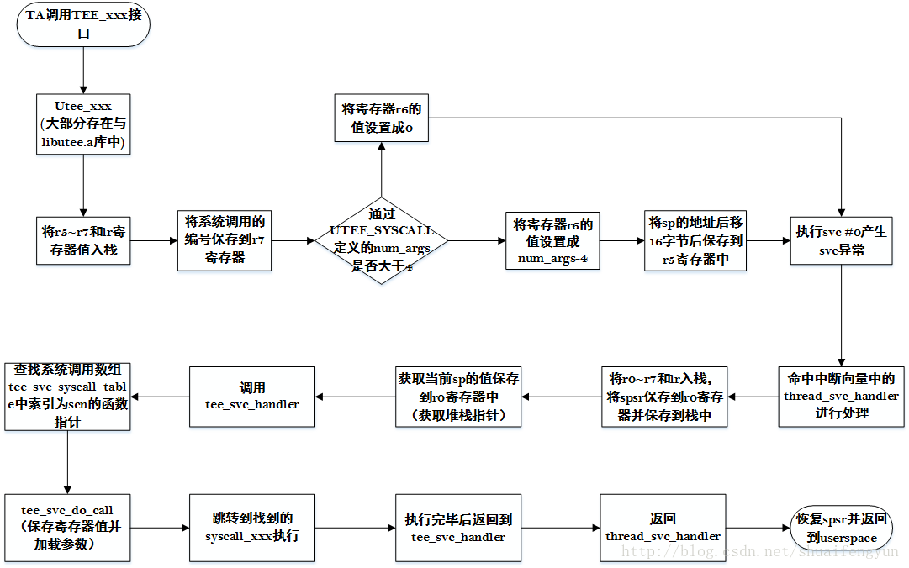

在GP文档中定义了很多接口，而这些接口大部分都是给TEE中的TA调用的，例如实现AES，RSA，SHA，HMAC，PBKDF等等算法在GP中都有统一的接口，该部分在OP-TEE编译的时候会被编译到`libutee.a`的库文件中，以备OP-TEE的userspace层面使用。

TA中可以通过调用这些接口来完成对数据的加解密以及验签等操作。如果板级有`hardware cipher`的话，调用这些算法接口之后最终会使用底层cipher驱动来完成计算操作。而cipher驱动是处于kernel space层面的，这也就衍生出了OP-TEE的system call的需求。

在OP-TEE中userspace的接口一般定义成`utee_xxx_xxx`的形式，而其对应的system call则为`syscall_xxx_xxx`。也即是在OP-TEE的userspace层面调用`utee_xxx_xxx`函数，系统最终会调用`syscall_xxx_xxx`来实现处理，可参考linux中系统调用的概念。在OP-TEE中一次完整的系统调用过程如下：


OP-TEE的系统调用的关键点上是通过svc切换到kernel space，通过类似中断的方式结合参数在系统调用数组中找到对应的函数并执行。完成之后切换cortex模式返回到userspace。

# 1.UTEE_SYSCALL宏

在定义一个syscall的时候，在userspace层面需要通过UTEE_SYSCALL宏来实现，在OP-TEE中所有的`utee_xxx`类的接口都使用该宏定义在`utee_syscalls_asm.S`文件中,该宏使用汇编来实现，内容如下：

```asm
.macro UTEE_SYSCALL name, scn, num_args
	FUNC \name , :
 
        push    {r5-r7,lr}	//保存r5~r7和lr
        mov     r7, #(\scn)	//将scn的值保存到r7中，scn为syscall的index
/* 检查参数个数，并根据num_args 的值来配置参数个数和参数在sp中的位置 */
	.if \num_args > TEE_SVC_MAX_ARGS
	.error "Too many arguments for syscall"
	.endif
        .if \num_args <= 4
        @ No arguments passed on stack
        mov     r6, #0
        .else
        @ Tell number of arguments passed on the stack
        mov     r6, #(\num_args - 4)
        @ Point just before the push (4 registers) above on the first argument
        add     r5, sp, #(4 * 4)
        .endif
        svc #0	//触发类svc中断
        pop     {r5-r7,pc}	//svc处理完成之后返回继续执行
	END_FUNC \name
.endm
```
该宏相当于实现了`utee_xxx`的函数，在宏参数中name相当于是`utee_xxx`，scn是系统调用的index， numargs参数个数，小于或者等于4则表示不需要传递数据给system call。

# 2. 系统调用表tee_svc_syscall_table

在kernel space中定义了一个系统调用的数组表`tee_svc_syscall_table`，该数组中包含了当前OP-TEE中支持的所有系统调用在kernel space的实现，该数组定义在`optee_os/core/arch/arm/tee/arch_svc.c`文件中。由于该数组较大，在此就不贴出来了。当在userspace中触发了svc之后，最终会调用到tee_svc_handler函数，在该函数中就会使用在userspace传递过来的scn值从tee_svc_syscall_table中获取到syscall的实现。即`tee_svc_syscall_table[scn]`中的内容即为需要调用的具体函数。

在tee_svc_handler中会调用tee_svc_do_call来执行`tee_svc_syscall_table[scn]`中定义的函数。在真正执行`tee_svc_syscall_table[scn]`之前会保存相关寄存器以便执行完成之后恢复到userspace，而且还需要将Userspace中带入的数据拷贝到kernel space供`tee_svc_syscall_table[scn]`中的函数使用。