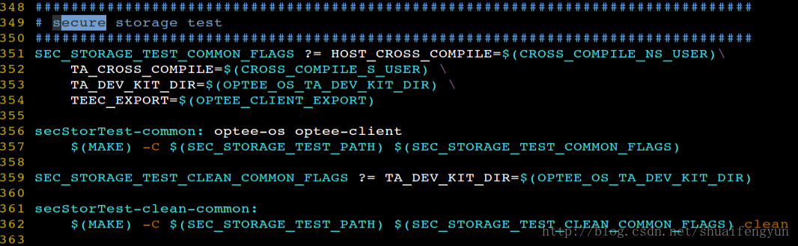

secure storage是TEE提供的一种用来存放`key, data`以及其他数据的功能，上层用户只要调用，TEE就能够将数据进行加密并保存到文件系统或者是EMMC的RPMB分区中，**至于将数据是保存到文件系统中还是RPMB中这是需要在编译TEE的时候进行相关的配置**，如果产品使用了RPMB分区，建议使用RPMB来保存数据，毕竟RPMB分区有EMMC自带的一套加密协议。故如果使用RPMB来对数据进行保护是相当于在TEE的加密机制之上叠加了RPMB分区对数据的保护，本文中的使用secure storage的代码是使用文件系统来保存数据。

本文中的示例主要是创建了一个TA和CA，对文件的操作做了一些简单的封装，提供了使用secure storage保存的文件数据的读取，写入，删除，重命名，创建文件，裁剪文件操作。如果需要保存文件，主要是使用TEE中的persistentObject来完成对文件的相关操作。接口的使用和参数说明都按照GP标准。源代码如下：

# 1.编译测试
下载上述代码后，将代码放在OP-TEE的根目录下，进入到secStorTest目录然后运行build_ta_secStor_qemu.sh脚本来测试代码是否能够编译通过（需要OP-TEE已经编译通过）

# 2.将secStor的TA和CA集成到系统中

如果运行build_ta_secStor_qemu.sh脚本测试编译通过之后。可以将secStorTest这个TA和CA添加到系统中去，代码在qemu+OP-TEE的方式运行是通过的。

## 2.1 修改Makefile
修改build目录中的Makefile或者qemu.mk，我将build目录下的Make链接成了qemu.mk，在Makefile中添加编译secStorTest的target，内容如下：

## 2.2 修改comm.mk文件

添加secStorTest所在目录变量`SEC_STOR_TEST_PATH`

添加编译secStorTest target的相关配置变量，添加的内容如下图所示:

在filelist-tee-common的target中添加socStorTest的相关操作，主要是在编译的时候将secStorTest的TA image和CA binary添加s到REE中的文件系统中。添加的内容如下图中的红框中部分：

# 3. 其他

在secStorTest目录中可以修改CA binary的名字，记得修改之后也需要同步修改comm.mk文件中的file-tee-common中的部分。同样也可以根据实际情况修改TA image的UUID，同时修改之后也需要同步修改comm.mk文件中的file-tee-common中的部分。关于如何修改UUID，怎么将自己的代码作为TA程序来运行的方法可参考《2.OP-TEE中添加自己的TA和CA》

# 4.整体编译工程并测试

修改完毕之后，进入到build目录中运行make -f qemu.mk all编译整个工程。关于如何使用secStorTest的CA binary，请参与secStorTest目录中的READM类似E.md一文。

编译完成之后在build目录下执行make -f qemu.mk run-only开始启动QEMU+OP-TEE的环境，启动完成之后在启动的linux shell端直接安全REAMME.md文中运行指令就可以。

在使用secure storage后，tee_supplicant将会在`/data/tee`目录下创建生成的文件，并将通过secue storage加密后的数据保存到对应的文件中，在`/data/tee`目录中会存在保存object的目录信息文件：`dirf.db`以及保存的文件编号：0

注意：只有在本CA中的main函数中注释掉删除文件的操作才能在`/data/tee`目录中看见生成的文件，如果没有注释，则最后会将该文件删除，在`/data/tee`目录中将不会有任何数据。