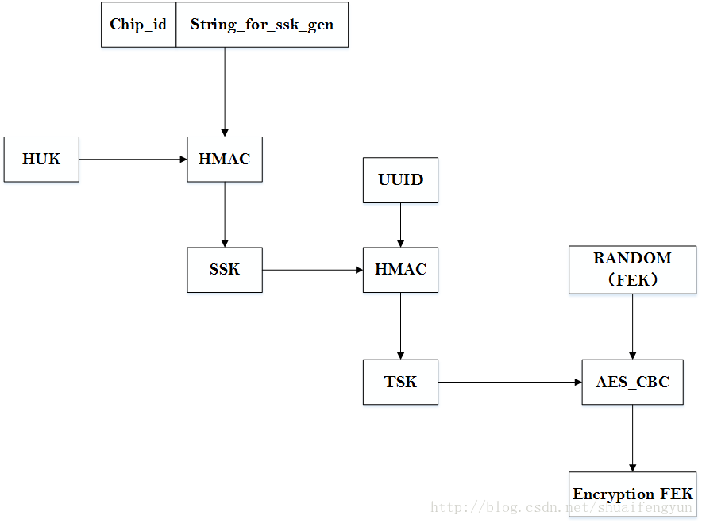

在OP-TEE中使用secure storage功能保存的数据都是经过`AES加密`之后被保存在文件系统或者是RPMB中的。使用AES算法进行加密或者解密的时候需要提供加密使用的`key`和`初始化向量IV值`。每个TA在使用secure storage功能保存数据的时候都会生成一个随机数作为IV值，使用FEK的值作为AES的key。而FEK的值是由一系列HMAC操作得到的。FEK值的生成牵扯到SSK和TSK，本文将介绍这些key的使用和生成，key之间的关系如下图所示：



# 1.SSK(Secure Storage Key)
在每台设备中的SSK的值不一样，在OP-TEE启动的时候会使用chip ID和HUK经过HMAC算法计算获取SSK的值，并见SSK的值保存在一般该值在结构体变量tee_fs_ssk的key成员成，以备生成其他key使用。工厂生产的时候会将HUK写入到`OTP/efuse`中，并且在normal world端是无法读取到HUK的值的，而chip ID在芯片出厂之后就会被写入到芯片中。


在OP-TEE启动的时候会执行tee_fs_init_key_manager函数，该函数就是用来根据`SSK = HMAC(HUK, message)`的方式来生成SSK，并保存在tee_fs_ssk的key成员中。该函数的内容如下：

```c
static TEE_Result tee_fs_init_key_manager(void)
{
	int res = TEE_SUCCESS;
	struct tee_hw_unique_key huk;
	uint8_t chip_id[TEE_FS_KM_CHIP_ID_LENGTH];
	uint8_t message[sizeof(chip_id) + sizeof(string_for_ssk_gen)];
 
	/* Secure Storage Key Generation:
	 *
	 *     SSK = HMAC(HUK, message)
	 *     message := concatenate(chip_id, static string)
	 * */
/* 获取HUK的值（该接口的实现与平台有关，不同的芯片具有不同的读取HUK值的方式） */
	tee_otp_get_hw_unique_key(&huk);
 
/*  获取chip ID的值（不同的芯片具有不同的读取chip id值的方式）*/
	tee_otp_get_die_id(chip_id, sizeof(chip_id));
 
/* 将chip id + string_for_ssk_gen连接后的值保存到message中，string_for_ssk_gen是一个
静态的字符串，该值被hard code在代码中 */
	memcpy(message, chip_id, sizeof(chip_id));
	memcpy(message + sizeof(chip_id), string_for_ssk_gen,
			sizeof(string_for_ssk_gen));
 
/* 使用huk的值对message的内容做HMAC运算，将获取到数据作为SSK，保存到tee_fs_ssk
变量的key成员中 */
	res = do_hmac(tee_fs_ssk.key, sizeof(tee_fs_ssk.key),
			huk.data, sizeof(huk.data),
			message, sizeof(message));
 
/* 标记ssk已经生产 */
	if (res == TEE_SUCCESS)
		tee_fs_ssk.is_init = 1;
 
	return res;
}
```

# 2.TSK(Trusted Applicant Storage Key)

TSK是用来生成FEK使用到的key，TSK的值由TA的UUID使用SSK作为key，经过HMAC计算获得，类似于HMAC(SSK, UUID)的方式得到TSK的值，在调用tee_fs_fek_crypt函数的时候就会去计算TSK的值。TSK最终会被用来生成FEK，FEK将会在使用secure storage功能保存数据的时候被用来加密数据。

# 3.FEK(File Encryption Key)

FEK是secure storage用来对数据进行加密使用的AES key，该key在生成文件的时候会使用PRNG来随机产生，产生的FEK会使用TSK进行加密，然后保存到head.enc_fek变量中，一个TA每次在使用secure storage创建一个安全文件时就生成一个随机数作为FEK，也即是每个TA中的每个安全文件都有一个FEK用于加密对应的文件数据。关于FEK值的产生可以简单理解为如下公式，使用的初始化向量IV值为0：`AES_CBC（in_key, TSK）`

　通过调用tee_fs_fek_crypt函数就能生成一个FEK的值，该函数代码如下：

```c
TEE_Result tee_fs_fek_crypt(const TEE_UUID *uuid, TEE_OperationMode mode,
			    const uint8_t *in_key, size_t size,
			    uint8_t *out_key)
{
	TEE_Result res;
	uint8_t *ctx = NULL;
	size_t ctx_size;
	uint8_t tsk[TEE_FS_KM_TSK_SIZE];
	uint8_t dst_key[size];
 
/* 检查输入的用于生成FEK的随机数in_key和用于存放生成的out_key地址是否合法 */
	if (!in_key || !out_key)
		return TEE_ERROR_BAD_PARAMETERS;
 
/* 检查in_key长度 */
	if (size != TEE_FS_KM_FEK_SIZE)
		return TEE_ERROR_BAD_PARAMETERS;
 
/* 判定SSK是否已经被初始化 */
	if (tee_fs_ssk.is_init == 0)
		return TEE_ERROR_GENERIC;
 
/* 如果调用的时候参数uuid不为0，则调用HMAC算法生成TSK。如果UUID的值为0，则
默认生成TSK使用的原始数据为0 */
	if (uuid) {
		res = do_hmac(tsk, sizeof(tsk), tee_fs_ssk.key,
			      TEE_FS_KM_SSK_SIZE, uuid, sizeof(*uuid));
		if (res != TEE_SUCCESS)
			return res;
	} else {
		/*
		 * Pick something of a different size than TEE_UUID to
		 * guarantee that there's never a conflict.
		 */
		uint8_t dummy[1] = { 0 };
 
		res = do_hmac(tsk, sizeof(tsk), tee_fs_ssk.key,
			      TEE_FS_KM_SSK_SIZE, dummy, sizeof(dummy));
		if (res != TEE_SUCCESS)
			return res;
	}
 
/* 获取调用AEC_CBC操作需要的context的大小 */
	res = crypto_ops.cipher.get_ctx_size(TEE_FS_KM_ENC_FEK_ALG, &ctx_size);
	if (res != TEE_SUCCESS)
		return res;
 
/* 分配一份进行AES_CBC操作时需要的context空间 */
	ctx = malloc(ctx_size);
	if (!ctx)
		return TEE_ERROR_OUT_OF_MEMORY;
 
/* 使用TSK作为进行AES_CBC计算使用的key，而IV值默认为0 */
	res = crypto_ops.cipher.init(ctx, TEE_FS_KM_ENC_FEK_ALG, mode, tsk,
				     sizeof(tsk), NULL, 0, NULL, 0);
	if (res != TEE_SUCCESS)
		goto exit;
 
/* 将输入的in_key填充到context中，做完AES_CBC操作之后，输出的数据将会被保存到
dst_key中 */
	res = crypto_ops.cipher.update(ctx, TEE_FS_KM_ENC_FEK_ALG,
			mode, true, in_key, size, dst_key);
	if (res != TEE_SUCCESS)
		goto exit;
 
/* 执行AES_CBC的加密运算，生成FEK */
	crypto_ops.cipher.final(ctx, TEE_FS_KM_ENC_FEK_ALG);
 
/* 将生成的FEK的值拷贝到输出参数中 */
	memcpy(out_key, dst_key, sizeof(dst_key));
 
exit:
	free(ctx);
 
	return res;
}
```