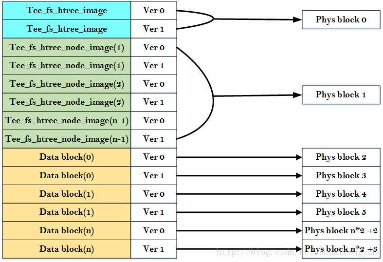
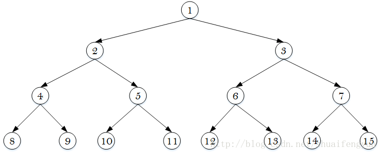
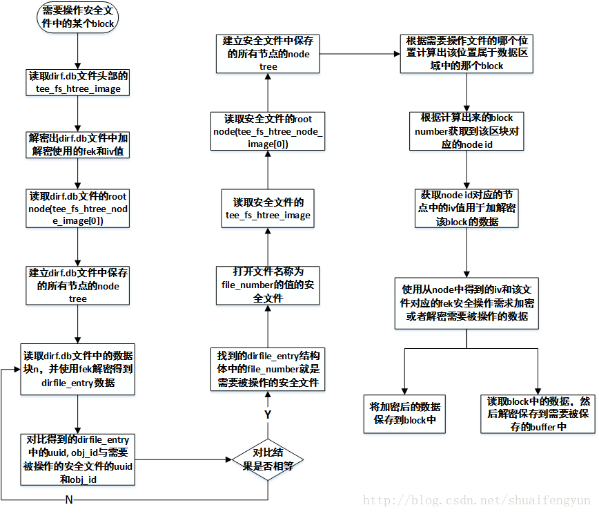

OP-TEE的secue sotrage功能能够满足用户保存敏感数据的需求，需要保存的数据会被加密保存到文件系统或者是RPMB中，当选择将数据保存到文件系统中时，默认情况下加密后的数据会被保存在`/data/tee`目录中。secure storage使用二叉树的方式来保存加密自后的文件。

当第一次使用secure storage创建用于保存敏感数据的时候，OP-TEE将会在`/data/tee`目录中生成两个文件：`dirf.db`文件和`以数字命名`的文件。

其中`dirf.db`文件保存的是整个secure storage保护的文件的所有`目录信息`和`节点信息`，当使用某个已经存在的安全文件时，首先需要读取到dirf.db文件中的相关内容，然后根据需要操作的安全文件名字的hash值在dirf.db文件中找到对应的文件编号，最终按照这个编号实现对文件的打开，关闭，写入，读出，重命名，裁剪等操作。

保存在`/data/tee`目录下的以数字命名的文件则是具体的被secure storage保存的用户文件。该文件保存的是用户数据加密之后的数据。而加密使用的key则是FEK，该key的生成请阅读《37.OP-TEE中secure storage----安全存储使用的key的产生》一文。

# 1.dirf.db文件和安全文件的格式

使用secure storage保存的文件都会使用同一的格式进行保存，而且dirf.db文件与实际的文件的格式也完全一样。安全文件中保存的内容格式如下图所示：



每个Pysb block的大小为4K，其中tee_fs_htree_image的结构体如下：

```c
struct tee_fs_htree_image {
	uint8_t iv[TEE_FS_HTREE_IV_SIZE];//加密iv+enc_fek时使用的iv值，每次保存head时会使用随机数更新
	uint8_t tag[TEE_FS_HTREE_TAG_SIZE];//加密iv+Enc_fek生成的数据的tag部分
	uint8_t enc_fek[TEE_FS_HTREE_FEK_SIZE];//使用TSK加密一个安全文件的fek生成的
	uint8_t imeta[sizeof(struct tee_fs_htree_imeta)];//加密iv+Enc_fek生成的数据的imeta部分
	uint32_t counter;//用于计算在保存tee_fs_htree_image的时候是存到ver0还是ver1
};
```
在保存每个block的时候都会使用fek来对需要保存的数据进行加密，而在打开读取文件的时候则会首先冲head中读取出enc_fek的值，然后使用tsk做解密操作来获取fek，最终使用解密后的fek对数据模块做解密操作获取明文的数据，再根据实际的需求获取到数据。tee_fs_htree_node_image的结构体如下：

```c
struct tee_fs_htree_node_image {
	/* Note that calc_node_hash() depends on hash first in struct */
	uint8_t hash[TEE_FS_HTREE_HASH_SIZE];//保存节点的hash值，用于在操作文件的时候找到该文件的head
	uint8_t iv[TEE_FS_HTREE_IV_SIZE];//加密安全文件数据区域中某一个block时使用的iv值，block数据的每次写入都会使用随机数更新
	uint8_t tag[TEE_FS_HTREE_TAG_SIZE];//加密安全数据区域中够一个block数据时生成的ta
	uint16_t flags;//用于计算使用block中的那个ver
};
```

data block是加密之后的需要被保存的数据，该数据使用该文件对应的fek和iv值进行加密。


在dirf.db文件中的data block区域保存的是所有使用secure storage保存的文件的相关信息，在secure sotrage中使用dirfile_entry结构体来表示每个安全文件的基本信息，该结构体如下：

```c
struct dirfile_entry {
	TEE_UUID uuid;//创建该安全文件的TA的UUID
	uint8_t oid[TEE_OBJECT_ID_MAX_LEN];//安全文件的名字（使用secure storage操作是的名字）
	uint32_t oidlen;//文件名字的长度
	uint8_t hash[TEE_FS_HTREE_HASH_SIZE];//data/tee目录下安全文件的root node的hash值
	uint32_t file_number;//保存在/data/tee目录下的文件编号
};
```

# 3.secure storage中的文件节点组成

在secure storage中,dirf.db文件和安全文件都使用的是二叉树的方式来保存文件编号或者是数据块。如果是在dirf.db文件中，数据块中保存的是dirfile_entry结构体变量（密文保存），而dirf.db文件中保存的就是与保存的数据块想对应的节点信息。通过dirf.db文件中的tee_fs_htree_node_image就能找到对应的保存了dirfile_entry数据块的数据。而在安全文件中同样也存在这样的对应关系，只不过数据块中保存的不再是dirfile_entry而是实际需要被保存的数据。而二叉树的保存方式如下，第一个节点作为dirf.db文件或者安全文件的root节点使用。



# 4.secure storage中寻找安全文件中特定数据块的操作过程

使用secure storage对已经保存的安全文件执行读写等操的时候都会先打开dirf.db文件，然后读取dirf.db文件中的数据区域，获取到整个secure storage中保存的所有文件的dirfile_entry信息，使用每个dirfile_entry中的uuid和obj_id与需要被操作的安全文件的uuid和obj_id进行对比来找到该安全文件保存在`/data/tee`目录下的文件编号。

查询到安全文件的文件编号之后就需要被该安全进行操作，同样会读取需要被操作的数据在安全中的位置，计算出block number，然后获得该block对应的node id获得该block的iv值，然后使用保存在安全文件head中的fek和获得的block的iv值对block进行解密操作来获取明文的数据，或者执行加密操作，将密文数据写入到block中。整个过程的大致流程如下图所示：


整个过程中node id与block number的对应关系是node id = block number + 1，而选取的是block中的哪个ver则与node id的ver相同。