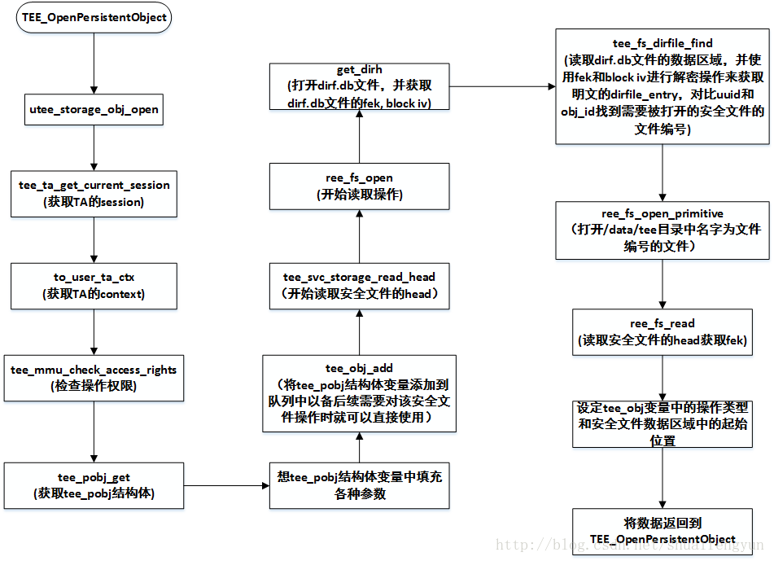
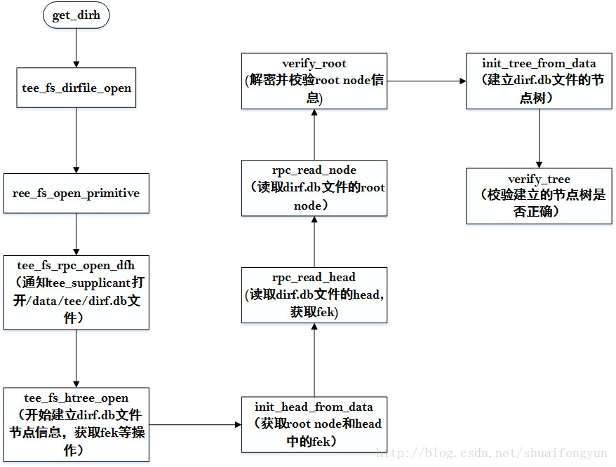
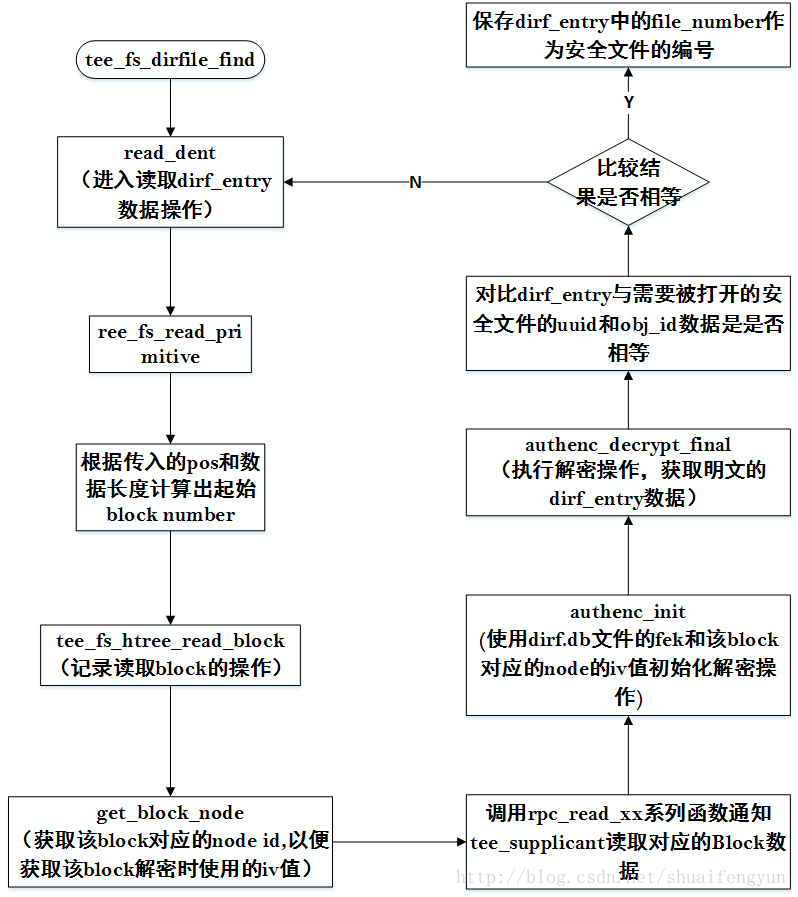

secure storage的完整实现不亚于一个小型的文件系统，为方便理解secure storage的实现，假设dirf.db文件和安全文件已经创建和初始化完毕，从对安全文件的`Open/write/read/rename`等方向入手理解整个secure storage的实现是一个很好的方向，本文将介绍安全文件的打开过程。

# 1. 打开操作的完整流程
使用secure storage的时候，在TA中调用TEE_OpenPersistentObject函数来实现打开某个特定的安全文件。该函数最终将会调用到utee_storage_obj_open函数进入到OP-TEE的kernel space进行打开操作，这个打开过程的执行流程如下图所示：



# 2.打开dirf.db文件并建立node tree

从`38. OP-TEE在secure storage----安全文件数据格式和操作过程`一文中的最后一章中可以看出，打开某个特定的安全文件的时候首先需要从dirf.db文件中找到该安全文件对应的文件编号。打开dirf.db文件是通过调用get_dirh函数来实现，整个打开流程的执行流程如下：



get_dirh函数的内容如下：

```c
static TEE_Result get_dirh(struct tee_fs_dirfile_dirh **dirh)
{
	if (!ree_fs_dirh_refcount) {
		TEE_Result res;
 
		assert(!ree_fs_dirh);
/* 执行打开dirf.db文件 */
		res = tee_fs_dirfile_open(&ree_dirf_ops, &ree_fs_dirh);
		if (res)
			return res;
	}
	assert(ree_fs_dirh);
	ree_fs_dirh_refcount++;	//标记difr.db文件已经被打开
	*dirh = ree_fs_dirh;	//将打开的dirf.db文件的相关信息返回
	return TEE_SUCCESS;
}
```

tee_fs_dirfile_open函数最终会调用ree_fs_open_primitive来实现打开dirf.db文件的操作。在该open函数中会调用tee_fs_rpc_open_dfh函数通知tee_supplicant打开`/data/tee/dirf.db`文件，并返回该文件的fd值，之后tee_fs_rpc_open_dfh函数会调用tee_fs_htree_open函数来读取dirf.db文件中最新的head，进解密之后获取到dirf.db文件加解密使用的fek，并建立dirf.db文件的node tree。tee_fs_htree_open函数内容如下：

```c
TEE_Result tee_fs_htree_open(bool create, uint8_t *hash, const TEE_UUID *uuid,
			     const struct tee_fs_htree_storage *stor,
			     void *stor_aux, struct tee_fs_htree **ht_ret)
{
	TEE_Result res;
	struct tee_fs_htree *ht = calloc(1, sizeof(*ht));
 
	if (!ht)
		return TEE_ERROR_OUT_OF_MEMORY;
 
	ht->uuid = uuid;
	ht->stor = stor;
	ht->stor_aux = stor_aux;
 
	if (create) {
		const struct tee_fs_htree_image dummy_head = { .counter = 0 };
 
		res = crypto_ops.prng.read(ht->fek, sizeof(ht->fek));
		if (res != TEE_SUCCESS)
			goto out;
 
		res = tee_fs_fek_crypt(ht->uuid, TEE_MODE_ENCRYPT, ht->fek,
				       sizeof(ht->fek), ht->head.enc_fek);
		if (res != TEE_SUCCESS)
			goto out;
 
		res = init_root_node(ht);
		if (res != TEE_SUCCESS)
			goto out;
 
		ht->dirty = true;
		res = tee_fs_htree_sync_to_storage(&ht, hash);
		if (res != TEE_SUCCESS)
			goto out;
		res = rpc_write_head(ht, 0, &dummy_head);
	} else {
/* 当在打开dirf.db文件是调用到函数，init_head_form_data
函数将会读取dirf.db文件最开始的tee_fs_htree_image结构体，并选用其中
最新的一个head，记录下该head的idx值（0/1）并调用rpc_read_node获取
dirf.db文件中的root node */
		res = init_head_from_data(ht, hash);
		if (res != TEE_SUCCESS)
			goto out;
/* 解密出root node的内容并校验*/
		res = verify_root(ht);
		if (res != TEE_SUCCESS)
			goto out;
 
/* 读取dirf.db文件中的所有node信息建立dirf.db文件的节点树 */
		res = init_tree_from_data(ht);
		if (res != TEE_SUCCESS)
			goto out;
/* 通过计算各节点内容的hash值，并与保存的hash进行比较来校验整个
节点的树是否合法 */
		res = verify_tree(ht);
	}
out:
	if (res == TEE_SUCCESS)
		*ht_ret = ht;
	else
		tee_fs_htree_close(&ht);
	return res;
}
```

# 3. 找到安全文件在/data/tee目录下的文件编号
打开了dirf.db文件并建立了文件节点树之后就可以通过通过读取dirf.db文件中的数据区域中存放的个文件对应的dirfile_entry来找到需要打开的安全文件的存储编号了，通过调用tee_fs_dirfile_find函数来实现，查找的过程如下：


在dirf.db文件的数据区域保存的是加密之后的dirf_entry数据。该数据使用dirf.db文件fek和该份数据处于的block number对应的node id中的IV进行加密，所有在读取过程中也得使用对应的数据才能获取到明文的dirf_entry数据。通过检查读取到的dirf_entry数据中的uuid, obi是否与需要打开的安全文件一直来判定是否找到正确的dirf_entry。如果匹配，则正确的那个dirf_entry数据中的file_number就是安全文件在/data/tee目录下的文件编号。

# 4.打开安全文件

得到的安全文件编号就是需要打开的安全文件，打开该文件，读取安全文件的head以及root node信息，并建立安全文件的node tree就可以正式对该安全文件进行读写操作了。打开安全同样也是调用ree_fs_open_primitive函数来实现，该函数的执行流程请参考前面章节。注意安全文件中的node id与数据区域中的block number对应关系。其中解密数据区域中的某个block中的密文数据需要使用到对应的node id中的iv，同时解密数据区域中的某个block中的密文数据还需要使用该安全文件对应的fek，该fek被加密保存在安全文件的head中，在打开安全文件的时候会被保存到`ht->fek`中。
