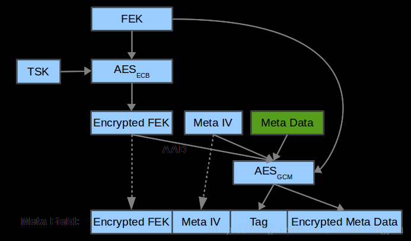
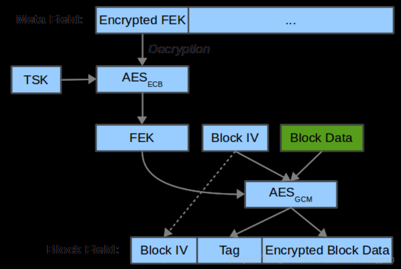

secure storage中的安全文件和dirf.db文件都是按照一定的格式保存的，主要由三部分组成：

* `tee_fs_htree_image`,
* `tee_fs_htree_node_image`
* 数据区域块`data block`。

tee_fs_htree_image和tee_fs_htree_node_image结构体中保存的是安全文件操作时使用到的重要数据的密文数据，tee_fs_htree_image区域中的数据是按照OP-TEE官方文档给出的meta data的方式加密重要数据之后获得。而data block和tee_fs_htree_node_image中的数据则是按照OP-TEE官方文档给出的block data encryption方式加密数据后获得。

# 1.各种类型数据的组成以及作用
关于安全文件中三种类型数据中的各个成员中的作用请参阅`38. OP-TEE中secure storage------安全文件数据格式和操作过程中`的第一章节。

* `tee_fs_htree_image`主要保存加密head的iv值和加密安全文件的fek的enc_fek以及加密之后生成的tag, imeta及标记两个tee_fs_htree_image哪个为最新的counter值。
* `tee_fs_htree_node_image`保存节点的hash值，加密data block使用的iv值，标记使用哪个data block的ver的flag值以及加密需要被保存的数据时生成的tag数据。
* `data block`区域保存的是加密需要保存的数据的密文数据。

中tee_fs_htree_image中的和imeta是按照meta data的方式加密对应的数据获得，tee_fs_htree_node_imaget中的ag跟data block中的数据则是按照block data encryption获得。

# 2. meta data加密
tee_fs_htree_image区域中的数据按照meta date方式加密生产，该加密的过程如下图所示：

上述加密操作过程中相关元素说明如下：

* `FEK`: 安全文件和dirf.db文件在执行加密操作时使用的key，该值在文件创建的时候使用随机数的方式生成，对已经创建好的文件进行操作时，该值会从tee_fs_htree_image中的enc_fek成员中使用TSK解密获得。
* `TSK`: TA Applicant storage key， 使用Ssk和UUID执行HMAC计算得到
* `AES_ECB`： 将FEK使用TSK进行AES的ECB模式进行加密操作生成enc_fek
* `Encrypted FEK`: 使用TSK加密FEK得到，保存在tee_fs_htree_image的enc_fek中，最终会被写入到安全文件或者dirf.db文件头的head中
* `Meta IV:` 使用secure storage创建文件或者将tee_fs_htree_image写入到文件中是都会被随机生成，最终会被写入到安全文件或者dirf.db文件头的head中
* `Meta Data:` `/data/tee`目录下每个文件中存放的tee_fs_htree_node_Image的个数相关的数据
* `AES_GCM:` 将enc_fek+meta iv+meta data使用FEK和meta IV进行AES的GCM模式进行加密操作生成Tag和Encryption Meta Data数据
* `Tag:` 加密enc_fek+meta iv+meta data时生成的tag值，数据会被保存在tee_fs_htree_image中的tag成员中
* `Encryptoed Meta Data:` 加密enc_fek+meta iv+meta data时生成的imeta值，数据会被保存在tee_fs_htree_image中的imeta成员中

# 3.block data encryption加密
`data block`和`tee_fs_htree_node_image`中的数据按照block data encryption的方式加密数据块生成，block data encryption方式的加密过程如下：

上述加密操作过程中相关元素说明如下：

* `Encrypted FEK:` 使用TSK加密FEK得到，保存在tee_fs_htree_image的enc_fek中，最终会被写入到安全文件或者dirf.db文件头的head中
* `TSK:` TA Applicant storage key， 使用Ssk和UUID执行HMAC计算得到
* `AES_ECB：` 将Encrypted FEK使用TSK进行AES的ECB模式进行解密操作生成fek
* `FEK:` 解密Encrypted FEK之后生成的fek，用于加密需要被保存的数据block
* `Block IV:` 每次加密数据区域中每个block是都会随机生成，然后被保存到tee_fs_htree_node_image变量的iv成员中
* `Block Data:` 将需要被保存的数据更新到对应的block的数据的正确位置之后生成的新的block的完成明文数据
* `AES_GCM:` 将Block IV+Block data使用FEK和Block IV进行AES的GCM模式进行加密操作生成Tag和Encryption Block Data数据
* `Tag:` 加密Block IV+Block data时生成的tag值，数据会被保存在tee_fs_htree_node_image中的tag成员中
* `Encryption Block Data:` 加密Block IV+Block data时生成的Encryption Block Data值，数据会被保存在文件中的数据区域对应的block中。
