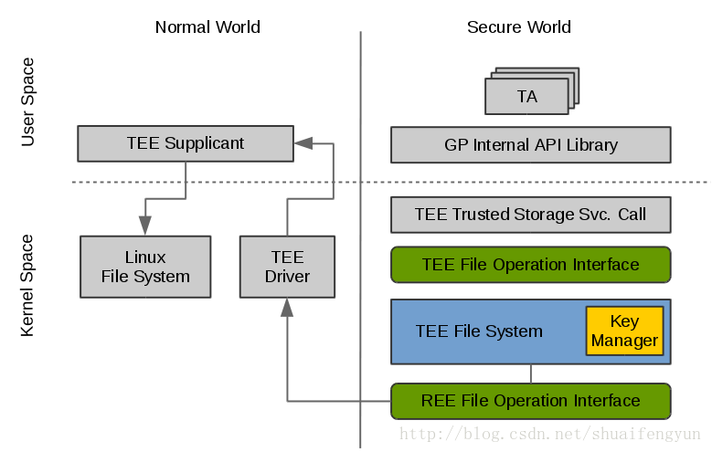
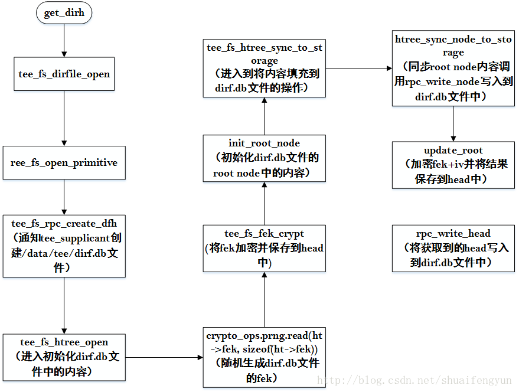
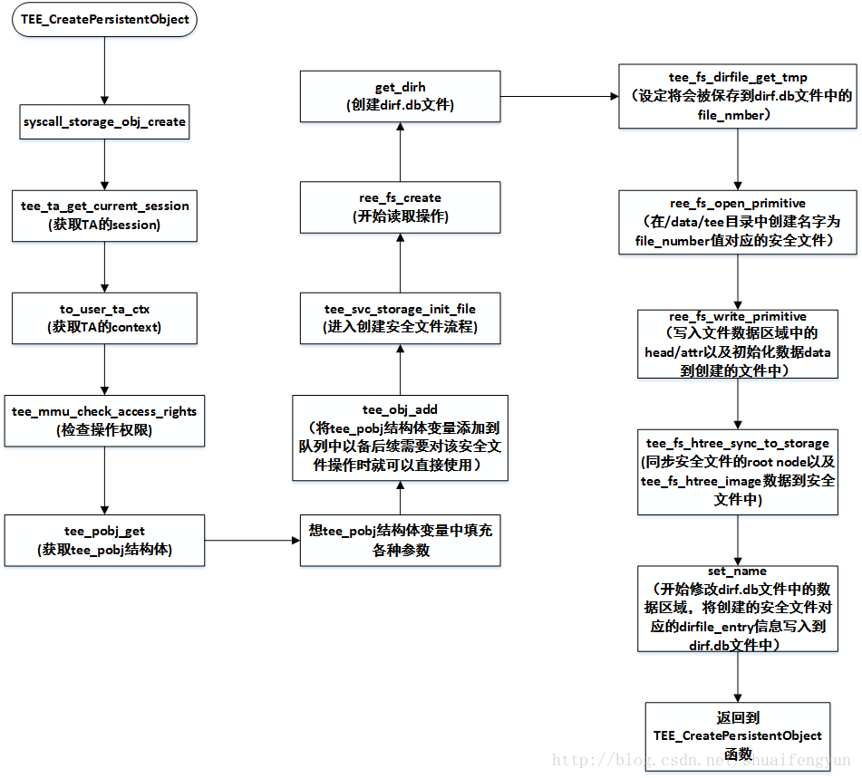

使用secure storage的时候首先就需要创建安全文件并初始化该安全文件。如果在创建安全文件之前，在`/data/tee`目录下如果没有dirf.db文件，则在创建安全文件之前首先会创建dirf.db文件并进行初始化，而创建的dirf.db文件和安全文件中的初始化数据都会按照相同的格式进分成三个区域进行保存。所有对REE侧中`/data/tee`目录中的操作都是通过在TEE侧发送RPC请求通知tee_supplicant来完成。

# 1.secure storage功能框架

所有对REE侧`/data/tee`目录下的文件操作都是通过tee_supplicant来实现，而整个secure storage 功能的架构如下图所示：

在TA中调用GP的接口，然后通过syscall陷入到OP-TEE的kernel space中，然后根据实际操作需求组装RPC请求需要的参数，并触发smc操作将RPC请求到tee_supplicant中，tee_supplicant将会解析出RPC请求中的参数，并按照参数的定义执行对`/data/tee`目录下的具体操作。

# 2.dirf.db文件的创建

当`/data/tee`目录下没有dirf.db文件时首先会创建dirf.db文件，在执行get_dirh函数时，get_dirh函数会判定在`/data/tee`目录下是否有dirf.db文件，如果没有则会先创建dirf.db文件。该文件的创建过程如下：

在创建dirf.db文件过程中会产生一个随机数作为fek,且在调用update_root函数时会产生另外一个随机数作为加密fek数据的IV值并保存到head.iv中。且每次head的更新该iv值都会重新使用随机数进行更新。

# 3.安全文件的创建
在TA中调用`TEE_CreatePersistentObject`接口可以创建安全文件，创建安全文件时可以带入初始化数据作为创建安全文件时数据区域的初始化数据被加密保存。而整个安全文件的创建过程如下图所示：

新建完安全文件之后会使用需要初始化的数据写入到创建的文件中，在将初始化数据加密后写入安全文件之后会更新整个安全文件的tee_fs_htree_node_image区域以及保存在文件头的tee_fs_htree_image区域。到此安全文件创建就完毕了，而为了后续操作能够通过dirf.db文件找到安全文件则还需要更新dirf.db文件中的内容，主要是dirf.db文件中的数据区域中的dirfile_entry数据。