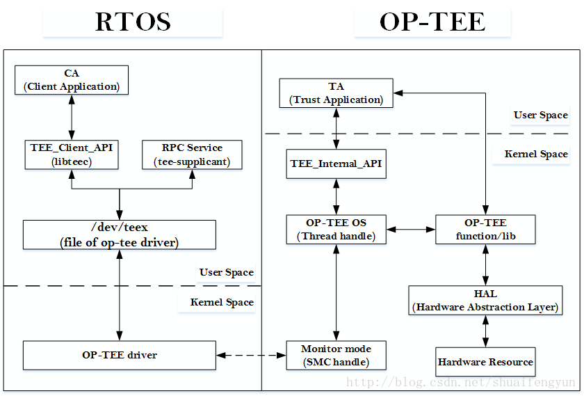

要使用OP-TEE来实现特定的安全功能就需要开发者根据自己的实际需求开发特定的`CA`和`TA`程序，并将TA集成到OP-TEE中。

* CA端负责实现在RTOS端userspace层面的对外接口
* TA端的代码则是在OP-TEE OS的userspace层面负责实现具体的安全功能，例如使用`各种算法组合来`对数据进行安全处理，对处理后的数据的安全保存，`解密加密数据`等等功能。

接下来的章节将详细介绍CA到TA之间的所有流程以及相关结构体设置，接口调用等等，关于如何在OP-TEE中添加自有的TA和CA程序请参考文档《2. OP-TEE中添加自己的TA和CA》。关于OP-TEE的中断处理的流程请查阅《OP-TEE中的中断处理》相关文章，接下来的章节将介绍不考虑中断的情况下，一个完整的TA和CA之间进行调用的完整过程分析。下图为系统中CA与TA之间执行的软件框图。

借助OP-TEE来实现特定安全需求时，一次完整的功能调用一般都是起源于CA，TA做具体功能实现并返回数据到CA，而整个过程需要经过OP-TEE的client端接口，OP-TEE在Linux kernel端的驱动，Monitor模式下的SMC处理，OP-TEE OS的thread处理，OP-TEE中的TA程序运行，OP-TEE端底层库或者硬件资源支持等几个阶段。当TA执行完具体请求之后会按照原路径将得到的数据返回给CA。

由于每家对具体API的具体实现不一样，但是其功能和对外接口都是遵循GP的标准来做的，笔者就遇见海思和mstar在实现CA端的API的时就各有各的方式，其中海思的实现方便更加复杂一点，因为海思在添加TA和CA的时候，在驱动层和TEE端都会对调用TEE服务的process或者thread做权限检查，建立了类似白名单机制，在海思的TEE中添加TA和CA的时候必须要注意CA端调用的process的注册。

由于当前所有厂商的TEE方案都会遵循GP标准，OP-TEE也遵循GP(Global Platform)标准，本文中牵扯到的API的实际实现则以OP-TEE中的`source code`为准。

在《OP-TEE中TA与CA执行流程介绍》系列文章中，笔者将以实际的CA和TA例子为例，分别按照如下章节对整个过程做详细的介绍：

* 1.CA部分的代码介绍
* 2.TEE_Client_API(libteec)的实现
* 3.tee_supplicant服务介绍
* 4.OP-TEE在linux端的驱动
* 5.Monitor mode中的处理
* 6.OP-TEE OS中thread的handle
* 7.TA部分的代码介绍