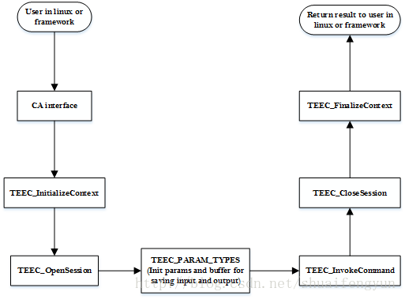

在该例子中实现了三个功能：打印`helloworld`, 调用`sha1`算法和`sha256`算法分别计算`hash值`，并将计算结构返回给CA端。


# 1.源码实现

1.`Makefile`内容

```makefile
CC = $(CROSS_COMPILE)gcc
LD = $(CROSS_COMPILE)ld
AR = $(CORSS_COMPILE)ar
NM = $(CROSS_COMPILE)nm
OBJCOPY = $(CROSS_COMPILE)objcopy
OBJDUMP = $(CROSS_COMPILE)objdump = $(CROSS_COMPILE)readelf

OBJS = main.o

CFLAGS += -Wall -I ../ta/include -I$(TEEC_EXPORT)/include -I ./include
#Add/link other required libraries here
LDADD += -lteec -L$(TEEC_EXPORT)/lib

BINARY = my_test

.PHONY:all
all:$(BINARY)

$(BINARY):$(OBJS)
	$(CC) $(LDADD) -o $@ $<

.PHONY:clean
clean:
	rm -f $(OBJS) $(BINARY)
```

2.`my_test_ca.h`

```c
#define TA_TEST_UUID { 0x9269fadd, 0x99d5, 0x4afb, \
	{0xa1, 0xdc, 0xee, 0x3e, 0x9c, 0x61, 0xb0, 0x4c}}
#define TA_MY_TEST_CMD_INC_VALUE 0
#define TA_MY_TEST_CMD_HASH 1
#define TA_MY_TEST_CMD_RANDOM 2

#define FAIL -1
#define OK 0

/*SHA operation type*/
typdef enum{
	EN_OP_SHA1 = 1,
	EN_OP_SHA224,
	EN_OP_SHA256,
	EN_OP_SHA384,
	EN_OP_SHA512,
	EN_OP_SHA_INVALID
}EN_SHA_MODE;

/*define the type of the variable*/
typedef unsigned char  UINT8;    /**< Typedef for 8bits unsigned integer  */
typedef unsigned short UINT16;   /**< Typedef for 16bits unsigned integer */
typedef uint32_t       UINT32;   /**< Typedef for 32bits unsigned integer */
typedef signed char    INT8;     /**< Typedef for 8bits signed integer    */
typedef signed short   INT16;    /**< Typedef for 16bits signed integer   */
typedef signed int     INT32;    /**< Typedef for 32bits signed integer   */
typedef char           CHAR;     /**< Typedef for char                    */
```

3.`main.c`文件

```c
#include <err.h>
#include <stdio.h>
#include <string.h>
#include <stdlib.h>

//OP-TEE client API(build by optee_client)
#include <tee_client_api.h>

//to the UUID(found the TA's h-file(s))

#include "my_test_ca.h"

//Flag if the task done initialize operation
static int g_TaskInitFlag= -1;

TEEC_UUID svc_id = TA_MY_TEST_UUID;
TEEC_Context g_TaskContext;
CHAR g_RandomOut[512]={0};

//Buffer for sha operation
CHAR g_ShaTestBuf[] ={
     'Y', 'o', 'u', ' ', 'y', 'o', 'u', ' ', 'c', 'h', 'e', 'c', 'k', ' ', 'n', 'o',
     'w', 'j', 'i', 'a', 'n', ' ', 'b', 'i', 'n', 'g', ' ', 'g', 'u', 'o', ' ', 'z',
     'i', ' ', 'l', 'a', 'i', ' ', 'y', 'i', ' ', 't', 'a', 'o', '!', '!', '!', '!'};
CHAR g_ShaOutput[80] = {0};

CHAR g_Sha1Result[] = 
{   
    0x21, 0x9b, 0x5b, 0x8b, 0x25, 0x6f, 0x0e, 0x52, 0xcb, 0x2f, 0xfe, 0xfd, 0x6c, 0x47, 0xd7, 0xb4, 
    0x44, 0x00, 0x57, 0xc3
};


CHAR g_Sha256Result[] = 
{   
    0xda, 0x52, 0xe9, 0xc2, 0x53, 0xae, 0x03, 0x30, 0xbd, 0x97, 0x3f, 0xa5, 0xf3, 0xea, 0x51, 0x1d, 
    0x31, 0x0a, 0xdf, 0x1f, 0x0a, 0xc0, 0x0e, 0x62, 0x0f, 0x2d, 0x5e, 0x99, 0xf5, 0xc8, 0x6b, 0x8f
};

void g_CA_PrintfBuffer(CHAR* buf, UINT32 len)
{
    UINT32 index = 0U;
    for(index = 0U; index < len; index++){
        if(index < 15U){
        }else if(0U == index%16U){
            printf("\n");
            
        }else{}
        	printf("0x%02x, ", (buf[index] & 0x000000FFU));
    }
    printf("\n");  
}
int l_CryptoVerifyCa_TaskInit(void){
	TEEC_Result result;
	int l_RetVal = OK;
	
	//1.check if need to do task initizlization operation
	if(-1 == g_TaskInitFlag){
		result = TEEC_InitializeContext(NULL,&g_TaskContext);
		if(result != TEEC_SUCESS){
			printf("InitializeContext failed,ReturnCOde = 0x%x\n",result);
			l_RetVal =FAIL;
		}else{
			g_TaskInitFlag=0;
			printf("InitializeContext success \n");
			l_RetVal = OK;
		}
	}
	return l_RetVal;
}

int l_CryptoVerifyCa_OpenSession(TEEC_Session* session){
	TEEC_Result result;
	int l_RetVal =FAIL;
	uint32_t orign;
	
	result = TEEC_OpenSeesion(&g_TaskContext,session,&svc_id,TEEC_LOGIN_PUBLIC,NULL,NULL,&origin);
	 if(result != TEEC_SUCCESS) {
        printf("OpenSession failed, ReturnCode=0x%x, ReturnOrigin=0x%x\n", result, origin);
        g_TaskInitFlag = -1;
        l_RetVal = FAIL;
    } else {
        printf("OpenSession success\n");
        l_RetVal = OK;
    }
    return l_RetVal;
}

int l_CryptoVerifyCa_SendCommand(TEEC_Operation* operation, TEEC_Session* session, uint32_t commandID){
	 TEEC_Result result;
    int l_RetVal = FAIL;
    uint32_t origin;

    result = TEEC_InvokeCommand(session, commandID, operation, &origin);
    if (result != TEEC_SUCCESS) {
        printf("InvokeCommand failed, ReturnCode=0x%x, ReturnOrigin=0x%x\n", result, origin);
        l_RetVal = FAIL;
    } else {
        printf("InvokeCommand success\n");
        l_RetVal = OK;
    }
    return l_RetVal;
}
void g_CryptoVerifyCa_Helloworld(void){
	TEEC_Session l_session;//define the session of TA&CA
	TEEC_Operation l_operation;//define the operation for communicating between TA&CA
	int l_Reval = FAIL;
	
	//1.Initilize this task
	l_Retval= l_CryptoVerifyCa_TaskInit();
	if(FAIL == l_RetVal){
		goto cleanup_1;
	}

	//2.Open session
	l_RetVal= l_CryptoVerifyCa_OpenSession(&l_session);
	if(FAIL==l_RetVal){
		goto cleanup_2;
	}
	
	//clear the TEEC_Operation struct
	memset(&l_operation,0,sizeof(TEEC_Operation));
		
	//prepare the argument.pass a value in the first parameter
	//the remaining three parameters are unused
	l_operation.paramTypes=TEEC_PARAM_TYPES(TEEC_VALUE_INOUT,TEEC_NONE,TEEC_NONE,TEEC_NONE,TEEC_NONE);
	l_operartion.param[0].value.a=42;
	
	//4.send command to TA
	l_RetVal=l_CrytoVerifyCa_SendCommand(&l_operation,&l_session,TA_MY_TEST_CMD_INC_VALUE);
	if(FAIL == l_RetVal){
		goto cleanup_3;
	}

	//5.the clean up operation
cleanup_3:
	TEEC_CloseSession(&l_session);	
cleanup_2:
	TEEC_FinalizeContext(&g_TaskContext);
cleanup_1:
	printf("over\n");	
}
int g_CryptoVerifyCa_Sha(CHAR* pData, UINT32 len, EN_SHA_MODE shaMode, CHAR* output, UINT32 outLen)
{
    TEEC_Session   l_session;    /* Define the session of TA&CA */
    TEEC_Operation l_operation;  /* Define the operation for communicating between TA&CA */
    int l_RetVal = FAIL;       /* Define the return value of function */

    /**1) Initialize this task */
    l_RetVal = l_CryptoVerifyCa_TaskInit();
    if(FAIL == l_RetVal)
    {
        goto cleanup_1;
    }

    /**2) Open session */
    l_RetVal = l_CryptoVerifyCa_OpenSession(&l_session);
    if(FAIL == l_RetVal)
    {
        goto cleanup_2;
    }

    /**3) Set the communication context between CA&TA */
    memset(&l_operation, 0x0, sizeof(TEEC_Operation));
    l_operation.started = 1;
    l_operation.paramTypes = TEEC_PARAM_TYPES(TEEC_MEMREF_TEMP_INPUT,TEEC_VALUE_INPUT, 
                                              TEEC_MEMREF_TEMP_OUTPUT, TEEC_NONE);
    l_operation.params[0].tmpref.size = len;
    l_operation.params[0].tmpref.buffer = pData;
    l_operation.params[1].value.a = shaMode;
    l_operation.params[2].tmpref.size = outLen;
    l_operation.params[2].tmpref.buffer = output;

    /**4) Send command to TA */
    l_RetVal = l_CryptoVerifyCa_SendCommand(&l_operation, &l_session, TA_MY_TEST_CMD_HASH);
    printf("The respond data length is 0x%02x\n", outLen);
    if(FAIL == l_RetVal)
    {
        goto cleanup_3;
    }

    /**5) The clean up operation */
    cleanup_3:
        TEEC_CloseSession(&l_session);
    cleanup_2:
        TEEC_FinalizeContext(&g_TaskContext);
    cleanup_1:
        return l_RetVal;
}
int main(int argc,char* argv[]){
	//1.helloworld
	if(0 == memcmp(argv[1],"helloworld",10)){
		printf("Entry get helloworld CA \n");
		g_CryptoVerifyCa_Helloworld();
		printf("The Respond helloworld from TA just like follow:\n");
	}
	
	//2.sha1
	if(0 ==memcmp(argv[1],"sha1",4)){
		printf("Entry sha1 CA\n");
        g_CryptoVerifyCa_Sha(g_ShaTestBuf, sizeof(g_ShaTestBuf), EN_OP_SHA1, g_ShaOutput, 20);
        printf("The Respond hash data from TA just like follow:\n");
        g_CA_PrintfBuffer(g_ShaOutput, 20);
	}
}
```

# 2.解释分析

关于在OP-TEE中如何添加自己的TA和CA请参阅《2. OP-TEE中添加自己的TA和CA》，修改好对应的makefile,配置文件，UUID, commandID等等之后，完成一次完整的CA请求时在linux userspace端需要执行的操作依次如下 ：

* 1.调用`TEEC_InitializeContext`函数打开**op-tee驱动文件**，获取到操作句柄并存放到`TEE_Context`类型的变量中。
* 2.调用`TEEC_OpenSession`函数，通过获取到的TEE_Context类型的变量创建一个特定CA与特定TA之间进行通信的通道，如果`TA image`被存放在`file system`中，那个在创建session的时候，`OP-TEE OS`端还会将`TA image`从`file system`中加载到`OP-TEE`。
* 3.初始化`TEEC_Operation`类型的变量，并根据实际需要借助`TEEC_PARAM_TYPES`宏来设定`TEEC_Operation`类型变量中paramTypes成员的值，该值规定传递到OP-TEE中的最多4个变量缓存或者是数据的作用（作为输入还是输出）。并且还要根据paramTypes的值设定对应的`params[x]`成员的`值`或者是`指向`的地址以及缓存的长度。
* 4.使用已经创建好的session，TA与CA端规定的command ID以及配置好的TEEC_Operation类型变量作为参数调用`TEEC_InvokeCommand`函数来真正发起请求。 调用`TEEC_InvokeCommand`成功之后，剩下的事情就有OP-TEE和TA进行处理并将结果和相关的数据通过TEEC_Operation类型变量中的params成员返回给CA。
* 5.调用成功之后如果不需要再次调用该TA则需要`注销session`和`释放掉context`，这两个操作一次通过调用`TEEC_CloseSession`函数和`TEEC_FinalizeContext`函数来实现。

在Linux端一次完整的CA接口调用过程如下图所示：



# 3.注意

* 1.注意在如果调用CA接口是一个service或者是一个常驻linux kernel且该接口会被多次调用的时候，**在未将context和session释放掉的前提下**，`TEEC_InitializeContext`和`TEEC_OpenSession`接口**不要重复调用**，**否则会引起OP-TEE出错**，因为每次执行initialize context和openssion的时候，OP-TEE都会划分一定的memory，如果在为释放已有资源的时候重复分配context和session，则会造成OP-TEE内存泄露。**针对该情况**:可以在CA接口的实现时对执行初始化context和open session的操作**添加一个flag**进行控制，当该接口的context和session已经被初始化时则不需要重复操作，而且在调用完TEEC_InvokeCommand之后，如果service或者Process还需要调用该CA接口，则不建议立即释放context和session。详细情况请查阅测试代码（测试代码加了flag，但是对于调用完TEEC_InvokeCommand操作后的后续操作需要重新搞搞，以后会更新该代码）
* 2.在使用过程过程中，一般会将CA接口打包成库文件给上层调用，也可以将该接口封装成JNI接口供JAVA层调用。
* 3.关于上述几个TEEC接口的具体实现每家芯片厂商可能不一样，但对于用户来说都一样。下文将以OP-TEE的实现为准进行介绍。后续有时间可以讲讲海思和mstar添加TA和CA的方式
