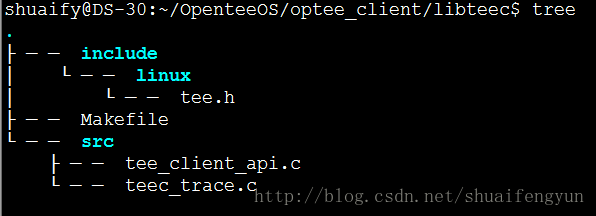

`libteec库`是OP-TEE提供给用户在linux userspace层面调用的接口实现，对于**该部分每家芯片厂商可能不一样**。本文将以OP-TEE的实现方法为例进行介绍。

libteec代码的具体实现存放在`optee_client/libteec`目录下，OP-TEE提供给linux端使用的接口源代码的实现存放在`optee_client/libteec/src/tee_client_api.c`,如下图所示：



在OP-TEE中libteec提供给上层用户使用的API一共有10个，他们分别为：

* 1.`TEEC_Result TEEC_InitializeContext(const char *name, TEEC_Context *ctx)`
* 2.`void TEEC_FinalizeContext(TEEC_Context *ctx)`
* 3.`TEEC_Result TEEC_OpenSession(TEEC_Context *ctx, TEEC_Session *session,const TEEC_UUID *destination,uint32_t connection_method, const void *connection_data,TEEC_Operation *operation, uint32_t *ret_origin)`
* 4.`void TEEC_CloseSession(TEEC_Session *session)`
* 5.`TEEC_Result TEEC_InvokeCommand(TEEC_Session *session, uint32_t cmd_id,TEEC_Operation *operation, uint32_t *error_origin)`
* 6.`void TEEC_RequestCancellation(TEEC_Operation *operation)`
* 7.`TEEC_Result TEEC_RegisterSharedMemory(TEEC_Context *ctx, TEEC_SharedMemory *shm)`
* 8.`TEEC_Result TEEC_RegisterSharedMemoryFileDescriptor(TEEC_Context *ctx,TEEC_SharedMemory *shm,int fd)`
* 9.`TEEC_Result TEEC_AllocateSharedMemory(TEEC_Context *ctx, TEEC_SharedMemory *shm)`
* 10.`void TEEC_ReleaseSharedMemory(TEEC_SharedMemory *shm)`

上述10个API都按照GP标准进行定义，使用上述10个API能够满足用户在userspace层面的需求，在系统中这部分会被编译成`libteec库`的形式存在。下面一次介绍上述10个API的作用：

## 1.TEEC_InitializeContext

* `函数原型`:`TEEC_Result TEEC_InitializeContext(const char *name, TEEC_Context *ctx)`
* `函数作用描述`:初始化一个TEEC_Context变量，该变量用于CA和TEE之间建立联系。其中参数name是用来定义TEE的身份，如果该参数为NULL，则CA将会选择默认的TEE方案来建立联系。该API是第一次调用TA是不行执行的函数。
* `参数说明`：
	* `name`:指向TEE的名字，一般情况下该值设置成NULL，使其选择默认的TEE方案进行连接
	* `ctx`:指向一个类型为TEEC_Context的变量的地址，该变量会用于CA与TA之间连接和通信。
* `函数返回值：`
	* `TEEC_SUCCESS`: 初始化操作成功
	* 其他返回值表示初始化失败

函数实现（在`OP-TEE`厂商中的实现）如下：

```cpp
TEEC_RESULT TEEC_InitializeContext(const char* name,TEEC_Context *ctx){
	char devname[PATH_MAX];
	int fd;
	size_t n;
	if(!ctx){
		return TEEC_ERROR_BAD_PARAMETERS;
	}	
	/*
	调用teec_open_dev打开可用的TEE驱动文件，在打开的过程中会校验TEE的版本信息
    如果检查合法，则会返回该驱动文件的句柄fd, 然后将fd赋值给ctx变量的fd成员
	*/
	for(n=0;n<TEEC_MAX_DEV_SEQ；n++){
		snprintf(devname,sizeof(devname),"dev/tee%zu",n);
		fd=teec_open_dev(devname,name);
		if(fd >=0){
			ctx->fd= fd;
			return TEEC_SUCCESS;
		}
	}
	return TEEC_ERROR_ITEM_NOT_FOUND;
}
```

## 2.TEEC_FinalizeContext

* `函数原型`：`void TEEC_FinalizeContext(TEEC_Context *ctx)`
* `函数作用描述`：释放一个已经被初始化过的类型为TEEC_Context变量，关闭CA与TEE之间的连接。**在调用该函数之前必须确保打开的session已经被关闭了**。
* `参数说明`：
	* `ctx`: 指向一个类型为TEEC_Context的变量，该变量会用于CA与TA之间连接和通信。
* `函数返回值`：无
* 函数实现（在OP-TEE中的实现）如下：

```cpp
void TEEC_FinializeContext(TEEC_Context *ctx){
	/*调用close函数，释放掉tee驱动文件的描述符来完成资源释放 */
	if(ctx)
		close(ctx->fd);
}
```

## 3.TEEC_OpenSession

* `函数原型`：`TEEC_Result TEEC_OpenSession(TEEC_Context *ctx, TEEC_Session *session,const TEEC_UUID *destination,uint32_t connection_method, const void *connection_data,TEEC_Operation *operation, uint32_t *ret_origin)`
* `函数作用描述`：打开一个CA与对应TA之间的一个session，该session用于该CA与对应TA之间的联系，该CA需要连接的TA是由UUID指定的。session具有不同的打开和连接方式，根据不同的打开和连接方式CA可以在执行打开session的时候传递数据给TA，以便TA对打开操作做出权限检查。各种打开方式说明如下：
	* `TEEC_LOGIN_PUBLIC`：不需要提供，也即是`connectionData`的值必须为NULL
	* `TEEC_LOGIN_USER`： 提示用户链接，connectionData的值必须为NULL
	* `TEEC_LOGIN_GROUP`： CA以某一组的方式打开session，connectionData的值必须指向一个uint32_t的数据，该数据组的信息。在TA端将会对connectionData的数据进行检查，判定CA是否真属于该组。
	* `TEEC_LOGIN_APPLICATION`： 以application的方式连接，connectionData的值必须为NULL
	* `TEEC_LOGIN_USER_APPLICATION`： 以用户程序的方式连接，connectionData的值必须为NULL
	* `TEEC_LOGIN_GROUP_APPLICATION`： 以组应用程序的范式连接，其中connectionData需要指向一个uint32_t类型的变量。在TA端将会对connectionData的数据进行权限检查，查看连接是否合法。
* `参数说明`：
	* `context`: 指向一个类型为TEEC_Context的变量，该变量用于CA与TA之间连接和通信，调用`TEEC_InitializeContext`函数进行初始化。
	* `session`: 存放session内存的变量
	* `destination`:指向存放需要连接的TA的UUID的值的变量
	* `connectionMethod`:CA与TA的连接方式，详细请参考函数描述中的说明
	* `connectionData`:指向需要在打开session的时候传递給TA的数据
	* `operation`:指向`TEEC_Operation`结构体的变量，变量中包含了一系列用于与TA进行交互使用的buffer或者其他变量。如果在打开session时CA和TA不需要交互数据，则可以将该变量指向NULL
	* `returnOrigin`:用于存放从TA端返回的结果的变量，如果不需要返回值，则可以将该变量指向NULL
* 函数返回值：
	* `TEEC_SUCCESS`: 初始化操作成功
	* 其他返回值表示初始化失败
* 函数实现（在OP-TEE中的实现）如下：

```cpp
```