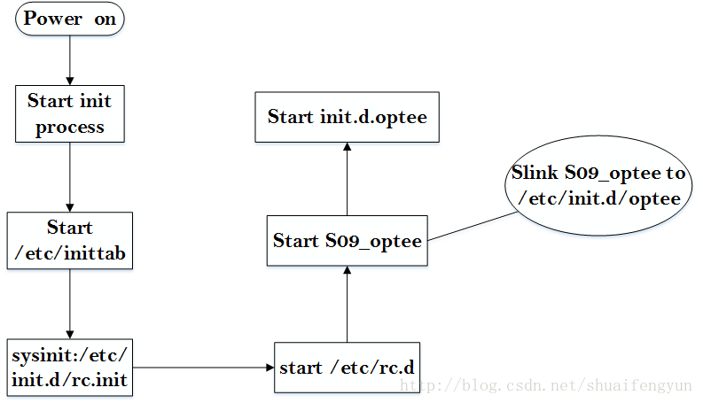
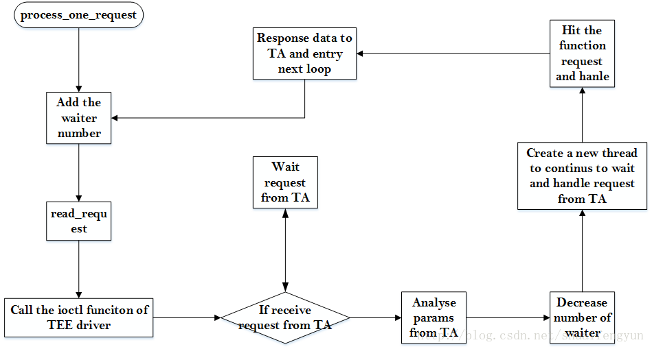

`tee_supplicant`的主要作用是使OP-TEE能够通过tee_supplicant来访问REE端文件系统中的资源。例如：

* 1.加载存放在文件系统中的TA镜像到TEE中
* 2.对REE端数据库的操作，对EMMC中RPMB分区的操作，提供socket通信等。

其源代码`optee_client/tee-supplicant`目录中。编译之后会生成一个名字为`tee_supplicant`的可执行文件，该可执行文件在REE启动的时候会作为一个后台程序被自动启动，而且常驻于系统中。

# 1.1. tee_supplicant编译生成和Linux中的自启动
tee_supplicant会在编译optee-client目标的时候被编译生成一个可执行文件，具体编译过程请查看optee-client目录中的Makefile文件结合《3.OP-TEE+qemu的编译--工程编译target依赖关系》文章就能明了该可执行文件是如何一步步被编译出来的。

　`tee_supplicant`可执行文件在Linux启动的时候会被作为后台程序启动。启动的动作存放在`build/init.d.optee`文件中，其内容如下：

```bash
#!/bin/sh

#/etc/init.d/optee

#start/stop tee-supplication (OP-TEE normal world daemon)

case "$1" in
	start)
		if [ -e /bin/tee-supplicant -a -e /dev/teepriv0 ];then
			echo "Starting tee-supplicant ..."
			tee-supplication &
			exit 0
		else
			echo "tee-supplicant or TEE device not found"
			exit 1
		fi
		;;
	stop)
		killall tee-supplicant
		;;
	status)
		# “||”之前为yes则后面执行
		cat /dev/teepriv0 2>&1 | grep -1 "Device or resource busy" || not = "not "
		echo "tee-supplicant is ${not}active"
		;;
esca
```
在编译的时候init.d.optee文件将会被打包到根文件系统中并以"optee“名字存放在`/etc/init.d`目录中。而且会被链接到`/etc/rc.d/S09_optee`文件。这些操作是在编译生成rootfs的时候所做的，详细情况请查看`build/common.mk`文件中`filelist-tee-common`目标的内容。系统启动`tee_supplicant`的过程如下图所示：



# 2. tee_supplicant入口函数

tee_supplicant启动后作为Linux中的一个后台程序运行，起到处理RPC请求 service的作用。通过类似于C/S的方式为OP-TEE提供对REE端文件系统的操作。该可执行文件的源代码的入口函数存放在`optee_client/tee-supplicant/src/tee_supplicant.c`文件中。其入口函数内容如下:

```cpp
int main(int argc,char*argv[]){
	struct thread_arg arg={.fd=-1};
	int e;
	/*初始化互斥体*/
	e=pthread_mutex_init(&arg.mutex,NULL);
	if(e){
		EMSG("pthread_mutex_init:%s",strerror(e));
		EMSG("terminating...");
		exit(EXIT_FAILURE);
	}

	/*判定是否带有启动参数，如果带有启动参数，则打开对应的驱动文件
    如果没有带参数，则打开默认的驱动文件*/
	if (argc > 2)
		return usage();
	if (argc == 2) {
		arg.fd = open_dev(argv[1]);
		if (arg.fd < 0) {
			EMSG("failed to open \"%s\"", argv[1]);
			exit(EXIT_FAILURE);
		}
	} else {
/*打开/dev/teepriv0设备，该设备为tee驱动设备文件，返回操作句柄*/
		arg.fd = get_dev_fd();
		if (arg.fd < 0) {
			EMSG("failed to find an OP-TEE supplicant device");
			exit(EXIT_FAILURE);
		}
	}
	if (tee_supp_fs_init() != 0) {
		EMSG("error tee_supp_fs_init");
		exit(EXIT_FAILURE);
	}
 
	if (sql_fs_init() != 0) {
		EMSG("sql_fs_init() failed ");
		exit(EXIT_FAILURE);
	}	
	/*调用process_one_request函数接收来自TEE的请求，并加以处理*/
	while (!arg.abort) {
		if (!process_one_request(&arg))
			arg.abort = true;
	}
 
	close(arg.fd);
	return EXIT_FAILURE;
}
```

# 3.tee_supplicant中的loop循环
tee_supplicant启动之后最终会进入一个loop循环，调用process_one_request函数来`监控`，`接收`，`处理`，`回复`OP-TEE的请求。整个处理过程如下图所示：



process_one_request函数的内容如下：

```cpp
```