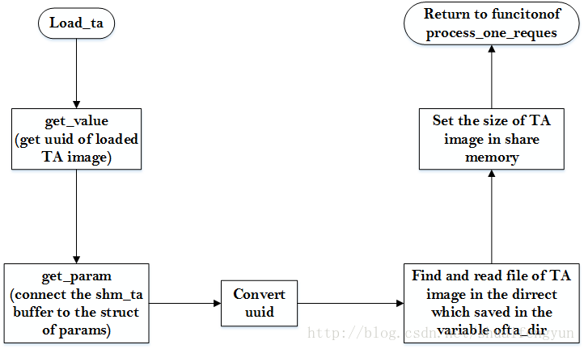

当tee_supplicant接收到来自TA的请求并解析出对应的请求`func ID`之后，tee_supplicant将会根据func ID来执行具体的请求操作。主要是**针对在REE端的文件系统的操作**。

# 1. 加载TA image到共享内存
当TA请求的func ID为`RPC_CMD_LOAD_TA`时，tee_supplicant将会到文件系统中将TA镜像的内容读取到共享内存中。该操作是通过调用load_ta函数来实现的，该函数定义在tee_supplicant.c文件中，内容如下：

```cpp
static uint32_t load_ta(size_t num_params,struct tee_ioctl_param* params){
	int ta_found =0;
	size_t size =0;
	TEEC_UUID uuid;
	struct tee_ioctl_param_value *val_cmdk;
	TEEC_SharedMemory shm_ta;
	
	memset(&shm_ta,0,sizeof(shm_ta));
	/*解析出需要加载的TA镜像的UUID以及配置将读取到的TA镜像的内容存放位置*/
	if(num_params != 2 || get_value(num_params, params, 0, &val_cmd) ||
	get_param(num_params, params, 1, &shm_ta)){	
		return TEEC_ERROR_BAD_PARAMETERS;
	}
	//将UUID的值转换成TEEC_UUID格式
	uuid_from_octets(&uuid,(void *)val_cmd);
	//从ta_dir变量指定的目录中查找与UUID相符的TA镜像，并将其内容读取到共享内存中
	size = shm_ta.size;
	ta_found = TEECI_LoadSecureModule(ta_dir, &uuid, shm_ta.buffer, &size);
	if (ta_found != TA_BINARY_FOUND) {
		EMSG("  TA not found");
		return TEEC_ERROR_ITEM_NOT_FOUND;
	}
	//设定读取到的TA镜像的大小到返回参数的size成员中
	params[1].u.memref.size = size;
	return TEEC_SUCCESS;
}
```
该函数的执行流程如下：



# 2.执行对REE端文件系统的操作

当`func ID`为`RPC_CMD_FS`时，tee_supplicant将会根据TA请求调用tee_supp_fs_process函数来完成对文件系统的具体操作，包括常规的文件和目录的`打开`，`关闭`，`读取`，`写入`，`重命名`，`删除`，等等。其内容如下：

```cpp
TEEC_Result tee_supp_fs_process(size_t num_params,
				struct tee_ioctl_param *params)
{
/* 解析出params */
	if (num_params == 1 && tee_supp_param_is_memref(params)) {
		void *va = tee_supp_param_to_va(params);
 
/* 如果num_params为1，且转换后va合法，则调用tee_supp_fs_process_primitive
函数进行文件操作 */
		if (!va)
			return TEEC_ERROR_BAD_PARAMETERS;
		return tee_supp_fs_process_primitive(va, params->u.memref.size);
	}
 
	if (!num_params || !tee_supp_param_is_value(params))
		return TEEC_ERROR_BAD_PARAMETERS;
 
/* 如果num_params参数不为1，则根据params中的value值来确定执行什么操作，
并且根据params中的数据指定文件名 */
	switch (params->u.value.a) {
	case OPTEE_MRF_OPEN:
		return ree_fs_new_open(num_params, params);
	case OPTEE_MRF_CREATE:
		return ree_fs_new_create(num_params, params);
	case OPTEE_MRF_CLOSE:
		return ree_fs_new_close(num_params, params);
	case OPTEE_MRF_READ:
		return ree_fs_new_read(num_params, params);
	case OPTEE_MRF_WRITE:
		return ree_fs_new_write(num_params, params);
	case OPTEE_MRF_TRUNCATE:
		return ree_fs_new_truncate(num_params, params);
	case OPTEE_MRF_REMOVE:
		return ree_fs_new_remove(num_params, params);
	case OPTEE_MRF_RENAME:
		return ree_fs_new_rename(num_params, params);
	case OPTEE_MRF_OPENDIR:
		return ree_fs_new_opendir(num_params, params);
	case OPTEE_MRF_CLOSEDIR:
		return ree_fs_new_closedir(num_params, params);
	case OPTEE_MRF_READDIR:
		return ree_fs_new_readdir(num_params, params);
	default:
		return TEEC_ERROR_BAD_PARAMETERS;
	}
}
```

# 3.执行对rpmb分区的操作
当func ID为`RPC_CMD_RPMB`时，tee_supplicant将会根据TA请求调用process_rpmb函数来完成对EMMC中rmpb分区的操作。在EMMC中的rpmb分区，在读写过程中会执行**验签**和**加解密**的操作。其内容如下：

```cpp
static uint32_t process_rpmb(size_t num_params, struct tee_ioctl_param *params)
{
	TEEC_SharedMemory req;
	TEEC_SharedMemory rsp;
 
/* 指定存放请求和返回数据的共享内存 */
	if (get_param(num_params, params, 0, &req) ||
	    get_param(num_params, params, 1, &rsp))
		return TEEC_ERROR_BAD_PARAMETERS;
 
/* 指定对rpmb分区的操作 */
	return rpmb_process_request(req.buffer, req.size, rsp.buffer, rsp.size);
}
```

# 4.执行分配共享内存的操作
当func ID为`RPC_CMD_SHM_ALLOC`时，tee_supplicant将会根据TA请求调用process_alloc函数来分配TA与tee_supplicant之间的共享内存。其内容如下：

```cpp
static uint32_t process_alloc(int fd, size_t num_params,
			      struct tee_ioctl_param *params)
{
	struct tee_ioctl_shm_alloc_data data;
	struct tee_ioctl_param_value *val;
	struct tee_shm *shm;
	int shm_fd;
 
	memset(&data, 0, sizeof(data));
 
/* 获取从TA发送到tee_supplicant的value */
	if (num_params != 1 || get_value(num_params, params, 0, &val))
		return TEEC_ERROR_BAD_PARAMETERS;
 
/* 分配shm变量空间 */
	shm = calloc(1, sizeof(*shm));
	if (!shm)
		return TEEC_ERROR_OUT_OF_MEMORY;
 
/* 调用tee驱动分配共享空间 */
	data.size = val->b;
	shm_fd = ioctl(fd, TEE_IOC_SHM_ALLOC, &data);
	if (shm_fd < 0) {
		free(shm);
		return TEEC_ERROR_OUT_OF_MEMORY;
	}
 
/* 将分配好的共享内存的句柄映射到系统内存中 */
	shm->p = mmap(NULL, data.size, PROT_READ | PROT_WRITE, MAP_SHARED,
		      shm_fd, 0);
	close(shm_fd);
	if (shm->p == (void *)MAP_FAILED) {
		free(shm);
		return TEEC_ERROR_OUT_OF_MEMORY;
	}
 
/* 记录分配好的共享内存数据 */
	shm->id = data.id;
	shm->size = data.size;
	val->c = data.id;
 
/* 将分配的共享内存添加到共享内存链表中 */
	push_tshm(shm);
 
	return TEEC_SUCCESS;
}
```

# 5.执行释放共享内存的操作
当func ID为RPC_CMD_SHM_FREE时，tee_supplicant将会根据TA请求调用process_free函数来释放TA与tee_supplicant之间的共享内存。其内容如下：

```cpp
static uint32_t process_free(size_t num_params, struct tee_ioctl_param *params)
{
	struct tee_ioctl_param_value *val;
	struct tee_shm *shm;
	int id;
 
/* 获取从TA传递到tee_supplicant的val数据 */
	if (num_params != 1 || get_value(num_params, params, 0, &val))
		return TEEC_ERROR_BAD_PARAMETERS;
 
/* 获取需要被释放的共享内存的id值 */
	id = val->b;
 
/* 从共享内存链表删除指定的节点 */
	shm = pop_tshm(id);
	if (!shm)
		return TEEC_ERROR_BAD_PARAMETERS;
 
/* 取消掉系统内存映射 */
	if (munmap(shm->p, shm->size) != 0) {
		EMSG("munmap(%p, %zu) failed - Error = %s",
		     shm->p, shm->size, strerror(errno));
		free(shm);
		return TEEC_ERROR_BAD_PARAMETERS;
	}
 
/* 执行free操作 */
	free(shm);
	return TEEC_SUCCESS;
}
```

# 6.执行记录程序执行效率操作
当func ID为RPC_CMD_GPROF时，tee_supplicant将会根据TA请求调用gprof_process函数来将某个特定的TA执行效率信息记录到文件系统中。其内容如下：

```cpp
TEEC_Result gprof_process(size_t num_params, struct tee_ioctl_param *params)
{
	char vers[5] = "";
	char path[255];
	size_t bufsize;
	TEEC_UUID *u;
	int fd = -1;
	void *buf;
	int flags;
	int id;
	int st;
	int n;
 
/* TA传递到tee_supplicant参数检查 */
	if (num_params != 3 ||
	    (params[0].attr & TEE_IOCTL_PARAM_ATTR_TYPE_MASK) !=
		TEE_IOCTL_PARAM_ATTR_TYPE_VALUE_INOUT ||
	    (params[1].attr & TEE_IOCTL_PARAM_ATTR_TYPE_MASK) !=
		TEE_IOCTL_PARAM_ATTR_TYPE_MEMREF_INPUT ||
	    (params[2].attr & TEE_IOCTL_PARAM_ATTR_TYPE_MASK) !=
                TEE_IOCTL_PARAM_ATTR_TYPE_MEMREF_INPUT)
		return TEEC_ERROR_BAD_PARAMETERS;
 
/* 用于判定是否需要创建专门的文件进行记录执行效率信息 */
	id = params[0].u.value.a;
 
	if (params[1].u.memref.size != sizeof(TEEC_UUID))
		return TEEC_ERROR_BAD_PARAMETERS;
/* 获取需要记录的TA的UUID值 */
	u = tee_supp_param_to_va(params + 1);
	if (!u)
		return TEEC_ERROR_BAD_PARAMETERS;
/* 获取需要记录的信息 */
	buf = tee_supp_param_to_va(params + 2);
	if (!buf)
		return TEEC_ERROR_BAD_PARAMETERS;
 
	bufsize = params[2].u.memref.size;
 
	if (id < 0 || id > 100)
		return TEEC_ERROR_BAD_PARAMETERS;
 
	flags = O_APPEND | O_WRONLY;
	if (!id) {
		/* id == 0 means create file */
		flags |= O_CREAT | O_EXCL;
		id = 1;
	}
 
/* 将buffer中的信息记录到/tmp/gmon-[uuid].out文件中 */
	for (;;) {
		if (id > 1) {
			/*
			 * id == 1 is file 0 (no suffix), id == 2 is file .1
			 * etc.
			 */
			snprintf(vers, sizeof(vers), ".%d", id - 1);
		}
		n = snprintf(path, sizeof(path),
			"/tmp/gmon-"
			"%08x-%04x-%04x-%02x%02x%02x%02x%02x%02x%02x%02x"
			"%s.out",
			u->timeLow, u->timeMid, u->timeHiAndVersion,
			u->clockSeqAndNode[0], u->clockSeqAndNode[1],
			u->clockSeqAndNode[2], u->clockSeqAndNode[3],
			u->clockSeqAndNode[4], u->clockSeqAndNode[5],
			u->clockSeqAndNode[6], u->clockSeqAndNode[7],
			vers);
	        if ((n < 0) || (n >= (int)sizeof(path)))
			break;
		fd = open(path, flags, 0600);
		if (fd >= 0) {
			do {
				st = write(fd, buf, bufsize);
			} while (st < 0 && errno == EINTR);
			close(fd);
			if (st < 0 || st != (int)bufsize)
				break;
			params[0].u.value.a = id;
			goto success;
		}
		if (errno != EEXIST)
			break;
		if (id++ == 100)
			break;
	}
 
	/* An error occured */
	return TEEC_ERROR_GENERIC;
 
success:
	return TEEC_SUCCESS;
}
```

# 7.执行网络socket操作
当func ID为`OPTEE_MSG_RPC_CMD_SOCKET`时，tee_supplicant将会根据TA请求调用tee_socket_process函数来完成网络socket的相关操作，包括socket的建立，发送，接收和ioctl操作。其内容如下：

```cpp
TEEC_Result tee_socket_process(size_t num_params,
			       struct tee_ioctl_param *params)
{
	if (!num_params || !tee_supp_param_is_value(params))
		return TEEC_ERROR_BAD_PARAMETERS;
 
/* 根据value.a的值来判定执行什么操作，而操作所需要的数据都
    从params中获取 */
	switch (params->u.value.a) {
	case OPTEE_MRC_SOCKET_OPEN:
		return tee_socket_open(num_params, params);
	case OPTEE_MRC_SOCKET_CLOSE:
		return tee_socket_close(num_params, params);
	case OPTEE_MRC_SOCKET_CLOSE_ALL:
		return tee_socket_close_all(num_params, params);
	case OPTEE_MRC_SOCKET_SEND:
		return tee_socket_send(num_params, params);
	case OPTEE_MRC_SOCKET_RECV:
		return tee_socket_recv(num_params, params);
	case OPTEE_MRC_SOCKET_IOCTL:
		return tee_socket_ioctl(num_params, params);
	default:
		return TEEC_ERROR_BAD_PARAMETERS;
	}
}
```