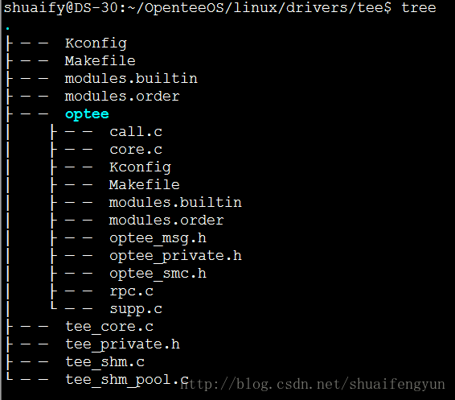
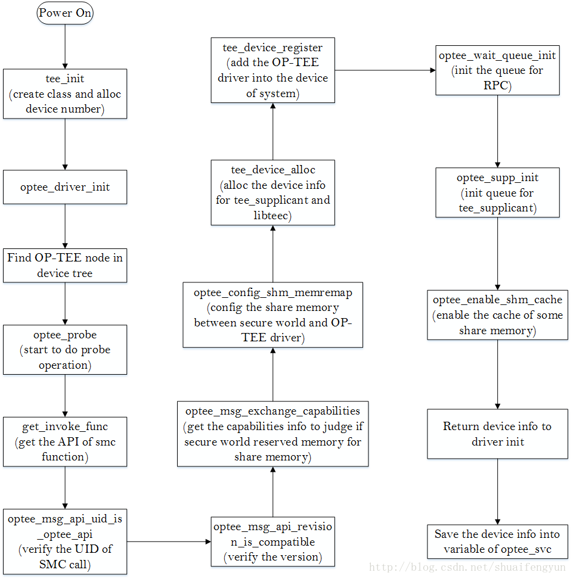

**OP-TEE驱动主要作用**是REE与TEE端进行数据交互的桥梁作用。`tee_supplicant`和`libteec`调用接口之后几乎都会首先通过系统调用陷入到kernel space，然后kernel根据传递的参数找到OP-TEE驱动，并命中驱动的operation结构体中的具体处理函数来完成实际的操作，对于OP-TEE驱动，一般都会触发`SMC`调用，并带参数进入到ARM cortex的monitor模式，在monitor模式中对执行normal world和secure world的切换，待状态切换完成之后，会将驱动端带入的参数传递給OP-TEE中的thread进行进一步的处理。OP-TEE驱动的源代码存放在`linux/drivers/tee`目录中，其内容如下：



# 1.OP-TEE驱动的加载
OP-TEE驱动的加载过程分为两部分:

* 第一部分是`创建class`和`分配设备号`，* 第二部分就是probe过程。
在正式介绍之前首先需要明白两个linux kernel中加载驱动的函数：`subsys_initcall`和`module_init`函数。OP-TEE驱动的第一部分是调用subsys_initcall函数来实现，而第二部分则是调用module_init来实现。整个OP-TEE驱动的初始化流程图如下图所示：



## 1.1  OP-TEE驱动模块的编译后的存放位置和加载过程

OP-TEE驱动通过subsys_initcall和module_init宏来告知系统在初始化的什么时候去加载OP-TEE驱动，subsys_initcall定义在`linux/include/init.h`文件中，内容如下：

```cpp
#define __define_initcall(fn, id) \
	static initcall_t __initcall_##fn##id __used \
	__attribute__((__section__(".initcall" #id ".init"))) = fn;
 
#define core_initcall(fn)		__define_initcall(fn, 1)
#define core_initcall_sync(fn)		__define_initcall(fn, 1s)
#define postcore_initcall(fn)		__define_initcall(fn, 2)
#define postcore_initcall_sync(fn)	__define_initcall(fn, 2s)
#define arch_initcall(fn)		__define_initcall(fn, 3)
#define arch_initcall_sync(fn)		__define_initcall(fn, 3s)
#define subsys_initcall(fn)		__define_initcall(fn, 4)
#define subsys_initcall_sync(fn)	__define_initcall(fn, 4s)
#define fs_initcall(fn)			__define_initcall(fn, 5)
#define fs_initcall_sync(fn)		__define_initcall(fn, 5s)
#define rootfs_initcall(fn)		__define_initcall(fn, rootfs)
#define device_initcall(fn)		__define_initcall(fn, 6)
#define device_initcall_sync(fn)	__define_initcall(fn, 6s)
#define late_initcall(fn)		__define_initcall(fn, 7)
#define late_initcall_sync(fn)		__define_initcall(fn, 7s)

```
使用subsys_initcall宏定义的函数最终会被编译到`.initcall4.init`段中，linux系统在启动的时候会执行`initcallx.init`段中的所有内容，而使用`subsys_initcall`宏定义段的执行优先级为4.

`module_init`的定义和相关扩展在`linux/include/linux/module.h`文件和`linux/include/linux/init.h`中，内容如下：

```cpp
#define device_initcall(fn)		__define_initcall(fn, 6)
#define __initcall(fn) device_initcall(fn)
#define module_init(x)  __initcall(x);
```
由此可见，使用module_init宏构造的函数将会在编译的时候被编译到`initcall6.init`段中，该段在linux系统启动的过程中的优先等级为6.

结合上述两点看，在系统加载OP-TEE驱动的时候，首先**会执行OP-TEE驱动中使用subsys_init定义的函数**，然后再**执行使用module_init定义的函数**。在OP-TEE驱动源代码中使用`subsys_init`定义的函数为`tee_init`，使用`module_init`定义的函数为`optee_driver_init`。

## 1.2tee_init函数初始化设备号和class


