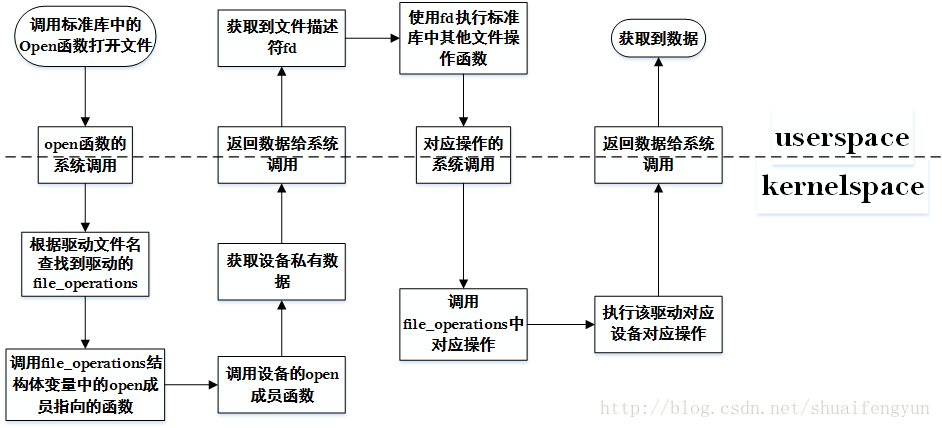

驱动挂载完成之后，CA程序通过调用libteec中的接口调用到OP-TEE驱动来穿透到secure world中调用对应的TA程序。OP-TEE的驱动挂载后会在/dev目录下分别创建两个设备接待，分别为`/dev/tee0`和`/dev/teepriv`，libteec和tee_supplicant分别对上述两个文件进行相关操作就能够穿透到secure world中。

# 1.userspace对使用驱动时的执行过程
在userspace层面对文件系统中的文件执行打卡，关闭，读写以及ioctl操作的时候，最终将会穿透到kernel space层面执行具体的操作。而从userspace陷入到kernespace是通过系统调用(systemcall)来实现的（关于syscall的实现请自行查阅资料了解，网上一大堆），进入到kernelspace后会调用相应的驱动获取对应的file_operations变量，该结构体变量中成员存放了对文件进行各种操作的具体函数指针。所以从userspace层面对文件进行操作的时候，其整个过程大致如下图所示：


调用libteec中按照GP标准定义的API或者tee_supplicant执行具体操作的时候都会经历上图中的流程。所以在后续章节中该流程就不再反复赘述了。

# 2.OP-TEE驱动中的重要结构体变量
要了解OP-TEE驱动中具体做了哪些操作，首先需要了解在OP-TEE驱动中存在的四个重要的结构体，`libteec`和`tee_supplicanty`以及`dma操作使用驱动时`会使用到这四个结构体，这四个结构体变量会在驱动挂载的时候被注册到系统设备模块或者是该设备的自由结构体中以便被userspace使用，而dma操作的时候会对共享内存进行注册。

## 2.1 OP-TEE驱动的file_operation结构体变量tee_fops
OP-TEE驱动的file_operation结构体变量定义在`linux/drivers/tee/tee_core.c`文件中，该变量中包含了OP-TEE驱动文件操作函数指针，其内容如下：

```cpp
struct const struct file_operations tee_fops={
	.owner=THIS_MODULE,
	.open=tee_open,
	.release=tee_release,
	.unlocked_ioctl=tee_ioctl,//驱动文件的ioctl操作具体实现的函数指针
	.compat_ioctl=tee_ioctl,//驱动文件ioctl操作具体实现指针
};
```
当在userspace层面调用open, release, ioctl函数操作驱动文件时就会调用到该结构体中的对应函数去执行具体操作。

# 2.2 OP-TEE驱动中`/dev/tee0`设备的tee_driver_ops结构体变量optee_ops

当用户调用libteec中的接口的时，操作的就是OP-TEE驱动的`/dev/tee0`设备，而optee_ops变量中存放的就是针对`/dev/tee0`设备的具体操作函数的指针，用户调用libteec接口时，首先会调用到tee_fops中的成员函数，tee_fops中的成员函数再会去调用到optee_ops中对应的成员函数来完成对`/dev/tee0`设备的实际操作。optee_ops变量定义在`linux/drivers/tee/optee/core.c`文件中。其内容如下：

```
static struct tee_driver_ops optee_ops = {
	.get_version = optee_get_version,	//获取OP-TEE版本信息的接口函数
	.open = optee_open,  //打开/dev/tee0设备的具体实现，初始化列表和互斥体，返context
	.release = optee_release, //释放掉打开的/dev/tee0设备资源，并通知secure world关闭session
	.open_session = optee_open_session, //打开session，以便CA于TA进行交互
	.close_session = optee_close_session, //关闭已经打开的session，断开CA与TA之间的交互
	.invoke_func = optee_invoke_func, 	//通过smc操作发送CA请求到对应TA
	.cancel_req = optee_cancel_req, //取消CA端已经发送的smc请求
};
```

## 2.3 OP-TEE驱动中`/dev/teepriv0`设备的tee_driver_ops结构体变量optee_supp_ops

当tee_supplicant需要执行相关操作时，操作的就是OP-TEE驱动的`/dev/teepriv0`设备，而optee_supp_ops变量中存放的就是针对`/dev/teepriv0`设备的具体操作函数的指针，tee_supplicant执行相关操作时，首先会调用到tee_fops中的成员函数，tee_fops中的成员函数再会去调用到optee_supp_ops中对应的成员函数来完成对`/dev/teepriv0`设备的实际操作。optee_supp_ops变量定义在`linux/drivers/tee/optee/core.c`文件中。其内容如下：

```
static struct tee_driver_ops optee_supp_ops = {
	.get_version = optee_get_version,	//获取OP-TEE的版本信息
	.open = optee_open,	//打开/dev/teepriv0设备的具体实现
	.release = optee_release, //释放掉打开的/dev/teepriv0设备，并通知secure world关闭session
	.supp_recv = optee_supp_recv, //接收从OP-TEE发送给tee_supplicant的请求
	.supp_send = optee_supp_send,  //执行完OP-TEE请求的操作后将结果和数据发送给OP-TEE
};
```

## 2.4 OP-TEE驱动中共享驱动缓存操作的dma_buf_ops结构体变量tee_shm_dma_buf_ops
OP-TEE驱动也支持其他设备访问OP-TEE驱动的共享缓存，该部分的功能当前并不算太完全，有一些功能尚未实现。该变量定义在`linux/drivers/tee/tee_shm.c`文件中，当需要被分配dma缓存时就会调用到该变量中对应的函数。其内容如下：

```
static struct dma_buf_ops tee_shm_dma_buf_ops = {
	.map_dma_buf = tee_shm_op_map_dma_buf,	//暂未实现
	.unmap_dma_buf = tee_shm_op_unmap_dma_buf,	//暂未实现
	.release = tee_shm_op_release,	//释放掉指定的共享内存
	.kmap_atomic = tee_shm_op_kmap_atomic, //暂未实现
	.kmap = tee_shm_op_kmap,	//暂未实现
	.mmap = tee_shm_op_mmap, 	//dma共享内存进行地址映射
};
```
**NOTE**:libteec中接口的执行和tee_supplicant功能的执行都会用上述四个结构体变量中的两个或者多个。而从libteec和tee_supplicant到驱动的kernelspace层面的过程都如第一小节大致相同，所以在后续章节中将不会对userspace如何到kernel space的过程进行赘述。
