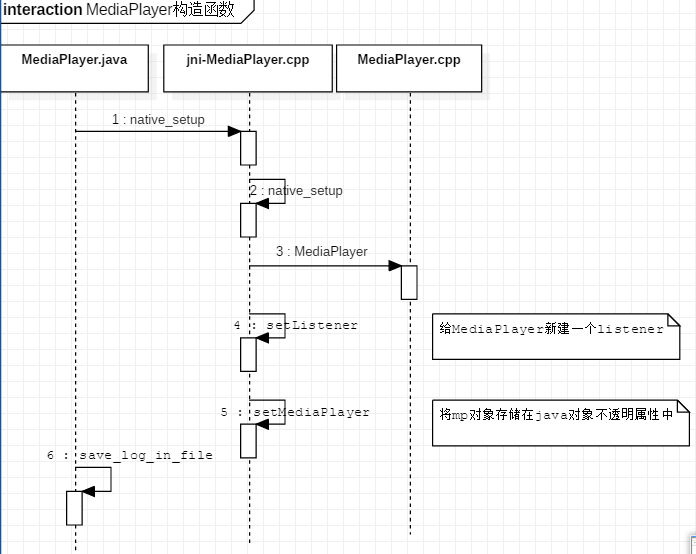
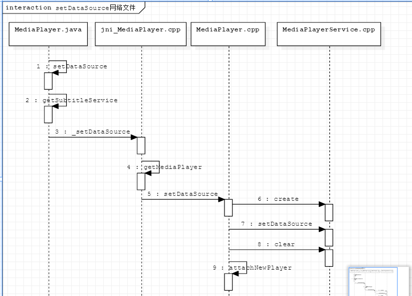

根据MediaPlayer正常启动播放的流程图，分析源码步骤.

# 1.MediaPlayer构造函数

MediaPlayer类，静态加载:

```java
static{
	System.loadLibrary("media_jni");
	native_init();
}
```

jni中保存了fileds结构体作为全局调用使用。

```java
struct fields_t{
	jfieldID context;
	jfieldID surface_texture;

	jmethodID post_event;
	jmethodID print_log;
	jmethodID proxyConfigGetHost;
	jmethodID proxyConfigGetPort;
	jmethod proxyConfigGetExclusionList;
	int disp_last_frame;
	jclass bitmapClazz;
	jfiledID nativeBitmap;
	jmethodID createBitmapMethod;
	jclass configClazz;
	jmethodID createConfigMethod;
};
static fields_t fields;
```

只会调用一次：

```cpp
static void android_media_MediaPlayer_native_init(JNIEnv *env){
	jclass clazz;
	clazz=env->FindClass("android/media/MediaPlayer");
	fields.context=env->GetFiledID(clazz,"mNativeContext","I");
	jclass configClazz=env->FindClass("android/graphics/Bitmap$Config");
	fields.createConfigMethod =
    env->GetStaticMethodID(fields.configClazz, "nativeToConfig",
                    "(I)Landroid/graphics/Bitmap$Config;");
}
```


* 1.`native_setup()`:传递弱引用Java对象`new WeakReference<MediaPlayer>(this)`
* 2.映射成jni中的`native_setup`函数。
* 3.调用native中的MediaPlayer构造函数，该构造函数主要完成：
	* 各属性的初始化
	* `mAudioSessionId=AudioSystem::newAudioSessionId()`,`AudioSystem::acquireAudioSessionId(mAudioSessionId)`来初始化mAudioSessionId属性。

* 4.`mp->setListener(listener)`设置本地端的listener，`sp<JNIMediaPlayerListener> listener=new JNIMediaPlayerListener(env,thiz,weak_this)`
* 5.`setMediaPlayer(env,thiz,mp)`，将本地c++，MediaPlayer存储在java对象的不透明属性中，**便于jni使用其他函数使用该c++ 对象**。

```cpp
static sp<MediaPlayer> setMediaPlayer(JNIEnv* env,jobject thiz,const sp<MediaPlayer> &player){
	Mutex::Autolock l(sLock);
	sp<MediaPlayer> old=env->GetIntField(thiz,fileds.context);
	//是否有老的本地对象,有减去强引用准备释放
	if(player.get()){
		player->incStrong(void*setMediaPlayer);
	}
	if(old !=0){
		old->decStrong((void*)setMediaPlayer);
	}
	//记录最新更新的mediaplayer
	env->SetIntField(thiz,filds.context,(int)player.get());
}
```

* 6.`save_log_in_file`:用文件记录media相关事件。

# 2.MediaPlayer.setDataSource

MediaPlayer的setDataSource分为两类，本地文件和远程网络数据。

* `setDataSource(Context context,Uri uri,Map<String,String> headers)`根据其中schema进行区分.`uri.getScheme()`协议类型。
* `setDataSource(FileDescriptor fd,long offset,long length)`.

主要看下网路播放部分，流程。



* 1.不同的文件类型，底层对象重载不同setDataSource函数。
* 2.`getSubtitleService()`：`ServiceManager.getService("subtitle_service")`返回IBinder对象。`subTitleService = ISubTitleService.Stub.asInterface(b);`
* 3.`getMediaPlayer(env,thiz)`获取返回的对象。改对象是保存在java属性中。
* 5.`setDataSource()`.通过`getSystemPlayerService()`,通过service和MediaPlayerService进行交互。

```cpp
IMedaiDeathNotifier::getMediaPlayerService(){
	Mutex::Autolock _l(sServiceLock);
	if(sMediaPlayerService==0){
		sp<IServiceManager> sm=defaultServiceManager();
		sp<IBinder> binder;
		do{	
			binder=sm->getService(String16("media.player"));
			if(binder!=0)break;
			usleep(50000);
		}while(true);
		if(sDeathNotifer==NULL){
			sDeathNotifier=new DeathNotifier();
		}
		binder->linkToDeath(sDeathNotifer);
		sMediaPlayerService=interface_cast<IMediaPlayerService>(binder);
	}
	return sMediaPlayerService;
}
```

* 6.`service->create(this,mAudioSessionId)`:主要简历Client对象，该对象是IMediaPlayer的子类。

```cpp
sp<IMediaPlayer> MediaPlayerService::create(const sp<IMediaPlayerClient>& client,int audioSessionId){
	pid_t pid=IPCThreadState::self()->getCallingPid();
	int32_t connId android_atomic_inc(&mNextConnId);
	sp<Client> c=new Client(this,pid,connId,client,audioSessionId,IPCThreadState::self()->getCallingUid());
	wp<Client> w=c;
	{
		Mutex::Autolock lock(mLock);
		mClients.add(w);
	}
	return c;
}
```

* 7.`player->setDataSource(url,headers)`.

```cpp
status_t MediaPlayerSerivce::Client::setDataSource(const char*urk,const KeyedVector<String8,String8>*headers){
	if(url==NULL)return UNKNOWN_ERROR;
	if(strncmp(url,"http://",7)==0||strncmp(url,"https://",8)==0||strncmp(url,"rtsp://",7)==0){
		//TODO 之后学习下，检验权限
		if(!checkPermission("android.permission.INTERNET")){
			return PERMISSION_DENIED;
		}
	}
	player_type playerType=getMediaType(url);
	sp<MediaPlayerBase> p=setDataSource_pre(playerType);
	if(p==NULL){
		return NO_INIT;
	}
	return mStatus;
}
```
* 8.`player.clear()`
* 9.`attachNewPlayer(player)`
将`mediaplayerservice`中的player记录在`MediaPlayer.cpp`中的mPlayer全局变量中。

# 3.MediaPlayer.prepare()
都使用`MediaPlayer.prepareAsync()`来进行异步