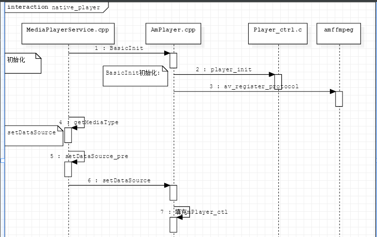
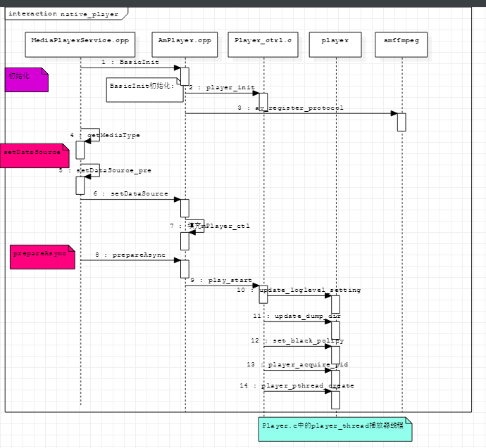

通过mediaplayerservice.cpp中的`instantiate()`函数进行初始化，`MyPlayer::BasicInit();`.



# 1.初始化分析

* 1.`MyPlayer::BaseicInit();`进行native层的初始化。主要进行协议的注册和ffmpeg初始化。注册支持的协议有：
	* `android`
	* StreamSource:
		* `IStreamSource`
	* DataSourceProtocol:
		* `DataSource`
		* `https`
		* `shttps`
		* `http`
	* ExtractorDemux:
		* `DRMdemux`
		* `Demux_no_prot`

* 2.`player_init`初始化：
	* `reset_auto_refresh_rate()`
	* `ffmepg_init()`
	* `player_id_pool_init()`
	* `codec_audio_basic_init()`
	* 注册所有支持的解码器，填充`stream_codec_t`结构体，完成对应解码器的相关操作。最后所有的解码器会组成一个数组`stream_codec_list`。
	* `urm_init()`:授权相关的操作，分配1M线程空间。
* 3.`av_register_protocol()`将生命的协议数组进行注册。

```c
int ffmpeg_init(){
	av_register_all();
	//支持外挂,media.libplayer.modules逗号分开，待分析
	ffmpeg_load_external_module();
	av_lockmgr_register(ffmpeg_lock);
	url_set_interrupt_cb(ffmpeg_interruput_callback);
	amthreadpool_system_init();
}
```

# 2.setDataSource

接上之前的分析。这里通过`getPlayerType()`和`setDataSource_pre(playerType);`来确定使用具体的播放器。

播放器根据url协议，选择播放器类型。

* TEST_PLAYER:`test:`
* CTC_PLAYER_ENABLE:只针对湖南的`rtp://`和对新疆库看`rtsp://`使用CTC_PLAYER。
* 如果打开：`media.cmccplayer.enable`,使用协议`http://`和`https://`和`igmp://`和`udp://`，使用CMCCPLAYER
* 如果`media.hls.use-nuplayer`打开，对`.m3u8`使用NU_PLAYER.
* 一般使用AMSuperPlayer

* 1.setDataSource中。其中的协议：
	* `tvin：`
	* `/manifest`:
	* 是否是HTTPSource：
		* `http`
		* `shttp`
		* `https`
		* `vrwc`
		* `vstb`
	* 是否是HLS
		* 是HTTPSource并且包含`.m3u8`

* 2.填充的mPlayer_ctl内容有：
	* `mPlayer_ctl.t_pos=-1`,不要seek到0.
	* `mPlayer_ctl.is_livemode=1`直播
	* `mPlayer_ctl.t_duration_ms`
	* `mPlayer_ctl.headers`
	* `mPlayer_ctl.auto_buffering_enbale=1`如果是网络模式，打开buffering 模式
	* `mPlayer_ctl.file_name=file`
	* `mPlayer_ctl.local_fd=fd`
* `sendEvent(MEDIA_SET_DATA_SOURCE)`:这里进行了回调操作。在父类MediaPlayerInterface调用mNotify.
	* 这个回调来自MediaPlayerService.cpp中p->setNotifyCallback();

这个变量来自JNI中`JNIMediaListener()`

```cpp
//android_media_MediaPlayer.cpp
sp<JNIMediaPlayerListener> listener=new JNIMediaPlayerListener();
mp->setListener(listener);
//---------------------------
JNIMediaPlayerListener::JNIMediaPlayerListener(JNIEnv* env, jobject thiz, jobject weak_thiz){
	jclass clazz=env->GetObjectClass(clazz);
	mClass=(jclass)env->NewGlobalRef(clazz);
	mObject=env->NewGlobalRef(weak_thiz);
}
```

通过mp->setListener(listener);对MediaPlayer.cpp中全局变量mListener保存

MediaPlayerService中保存mClient就是MediaPlayer.cpp中的对象，调用mClient->notify，即调用MediaPlayer.cpp::notify，这里不处理，则会抛出到java对象进行处理。

在MediaPlayerService.cpp中的新建播发器的时候，会将MediaPlayerService::notify传递到响应的播放器，从而新建立的播放器可以直接调用sendEvent。

总上述分析：播放器中的sendEvent，首先到MediaPlayerService::notify,然后分派到mClient(MediaPlayer.cpp),处理一部分，然后抛出到java端（通过JNI端进行实现的）

# 2.prepareAsync



该部分也对mPlayer_ctl进行填充。

* `mPlay_ctl.callback_fn.notify_fn=notifyhandle`
* `mPlay_ctl.callback_fn.update_interval`
* `mPlay_ctl.cachetime_fn.notify_fn`
* `mPlay_ctl.cachetime_fn.update_intervel`
* `mPlay_ctl.audio_index`
* `mPlay_ctl.video_index`
* `mPlay_ctl.hassub`
* `mPlay_ctl.is_type_parser`
* `mPlay_ctl.lowbuffermode_limited_ms`
* `mPlay_ctl.buffing_min`
* `mPlay_ctl.buffing_middle`
* `mPlay_ctl.buffing_max`
* `mPlay_ctl.buffing_starttime_s`

delaybuffering时候：
* `mPlay_ctl.buffing_force_delay_s`

lowlevelbufmode时候：

* `mPlay_ctl.auto_buffing_enable=0`
* `mPlay_ctl.enable_rw_on_pause=0`
* `mPlay_ctl.lowbuffingmode_flag=1`

* `mPlay_ctl.read_max_cnt=10000;重试次数`
* `mPlay_ctl.dislast_frame`
* `mPlay_ctl.SessionID=mSessionID`

* 2.`player_start(&mPlay_ctl,this)`。将之前准备好的`mPlay_ctl`传递下去。

* `update_loglevel_setting()`使用属性`media.amplayer.loglevel`
* `update_dump_dir_path();`:media.libplayer.dumppath属性设置。默认的路径是`/data/tmp/`

* 3.`set_black_policy(0)`:默认保留最后一帧。`/sys/class/video/blackout_policy`
* 4.`get_auto_refresh_rate()`:设置自动属性率`/sys/class/tv/policy_fr_auto_switch`
* 5.`player_request_id()`:
* 6.`player_thread_create(play_para_t *player)`

```c
int player_thread_create(play_para_t *player){
	int ret=0;
	pthread_t tid;
	pthread_attr_t pthread_attr;
	player_thread_mgt_t *mgt=&player->thread_mgt;
	pthread_attr_init(&pthread_attr);
	//默认栈的值
	pthread_attr_setstacksize(&pthread_attr,0);
	amthreadpool_phthread_create(&tid,&pthread_attr,(void*)&player_thread_t, (void*)player);
	pthread_setname_np(tid,"AmplayerMain");
	phthread_attr_destory(&pthread_attr);
	mgt->pthread_id=tid;
}
```

相关参数：

```c
//1.文件类型
typedef enum {
    UNKNOWN_FILE    = 0,
    AVI_FILE        = 1,
    MPEG_FILE       = 2,
    WAV_FILE        = 3,
    MP3_FILE        = 4,
    AAC_FILE        = 5,
    AC3_FILE        = 6,
    RM_FILE         = 7,
    DTS_FILE        = 8,
    MKV_FILE        = 9,
    MOV_FILE        = 10,
    MP4_FILE        = 11,
    FLAC_FILE       = 12,
    H264_FILE       = 13,
    M2V_FILE        = 14,
    FLV_FILE        = 15,
    P2P_FILE        = 16,
    ASF_FILE        = 17,
    STREAM_FILE     = 18,
    APE_FILE        = 19,
    AMR_FILE        = 20,
    AVS_FILE        = 21,
    PMP_FILE        = 22,
    OGM_FILE            = 23,
    HEVC_FILE       = 24,
    FILE_MAX,
} pfile_type;

//2.流类型
typedef enum {
    STREAM_UNKNOWN = 0,
    STREAM_TS,
    STREAM_PS,
    STREAM_ES,
    STREAM_RM,
    STREAM_AUDIO,
    STREAM_VIDEO,
} pstream_type;
```

* vdec_profile.

```
//vdec_profile
mpeg12:;
mpeg4:;
vc1:progressive, interlace, wmv3;
h264:4k;
hmvc:;
h264_4k2k:;
hevc:4k, 9bit, 10bit, dwrite, compressed;
mjpeg:;
real:rmvb,1080p+;
avs:avs+;
avc:;
jpegenc:;
```